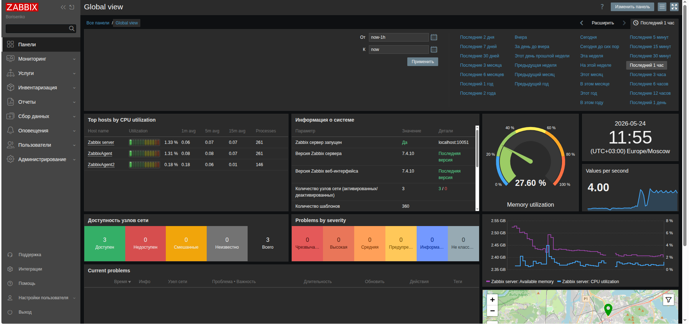
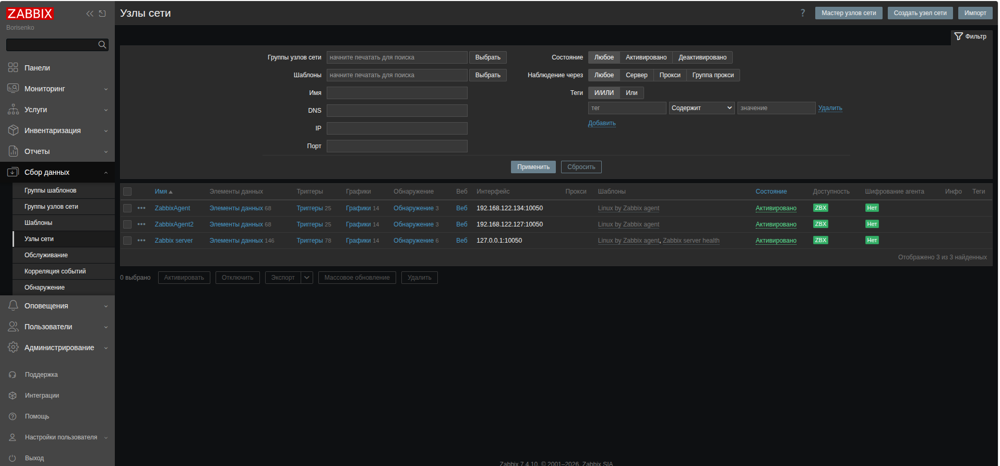
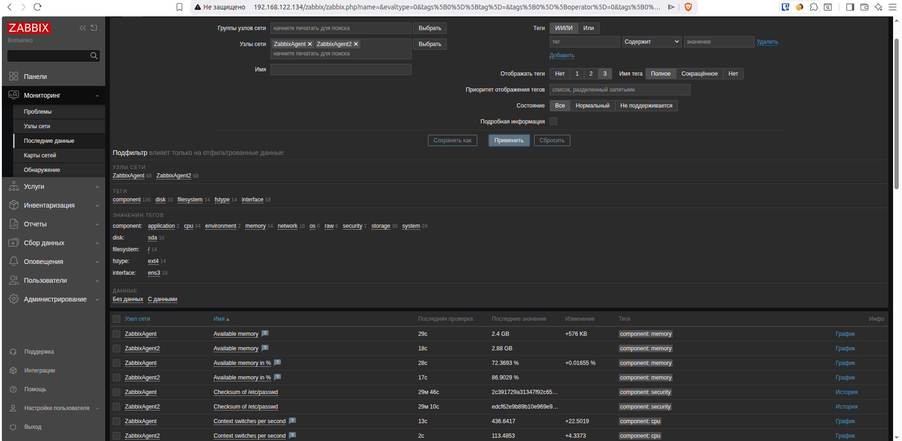
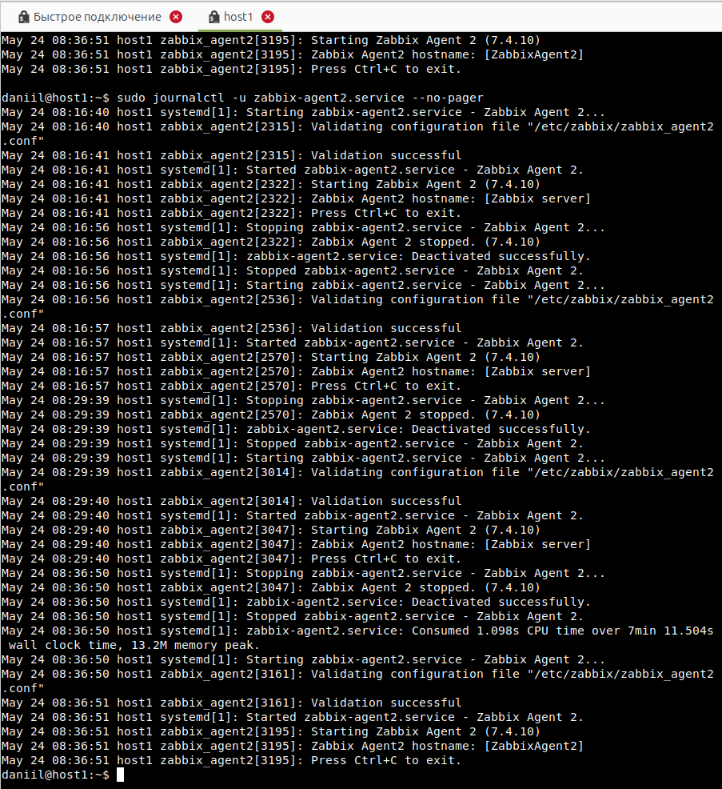

# Домашнее задание к занятию "8.04 Zabbix" - "Борисенко Даниил"

---

## Задание 1
---
Установлен Zabbix Server с веб-интерфейсом.

В процессе выполнения задания были установлены и настроены следующие компоненты:

- PostgreSQL;
- Zabbix Server;
- Zabbix Web Interface;
- Apache;
- Zabbix Agent 2.

Были использованы следующие команды:
### Установка базы данных:
sudo -s
apt install postgresql

### Установка репозитория Zabbix
wget https://repo.zabbix.com/zabbix/7.4/release/ubuntu/pool/main/z/zabbix-release/zabbix-release_latest_7.4+ubuntu26.04_all.deb
dpkg -i zabbix-release_latest_7.4+ubuntu26.04_all.deb
apt update

### Установка компонентов
apt install zabbix-server-pgsql zabbix-frontend-php zabbix-apache-conf zabbix-sql-scripts zabbix-agent2 php-pgsql -y

### Создание пользователя zabbix
sudo -u postgres createuser --pwprompt zabbix
sudo -u postgres createdb -O zabbix zabbix

### Установка скриптов
zcat /usr/share/zabbix/sql-scripts/postgresql/server.sql.gz | sudo -u zabbix psql zabbix

### Редактирования конфигурационного файла и изменение пароля.
sudo nano /etc/zabbix/zabbix_server.conf

Скриншот авторизации/работы в админке Zabbix:

## Задание 2
---
Установлены и настроены Zabbix Agent на два хоста.

Один из хостов — сам Zabbix Server, второй — отдельная виртуальная машина с установленным Zabbix Agent 2.

### Установка Zabbix Agent 2

На хостах был установлен агент и соответствующие плагины:
sudo -s
wget https://repo.zabbix.com/zabbix/7.4/release/ubuntu/pool/main/z/zabbix-release/zabbix-release_latest_7.4+ubuntu26.04_all.deb
dpkg -i zabbix-release_latest_7.4+ubuntu26.04_all.deb
apt update
apt install zabbix-agent2
apt install zabbix-agent2-plugin-mongodb zabbix-agent2-plugin-mssql zabbix-agent2-plugin-postgresql

### Добавление Zabbix Server в список разрешенных Zabbix Agentов

В файле /etc/zabbix/zabbix_agent2.conf добавил:
IP Адрес Zabbix_Server:
ServerActive=127.0.0.1,192.168.0.134

В Zabbix Server были добавлены два узла сети в разделе:

Сбор данных → Узлы сети

Скриншот сбора метрик

Скриншот логов заббикс агента

---