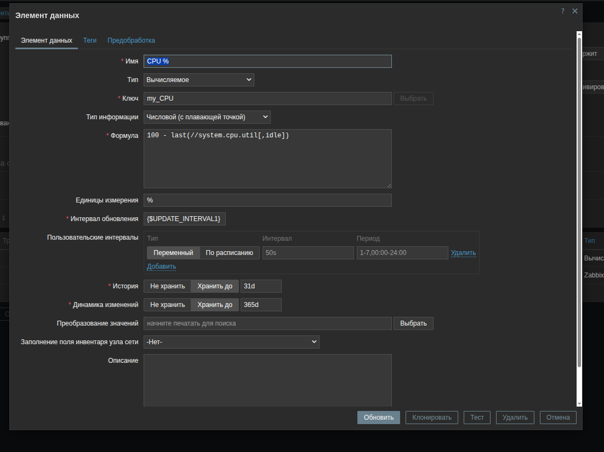
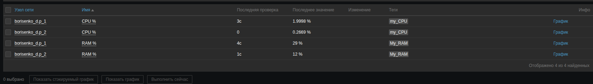
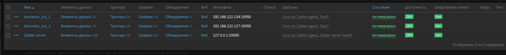

# Домашнее задание к занятию "Система мониторинга Zabbix. Часть 2" - "Борисенко Даниил"

---

## Задание 1
Создан шаблон Task1 с макросами {$UPDATE_INTERVAL1} с интервалом обновления 5 секунд и {$UPDATE_INTERVAL2} с интервалом обновления 30 секунд.

Использовал следующие ключи для нагрузки CPU и RAM:
```bash
system.cpu.util[,idle]
vm.memory.size[pused]
```
Добавил переработку для корректного отображения нагрузки на процессор.
return 100 - value;

Скриншот элементов данных


Скриншот метрик


---

## Задание 2-3
На данном этапе столкнулся с конфликтом ключей в шаблонах Task1 и Linux by Zabbix Agent, т.к. в шаблоне Linux by Zabbix Agent уже есть ключ system.cpu.util[,idle].

Скриншот с ошибкой


Для принудительной связки использовал вычисляемый тип элемента даннных с формулой
```bash
100 - last(//system.cpu.util[,idle])
```
По итогу получился ключ My_CPU с формулой переработки.


Добавил тег к моим ключам для сортировки данных:


Скриншот хостов


---

### Задание 4

Создал кастомный дашборд...
Мог бы подвязать триггеры по хостам, задать пороговые значения событиям, подвязать их на дашборд, после связать их с графаной и настроить отправку уведомлений на email либо через бота, добавить автообнаружение докер-контейнеров, но к сожалению времени не так много...


---