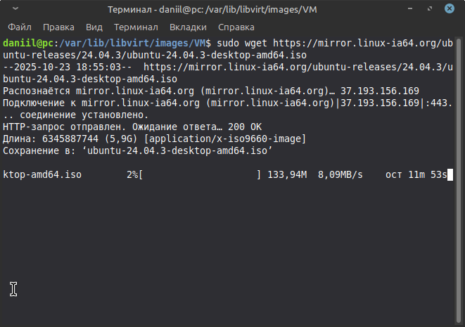
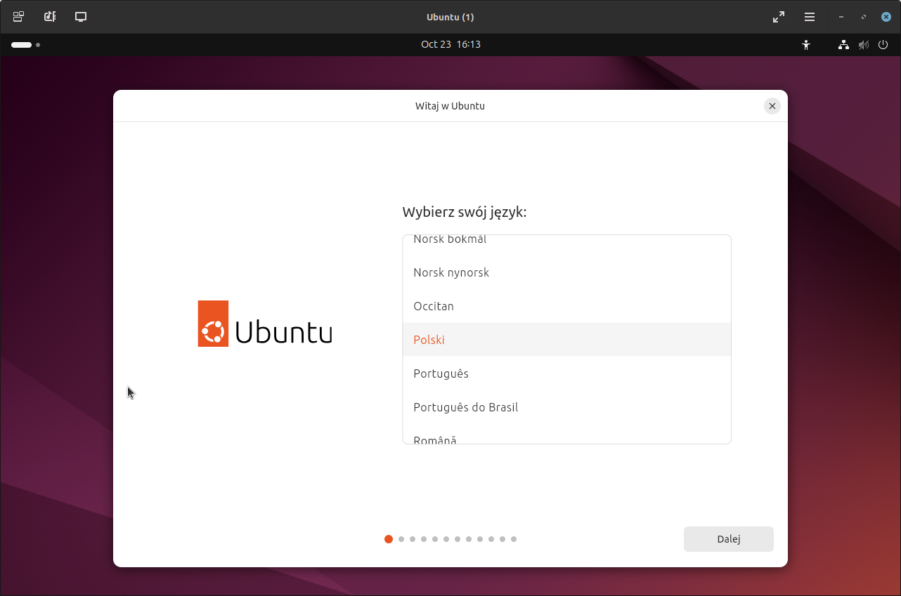
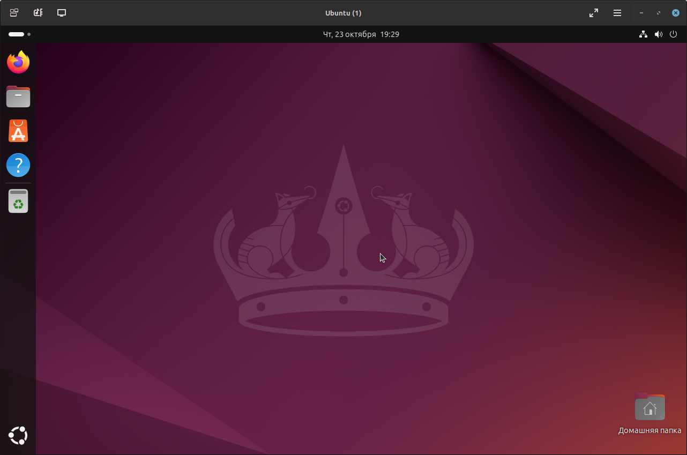
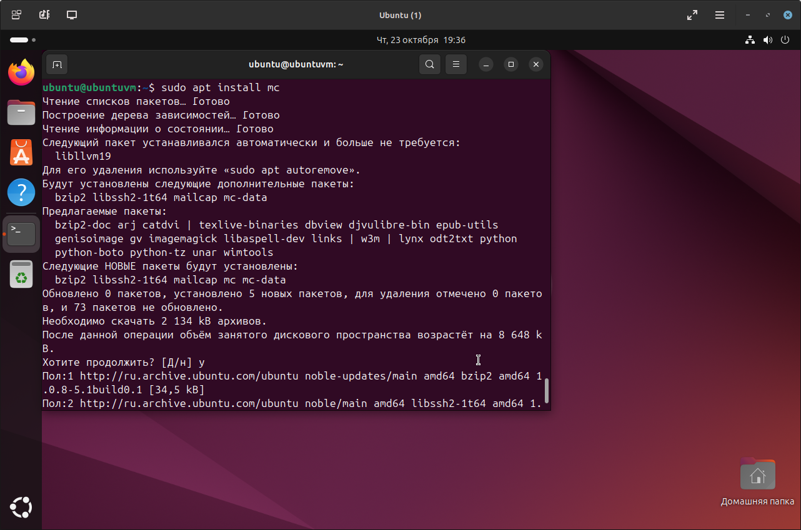
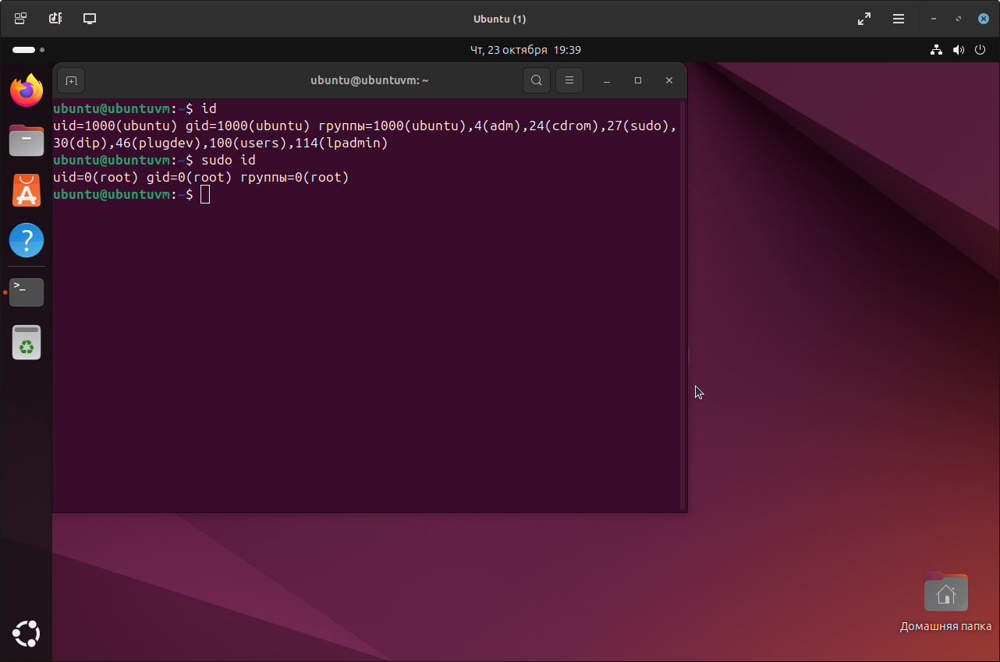

# Домашнее задание к занятию "1.03.Знакомство с операционной системой Linux" - "Борисенко Даниил"

---

## Задание 1

**Условие:**
Подготовьте рабочее пространство:

- Скачайте с сайта VirtualBox и установите на свой компьютер
- Создайте новую виртуальную машину
- Скачайте Ubuntu
- Установите Ubuntu на вашу виртуальную машину

Сделайте скриншот консоли, где в строке ввода будет ваше ФИО.

**Ход решения:**

1. Скачал образ ubuntu для создания VM, используя команду:

    ```bash
    sudo wget https://mirror.linux-ia64.org/ubuntu-releases/24.04.3/ubuntu-24.04.3-desktop-amd64.iso 
    ```

    

2. Создал VM через qemu-kvm, используя инструмент virt-install, командой:

    ```bash
    sudo virt-install --name Ubuntu --ram 4096 --vcpus 4 --disk size=30 --cdrom ubuntu-24.04.3-desktop-amd64.iso
    ```

    где:
    - **`--name`** - задает имя VM;
    - **`--ram`** - задает количество выделенной оперативной памяти;
    - **`--vcpus`** - задает количество процессоров;  
    - **`--disk size`** - размер пространства под VM;
    - **`--cdrom`** - путь к iso образу, на основе которого создается VM.

    

3. Для запуска окна созданной VM, использовал команду:

    ```bash
    virt-viewer Ubuntu
    ```

    

---

## Задание 2

**Условие:**
Запустите терминал и выполните команды:

- echo $SHELL
- cat /etc/shells
Ответ приведите в виде снимка экрана и прокомментируйте в свободной форме результаты выполнения указанных команд

**Ход решения:**

1. Команда:

    ```bash
    echo $SHELL
    ```

    Назначение: Выводит путь, где находится используемая оболочка

2. Команда:

    ```bash
    cat /etc/shells 
    ```

    Назначение: Просматривает файл, в котором указаны доступные оболочки

    

---

## Задание 3

**Условие:**
Установите при помощи утилиты apt файловый менеджер mc.
Решение приведите в виде последовательности команд или снимка экрана

**Ход решения:**

Для установки файлового менеджера midnight commander, использовал утилиту apt, применив следующую команду:

```bash
sudo apt install mc
```



---

## Задание 4*

**Условие:**
Выполните следующие команды:

- id
- sudo id
Объясните, почему вывод одной и той же команды отличается в этих случаях.

**Ход решения:**

1. Команда:

    ```bash
    id
    ```

    **Назначение:** Выводит данные о текущем пользователе.

2. Команда:

    ```bash
    sudo id
    ```

    **Назначение:** Выводит данные суперпользователе.

    

---
