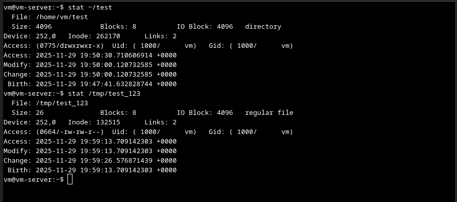
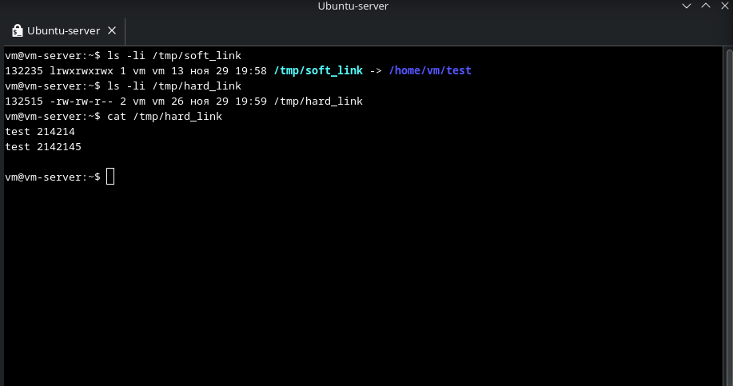
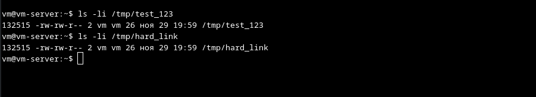
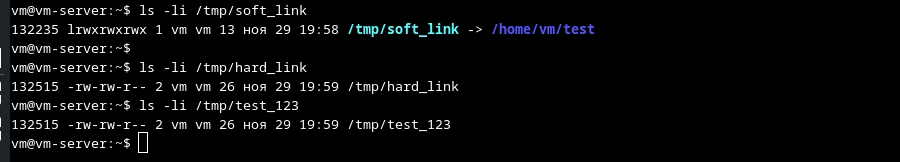
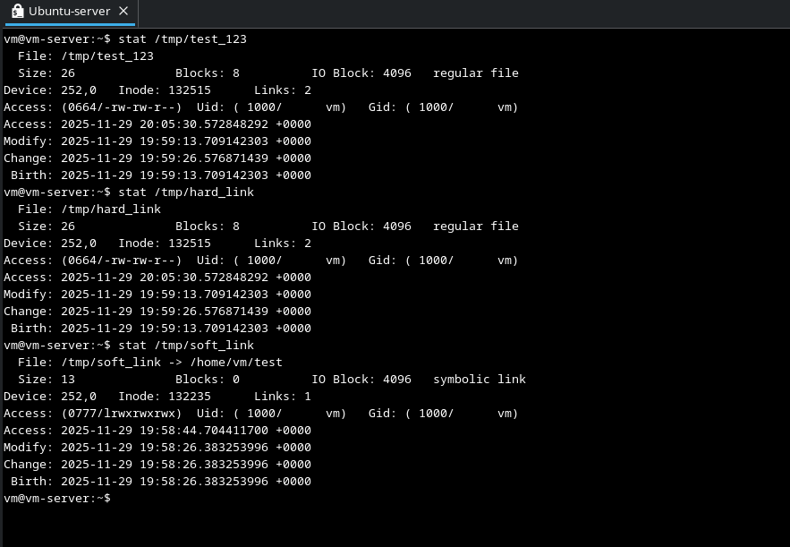
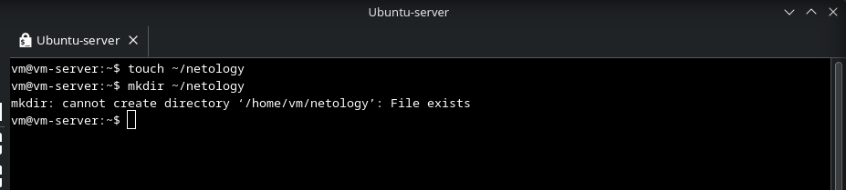
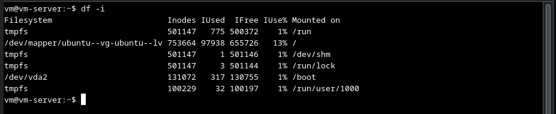
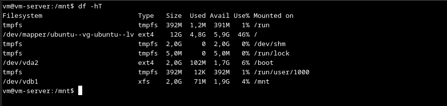
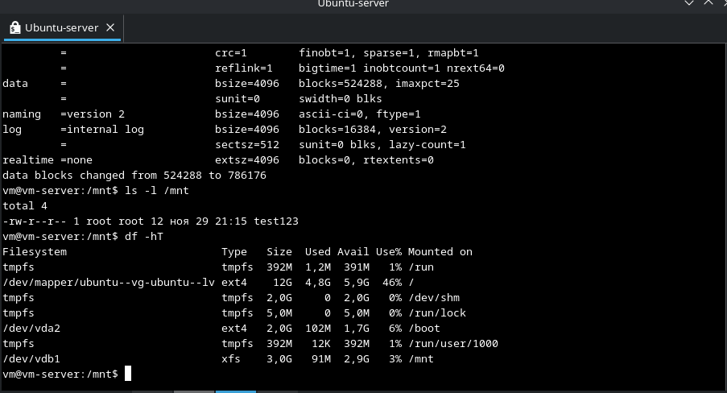

# Домашнее задание к занятию "2.07 Файловые системы" - "Борисенко Даниил"

---

## Задание 1

**Условие:**

1. Создайте каталог ~/test и в нём файл test_123 с любым содержимым.
2. Создайте символическую ссылку на каталог ~/test по пути /tmp/soft_link.
3. Используя ссылку /tmp/soft_link, скопируйте файл test_123 в каталог /tmp с тем же именем. Создайте жёсткую ссылку на файл /tmp/test_123 с именем /tmp/hard_link.

*Вопрос 1. Файл ~/test и /tmp/test_123 — это один и тот же файл (одинаковые inode)?*

*Вопрос 2. Файл /tmp/soft_link и /tmp/hard_link — это один и тот же файл (одинаковые inode)?*

*Вопрос 3. Файл /tmp/test_123 и /tmp/hard_link — это один и тот же файл (одинаковые inode)?*

*Вопрос 4. Докажите, что одна из ссылок символическая, а другая жёсткая. Обязательно приложите к ответу скриншоты команд, которые иллюстрируют различия ссылок разного типа, или, если не уверены, ход решения задания.*

**Ход решения:**

1. Ответ на Вопрос 1: Нет. В данном случае мы использовали копирование, соответственно создался новый файл с новым inode.

    

2. Ответ на Вопрос 2: Нет. /tmp/soft_link - это символическая ссылка, которая ссылается на каталог /test, а /tmp/hard_link - это жесткая ссылка, которая ссылается на файл /tmp/test_123.

    

3. Ответ на Вопрос 3: Да. /tmp/hard_link - жесткая ссылка на файл /tmp/test_123. У них одинаковые inode, а так же увеличенное количество ссылок (2). Иными словами - это один и тот же файл, но с разными именами.

    

4. Ответ на Вопрос 4: Рассмотрим на примере символической ссылки **/tmp/soft_link** и жесткой ссылки **/tmp/hard_link**.
Проверить их можно командами:

    ```bash
    ls -li /tmp/soft_link
    ls -li /tmp/hard_link
    ```

    При использовании данных команд, мы заметим inode файлов, количество ссылок на файл, а так же показано на какой файл или каталог ссылается символическая ссылка. Если inode одинаковы у файлов и количество ссылок - то это жесткая ссылка, она так же отображается в типе файла “-”, в то время как символическая ссылка создает файл с отличным inode и отображается как “l” - то есть link.

    

    Так же файлы и каталоги можно проверить командой stat, где наглядной по той же логике можно определить где символическая ссылка, а где жесткая.

    

---

## Задание 2

**Условие:**

1. Создайте файл `~/netology`.
2. Создайте каталог `~/netology/`.
3. Поместите файл `netology` в каталог `netology`.

*Какое или какие из трёх действий невозможно выполнить? Почему?*

**Ход решения:**
Если выполнять задание в данной последовательности, то 2 и 3 действия выполнить невозможно, т.к. система выдаст ошибку о том, что невозможно создать директорию, т.к. файл с таким именем уже создан.



---

## Задание 3

**Условие:**

1. Как посмотреть количество `inodes`?
2. В каких файловых системах не может возникнуть проблемы нехватки `inodes`?

*Запишите ответ в свободной форме.*

**Ход решения:**

1. Количество inode можно посмотреть командой df -i

    

2. В ФС, которые обладают динамическим выделением inode не возникает проблем с их нехваткой, т.к. inode выделяются по мере необходимости, и неиспользуемые inode могут быть освобождены. К ним относятся ФС: jfs, xfs, btrfs, zfs и др.

    Inode в файловой системе EXT формируются заранее в определенном количестве, при создании файлов, а в XFS к примеру по запросу.

---

## Задание 4

**Условие:**

Задание не предполагает использования LVM.

1. Подключите к системе новый диск 3 Гб.
2. Создайте на диске один раздел размером 2 Гб.
3. Разметьте раздел как `xfs`.
4. Смонтируйте раздел по пути /mnt. Создайте любой файл на смонтированной файловой системе. Сделайте скриншот вывода команды df -hT.
5. Увеличьте раздел до 3 Гб.
6. Расширьте файловую систему на новое свободное пространство.
7. Убедитесь, что после всех манипуляций созданный вами файл остался внутри раздела и файловой системы.
8. Сделайте скриншот вывода команды df -hT.

*В качестве ответа приложите два сделанных скриншота.*

**Ход решения:**





---

## Задание 5*

**Условие:**

Создайте файловую систему `Btrfs` на двух дисках по 5 Гб каждый.

*Сколько места будет доступно для работы с файлами? Сколько места займут метаданные?*

**Ход решения:**

---

*Список используемой литературы:*
    - 
    - 
