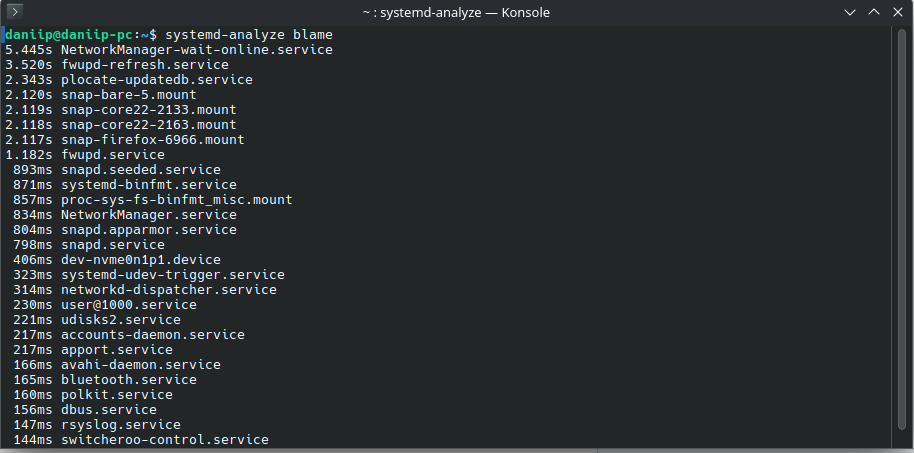
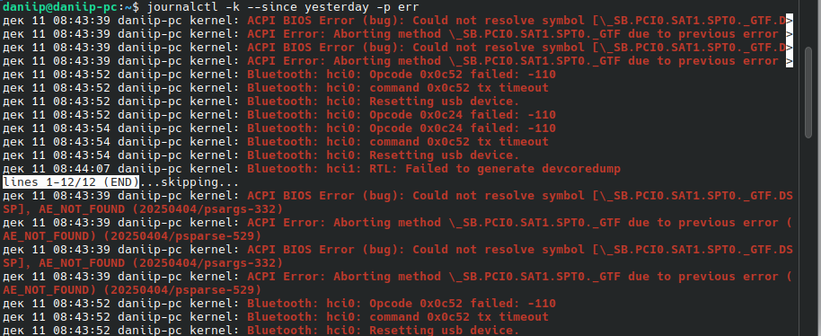
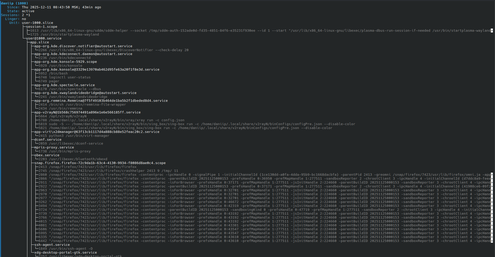
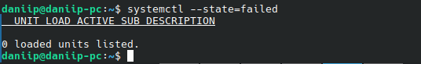

# Домашнее задание к занятию "3.03 Инициализация системы, Init, systemd" - "Борисенко Даниил"

---

## Задание 1

**Условие:**

Выполните `systemd-analyze blame`.

*Укажите, какие модули загружаются дольше всего.*

**Ход решения:**

Выполнил команду `systemd-analyze blame`:

    

    Согласно выводу `systemd-analyze blame`, дольше всего при загрузке системы стартуют следующие службы:
    - **NetworkManager-wait-online.service** - 5.445s
    - **fwupd-refresh.service** - 3.520s
    - **plocate-updatedb.service** - 2.343s

---

## Задание 2

**Условие:**

Какой командой вы посмотрите ошибки ядра, произошедшие начиная со вчерашнего дня?

*Напишите ответ в свободной форме.*

**Ход решения:**

Для того чтобы посмотреть ошибки ядра, произошедшие начиная со вчерашнего дня можно воспользоваться командой `journalctl`:

    ```bash
    journalctl -k --since yesterday -p err
    ```
    **где:**

    - **`-k`** - только сообщения ядра,
    - **`--since yesterday`** — начиная со вчерашнего дня,
    - **`-p err`** — только сообщения уровня error и выше (ошибки ядра).

    

---

## Задание 3

**Условие:**

Запустите команду `loginctl user-status`.

*Напишите, что выполняет, для чего предназначена эта утилита.*

**Ход решения:**

Выполнил команду:

    ```bash
    loginctl user-status
    ```
    
    

    Команда `loginctl user-status` показывает статус текущего пользователя: 
    - UID;
    - Fктивные сессии (консольные, графические, ssh);
    - Cписок процессов пользователя.

---

## Задание 4

**Условие:**

Есть ли у вас на машине службы, которые не смогли запуститься? Как вы это определили?

*Приведите ответ в свободной форме.*

**Ход решения:**

Для проверки, есть ли службы, которые не смогли запуститься, я использовал команду:

    ```bash
    systemctl --state=failed
    ```

    

    Вывод команды показал 0 loaded units listed, то есть в системе нет служб со статусом failed - все сервисы запустились корректно.

---

## Задание 5*

**Условие:**

Можно ли с помощью systemd отмонтировать раздел или устройство?

*Приведите ответ в свободной форме.*

**Ход решения:**

---
