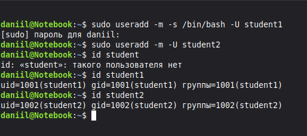
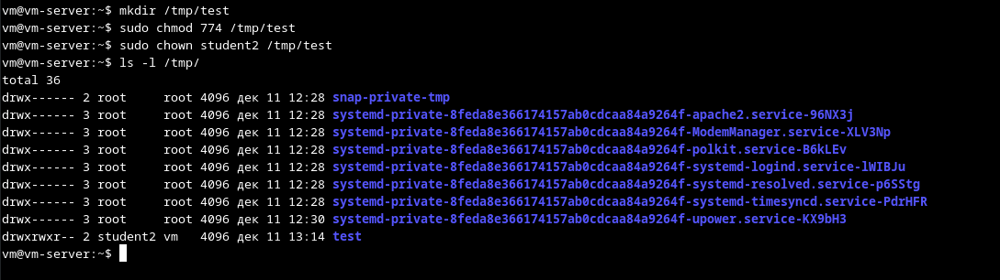
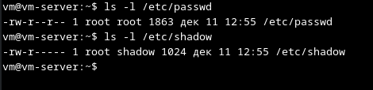
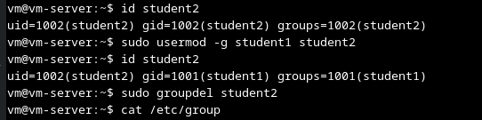
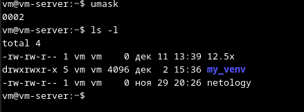

# Домашнее задание к занятию "3.04 Управление пользователями" - "Борисенко Даниил"

---

## Задание 1

**Условие:**

1. Создайте пользователя `student1` с оболочкой bash, входящего в группу `student1`.

2. Создайте пользователя `student2`, входящего в группу `student2`.

*Приведите своё решение в виде снимков экрана.*

**Ход решения:**

1. Для создания пользователя `student1` с оболочкой bash, использовал команду:

    ```bash
    sudo useradd -m -s /bin/bash -U student1
    ```

2. Для создания пользователя `student2` без оболочки bash использовал команду:

    ```bash
    sudo useradd -m -U student2
    ```

    **где:**

    **`m`** - создает домашнюю папку;
    **`-s`** - задает оболочку bash;
    **`-U`** - создает группу с именем пользователя и добавляет в эту группу пользователя.

3. Для проверки созданных пользоваетелей и групп использовал команды:

    ```bash
    id student1
    id student2
    ```



---

## Задание 2

**Условие:**

Создайте в общем каталоге (например, /tmp) директорию и назначьте для неё полный доступ со стороны группы `student2` и доступ на чтение всем остальным.

*Приведите своё решение в виде снимков экрана.*

**Ход решения:**

1. Создал директорию `test` по пути `tmp/test`:

    ```bash
    mkdir /tmp/test
    ```

2. Добавил права на директорию для владельца, групп и остальных следующей командой:

    ```bash
    sudo chmod 774 /tmp/test
    ```

    **где:**
    - 7 = rwx = доступ на запись, чтение и исполнение для владельца;
    - 7 = rwx = доступ на запись, чтение и исполнение для групп;
    - 4 = r-- = доступ только на чтение для остальных.

3. Предоставил полный доступ к директории `test` для пользователя `student2`:

    ```bash
    sudo chown student2 /tmp/test
    ```

4. Проверку прав осуществил следующей командой:

    ```bash
    sudo ls -l /tmp/
    ```



---

## Задание 3

**Условие:**

Какой режим доступа установлен для файлов `/etc/passwd` и `/etc/shadow`?

Объясните, зачем понадобилось именно два файла.

*Приведите ответ в свободной форме.*

**Ход решения:**

1. Проверил права для файлов `/etc/passwd` и `/etc/shadow` следующими командами:

    ```bash
    sudo ls -l /etc/passwd
    sudo ls -l /etc/shadow
    ```

    

    - **`/etc/passwd`** - доступен на чтение всем, он содержит общую информацию о пользователях: UID, GID, домашний каталог и оболочку.

    - **`/etc/shadow`** - доступен только root и группе shadow. Он хранит хеши паролей и данные об их сроках действия, поэтому в целях безопасности закрыт для пользователей.

    Разделение на два файла обеспечивает безопасное хранение паролей.

---

## Задание 4

**Условие:**

Удалите группу `student2`, а пользователя `student2` добавьте в группу `student1`.

*Приведите своё решение в виде снимков экрана.*

**Ход решения:**

1. Для добавил пользователя `student2` в группу `student1`:

    ```bash
    sudo usermod -g student1 student2
    ```

2. Для удаления группы`student2` использовал:

    ```bash
    sudo groupdel student2
    ```

3. Для проверки использовал:

    ```bash
    id student1
    ```



---

## Задание 5

**Условие:**

Напишите своими словами, как происходит сложение и вычитание прав доступа к файлам и папкам.

*Приведите ответ в свободной форме.*

**Ход решения:**

В Linux права существуют 3 права доступа:

- **`r`** - права на чтение;
- **`w`** - права на запись;
- **`х`** - права на выполнение.

Они соответствуют двоичным числам

- **`r`** соответствует 100 = 4;
- **`w`** соответствует 010 = 2;
- **`x`** соответствует 001 = 1.

При изменении прав доступа на файл или каталог используем чисел в десятичной системе исчисления. Например:

- rwx = 4 + 2 + 1 = 7,

Поэтому при команде **`chmod`** используются трехбитные маски 775 (соответствует rwxrwxr-x), 760 (соответствует rwxrw—-) и т.д.
**`Umask`** - трехбитная маска, которая по умолчанию указывает какие права у файлов и каталогов следует “забрать”, к примеру, у меня umask равен 002.

По умолчанию создаются файлы с маской прав 666, т.к. файл изначально не может быть исполняемым, а **`umask`** отнимает права на чтение, то есть 666 - 002 = 664.



---

## Задание 6

**Условие:**

Создайте в общем каталоге (например, /tmp) директорию и назначьте для неё полный доступ для всех, кроме группы `student1`.  Группа `student1` не должна иметь доступа к содержимому этого каталога.

*Приведите своё решение в виде снимков экрана.*

**Ход решения:**

---
