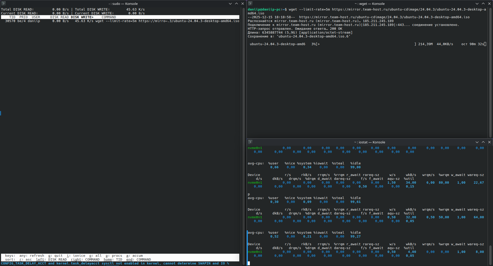
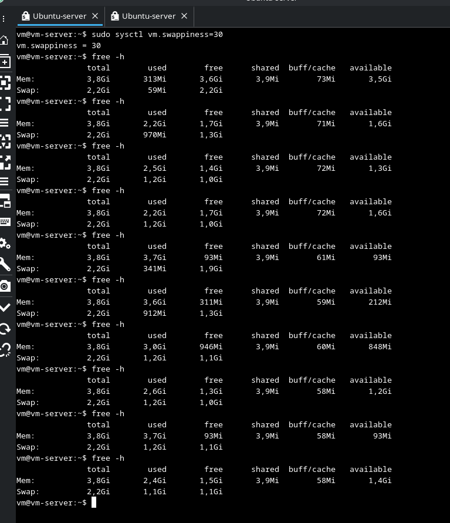
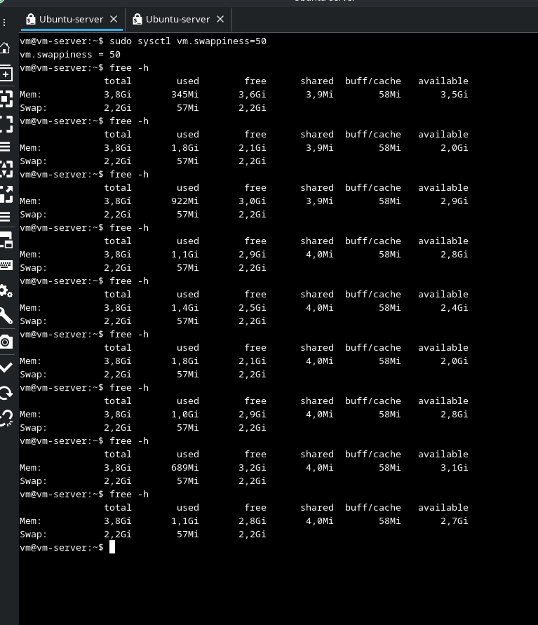
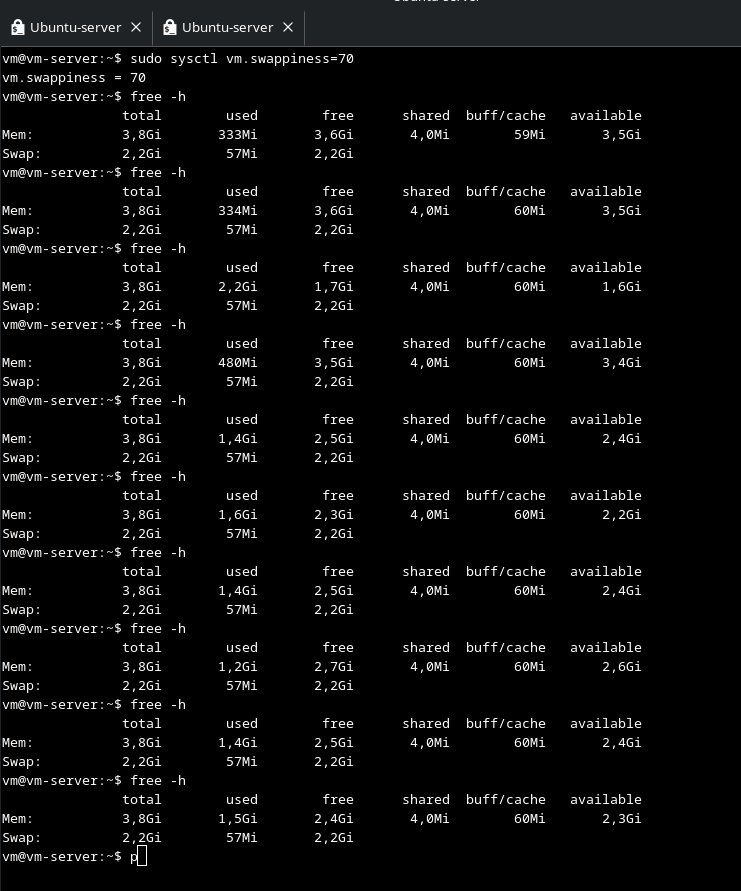

# Домашнее задание к занятию "3.06 Производительность системы. Часть 2" - "Борисенко Даниил"

---

## Задание 1

**Условие:**

Составьте задание через утилиту `cron` на проверку объёма кеш-обновлений еженедельно.

Кеш-обновления — это обновления, которые остаются после выполнения `apt update`, `apt upgrade`.

*Приведите ответ в виде команды.*

**Ход решения:**

Для выполнения задания использовал команду:

```bash
0 0 * * 1 du -sh /var/cache/apt/archives >> /var/log/cache
```

**Где:**

`0` — значение, указывающее на минуты, в данном случае `0`;  
`0` — значение, указывающее на часы, в данном случае `0`;  
`*` — значение, указывающее на день месяца, в данном случае любой;  
`*` — значение, указывающее на месяц, в данном случае любой;  
`1` — значение, указывающее на день недели, в данном случае понедельник.

Команда:

```bash
du -sh /var/cache/apt/archives
```

Показывает размер папки кэша `.deb` пакетов APT.

```text
>> /var/log/cache
```

Дописывает результат в конец файла `/var/log/cache`, не перезаписывая старые записи.

**Вывод:** каждую неделю, в понедельник в 00:00, cron будет записывать размер APT-кэша в лог-файл `/var/log/cache`.

---

## Задание 2

**Условие:**

1. Запустите процесс копирования большого файла (1 Гб) на жёсткий диск.
2. Запустите команду `iostat`.
3. Запустите `iotop`.

Какие процессы влияют на данные команды?

*Приведите развёрнутый ответ и приложите снимки экрана.*

**Ход решения:**

Для выполнения задания использовал команду:

```bash
wget --limit-rate=5m https://mirror.team-host.ru/ubuntu-cdimage/24.04.3/ubuntu-24.04.3-desktop-amd64.iso
```

**Где:**

```bash
wget
```

Утилита для скачивания файлов из интернета через терминал.

```bash
--limit-rate=5m
```

Ограничивает скорость скачивания до **5 МБ/с**.

```text
https://mirror.team-host.ru/ubuntu-cdimage/24.04.3/ubuntu-24.04.3-desktop-amd64.iso
```

Ссылка на файл ISO-образа Ubuntu Desktop.

**Вывод:** команда скачивает ISO-образ Ubuntu, ограничивая скорость загрузки до 5 МБ/с. В выводе команды iotop наблюдается процесс wget, который записывает данные на диск. В выводе команды iostat фиксируется увеличение показателей записи на диск, создаваемое процессом wget.



---

## Задание 3

**Условие:**

1. Настройте приоритет использования `swap` в пропорции:

    - 30/70,
    - 50/50,
    - 70/30.

2. Запустите браузер и нагрузите память:
   - сделайте скриншот терминала с выводом команды `free -h`;
   - открывайте закладки браузера, к примеру, Rutube;
   - мониторьте использование swap командой `free -h`;
   - при увеличении swap сделайте скриншот `free -h`;
   - продолжайте открывать закладки до близкого к полному исчерпанию оперативной памяти;
   - сделайте скриншот `free -h`;
   - сбросьте swap или перезагрузите машину;
   - повторите всё сначала в следующем режиме.

3. Проанализируйте результат.

*Приведите развёрнутый ответ и приложите снимки экрана.*

**Ход решения:**

1. Для настройки приоритета использования `swap` в пропорции 30/70, на отдельной vm использовал команду:

```bash
sudo sysctl vm.swappiness=30
```



В режиме vm.swappiness = 30 в ходе нагрузки оперативной памяти наблюдалось постепенное снижение значения доступной RAM. Использование swap фиксировалось только при высокой загрузке оперативной памяти. При практически полном исчерпании RAM система продолжала преимущественно использовать оперативную память, т.к при низком значении параметра vm.swappiness, swap используется только при нехватке оперативной памяти.

2. Для настройки приоритета использования `swap` в пропорции 50/50, на отдельной vm использовал команду:

```bash
sudo sysctl vm.swappiness=50
```



В режиме vm.swappiness = 50 использование swap фиксировалось уже на раннем этапе нагрузки памяти. По сравнению с режимом vm.swappiness = 30, система начала использовать swap до исчерпания оперативной памяти.

3. Для настройки приоритета использования `swap` в пропорции 70/30, на отдельной vm использовал команду:

```bash
sudo sysctl vm.swappiness=70
```



В режиме vm.swappiness = 70 использование swap фиксировалось сразу после установки параметра, даже при минимальной загрузке оперативной памяти. В ходе дальнейшей нагрузки объём используемой подкачки оставался стабильным, что свидетельствует о высоком приоритете использования swap.

**Вывод:** Параметр vm.swappiness напрямую влияет на момент и интенсивность использования swap. При vm.swappiness = 30 подкачка используется поздно и в ограниченном объеме, при vm.swappiness = 50 - раньше и более стабильно, а при vm.swappiness = 70 использовался наиболее активно и при наличии значительного объёма свободной оперативной памяти.

---

## Задание 4*

**Условие:**

Задание можно выполнить, если вы используете Linux на реальном железе. Можно установить программу `apt install cpufreq` и посмотреть настройки режимов процессора.

- установите `cpufreq`,
- выполните настройку на режим сохранения энергии,
- выполните настройку полной производительности.

Сравните результаты.

*Приведите развёрнутый ответ и приложите снимки экрана.*

**Ход решения:**

---

## Задание 5*

**Условие:**

Cron — ортодоксальный планировщик задач, но мы живём в 21 веке. Составьте задание на проверку объёма кеш-обновлений с помощью systemd-timers. В качестве подсказки используйте [материалы](https://opensource.com/article/20/7/systemd-timers).

*Прикрепите тест сервиса.*

**Ход решения:**

---
