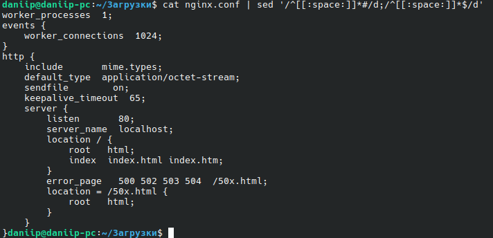
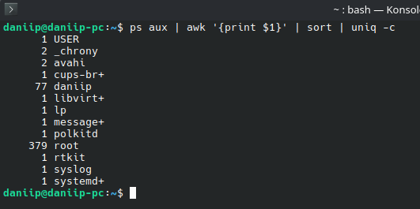
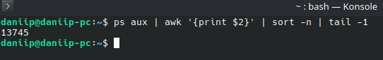
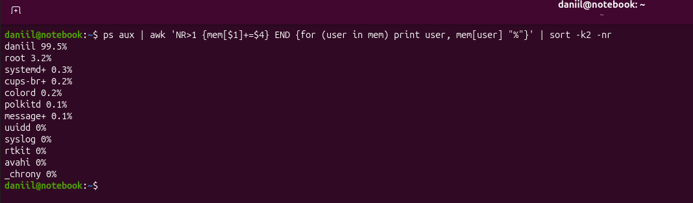

# Домашнее задание к занятию "4.03 Regexp и его использование для синтаксического анализа" - "Борисенко Даниил"

---

## Цель задания

В результате выполнения этого задания вы научитесь использовать:

1. Регулярные выражения для фильтрации вывода;
2. Утилиту sed для работы с конфигурационными файлами;
3. Утилиту awk для анализа информации.

---

## Задание 1

**Условие:**

Напишите регулярное выражение для проверки является ли строка `IPv4` адресом.

Для тестов можно использовать файл со следующим содержимым, фильтруя вывод с помощью команды `grep -E`:

```
192.168.0.1
127.0.0.1
84.345.23.11
88.3A.56.76
224.12.76
999.999.999.999
355.255.255.257
0.0.0.0
```

*Пришлите получившееся выражение в качестве ответа.*

**Ход решения:**

Для фильтрации IPv4-адресов использовал следующую команду:

```bash
grep -E '^((25[0-5]|2[0-4][0-9]|1[0-9]{2}|[1-9]?[0-9])\.){3}(25[0-5]|2[0-4][0-9]|1[0-9]{2}|[1-9]?[0-9])$'
```

**Где:**

`^` — начало строки;  
`$` — конец строки;  
`25[0-5]` — числа от 250 до 255;  
`2[0-4][0-9]` — числа от 200 до 249;  
`1[0-9]{2}` — числа от 100 до 199;  
`[1-9]?[0-9]` — числа от 0 до 99;  
`\.` — точка между октетами;  
`{3}` — повторение первых трёх октетов с точкой.

**Вывод:** регулярное выражение проверяет, что строка состоит из четырёх чисел от 0 до 255, разделённых точками.

---

## Задание 2

**Условие:**

В Вашей конфигурации Nginx скопилось много неиспользуемых сегментов и становится сложно его читать.

Используя `sed` удалите все пустые строки и комментарии в конфигурации Nginx.

Попробуйте сделать это одним запуском.

Файл расположен по [ссылке](./nginx.conf)

*Пришлите получившуюся команду в качестве ответа.*

**Ход решения:**

Для удаления пустых строк и комментариев использовал следующее выражение:

```bash
cat nginx.conf | sed '/^[[:space:]]*#/d;/^[[:space:]]*$/d'
```

**Где:**

`cat nginx.conf` — выводит содержимое файла `nginx.conf`;  
`sed` — обрабатывает текстовый поток;  
`/^[[:space:]]*#/d` — удаляет строки, которые начинаются с комментария `#`, даже если перед ним есть пробелы;  
`/^[[:space:]]*$/d` — удаляет пустые строки.

**Вывод:** команда одним запуском удаляет из конфигурации Nginx комментарии и пустые строки, оставляя только активные параметры.



---

## Задание 3

**Условие:**

Используя `awk` и `ps aux` соберите информацию о:

- количестве процессов для каждого пользователя;
- процессе с самым большим PID;
- (дополнительное задание со звездочкой*) суммарном использовании памяти различными пользователями.

*Пришлите скриншоты со скриптами и демонстрацией их работы.*

**Ход решения:**

1. Для подсчёта количества процессов для каждого пользователя использовал команду:

```bash
ps aux | awk '{print $1}' | sort | uniq -c
```

**Где:**

```bash
ps aux
```

Выводит список всех процессов в системе.

```bash
awk '{print $1}'
```

Выводит первый столбец из результата команды `ps aux`, то есть пользователя, от имени которого запущен процесс.

```bash
sort
```

Сортирует список пользователей.

```bash
uniq -c
```

Подсчитывает количество повторяющихся строк, то есть количество процессов для каждого пользователя.

В результате видно, сколько процессов запущено от имени каждого пользователя.



2. Для поиска процесса с самым большим PID использовал команду:

```bash
ps aux | awk '{print $2}' | sort -n | tail -1
```

**Где:**

```bash
awk '{print $2}'
```

Выводит второй столбец из результата команды `ps aux`, то есть PID процесса.

```bash
sort -n
```

Сортирует PID как числа по возрастанию.

```bash
tail -1
```

Выводит последнюю строку, то есть самый большой PID.

В результате был найден максимальный PID процесса в системе.



3. Для подсчёта суммарного использования памяти различными пользователями использовал команду:

```bash
ps aux | awk 'NR>1 {mem[$1]+=$6} END {for (user in mem) printf "%-15s %.2f MB\n", user, mem[user]/1024}' | sort -k2 -nr
```

**Где:**

```bash
NR>1
```

Пропускает первую строку с заголовками.

```bash
mem[$1]+=$6
```

Суммирует значение шестого столбца `RSS` для каждого пользователя.  
`$1` — имя пользователя, `$6` — объём используемой памяти процессом в КБ.

```bash
printf "%-15s %.2f MB\n", user, mem[user]/1024
```

Выводит имя пользователя и суммарное использование памяти в мегабайтах.

```bash
sort -k2 -nr
```

Сортирует результат по объёму памяти в порядке убывания.

В результате видно, сколько оперативной памяти суммарно используют процессы каждого пользователя.



**Вывод:** команда `ps aux` выводит список процессов, а утилита `awk` позволяет обрабатывать нужные столбцы: считать количество процессов для каждого пользователя, находить максимальный PID и суммировать использование памяти процессами разных пользователей.

---

## Задание 4*

**Условие:**

Напишите bash-скрипт который собирает информацию о системе и пишет ее в лог каждые 5 секунд.

Используемые параметры:

- loadavg[1,5,15] средний показатель загрузки ЦПУ за последние 1 5 и 15 минут. *Примечание:* хранится в `/proc/loadavg`.
- memfree количество свободной оперативной памяти в байтах. *Примечание:* используем утилиту `free`.
- memtotal количество всей оперативной памяти в байтах. *Примечание:* используем утилиту `free`.
- diskfree свободное место на диске подключенного к /. *Примечание:* используем утилиту `df`.
- disktotal общий объем диска подключенного к /. *Примечание:* используем утилиту `df`.

***Формат записи:*** `timestamp loadavg1 loadavg5 loadavg15 memfree memtotal diskfree disktotal`

Пособирайте данные в течении 5-10 минут.

Анализируя этот лог с помощью `awk` напишите скрипт проверки состояния системы с заданными условиями:

- `loadavg1 < 1` в течении последних 2 минут;
- `memfree / memtotal < 60%` в течении последних 3 минут;
- `diskfree / disktotal < 60%` в течении последних 5 минут.

Скрипт должен возвращать 0 код ответа, если все условия выполняются, и любой другой в случае невыполнения.

В консоль также необходимо выводить, какое именно из условий не выполняется.

*Пришлите получившиеся скрипты в качестве ответа.*

**Ход решения:**

---
