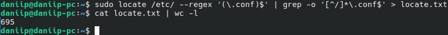
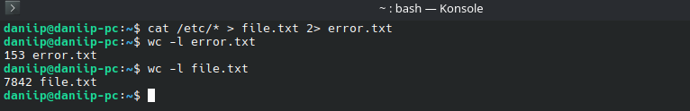
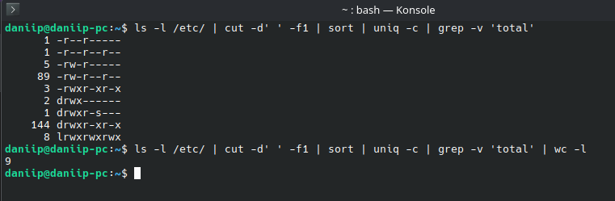
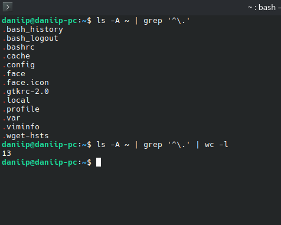

# Домашнее задание к занятию "4.04 Работа с текстовыми утилитами" - "Борисенко Даниил"

## Цель задания

В результате выполнения этого задания вы научитесь:

1. Использовать команды для поиска файлов в Linux;
2. Перенаправлять потоки в различные файлы;
3. Подсчитывать количество строк в выводе;
4. Использовать сортировку.

---

## Задание 1

**Условие:**

- Найдите все файлы с расширением `.conf` в /etc сначала с помощью команды `find`, а потом с помощью команды `locate`;
- Перенаправьте результаты работы каждой команды в разные файлы;
- Подсчитайте количество найденных файлов в каждом случае с помощью `wc`.

**Ход решения:**

1. Для поиска всех файлов с расширением `.conf` в каталоге `/etc` с помощью команды `find` использовал команду:

```bash
sudo find /etc -type f -name "*.conf" >> find.txt
```
**Где:**

`sudo find /etc` — запускает поиск в каталоге `/etc`;  
`-type f` — ищет только обычные файлы;  
`-name "*.conf"` — ищет файлы с расширением `.conf`;  
`>> find.txt` — записывает результат в файл `find.txt`;  

Для подсчёта количества найденных файлов использовал команду:

```bash
cat find.txt | wc -l
```

Результат:

```text
279
```


2. Для поиска файлов с расширением `.conf` с помощью команды `locate` использовал команду:

```bash
sudo locate /etc/ --regex '(\.conf)$' | grep -o '[^/]*\.conf$' > locate.txt
```

**Где:**

`locate /etc/` — ищет файлы по базе данных `locate` в каталоге `/etc`;  
`--regex '(\.conf)$'` — выбирает только пути, которые заканчиваются на `.conf`;  
`grep -o '[^/]*\.conf$'` — выводит только имя файла без полного пути;  
`> locate.txt` — записывает результат в файл `locate.txt`;  

3. Для подсчёта количества найденных файлов использовал команду:

```bash
cat locate.txt | wc -l
```

Результат:

```text
695
```

**Вывод:** команда `find` ищет файлы напрямую в файловой системе, а `locate` использует заранее созданную базу данных. Поэтому количество найденных файлов может отличаться.



---

## Задание 2

**Условие:**

- Выведите с помощью `cat` содержимое всех файлов в директории /etc `cat /etc/*`;
- Направьте ошибки в отдельный файл в вашей домашней директории;
- Стандартный поток вывода направьте в другой файл;
- Подсчитайте, сколько объектов не удалось прочитать.

**Ход решения:**

1. Для вывода содержимого всех объектов в каталоге `/etc` использовал команду:

```bash
cat /etc/* > file.txt 2> error.txt
```

**Где:**

`cat /etc/*` — пытается вывести содержимое всех объектов в каталоге `/etc`;  
`> file.txt` — перенаправляет стандартный вывод в файл `file.txt`;  
`2> error.txt` — перенаправляет ошибки в файл `error.txt`; 

2. Для подсчёта количества ошибок использовал команду:

```bash
wc -l error.txt
```

Результат:

```text
153 error.txt
```

3. Также проверил количество строк в файле со стандартным выводом:

```bash
wc -l file.txt
```

Результат:

```text
7842 file.txt
```

**Вывод:** не удалось прочитать `153` объекта. Основная причина — среди объектов в `/etc` есть директории и файлы, к которым нет доступа для чтения через `cat`.



---

## Задание 3

**Условие:**

- Перенаправьте результат работы команды `ls -l` в каталоге с большим количеством файлов в утилиту `cut`, чтобы отобразить только права доступа к файлам;
- Отправьте в конвейере этот вывод на `sort` и `uniq`, чтобы отфильтровать все повторяющиеся строки;
- Уберите из подсчета строку `total`;
- С помощью `wc` подсчитайте различные типы разрешений в этом каталоге.

**Ход решения:**

1. Для вывода прав доступа к объектам в каталоге `/etc` использовал команду:

```bash
ls -l /etc/ | cut -d' ' -f1 | sort | uniq -c | grep -v 'total'
```

**Где:**

`ls -l /etc/` — выводит подробный список объектов каталога `/etc`;  
`cut -d' ' -f1` — оставляет только первый столбец, то есть права доступа;  
`sort` — сортирует результат;  
`uniq -c` — группирует одинаковые строки и считает их количество;  
`grep -v 'total'` — убирает строку `total`;  

2. Для подсчёта количества различных типов разрешений использовал команду:

```bash
ls -l /etc/ | cut -d' ' -f1 | sort | uniq -c | grep -v 'total' | wc -l
```

**Где:**

`wc -l` — считает количество разных типов прав доступа.

Результат:

```text
9
```

**Вывод:** в каталоге `/etc` найдено `9` различных типов разрешений.



---

## Задание 4*

**Условие:**

В ОС Linux скрытыми файлами считаются те, имена которых начинаются с точки.

Сколько скрытых файлов в вашем домашнем каталоге?

**Ход решения:**

1. Для поиска скрытых файлов в домашнем каталоге использовал команду:

```bash
ls -A ~ | grep '^\.'
```

**Где:**

`ls -A ~` — выводит содержимое домашнего каталога, включая скрытые файлы;  
`grep '^\.'` — оставляет только строки, которые начинаются с точки;  

2. Для подсчёта количества скрытых файлов использовал команду:

```bash
ls -A ~ | grep '^\.' | wc -l
```

**Где:**

`wc -l` — подсчитывает количество найденных строк.

Результат:

```text
13
```

**Вывод:** в домашнем каталоге найдено `13` скрытых файлов и директорий.



---
