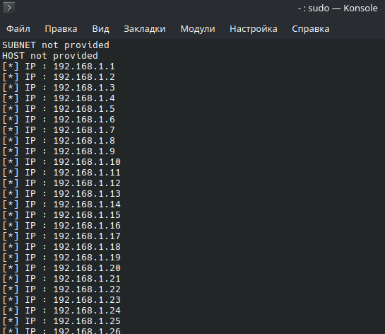
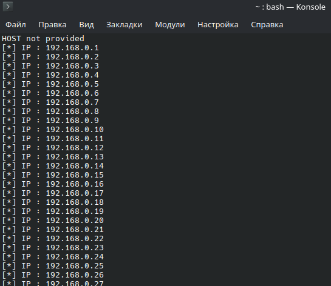
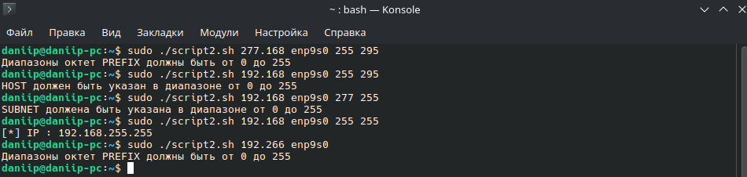

# Домашнее задание к занятию "4.05 Разбор скриптов и и их написание" - "Борисенко Даниил"

## Цель задания

В результате выполнения этого задания вы научитесь:

1. Контролировать передачу пользователем параметров скрипту;
2. Проверять входные данные;
3. Проверять, что скрипт запущен с повышенными привилегиями.

---

## Задание 1

### Условие задания 1

Дан скрипт:

```bash
#!/bin/bash
PREFIX="${1:-NOT_SET}"
INTERFACE="$2"

[[ "$PREFIX" = "NOT_SET" ]] && { echo "\$PREFIX must be passed as first positional argument"; exit 1; }
if [[ -z "$INTERFACE" ]]; then
    echo "\$INTERFACE must be passed as second positional argument"
    exit 1
fi

for SUBNET in {1..255}
do
 for HOST in {1..255}
 do
  echo "[*] IP : ${PREFIX}.${SUBNET}.${HOST}"
  arping -c 3 -i "$INTERFACE" "${PREFIX}.${SUBNET}.${HOST}" 2> /dev/null
 done
done
```

Условимся, что в данной работе мы сканируем только IP адреса с маской 24. Т.е. формата ххх.ххх.ххх.ххх

где:

- первые два октета ххх.ххх это PREFIX
- далее идёт ххх- SUBNET
- и наконец, ххх- HOST

Измените скрипт так, чтобы:

- для ввода пользователем были доступны все параметры IPv4 адреса. Помимо обязательных аргументов для запуска скрипта PREFIX и INTERFACE, сделайте возможность пользователю задавать также аргумены SUBNET и HOST;
- скрипт должен работать корректно в случае передачи туда только PREFIX и INTERFACE- сканируется вся подсеть;
- скрипт должен сканировать только одну подсеть, если переданы параметры PREFIX, INTERFACE и SUBNET- сканируются все хосты данной подсети;
- скрипт должен сканировать только один IP-адрес, если переданы PREFIX, INTERFACE, SUBNET и HOST- сканируется только один IP-адрес;
- не забывайте проверять вводимые пользователем параметры с помощью регулярных выражений и знака `=~` в условных операторах;
- проверьте, что скрипт запускается с повышенными привилегиями и сообщите пользователю, если скрипт запускается без них;
- скрипт не должен содержать повторяющихся блоков кода, для решения этого вопроса используйте функции.

### Требования к результату

- В вашем решении содержится ссылка на .sh файл скрипта (например, из Google Диска или GitHub)
- В вашем решении приведены скриншоты, демонстрирующие работоспособность скрипта в соответствии со списком требований:
- вводе только PREFIX и INTERFACE;
- вводе PREFIX, INTERFACE, SUBNET;
- вводе PREFIX, INTERFACE, SUBNET, HOST;
- запуске без прав root с соответствующим уведомлением.

### Ход решения задания 1

Для выполнения задания был изменён исходный bash-скрипт.  
В скрипт добавлена возможность передавать параметры `PREFIX`, `INTERFACE`, `SUBNET` и `HOST`.

Файл скрипта: [script2.sh](./script2.sh)

Скрипт поддерживает несколько вариантов запуска:

- если переданы только `PREFIX` и `INTERFACE`, сканируются все подсети и хосты;
- если переданы `PREFIX`, `INTERFACE` и `SUBNET`, сканируются все хосты указанной подсети;
- если переданы `PREFIX`, `INTERFACE`, `SUBNET` и `HOST`, сканируется только один IP-адрес;
- если скрипт запущен без прав root, выводится сообщение об ошибке;
- если параметры указаны неверно, скрипт выводит сообщение об ошибке.

Для запуска скрипта с параметрами `PREFIX` и `INTERFACE` использовал команду:

```bash
sudo ./script2.sh 192.168 enp9s0 | less
```

В данном случае `SUBNET` и `HOST` не указаны, поэтому скрипт сканирует диапазон подсетей и хостов.


Для запуска скрипта с параметрами `PREFIX`, `INTERFACE` и `SUBNET` использовал команду:

```bash
sudo ./script2.sh 192.168 enp9s0 0 | less
```

В данном случае указан `SUBNET`, но не указан `HOST`, поэтому скрипт сканирует все хосты в подсети `192.168.0.0/24`.



Для сканирования одного IP-адреса использовал команду:

```bash
sudo ./script2.sh 192.168 enp9s0 0 16 | less
```

В данном случае скрипт проверяет только один адрес:

```text
192.168.0.16
```


Также была выполнена проверка запуска скрипта без прав root:

```bash
./script2.sh 192.168 enp9s0
```

В результате скрипт сообщил, что его необходимо запускать с правами root.



Дополнительно была проверена обработка некорректных параметров:

```bash
sudo ./script2.sh 277.168 enp9s0 255 295
sudo ./script2.sh 192.168 enp9s0 255 295
sudo ./script2.sh 192.168 enp9s0 255 255
sudo ./script2.sh 192.266 enp9s0
```

Скрипт корректно обрабатывает ошибки ввода и выводит сообщения о неверных диапазонах октетов.



**Вывод:** скрипт был доработан так, чтобы пользователь мог передавать все параметры IPv4-адреса. Также была добавлена проверка запуска от имени root, проверка корректности введённых значений и обработка разных вариантов запуска.

---

## Задание 2*

### Условие задания 2

Измените скрипт из Задания 1 так, чтобы:

- единственным параметром для ввода остался сетевой интерфейс;
- определите подсеть и маску с помощью утилиты `ip a` или `ifconfig`
- сканируйте с помощью arping адреса только в этой подсети
- не забывайте проверять в начале работы скрипта, что введенный интерфейс существует
- воспользуйтесь shellcheck для улучшения качества своего кода

### Ход решения задания 2

---
