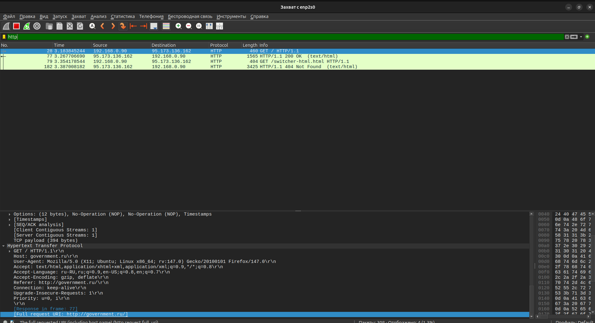
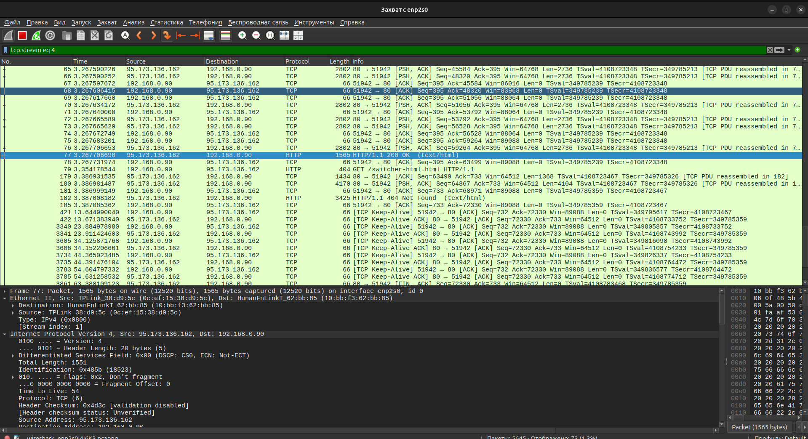
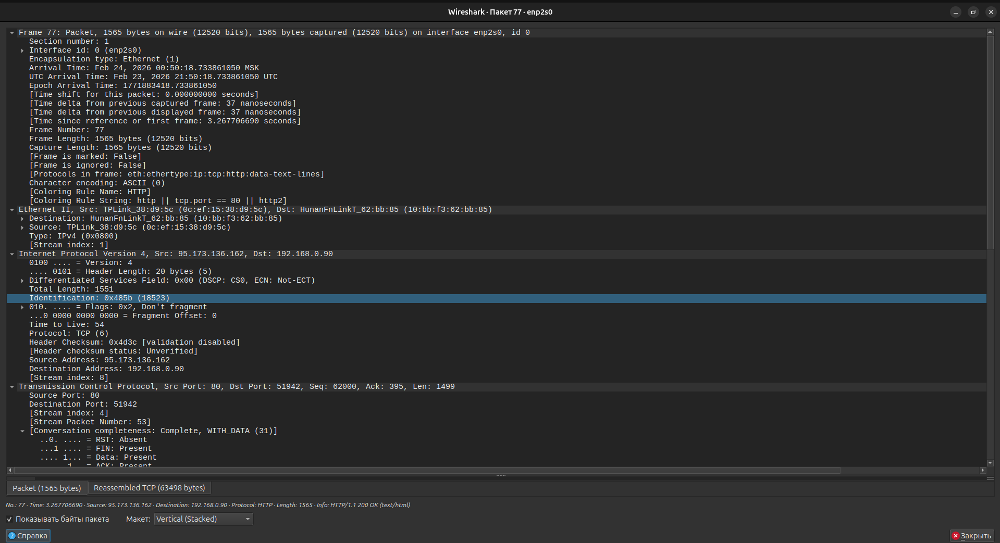
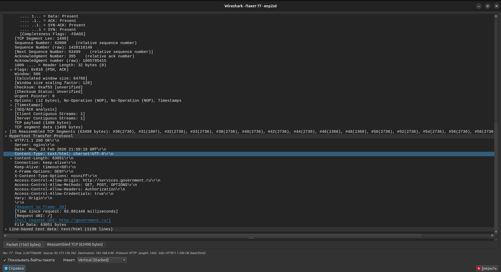
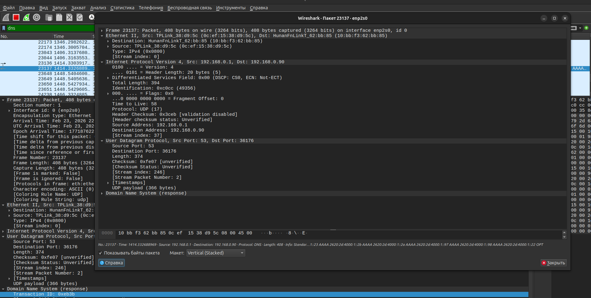
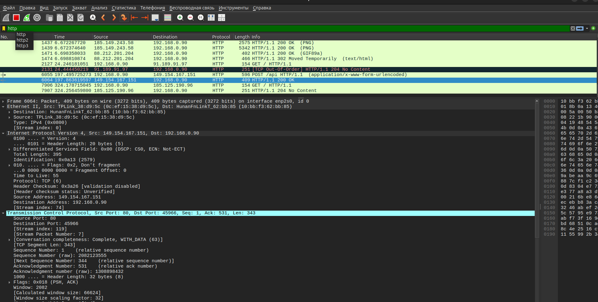

# Домашнее задание к занятию "5.01 Теоретические основы сети. Модель OSI и TCP/IP" - "Борисенко Даниил"

## Цели задания

- Научиться расшифровывать результаты анализа сетевого трафика с помощью Wireshark;
- Понять суть и увидеть варианты инкапсуляции (по модели OSI) на примерах различных протоколов. 

Такая практика помогает закрепить знания об иерархии распределения протоколов и технологий на разных уровнях модели OSI. Эти навыки пригодятся для понимания принципов сети и выполнения домашнего задания в дальнейшем.

## Задание 1. Анализ захвата трафика

### Условие

Вам поставили задачу проанализировать результаты захвата трафика сетевого интерфейса. Это базовый навык при работе с сетью. В будущем он пригодится вам для того, чтобы выявлять источники проблем в сети и проверять проблемы безопасности (траблшутинг). 

### Требования к результату

- Вы должны отправить скриншоты захваченного пакета. Пример вы найдёте по [ссылке](https://u.netology.ru/backend/uploads/lms/content_assets/file/11241/image.png).
- К скриншотам необходимо приложить комментарии с информацией, какие протоколы и уровни модели OSI вы обнаружили.

### Процесс выполнения

1. Откройте Wireshark.
2. Запустите захват трафика с сетевого интерфейса.
3. Запустите браузер и зайдите на любой сайт.
4. Выберите какой-нибудь пакет из захваченного трафика.
5. Посмотрите разные уровни и разверните параметры при необходимости.
6. Напишите, какие протоколы и уровни модели OSI вы видите.

### Ход решения

Для выполнения задания был запущен Wireshark и выбран сетевой интерфейс `enp2s0`.

После запуска захвата трафика был открыт сайт `government.ru`. Для отображения HTTP-пакетов использовал фильтр:

```text
http
```

В результате были найдены HTTP-пакеты между локальным компьютером и удалённым сервером.



На скриншоте видно, что локальный компьютер с IP-адресом `192.168.0.90` отправил HTTP-запрос на сервер `95.173.136.162`.

В HTTP-запросе отображается:

```text
GET / HTTP/1.1
Host: government.ru
```

Это означает, что клиент отправил запрос на получение главной страницы сайта `government.ru`.

Для анализа одного TCP-соединения был применён фильтр:

```text
tcp.stream eq 4
```



Фильтр `tcp.stream eq 4` отображает только пакеты одного TCP-потока. В этом потоке видно, что клиент отправил HTTP-запрос, а сервер вернул HTTP-ответ.

В выбранном пакете отображаются следующие уровни и протоколы:

```text
Frame
Ethernet II
Internet Protocol Version 4
Transmission Control Protocol
Hypertext Transfer Protocol
```



Разбор по модели OSI:

- **Канальный уровень** — `Ethernet II`, содержит MAC-адреса источника и назначения;
- **Сетевой уровень** — `IPv4`, содержит IP-адреса источника и назначения;
- **Транспортный уровень** — `TCP`, содержит порты, номера последовательности и подтверждения;
- **Прикладной уровень** — `HTTP`, содержит HTTP-запрос или HTTP-ответ.

В HTTP-ответе видно:

```text
HTTP/1.1 200 OK
Server: nginx
Content-Type: text/html; charset=UTF-8
Content-Length: 63051
```



Код ответа `200 OK` означает, что запрос был успешно обработан сервером.  
Поле `Content-Type` показывает тип передаваемых данных, в данном случае это HTML-страница.

**Вывод:** при передаче HTTP-трафика используются несколько уровней модели OSI. На канальном уровне передаются Ethernet-кадры, на сетевом уровне используются IP-адреса, на транспортном уровне работает TCP, а на прикладном уровне передаются HTTP-запросы и ответы.

---

## Задание 2. Инкапсуляция данных

### Условие

Вам поставили задачу найти различия в инкапсуляции данных разных протоколов и технологий. Это также базовый навык при работе с сетью. Вы сможете понимать, как одни приложения и технологии зависят от других протоколов и приложений. Это позволит эффективнее решать сетевые проблемы. 

### Требования к результату

- Вы должны отправить скриншоты захваченных пакетов.
- В комментариях к скриншоту необходимо указать, чем они различаются по уровням модели OSI.

### Процесс выполнения

1. Откройте Wireshark.
2. Запустите захват трафика с сетевого интерфейса.
3. Запустите браузер и зайдите на любой сайт.
4. Сначала установите фильтр захваченного трафика по технологии DNS, затем выберите любой HTTP-поток.
5. Сравните пакеты между собой. В чём отличия с точки зрения модели OSI? 

### Ход решения

Для выполнения задания в Wireshark были проанализированы DNS- и HTTP-пакеты.

Сначала был применён фильтр:

```text
dns
```



На скриншоте выбран DNS-пакет. В деталях видно, что используется протокол UDP:

```text
User Datagram Protocol
Src Port: 53
Dst Port: 36176
```

Источник пакета:

```text
192.168.0.1
```

Получатель пакета:

```text
192.168.0.90
```

Это означает, что устройство `192.168.0.1`, вероятно роутер или DNS-сервер в локальной сети, отправило DNS-ответ на компьютер `192.168.0.90`.

Разбор DNS-пакета по модели OSI:

- **Канальный уровень** — `Ethernet II`;
- **Сетевой уровень** — `IPv4`;
- **Транспортный уровень** — `UDP`;
- **Прикладной уровень** — `DNS`.

DNS использует UDP, потому что для большинства DNS-запросов не требуется установка постоянного соединения.

Далее был применён фильтр:

```text
http
```



В списке пакетов отображаются HTTP-запросы и ответы. На скриншоте выбран HTTP-пакет, в котором видно использование протокола TCP.

В деталях пакета отображаются IP-адреса:

```text
Source Address: 149.154.167.151
Destination Address: 192.168.0.90
```

Также отображаются TCP-порты:

```text
Src Port: 80
Dst Port: 45966
```

Порт `80` используется для HTTP. Это означает, что удалённый сервер отправил HTTP-ответ локальному компьютеру.

Сравнение DNS и HTTP по модели OSI:

| Уровень OSI | DNS | HTTP |
|---|---|---|
| Прикладной уровень | DNS | HTTP |
| Транспортный уровень | UDP | TCP |
| Сетевой уровень | IPv4 | IPv4 |
| Канальный уровень | Ethernet II | Ethernet II |

Главное отличие заключается в транспортном уровне: DNS в данном случае использует `UDP`, а HTTP использует `TCP`.

**Вывод:** DNS и HTTP относятся к прикладному уровню модели OSI, но используют разные транспортные протоколы. DNS работает через UDP, а HTTP работает через TCP. В Wireshark можно увидеть инкапсуляцию данных: прикладной протокол помещается в TCP или UDP, затем в IP-пакет, а затем в Ethernet-кадр.

---

*Список используемой литературы:*

- [«Как пользоваться Wireshark для анализа трафика».](https://losst.pro/kak-polzovatsya-wireshark-dlya-analiza-trafika)
- [Дополнительные материалы по модели OSI](https://github.com/netology-code/snet-homeworks/blob/snet-22/4-01-osi.md)

---
