# Домашнее задание к занятию "6.01 Виртуализация и облачные решения: AWS, GCP, Yandex Cloud, OpenStack" - "Борисенко Даниил"

---

## Задание 1

### Условие

**Ответьте на вопрос в свободной форме.**

Чем частное облако отличается от общедоступного, публичного и гибридного?

### Ход решения

Частное облако — это облачная инфраструктура, которая используется одной организацией или ограниченным кругом пользователей. Доступ к такому облаку закрыт для посторонних, а ресурсы выделены конкретной компании или группе.

Публичное облако — это облачная инфраструктура, ресурсы которой доступны широкому кругу пользователей через интернет. Примеры: Yandex Cloud, AWS, Google Cloud, Microsoft Azure.

Общедоступное облако похоже на публичное: его ресурсы предоставляются разным пользователям и организациям, а инфраструктурой управляет провайдер.

Гибридное облако объединяет частное и публичное облако. Например, часть сервисов может работать внутри компании, а часть — в облаке провайдера.

**Вывод:** основное отличие между видами облаков заключается в том, кто имеет доступ к ресурсам, где размещена инфраструктура и кто отвечает за управление и безопасность.

---

## Задание 2

### Условие

Что обозначают: IaaS, PaaS, SaaS, CaaS, DRaaS, BaaS, DBaaS, MaaS, DaaS, NaaS, STaaS? Напишите примеры их использования.

### Ход решения

- **IaaS (Infrastructure as a Service)** — инфраструктура как услуга. Пользователь получает виртуальные машины, сеть и хранилища, а операционную систему и приложения настраивает сам.  
  Примеры: Yandex Compute Cloud, AWS EC2, Google Compute Engine.

- **PaaS (Platform as a Service)** — платформа как услуга. Провайдер предоставляет готовую среду для разработки, тестирования и запуска приложений.  
  Примеры: Heroku, Google App Engine, Yandex Cloud Functions.

- **SaaS (Software as a Service)** — программное обеспечение как услуга. Пользователь получает готовое приложение через интернет.  
  Примеры: Google Docs, Gmail, Microsoft 365, Битрикс24.

- **CaaS (Containers as a Service)** — контейнеры как услуга. Сервис для запуска и управления контейнерами.  
  Примеры: Kubernetes, Google Kubernetes Engine, Yandex Managed Service for Kubernetes.

- **DRaaS (Disaster Recovery as a Service)** — аварийное восстановление как услуга. Позволяет восстановить инфраструктуру после сбоя или аварии.  
  Примеры: VMware Cloud Disaster Recovery, аварийное восстановление в облаке.

- **BaaS (Backup as a Service)** — резервное копирование как услуга. Используется для создания и хранения резервных копий.  
  Примеры: облачные сервисы резервного копирования.

- **DBaaS (Database as a Service)** — база данных как услуга. Провайдер предоставляет готовую управляемую базу данных.  
  Примеры: Yandex Managed Service for PostgreSQL, Firebase, Supabase.

- **MaaS (Monitoring as a Service)** — мониторинг как услуга. Сервис для наблюдения за состоянием инфраструктуры и приложений.  
  Примеры: Yandex Monitoring, Zabbix, Grafana Cloud.

- **DaaS (Desktop as a Service)** — рабочий стол как услуга. Пользователь получает удалённый рабочий стол.  
  Примеры: Citrix, Microsoft Remote Desktop.

- **NaaS (Network as a Service)** — сеть как услуга. Провайдер предоставляет сетевые функции и сервисы.  
  Примеры: VPN, балансировщики нагрузки, облачные сети.

- **STaaS (Storage as a Service)** — хранилище как услуга. Пользователь арендует место для хранения данных.  
  Примеры: Google Drive, Dropbox, Яндекс Диск, Yandex Object Storage.

---

## Задание 3

### Условие

**Ответьте на вопрос в свободной форме.**

Напишите, какой вид сервиса предоставляется пользователю в ситуациях:

1. Всеми процессами управляет провайдер.
2. Вы управляете приложением и данными, остальным управляет провайдер.
3. Вы управляете операционной системой, средой исполнения, данными, приложениями, остальными управляет провайдер.
4. Вы управляете сетью, хранилищами, серверами, виртуализацией, операционной системой, средой исполнения, данными, приложениями.

### Ход решения

1. **Всеми процессами управляет провайдер.**

   Это модель **SaaS** — программное обеспечение как услуга. Пользователь только использует готовый сервис, а провайдер управляет инфраструктурой, платформой и приложением.

2. **Пользователь управляет приложением и данными, остальным управляет провайдер.**

   Это модель **PaaS** — платформа как услуга. Пользователь размещает своё приложение и данные, а серверы, ОС и среду выполнения обслуживает провайдер.

3. **Пользователь управляет операционной системой, средой исполнения, данными и приложениями, остальным управляет провайдер.**

   Это модель **IaaS** — инфраструктура как услуга. Провайдер предоставляет виртуальные машины, сеть и хранилище, а пользователь сам настраивает ОС и приложения.

4. **Пользователь управляет сетью, хранилищами, серверами, виртуализацией, ОС, средой исполнения, данными и приложениями.**

   Это модель **On-Premise**, то есть собственная инфраструктура. В этом случае организация самостоятельно управляет всеми уровнями ИТ-инфраструктуры.

---

## Задание 4

### Условие

Вы работаете ИТ-специалистом в своей компании. Перед вами встал вопрос: покупать физический сервер или арендовать облачный сервис от [Yandex Cloud](https://cloud.yandex.ru).

Выполните действия и приложите скриншоты по каждому этапу:

1. Создать платёжный аккаунт:

- зайти в консоль;
- выбрать меню биллинг;
- зарегистрировать аккаунт.

2. После регистрации выбрать меню в консоли Computer cloud.
3. Приступить к созданию виртуальной машины.

**Ответьте на вопросы в свободной форме:**

1. Какие ОС можно выбрать?
2. Какие параметры сервера можно выбрать?
3. Какие компоненты мониторинга можно создать?
4. Какие системы безопасности предусмотрены?
5. Как меняется цена от выбранных характеристик? Приведите пример самой дорогой и самой дешёвой конфигурации. 

### Ход решения

Для анализа облачного сервиса была открыта консоль Yandex Cloud.

В консоли доступен дашборд облака, где отображаются основные ресурсы: сети, подсети, группы безопасности и другие сервисы.

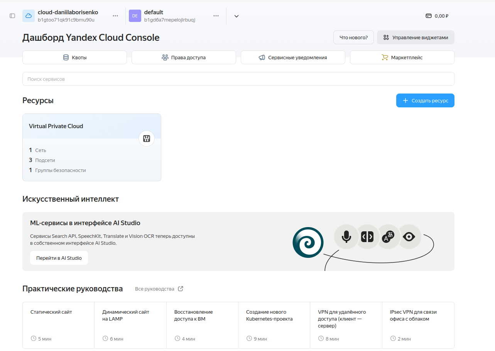

Далее был открыт раздел создания виртуальной машины.

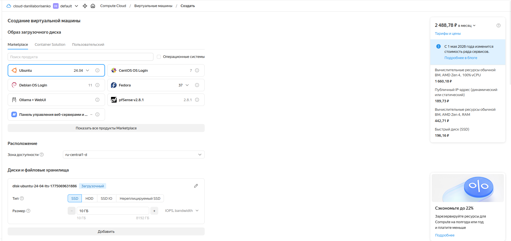

1. **Какие ОС можно выбрать?**

В Yandex Cloud можно выбрать разные операционные системы. В разделе Marketplace доступны образы на базе Linux и Windows. Например, можно выбрать Ubuntu, Debian, CentOS, Fedora и другие образы.

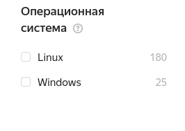

2. **Какие параметры сервера можно выбрать?**

При создании виртуальной машины можно выбрать:

- зону доступности;
- тип и размер диска;
- тип диска: SSD, HDD, SSD IO;
- количество vCPU;
- объём RAM;
- сетевые настройки;
- наличие публичного IP-адреса.

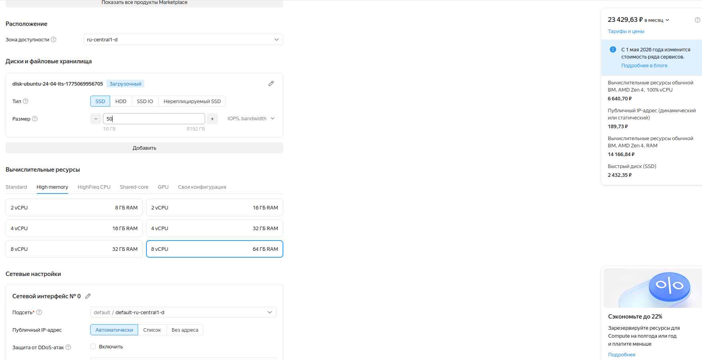

Также можно изменять тип и размер диска.

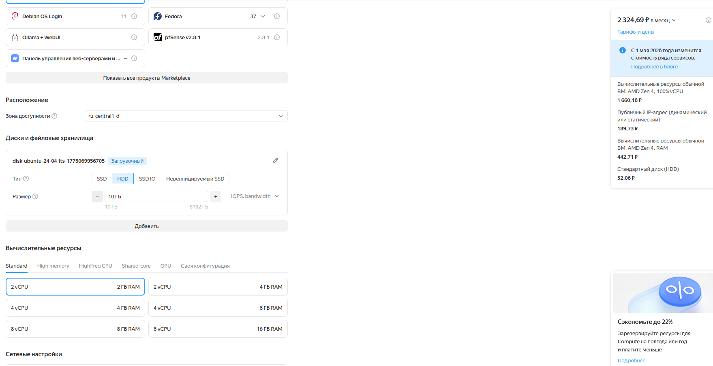

3. **Какие компоненты мониторинга можно создать?**

В настройках виртуальной машины можно установить агент сбора метрик. Метрики можно отправлять в Yandex Monitoring или Yandex Managed Service for Prometheus.

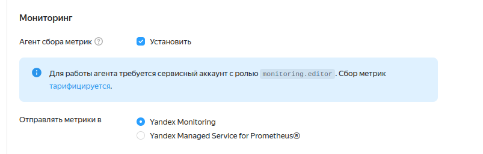

4. **Какие системы безопасности предусмотрены?**

Для доступа к виртуальной машине можно использовать SSH-ключ или OS Login. SSH-ключ позволяет безопасно подключаться к серверу без использования обычного пароля.

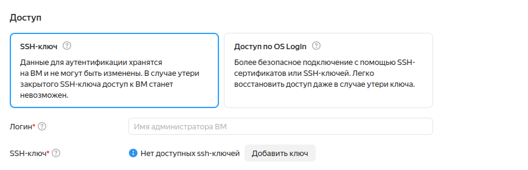

5. **Как меняется цена от выбранных характеристик?**

Цена зависит от выбранных ресурсов: количества процессорных ядер, объёма оперативной памяти, типа и размера диска, а также наличия публичного IP-адреса.

Чем мощнее конфигурация сервера, тем выше стоимость. Например, конфигурация с большим количеством vCPU, большим объёмом RAM и SSD-диском стоит значительно дороже минимальной конфигурации с HDD-диском и небольшим количеством ресурсов.

**Вывод:** при создании виртуальной машины в Yandex Cloud можно выбрать операционную систему, вычислительные ресурсы, диск, сеть, мониторинг и способ безопасного доступа.

---

## Задание 5*

Выполните действия и приложите скриншот:

1. Создайте виртуальную машину на Yandex Cloud.
2. Создайте сервисный аккаунт.
3. Отсканируйте SSH-ключ.
4. Придумайте логин.
5. Подключитесь к облаку через SSH.

### Ход решения

Для выполнения дополнительного задания была создана виртуальная машина на VPS-платформе. В качестве сервера использовалась машина с Ubuntu 24.04.

1. Была создана виртуальная машина.

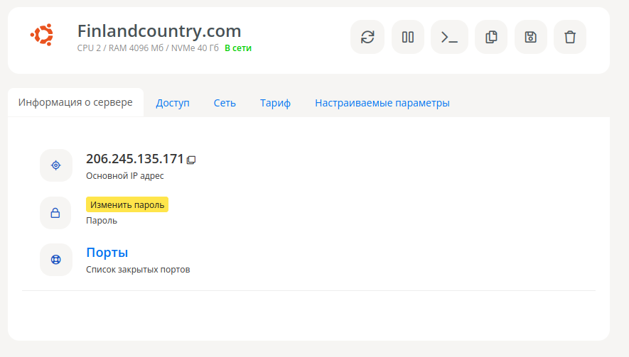

2. На локальной машине был создан SSH-ключ.

```bash
ssh-keygen -t ed25519
```

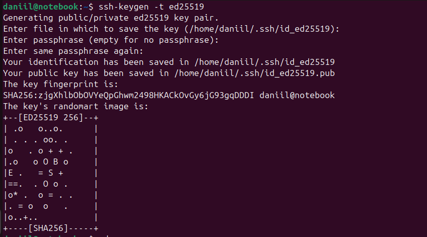

3. Публичный SSH-ключ был скопирован и добавлен на удалённую виртуальную машину.

```bash
cat id_ed25519.pub
scp /home/daniil/.ssh/id_ed25519.pub root@206.245.135.171:/root
```

На сервере был создан файл `authorized_keys`, после чего публичный ключ был добавлен в него.

```bash
touch /root/.ssh/authorized_keys
tail /root/id_ed25519.pub >> /root/.ssh/authorized_keys
chmod 600 /root/.ssh/authorized_keys
```

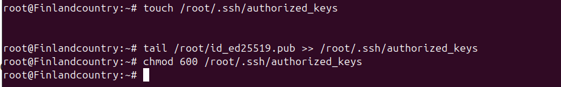

4. После добавления ключа было выполнено подключение к серверу по SSH.

```bash
ssh root@206.245.135.171
```

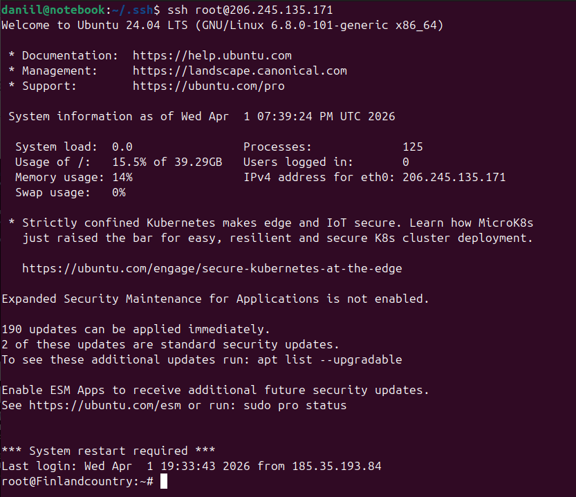

**Вывод:** была создана виртуальная машина, сгенерирован SSH-ключ, публичный ключ был добавлен на сервер, после чего удалось подключиться к виртуальной машине по SSH.

---

*Список литературы:*

- [Инструкция по экономии облачных ресурсов](https://github.com/netology-code/devops-materials/blob/master/cloudwork.MD).

---
