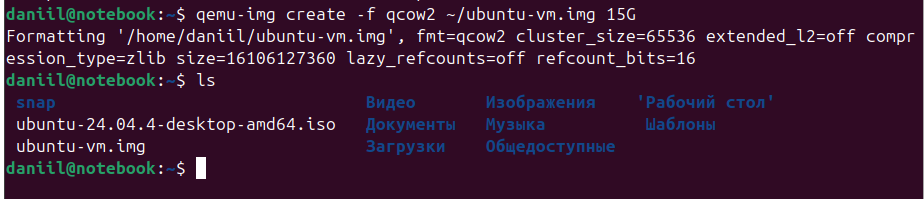
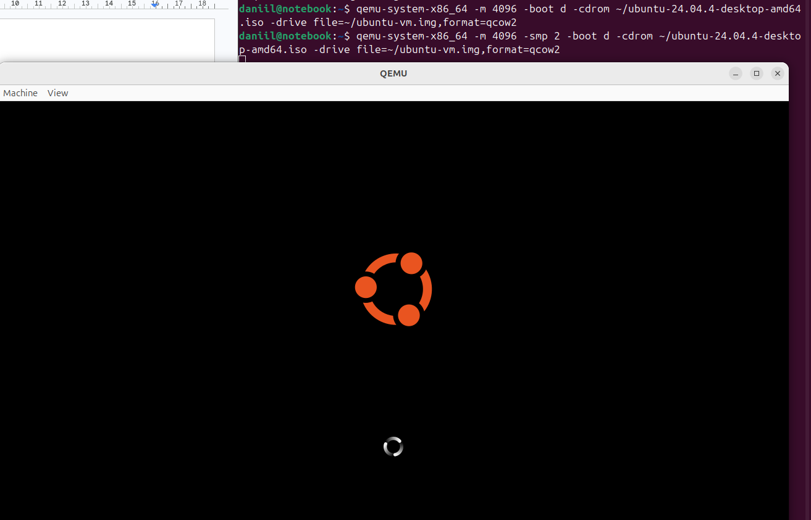
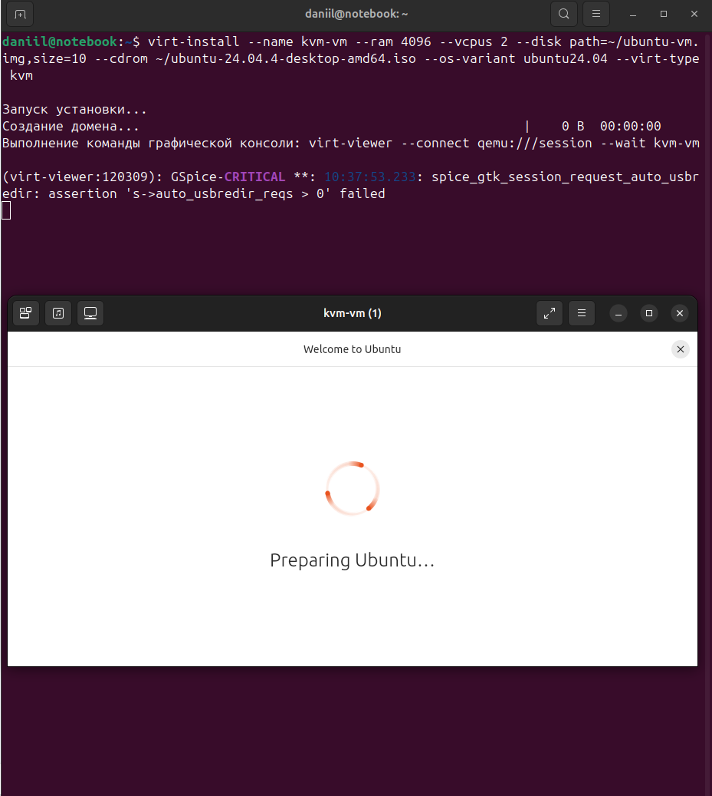

# Домашнее задание к занятию "6.02 Типы виртуализации: KVM, QEMU" - "Борисенко Даниил"

---

## Задание 1

### Условие

Выполните действия и приложите скриншоты по каждому этапу:

1. Установите QEMU в зависимости от системы.
2. Создайте виртуальную машину.
3. Установите виртуальную машину.
Можете использовать пример [по ссылке](https://dl-cdn.alpinelinux.org/alpine/v3.13/releases/x86/alpine-standard-3.13.5-x86.iso). Пример взят [с сайта](https://alpinelinux.org).

Если KVM уже установлен, создайте ВМ без использования аппаратной виртуализации.  
В случае использования `virt-install` используйте параметр `--virt-type=qemu`.

### Ход решения

Для выполнения задания был использован QEMU и образ Ubuntu Desktop `ubuntu-24.04.4-desktop-amd64.iso`.

1. Сначала был создан виртуальный диск в формате `qcow2`.

```bash
qemu-img create -f qcow2 ~/ubuntu-vm.img 15G
```

2. После выполнения команды был создан файл виртуального диска `ubuntu-vm.img`.

```bash
ls
```



3. Далее была запущена виртуальная машина через `qemu-system-x86_64`.

```bash
qemu-system-x86_64 -m 4096 -smp 2 -boot d -cdrom ~/ubuntu-24.04.4-desktop-amd64.iso -drive file=~/ubuntu-vm.img,format=qcow2
```

**Где:**

- `-m 4096` — выделение 4096 МБ оперативной памяти;
- `-smp 2` — выделение 2 виртуальных процессоров;
- `-boot d` — загрузка с CD-ROM;
- `-cdrom` — путь к ISO-образу Ubuntu;
- `-drive file=~/ubuntu-vm.img,format=qcow2` — подключение виртуального диска.

После запуска открылось окно QEMU, в котором началась загрузка установщика Ubuntu.



**Вывод:** была создана виртуальная машина с помощью QEMU без использования аппаратной виртуализации KVM.

---

## Задание 2

### Условие

Выполните действия и приложите скриншоты по каждому этапу:

1. Установите KVM и библиотеку libvirt.  
2. Создайте виртуальную машину.
3. Установите виртуальную машину.
Можете использовать пример [по ссылке](https://dl-cdn.alpinelinux.org/alpine/v3.13/releases/x86/alpine-standard-3.13.5-x86.iso). Пример взят [с сайта](https://alpinelinux.org).

В случае использования `virt-install` используйте параметр `--virt-type=kvm`.

### Ход решения

Для выполнения задания был использован KVM, библиотека libvirt и утилита `virt-install`.

Виртуальная машина была создана командой:

```bash
virt-install --name kvm-vm --ram 4096 --vcpus 2 --disk path=~/ubuntu-vm.img,size=10 --cdrom ~/ubuntu-24.04.4-desktop-amd64.iso --os-variant ubuntu24.04 --virt-type kvm
```

**Где:**

- `--name kvm-vm` — имя виртуальной машины;
- `--ram 4096` — выделение 4096 МБ оперативной памяти;
- `--vcpus 2` — выделение 2 виртуальных процессоров;
- `--disk path=~/ubuntu-vm.img,size=10` — подключение виртуального диска;
- `--cdrom` — подключение ISO-образа Ubuntu;
- `--os-variant ubuntu24.04` — указание типа гостевой ОС;
- `--virt-type kvm` — использование аппаратной виртуализации KVM.

После запуска команды открылась графическая консоль `virt-viewer`.

В окне виртуальной машины началась подготовка установщика Ubuntu.



**Вывод:** была создана виртуальная машина с использованием KVM и `virt-install`. В отличие от программной эмуляции QEMU, здесь используется аппаратная поддержка виртуализации процессора.

## Задание 3

### Условие

Напишите, как изменилось время установки и старта системы при аппаратной виртуализации (KVM) по сравнению с программной эмуляцией (QEMU).

### Ход решения

Для сравнения QEMU и KVM использовался один и тот же ISO-образ Ubuntu Desktop и одинаковые параметры ресурсов:

- 4096 МБ оперативной памяти;
- 2 виртуальных процессора;
- виртуальный диск в формате `qcow2`.

При запуске виртуальной машины через QEMU без аппаратной виртуализации система загружалась заметно дольше. Интерфейс работал менее плавно, а сама виртуальная машина ощущалась более тяжёлой, так как использовалась программная эмуляция процессора.

При запуске виртуальной машины через KVM система загружалась быстрее, интерфейс работал плавнее и стабильнее. Это связано с тем, что KVM использует аппаратную поддержку виртуализации процессора.

**Вывод:** аппаратная виртуализация KVM работает быстрее программной эмуляции QEMU. Время запуска и установки системы при KVM меньше, а производительность виртуальной машины выше.

---

## Задание 4*

### Условие

1. Установите виртуальные (alpine) машины двух различных архитектур, отличных от X86 в QEMU.
2. Приложите скриншоты действий.

### Ход решения

---

*Список литературы:*

- [Создание ВМ с помощью virt-install](<https://docs.altlinux.org/ru-RU/archive/9.0/html/alt-server-v/ch48s02.html>).

---
