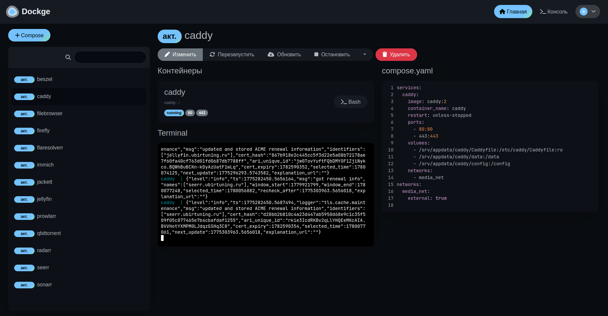
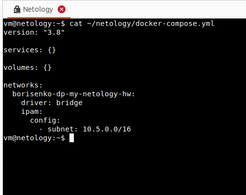
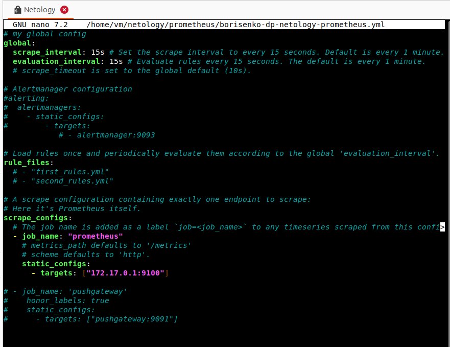
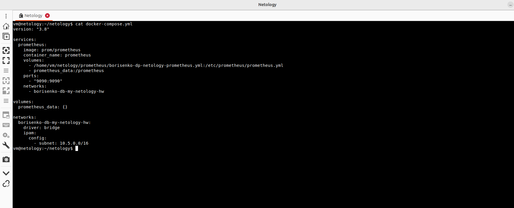
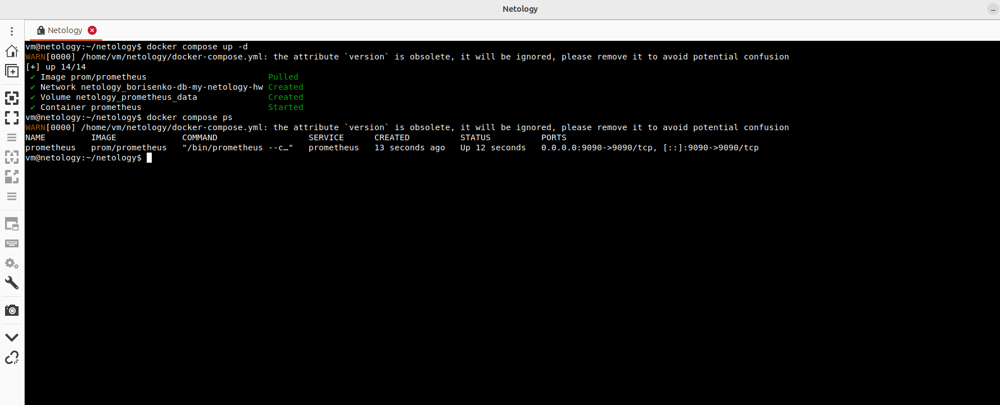
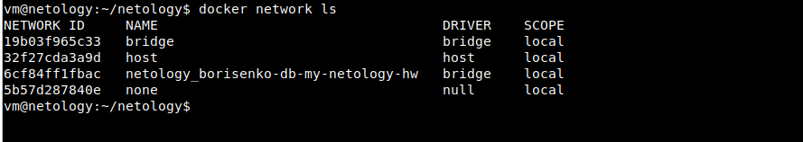

# Домашнее задание к занятию "6.04 Docker. Часть 2" - "Борисенко Даниил"

---

**Правила выполнения заданий к занятию:**

- Все задания выполняйте на основе [конфигов](</Модуль 6: Виртуализация/6.04 Docker. Часть 2/lecture_files/>) из лекции.
- В заданиях описаны те параметры, которые необходимо изменить.
- Если параметр не упомянут вообще, значит, его нужно оставить таким, какой он был в лекции.
- Если в каком-то задании, например, в задании 2, нужно изменить параметр, подразумевается, что во всех следующих заданиях будет использоваться уже изменённый параметр.
- Проверяйте правильность отступов. Очень важно их соблюдать, так как это влияет на структуру данных.
- Выполнив все задания без звёздочки, вы должны получить полнофункциональный сервис.

---

## Задание 1

### Условие

**Напишите ответ в свободной форме, не больше одного абзаца текста.**

Установите Docker Compose и опишите, для чего он нужен и как может улучшить лично вашу жизнь.

### Ход решения

Docker Compose нужен для описания и запуска нескольких контейнеров через один YAML-файл. Это удобно, потому что не нужно вручную запускать каждый контейнер отдельной командой `docker run`: все сервисы, сети, тома, порты и параметры запуска можно хранить в одном `docker-compose.yml`. В моём случае Docker Compose полезен для домашнего сервера: через него удобно управлять медиасервером, обратным прокси, сервисами для фото, документов и другими контейнерами.



---

## Задание 2

### Условие

**Выполните действия и приложите текст конфига на этом этапе.**

Создайте файл docker-compose.yml и внесите туда первичные настройки:

 * version;
 * services;
 * volumes;
 * networks.

При выполнении задания используйте подсеть 10.5.0.0/16.
Ваша подсеть должна называться: <ваши фамилия и инициалы>-my-netology-hw.
Все приложения из последующих заданий должны находиться в этой конфигурации.

### Ход решения

Был создан файл `docker-compose.yml`.

```yaml
version: "3.8"

services: {}

volumes: {}

networks:
  borisenko-dp-my-netology-hw:
    driver: bridge
    ipam:
      config:
        - subnet: 10.5.0.0/16
```

В конфигурации была создана сеть `borisenko-dp-my-netology-hw` с подсетью `10.5.0.0/16`.



---

## Задание 3

### Условие

**Выполните действия:**

1. Создайте конфигурацию docker-compose для Prometheus с именем контейнера <ваши фамилия и инициалы>-netology-prometheus. 
2. Добавьте необходимые тома с данными и конфигурацией (конфигурация лежит в репозитории в директории [6-04/prometheus](https://github.com/netology-code/sdvps-homeworks/tree/main/lecture_demos/6-04/prometheus) ).
3. Обеспечьте внешний доступ к порту 9090 c докер-сервера.

### Ход решения

Для Prometheus был создан конфигурационный файл `borisenko-dp-netology-prometheus.yml`.

```yaml
global:
  scrape_interval: 15s
  evaluation_interval: 15s

rule_files:
  # - "first_rules.yml"
  # - "second_rules.yml"

scrape_configs:
  - job_name: "prometheus"
    static_configs:
      - targets: ["172.17.0.1:9100"]
```



После этого в `docker-compose.yml` был добавлен сервис Prometheus с именем контейнера `borisenko-dp-netology-prometheus`.

```yaml
services:
  prometheus:
    image: prom/prometheus
    container_name: borisenko-dp-netology-prometheus
    volumes:
      - /home/vm/netology/prometheus/borisenko-dp-netology-prometheus.yml:/etc/prometheus/prometheus.yml
      - prometheus_data:/prometheus
    ports:
      - "9090:9090"
    networks:
      - borisenko-dp-my-netology-hw

volumes:
  prometheus_data: {}

networks:
  borisenko-dp-my-netology-hw:
    driver: bridge
    ipam:
      config:
        - subnet: 10.5.0.0/16
```



Контейнер был запущен командой:

```bash
docker compose up -d
```

После запуска была выполнена проверка:

```bash
docker compose ps
```



Также была проверена созданная Docker-сеть:

```bash
docker network ls
```



**Вывод:** был настроен контейнер Prometheus, подключён конфигурационный файл, добавлен volume для данных и открыт внешний доступ к порту `9090`.

---

## Задание 4

### Условие

**Выполните действия:**

1. Создайте конфигурацию docker-compose для Pushgateway с именем контейнера <ваши фамилия и инициалы>-netology-pushgateway. 
2. Обеспечьте внешний доступ к порту 9091 c докер-сервера.

### Ход решения

В `docker-compose.yml` был добавлен сервис Pushgateway с именем контейнера `borisenko-dp-netology-pushgateway`.

```yaml
pushgateway:
  image: prom/pushgateway
  container_name: borisenko-dp-netology-pushgateway
  ports:
    - "9091:9091"
  networks:
    - borisenko-dp-my-netology-hw
```

Pushgateway был подключён к общей сети `borisenko-dp-my-netology-hw`.  
Внешний доступ к сервису был открыт через порт `9091`.

**Вывод:** был создан контейнер Pushgateway и обеспечен внешний доступ к нему через порт `9091`.

---

## Задание 5

### Условие

**Выполните действия:**

1. Создайте конфигурацию docker-compose для Grafana с именем контейнера <ваши фамилия и инициалы>-netology-grafana. 
2. Добавьте необходимые тома с данными и конфигурацией (конфигурация лежит в репозитории в директории [6-04/grafana](https://github.com/netology-code/sdvps-homeworks/blob/main/lecture_demos/6-04/grafana/custom.ini).
3. Добавьте переменную окружения с путем до файла с кастомными настройками (должен быть в томе), в самом файле пропишите логин=<ваши фамилия и инициалы> пароль=netology.
4. Обеспечьте внешний доступ к порту 3000 c порта 80 докер-сервера.

### Ход решения

В `docker-compose.yml` был добавлен сервис Grafana с именем контейнера `borisenko-dp-netology-grafana`.

```yaml
grafana:
  image: grafana/grafana
  container_name: borisenko-dp-netology-grafana
  volumes:
    - ./grafana/custom.ini:/etc/grafana/grafana.ini
    - grafana_data:/var/lib/grafana
  ports:
    - "3000:3000"
  networks:
    - borisenko-dp-my-netology-hw
```

Также был создан файл `custom.ini` с настройками логина и пароля для Grafana.

```ini
[security]

admin_user = netology
admin_password = netology
```

В конфигурации были добавлены тома для файла настроек Grafana и хранения данных. Grafana была подключена к общей сети `borisenko-dp-my-netology-hw`.

**Вывод:** был создан контейнер Grafana, подключён файл пользовательских настроек, настроены логин `netology` и пароль `netology`, а также открыт внешний доступ к веб-интерфейсу Grafana.

---

## Задание 6

### Условие

**Выполните действия.**

1. Настройте поочередность запуска контейнеров.
2. Настройте режимы перезапуска для контейнеров.
3. Настройте использование контейнерами одной сети.
5. Запустите сценарий в detached режиме.

### Ход решения

В `docker-compose.yml` все сервисы были подключены к одной сети `borisenko-dp-my-netology-hw`.

Для запуска сценария использовалась команда:

```bash
docker compose up -d
```

Ключ `-d` запускает контейнеры в фоновом режиме.

После запуска были проверены контейнеры:

```bash
docker compose ps
```

В результате были запущены основные контейнеры:

- `borisenko-dp-netology-prometheus`;
- `borisenko-dp-netology-pushgateway`;
- `borisenko-dp-netology-grafana`;
- `borisenko-dp-netology-node-exporter`.

**Вывод:** контейнеры были запущены и подключены к одной Docker-сети.

---

## Задание 7

### Условие

**Выполните действия.**

1. Выполните запрос в Pushgateway для помещения метрики <ваши фамилия и инициалы> со значением 5 в Prometheus: ```echo "<ваши фамилия и инициалы> 5" | curl --data-binary @- http://localhost:9091/metrics/job/netology```.
2. Залогиньтесь в Grafana с помощью логина и пароля из предыдущего задания.
3. Cоздайте Data Source Prometheus (Home -> Connections -> Data sources -> Add data source -> Prometheus -> указать "Prometheus server URL = http://prometheus:9090" -> Save & Test).
4. Создайте график на основе добавленной в пункте 5 метрики (Build a dashboard -> Add visualization -> Prometheus -> Select metric -> Metric explorer -> <ваши фамилия и инициалы -> Apply.

В качестве решения приложите:

* docker-compose.yml **целиком**;
* скриншот команды docker ps после запуске docker-compose.yml;
* скриншот графика, постоенного на основе вашей метрики.

### Ход решения

### Ход решения

Для выполнения задания был использован итоговый файл `docker-compose.yml`.

```yaml
version: "2.0.2.6"

services:
  prometheus:
    image: prom/prometheus
    container_name: borisenko-dp-netology-prometheus
    volumes:
      - /home/vm/netology/prometheus/borisenko-dp-netology-prometheus.yml:/etc/prometheus/prometheus.yml
      - prometheus_data:/prometheus
    ports:
      - "9090:9090"
    networks:
      - borisenko-dp-my-netology-hw

  node-exporter:
    image: prom/node-exporter
    container_name: borisenko-dp-netology-node-exporter
    ports:
      - "9100:9100"
    networks:
      - borisenko-dp-my-netology-hw
  
  pushgateway:
    image: prom/pushgateway
    container_name: borisenko-dp-netology-pushgateway
    ports:
      - "9091:9091"
    networks:
      - borisenko-dp-my-netology-hw

  grafana:
    image: grafana/grafana
    container_name: borisenko-dp-netology-grafana
    volumes:
      - ./grafana/custom.ini:/etc/grafana/grafana.ini
      - grafana_data:/var/lib/grafana
    ports:
      - "3000:3000"
    networks:
      - borisenko-dp-my-netology-hw

volumes:
  prometheus_data: {}
  grafana_data: {}

networks:
  borisenko-dp-my-netology-hw:
    driver: bridge
    ipam:
      config:
        - subnet: 10.5.0.0/16
```

После запуска контейнеров был выполнен запрос в Pushgateway для добавления метрики `borisenko_dp` со значением `5`.

```bash
echo "borisenko_dp 5" | curl --data-binary @- http://localhost:9091/metrics/job/netology
```

Контейнеры были проверены командой:

```bash
docker compose ps
```


После этого был выполнен вход в Grafana с логином и паролем `netology`.  
В Grafana был добавлен источник данных Prometheus с адресом:

```text
http://prometheus:9090
```

Затем был создан график по метрике `borisenko_dp`.


**Вывод:** метрика была отправлена в Pushgateway, Prometheus получил её, а в Grafana был построен график на основе этой метрики.

---

## Задание 8

### Условие

**Выполните действия:**

1. Остановите и удалите все контейнеры одной командой.

В качестве решения приложите скриншот консоли с проделанными действиями.

### Ход решения

Для остановки и удаления всех контейнеров, созданных через `docker-compose.yml`, была выполнена команда:

```bash
docker compose down
```

Команда остановила и удалила контейнеры, а также удалила созданную сеть проекта.


**Вывод:** все контейнеры были остановлены и удалены одной командой.

---

## Задание 9*

### Условие

**Выполните действия:**

1. Создайте конфигурацию docker-compose для Alertmanager с именем контейнера <ваши фамилия и инициалы>-netology-alertmanager. 
2. Добавьте необходимые тома с данными и [конфигурацией](https://github.com/netology-code/sdvps-homeworks/tree/main/6-04/alertmanager), сеть, режим и очередность запуска.
3. Обновите конфигурацию Prometheus (необходимые изменения ищите в презентации или документации) и перезапустите его. 
4. Обеспечьте внешний доступ к порту 9093 c докер-сервера.

В качестве решения приложите скриншот с событием из Alertmanager.

### Ход решения

---

## Задание 10*

### Условие

Запустите свой сценарий на чистом железе без предзагруженных образов.

**Ответьте на вопросы в свободной форме:**

1. Опишите выполненный вами процесс развертывания сценария.
2. Как вы думаете зачем может понадобиться такой способ развертывания?

### Ход решения

---

*Список литературы:*

- [Примеры различных композ проектов от разработчиков Docker](https://github.com/docker/awesome-compose/tree/master)
- [блок networks: в compose](https://docs.docker.com/compose/compose-file/06-networks/)
- [блок volumes: в compose](https://docs.docker.com/compose/compose-file/07-volumes/)

---
