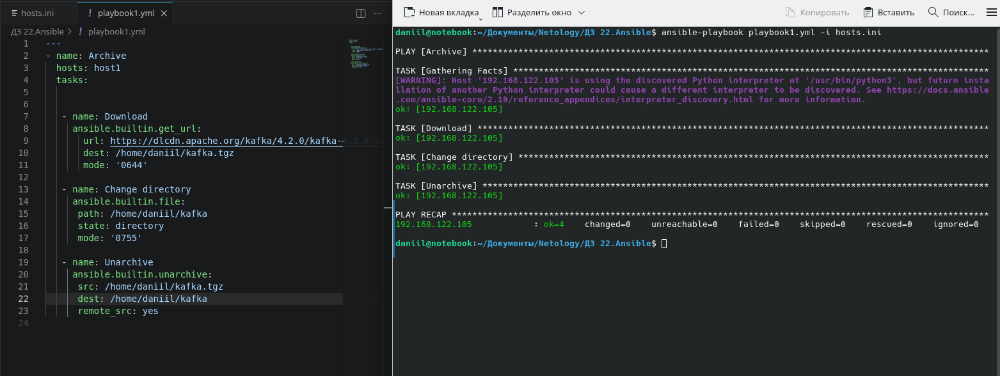
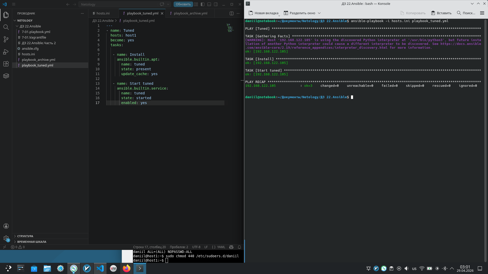
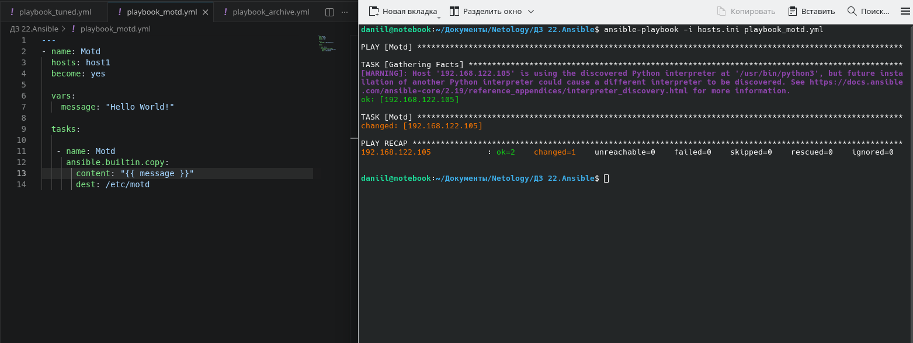
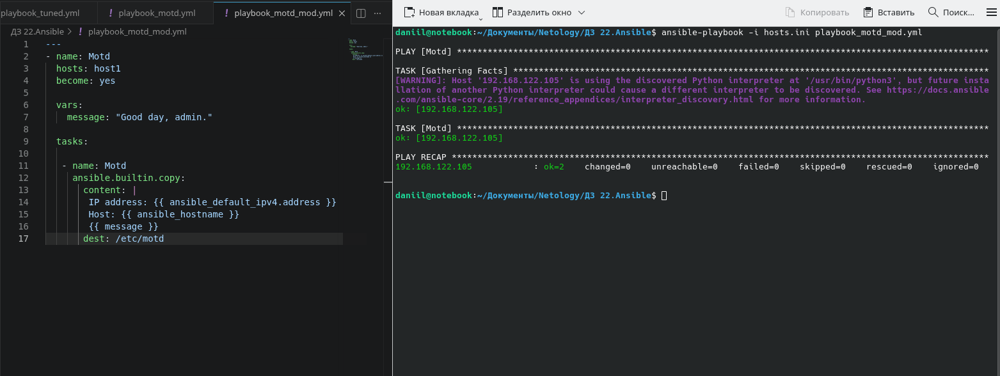
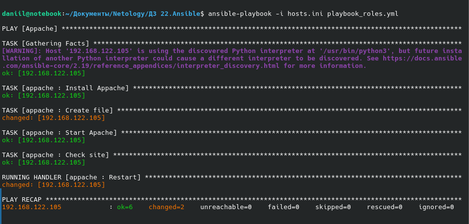
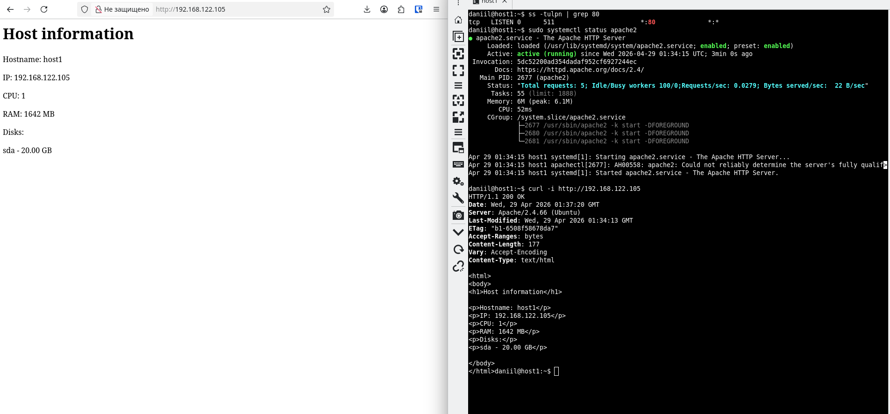

# Домашнее задание к занятию "7.02 Ansible. Часть 2" - "Борисенко Даниил"

---

## Задание 1

### Условие

**Выполните действия, приложите файлы с плейбуками и вывод выполнения.**

Напишите три плейбука. При написании рекомендуем использовать текстовый редактор с подсветкой синтаксиса YAML.

Плейбуки должны:

1. Скачать какой-либо архив, создать папку для распаковки и распаковать скаченный архив. Например, можете использовать [официальный сайт](https://kafka.apache.org/downloads) и зеркало Apache Kafka. При этом можно скачать как исходный код, так и бинарные файлы, запакованные в архив — в нашем задании не принципиально.
2. Установить пакет tuned из стандартного репозитория вашей ОС. Запустить его, как демон — конфигурационный файл systemd появится автоматически при установке. Добавить tuned в автозагрузку.
3. Изменить приветствие системы (motd) при входе на любое другое. Пожалуйста, в этом задании используйте переменную для задания приветствия. Переменную можно задавать любым удобным способом.

### Ход решения

Для выполнения задания использовался хост:

```text
192.168.122.105
```

Файл `hosts.ini`:

```ini
[my]
192.168.122.105
192.168.122.25

[host1]
192.168.122.105

[host2]
192.168.122.25
```

### Плейбук 1. Распаковка архива

Был создан плейбук `playbook_archive.yml`, который скачивает архив Apache Kafka, создаёт директорию и распаковывает архив на хосте.

```yaml
---
- name: Archive
  hosts: host1
  tasks:

   - name: Download
     ansible.builtin.get_url:
       url: https://dlcdn.apache.org/kafka/4.2.0/kafka-4.2.0-src.tgz
       dest: /home/daniil/kafka.tgz
       mode: '0644'

   - name: Change directory
     ansible.builtin.file:
      path: /home/daniil/kafka
      state: directory
      mode: '0755'

   - name: Unarchive
     ansible.builtin.unarchive:
      src: /home/daniil/kafka.tgz
      dest: /home/daniil/kafka
      remote_src: yes
```

Плейбук был запущен командой:

```bash
ansible-playbook playbook_archive.yml -i hosts.ini
```

Архив был скачан, директория `/home/daniil/kafka` была создана, а архив был распакован.



### Плейбук 2. Установка и запуск tuned

Был создан плейбук `playbook_tuned.yml`, который устанавливает пакет `tuned`, запускает сервис и добавляет его в автозагрузку.

```yaml
---
- name: Tuned
  hosts: host1
  become: yes
  tasks:

   - name: Install
     ansible.builtin.apt:
       name: tuned
       state: present
       update_cache: yes

   - name: Start tuned
     ansible.builtin.service:
       name: tuned
       state: started
       enabled: yes
```

Плейбук был запущен командой:

```bash
ansible-playbook -i hosts.ini playbook_tuned.yml
```

Пакет `tuned` был установлен, сервис был запущен и добавлен в автозагрузку.



### Плейбук 3. Изменение motd

Был создан плейбук `playbook_motd.yml`, он изменяет приветствие системы в файле `/etc/motd`. Для текста приветствия использовалась переменная `message`.

```yaml
---
- name: Motd
  hosts: host1
  become: yes

  vars:
    message: "Hello World!"

  tasks:

    - name: Motd
      ansible.builtin.copy:
        content: "{{ message }}"
        dest: /etc/motd
```

Плейбук был запущен командой:

```bash
ansible-playbook -i hosts.ini playbook_motd.yml
```

В результате файл `/etc/motd` был изменён.



**Вывод:** были написаны и выполнены три плейбука: для скачивания и распаковки архива, установки и запуска `tuned`, а также изменения системного приветствия `motd`.

---

## Задание 2

### Условие

**Выполните действия, приложите файлы с модифицированным плейбуком и вывод выполнения.** 

Модифицируйте плейбук из пункта 3, задания 1. В качестве приветствия он должен установить IP-адрес и hostname управляемого хоста, пожелание хорошего дня системному администратору.

### Ход решения

Для выполнения задания был модифицирован плейбук из задания 1, который изменяет файл `/etc/motd`.

В новом варианте приветствие содержит:

- IP-адрес управляемого хоста;
- hostname управляемого хоста;
- пожелание хорошего дня системному администратору.

Плейбук `playbook_motd_mod.yml`:

```yaml
---
- name: Motd
  hosts: host1
  become: yes

  vars:
    message: "Good day, admin."

  tasks:

   - name: Motd
     ansible.builtin.copy:
       content: |
        IP address: {{ ansible_default_ipv4.address }}
        Host: {{ ansible_hostname }}
        {{ message }}
       dest: /etc/motd
```

В плейбуке используются Ansible facts:

- `ansible_default_ipv4.address` — IP-адрес управляемого хоста;
- `ansible_hostname` — hostname управляемого хоста.

Плейбук был запущен командой:

```bash
ansible-playbook -i hosts.ini playbook_motd_mod.yml
```

После выполнения плейбука файл `/etc/motd` был изменён. При повторном запуске Ansible показал `changed=0`, так как нужное состояние уже было применено ранее.



**Вывод:** был модифицирован плейбук для изменения `motd`. Теперь приветствие формируется динамически и содержит IP-адрес, hostname управляемого хоста и сообщение для администратора.

---

## Задание 3

### Условие

**Выполните действия, приложите архив с ролью и вывод выполнения.**

Ознакомьтесь со статьёй [«Ansible - это вам не bash»](https://habr.com/ru/post/494738/), сделайте соответствующие выводы и не используйте модули **shell** или **command** при выполнении задания.

Создайте плейбук, который будет включать в себя одну, созданную вами роль. Роль должна:

1. Установить веб-сервер Apache на управляемые хосты.
2. Сконфигурировать файл index.html c выводом характеристик каждого компьютера как веб-страницу по умолчанию для Apache. Необходимо включить CPU, RAM, величину первого HDD, IP-адрес.
Используйте [Ansible facts](https://docs.ansible.com/ansible/latest/playbook_guide/playbooks_vars_facts.html) и [jinja2-template](https://linuxways.net/centos/how-to-use-the-jinja2-template-in-ansible/). Необходимо реализовать handler: перезапуск Apache только в случае изменения файла конфигурации Apache.
4. Открыть порт 80, если необходимо, запустить сервер и добавить его в автозагрузку.
5. Сделать проверку доступности веб-сайта (ответ 200, модуль uri).

В качестве решения:

- предоставьте плейбук, использующий роль;
- разместите архив созданной роли у себя на Google диске и приложите ссылку на роль в своём решении;
- предоставьте скриншоты выполнения плейбука;
- предоставьте скриншот браузера, отображающего сконфигурированный index.html в качестве сайта.

### Ход решения

Для выполнения задания была создана роль `appache`, которая устанавливает и настраивает веб-сервер Apache. При выполнении задания применялись модули `apt`, `template`, `service` и `uri`.

Плейбук `playbook_roles.yml`, который использует роль:

```yaml
---
- name: Appache
  hosts: host1
  become: yes
  tasks:

  roles:
    - appache
```

Основной файл задач роли `roles/appache/tasks/main.yml`:

```yaml
---
- name: Install Appache
  ansible.builtin.apt:
    name: apache2
    state: present
    update_cache: yes

- name: Create file
  ansible.builtin.template:
    src: site.html
    dest: /var/www/html/index.html
    mode: "0644"
  notify: Restart

- name: Start Apache
  ansible.builtin.service:
    name: apache2
    state: started
    enabled: yes

- name: Check site
  ansible.builtin.uri:
    url: "http://{{ ansible_default_ipv4.address }}"
    status_code: 200
```

Шаблон `roles/appache/templates/site.html`:

```html
<html>
<body>
<h1>Host information</h1>

<p>Hostname: {{ ansible_hostname }}</p>
<p>IP: {{ ansible_default_ipv4.address }}</p>
<p>CPU: {{ ansible_processor_vcpus }}</p>
<p>RAM: {{ ansible_memtotal_mb }} MB</p>
<p>Disks:</p>


<p>{{ disk }} - {{ value.size }}</p>



</body>
</html>
```

В шаблоне используются Ansible facts:

- `ansible_hostname` — hostname сервера;
- `ansible_default_ipv4.address` — IP-адрес;
- `ansible_processor_vcpus` — количество CPU;
- `ansible_memtotal_mb` — объём RAM;
- `ansible_devices` — информация о дисках.

Handler роли `roles/appache/handlers/main.yml`:

```yaml
---
- name: Restart
  ansible.builtin.service:
    name: apache2
    state: restarted
```

Handler выполняет перезапуск Apache только в случае изменения файла `index.html`.

Плейбук был запущен командой:

```bash
ansible-playbook -i hosts.ini playbook_roles.yml
```

В результате Ansible установил Apache, создал файл `/var/www/html/index.html`, запустил Apache, добавил его в автозагрузку и проверил доступность сайта через модуль `uri`.



После выполнения плейбука была проверена работа Apache. В браузере открылась страница с характеристиками управляемого хоста:

- hostname;
- IP-адрес;
- CPU;
- RAM;
- диск.

Также в терминале был проверен статус Apache и ответ веб-сервера.



Файлы задания:

- [playbook_roles.yml](./playbook_roles.yml)
- [Архив роли appache](./appache_roles.tar.gz)
- [Общий архив с предыдущими заданиями](./ansible.tar.gz)

**Вывод:** была создана Ansible-роль для установки и настройки Apache.

---
