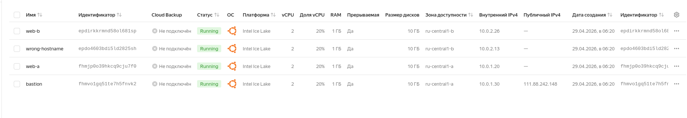
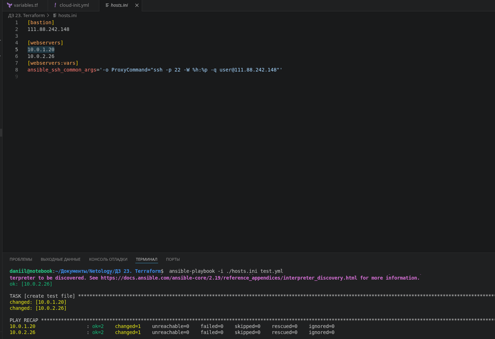
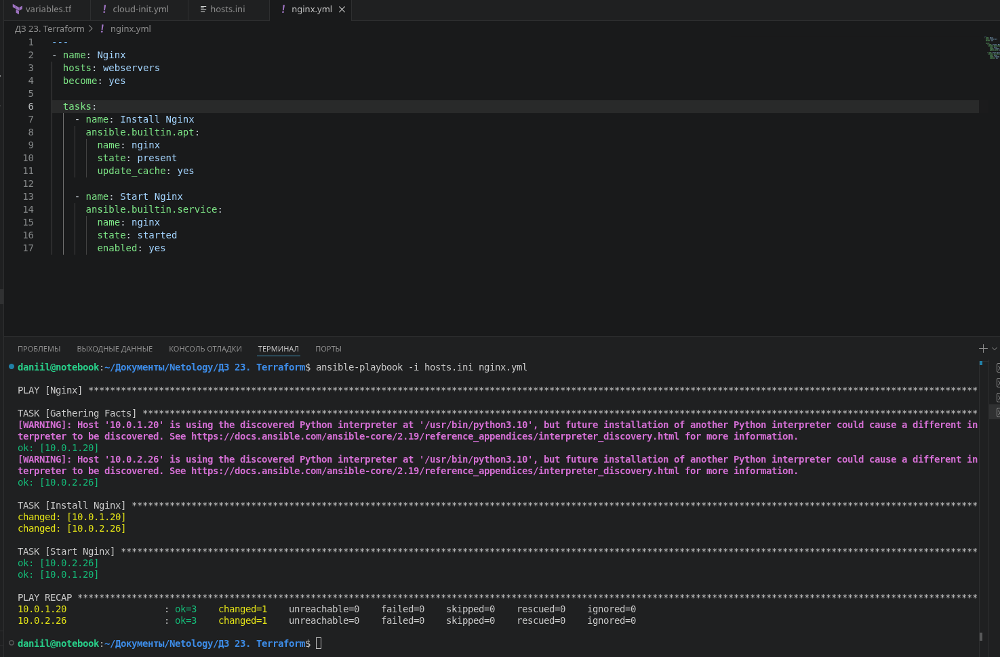

# Домашнее задание к занятию "7.04 Подъём инфраструктуры в Yandex Cloud" - "Борисенко Даниил"

---

## Задание 1

### Условие

Повторить демонстрацию лекции(развернуть vpc, 2 веб сервера, бастион сервер)

### Ход решения

В Yandex Cloud была развёрнута облачная инфраструктура с VPC, двумя веб-серверами и bastion-хостом.

- `bastion` — виртуальная машина с публичным IP-адресом;
- `web-a` — веб-сервер во внутренней подсети `10.0.1.0/24`;
- `web-b` — веб-сервер во внутренней подсети `10.0.2.0/24`;
- подключение к внутренним веб-серверам выполняется через bastion;
- для выхода внутренних машин в интернет используется NAT Gateway.


Для развёртывания инфраструктуры использовался Terraform.

В файле `providers.tf` был настроен провайдер Yandex Cloud:

```hcl
terraform {
  required_providers {
    yandex = {
      source  = "yandex-cloud/yandex"
      version = "0.129.0"
    }
  }

  required_version = ">=1.8.4"
}

provider "yandex" {
  cloud_id                 = var.cloud_id
  folder_id                = var.folder_id
  service_account_key_file = file("~/.authorized_key.json")
}
```

В файле `vms.tf` были описаны виртуальные машины:

- `bastion`;
- `web-a`;
- `web-b`.

Bastion-хост получил внешний IP-адрес, а веб-серверы были созданы без публичных IP-адресов.

Также Terraform автоматически сформировал файл `hosts.ini` для Ansible:

```ini
[bastion]
89.169.142.236

[webservers]
10.0.1.12
10.0.2.10

[webservers:vars]
ansible_ssh_common_args='-o ProxyCommand="ssh -p 22 -W %h:%p -q user@89.169.142.236"'
```

Через параметр `ansible_ssh_common_args` было настроено подключение к внутренним серверам через bastion-хост.

После подготовки файлов были выполнены команды:

```bash
terraform init
terraform apply
```

В результате в Yandex Cloud были созданы виртуальные машины.  
В консоли видно, что машины находятся в состоянии `Running`.



Для проверки подключения через bastion был выполнен тестовый Ansible playbook `test.yml`.

```yaml
---
- name: test
  gather_facts: false
  hosts: webservers
  vars:
    ansible_ssh_user: user
  become: yes

  pre_tasks:
    - name: Validating the ssh port is open
      wait_for:
        host: "{{ (ansible_ssh_host|default(ansible_host))|default(inventory_hostname) }}"
        port: 22
        delay: 5
        timeout: 300
        state: started
        search_regex: OpenSSH

  tasks:
    - name: create test file
      copy:
        dest: /tmp/test
        content: "success"
```

Команда запуска:

```bash
ANSIBLE_HOST_KEY_CHECKING=False ansible-playbook -i ./hosts.ini test.yml
```

Плейбук успешно подключился к внутренним серверам `web-a` и `web-b` через bastion и создал тестовый файл.



**Вывод:** была развёрнута инфраструктура в Yandex Cloud: VPC, две внутренние подсети, NAT Gateway, bastion-хост и два веб-сервера без публичных IP-адресов. Подключение к веб-серверам было проверено через Ansible с использованием bastion-хоста.

---

## Задание 2

### Условие

С помощью ansible подключиться к web-a и web-b , установить на них nginx.(написать нужный ansible playbook)

Провести тестирование и приложить скриншоты развернутых в облаке ВМ, успешно отработавшего ansible playbook. 

### Ход решения

Для выполнения задания был написан Ansible playbook `nginx.yml`, который устанавливает и запускает Nginx на серверах `web-a` и `web-b`.

В качестве inventory использовался файл `hosts.ini`, созданный Terraform:

```ini
[bastion]
89.169.142.236

[webservers]
10.0.1.12
10.0.2.10

[webservers:vars]
ansible_ssh_common_args='-o ProxyCommand="ssh -p 22 -W %h:%p -q user@89.169.142.236"'
```

Плейбук `nginx.yml`:

```yaml
---
- name: Nginx
  hosts: webservers
  become: yes

  tasks:

    - name: Install Nginx
      ansible.builtin.apt:
        name: nginx
        state: present
        update_cache: yes

    - name: Start Nginx
      ansible.builtin.service:
        name: nginx
        state: started
        enabled: yes
```

Плейбук был запущен командой:

```bash
ansible-playbook -i hosts.ini nginx.yml
```

Ansible подключился к двум внутренним веб-серверам через bastion-хост и выполнил установку Nginx.

В результате выполнения:

- на `10.0.1.12` был установлен и запущен Nginx;
- на `10.0.2.10` был установлен и запущен Nginx;
- ошибок выполнения не было;
- в `PLAY RECAP` оба хоста завершили выполнение со статусом `failed=0`.



**Вывод:** с помощью Ansible было выполнено подключение к серверам `web-a` и `web-b` через bastion-хост. На обоих веб-серверах был установлен, запущен и добавлен в автозагрузку Nginx.

---

## Задание 3*

### Условие

**Выполните действия, приложите скриншот скриптов, скриншот выполненного проекта.**

1. Добавить еще одну виртуальную машину. 
2. Установить на нее любую базу данных. 
3. Выполнить проверку состояния запущенных служб через Ansible.

### Ход решения

---

## Задание 4*

### Условие

Изучите [инструкцию](https://cloud.yandex.ru/docs/tutorials/infrastructure-management/terraform-quickstart) yandex для terraform.
Добейтесь работы паплайна с безопасной передачей токена от облака в terraform через переменные окружения. Для этого:

1. Настройте профиль для yc tools по инструкции.
2. Удалите из кода строчку "token = var.yandex_cloud_token". Terraform будет считывать значение ENV переменной YC_TOKEN.
3. Выполните команду export YC_TOKEN=$(yc iam create-token) и в том же shell запустите terraform.
4. Для того чтобы вам не нужно было каждый раз выполнять export - добавьте данную команду в самый конец файла ~/.bashrc

### Ход решения

---

*Список литературы:*

- [Инструкция по экономии облачных ресурсов](https://github.com/netology-code/devops-materials/blob/master/cloudwork.MD).
- [Nginx. Руководство для начинающих](https://nginx.org/ru/docs/beginners_guide.html).
- [Руководство по Terraform](https://registry.terraform.io/providers/yandex-cloud/yandex/latest/doc).
- [Ansible User Guide](https://docs.ansible.com/ansible/latest/user_guide/index.html).
- [Terraform Documentation](https://www.terraform.io/docs/index.html).

---
