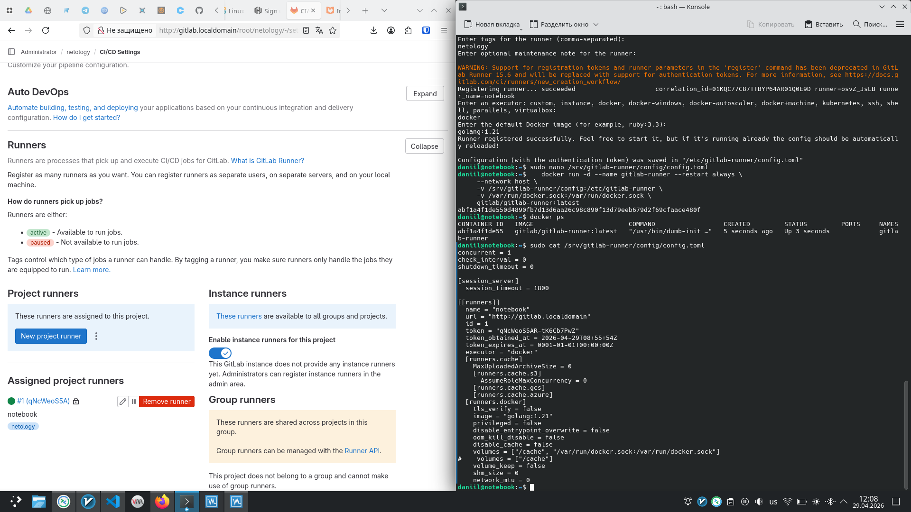
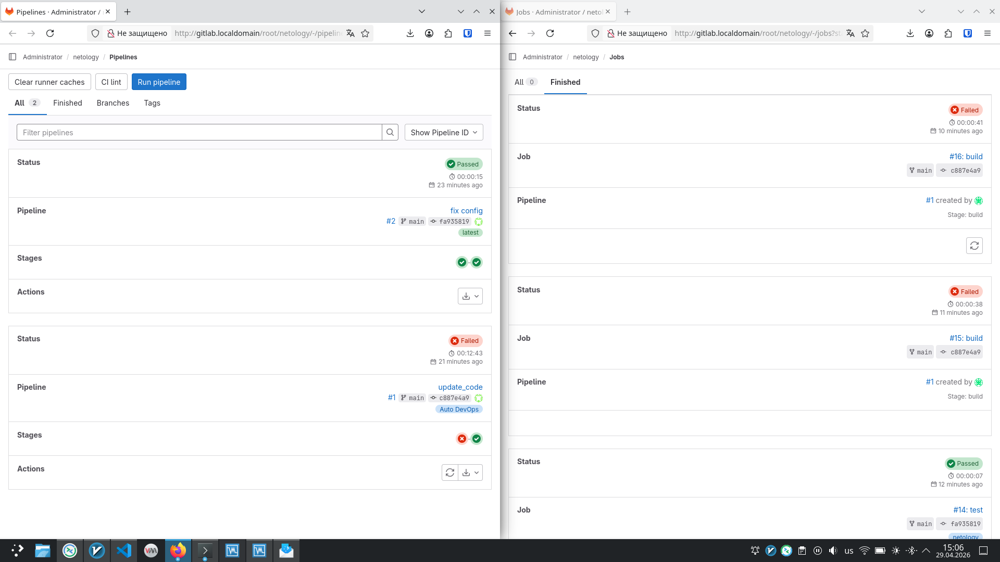

# Домашнее задание к занятию "7.07 GitLab" - "Борисенко Даниил"

---

## Задание 1

### Условие

1. Разверните GitLab локально, используя Vagrantfile и инструкцию, описанные в [этом репозитории](https://github.com/netology-code/sdvps-materials/tree/main/gitlab).
2. Создайте новый проект и пустой репозиторий в нём.
3. Зарегистрируйте gitlab-runner для этого проекта и запустите его в режиме Docker. Раннер можно регистрировать и запускать на той же виртуальной машине, на которой запущен GitLab.

В качестве ответа в репозиторий шаблона с решением добавьте скриншоты с настройками раннера в проекте.

### Ход решения

Для выполнения задания GitLab был развёрнут локально с помощью `Vagrantfile`.

1. Сначала была добавлена запись в файл `/etc/hosts`, чтобы GitLab был доступен по доменному имени `gitlab.localdomain`.

```bash
echo '192.168.56.10    gitlab.localdomain gitlab' | sudo tee -a /etc/hosts
```

2. После этого была запущена виртуальная машина с GitLab.

```bash
VAGRANT_EXPERIMENTAL="disks" vagrant up
```

Переменная `VAGRANT_EXPERIMENTAL="disks"` используется для того, чтобы Vagrant мог создать виртуальную машину с нестандартным размером диска.

После запуска GitLab стал доступен по адресу:

```text
http://gitlab.localdomain
```

3. Первичный пароль пользователя `root` был получен командой:

```bash
vagrant ssh -- sudo cat /etc/gitlab/initial_root_password
```

4. Далее в GitLab был создан новый проект `netology`.

5. Для проекта был зарегистрирован GitLab Runner в режиме Docker.

Регистрация runner выполнялась командой:

```bash
docker run -ti --rm --name gitlab-runner \
  --network host \
  -v /srv/gitlab-runner/config:/etc/gitlab-runner \
  -v /var/run/docker.sock:/var/run/docker.sock \
  gitlab/gitlab-runner:latest register
```

6. После регистрации runner был запущен отдельным контейнером:

```bash
docker run -d --name gitlab-runner --restart always \
  --network host \
  -v /srv/gitlab-runner/config:/etc/gitlab-runner \
  -v /var/run/docker.sock:/var/run/docker.sock \
  gitlab/gitlab-runner:latest
```

В настройках проекта видно, что runner зарегистрирован и доступен для выполнения задач.



**Вывод:** GitLab был развёрнут локально с помощью Vagrant, был создан проект `netology`, а также зарегистрирован и запущен GitLab Runner в режиме Docker.

---

## Задание 2

### Условие

1. Запушьте [репозиторий](https://github.com/netology-code/sdvps-materials/tree/main/gitlab) на GitLab, изменив origin. Это изучалось на занятии по Git.
2. Создайте .gitlab-ci.yml, описав в нём все необходимые, на ваш взгляд, этапы.

В качестве ответа в шаблон с решением добавьте:

* файл gitlab-ci.yml для своего проекта или вставьте код в соответствующее поле в шаблоне;
* скриншоты с успешно собранными сборками.

### Ход решения

Для выполнения задания репозиторий из материалов был загружен в локальный GitLab.

В проекте использовался простой Go-код и тест:

- `main.go`;
- `main_test.go`;
- `go.mod`.

1. После этого был создан файл `.gitlab-ci.yml`.

Для проекта были выбраны два этапа pipeline:

`test` — проверка кода с помощью тестов;
`build` — сборка проекта.

На этапе `test` запускается команда:

```bash
go test ./...
```

Если тесты завершаются с ошибкой, сборка проекта не выполняется. Это позволяет остановить pipeline на раннем этапе и не собирать проект с ошибками.

На этапе `build` выполняется сборка проекта:

```bash
go build .
```

Содержимое файла `.gitlab-ci.yml`:

```yaml
stages:
  - test
  - build

test:
  stage: test
  image: golang:1.17
  tags:
   - netology
  script: 
   - go test ./...

build:
  stage: build
  image: golang:1.17
  tags:
   - netology
  script:
   - go build .
```

В pipeline используется runner с тегом `netology`.

2. После добавления файла `.gitlab-ci.yml` был запущен pipeline. В GitLab видно, что после исправления конфигурации pipeline успешно прошёл: этапы `test` и `build` завершились без ошибок.



Файл pipeline: [.gitlab-ci.yml](./.gitlab-ci.yml)

**Вывод:** репозиторий был загружен в локальный GitLab, был создан CI/CD pipeline с этапами `test` и `build`. Pipeline успешно выполнился, что подтверждает корректную настройку GitLab CI.

---

## Задание 3*

### Условие

Измените CI так, чтобы:

* этап сборки запускался сразу, не дожидаясь результатов тестов;
* тесты запускались только при изменении файлов с расширением *.go.

В качестве ответа добавьте в шаблон с решением файл gitlab-ci.yml своего проекта или вставьте код в соответствующее поле в шаблоне.

### Ход решения

---
