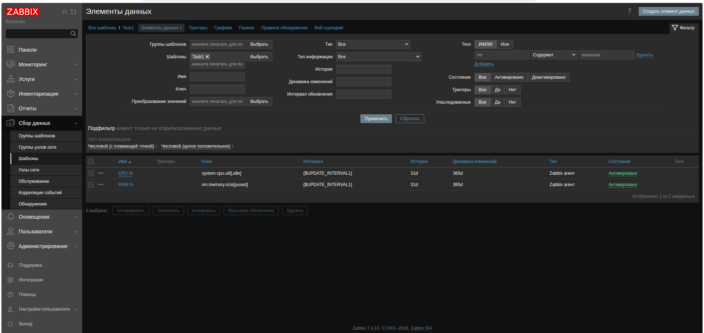
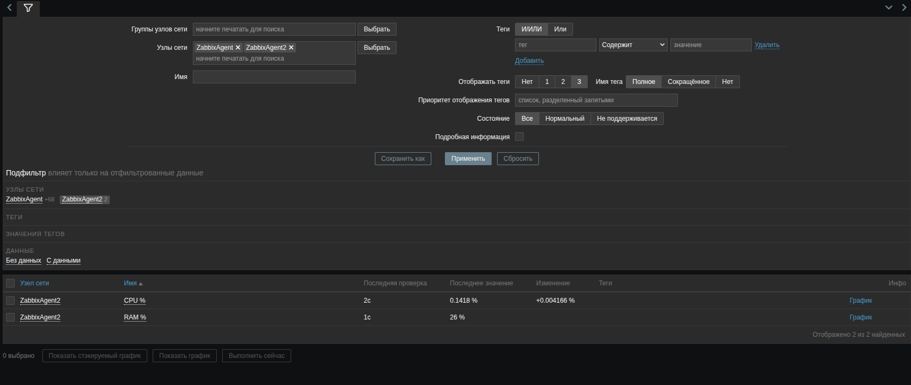
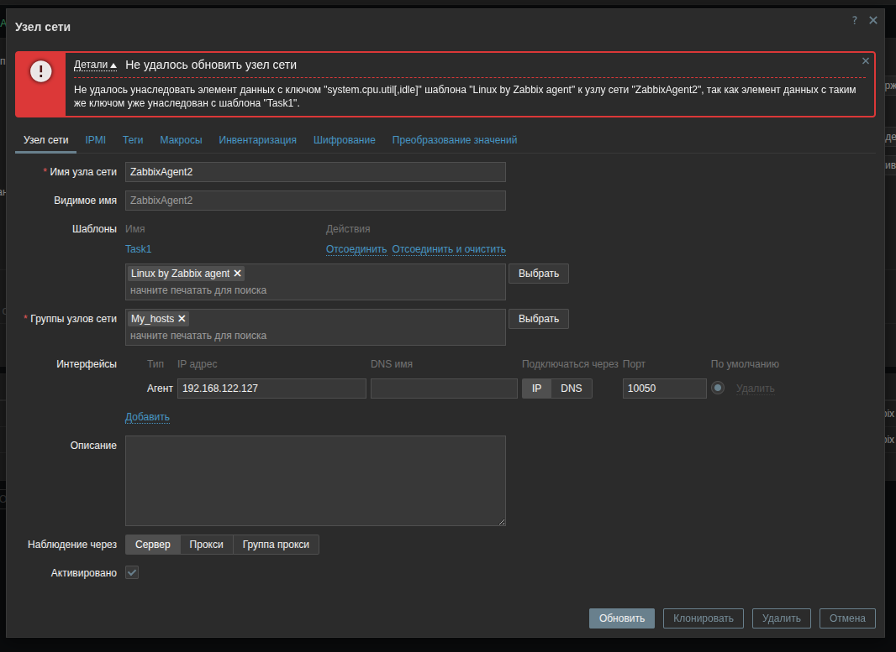
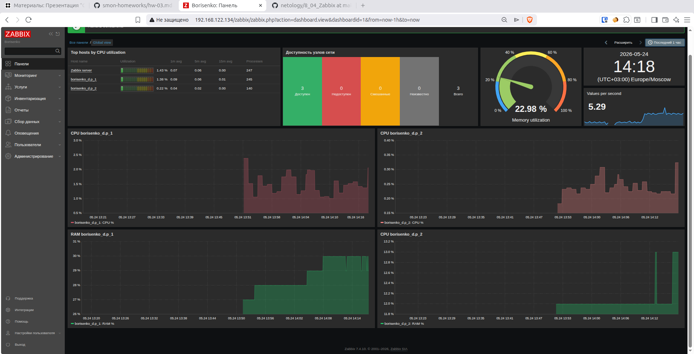

# Домашнее задание к занятию "8.03 Система мониторинга Zabbix. Часть 2" - "Борисенко Даниил"

## Цели задания

1. Научиться создавать свои шаблоны в Zabbix, добавлять в Zabbix хосты и связывать шаблон с хостами.
2. Научиться составлять кастомный дашборд.
3. Научиться создавать UserParameter на Bash.
4. Научиться создавать Python-скрипт, добавлять в него UserParameter и прикреплять к шаблону.
5. Научиться создавать Vagrant-скрипты для Zabbix Agent.

---

## Задание 1

### Условие

Создайте свой шаблон, в котором будут элементы данных, мониторящие загрузку CPU и RAM хоста.

#### Процесс выполнения

1. Выполняя ДЗ, сверяйтесь с процессом, отражённым в записи лекции.
2. В веб-интерфейсе Zabbix Server в разделе `Templates` создайте новый шаблон.
3. Создайте item, который будет собирать информацию о загрузке CPU в процентах.
4. Создайте item, который будет собирать информацию о загрузке RAM в процентах.

#### Требования к результату

- Прикрепите в файл `README.md` скриншот страницы шаблона с названием «Задание 1».

### Ход решения

1. В веб-интерфейсе Zabbix был создан пользовательский шаблон `Task1`.

2. В шаблоне были созданы элементы данных для мониторинга CPU и RAM.

Для получения значения CPU использовался ключ:

```text
system.cpu.util[,idle]
```

Для получения значения RAM использовался ключ:

```text
vm.memory.size[pused]
```

3. Так как ключ `system.cpu.util[,idle]` показывает процент простоя процессора, для отображения загрузки CPU была использована формула:

```text
100 - last(//system.cpu.util[,idle])
```

4. Также для элементов данных были настроены интервалы обновления через макросы шаблона.

Скриншот созданного шаблона и элементов данных:



Скриншот элементов данных шаблона:



---

## Задание 2

### Условие

Добавьте в Zabbix два хоста и задайте им имена `<фамилия и инициалы-1>` и `<фамилия и инициалы-2>`.

#### Процесс выполнения

1. Выполняя ДЗ, сверяйтесь с процессом, отражённым в записи лекции.
2. Установите Zabbix Agent на 2 виртуальные машины, одной из них может быть ваш Zabbix Server.
3. Добавьте Zabbix Server в список разрешённых серверов ваших Zabbix Agent.
4. Добавьте Zabbix Agent в раздел `Configuration` → `Hosts` вашего Zabbix Server.
5. Прикрепите за каждым хостом шаблон `Linux by Zabbix Agent`.
6. Проверьте, что в разделе `Latest Data` начали появляться данные с добавленных агентов.

#### Требования к результату

- Результат данного задания сдавайте вместе с заданием 3.

### Ход решения

В Zabbix были добавлены два хоста:

- `borisenko_d.p_1`;
- `borisenko_d.p_2`.

На хостах был установлен и настроен Zabbix Agent 2. В конфигурации агентов был указан адрес Zabbix Server, после чего агенты были добавлены в веб-интерфейс Zabbix.

К каждому хосту был прикреплён шаблон `Linux by Zabbix agent`.

---

## Задание 3

### Условие

Привяжите созданный шаблон к двум хостам. Также привяжите к обоим хостам шаблон `Linux by Zabbix Agent`.

#### Процесс выполнения

1. Выполняя ДЗ, сверяйтесь с процессом, отражённым в записи лекции.
2. Зайдите в настройки каждого хоста и в разделе `Templates` прикрепите к этому хосту ваш шаблон.
3. Также к каждому хосту привяжите шаблон `Linux by Zabbix Agent`.
4. Проверьте, что в раздел `Latest Data` начали поступать необходимые данные из вашего шаблона.

#### Требования к результату

- Прикрепите в файл `README.md` скриншот страницы хостов, где будут видны привязки шаблонов с названиями «Задание 2-3». Хосты должны иметь зелёный статус подключения.

### Ход решения

При привязке шаблона `Task1` вместе с шаблоном `Linux by Zabbix agent` возник конфликт ключей.

Ошибка возникла из-за того, что в шаблоне `Linux by Zabbix agent` уже используется ключ:

```text
system.cpu.util[,idle]
```

Скриншот ошибки:



1. Для решения конфликта был использован вычисляемый тип элемента данных. Для CPU был создан отдельный элемент с ключом:

```text
my_CPU
```

Формула вычисления:

```text
100 - last(//system.cpu.util[,idle])
```

Скриншот настройки вычисляемого элемента данных CPU:


2. Для удобной фильтрации элементов данных были добавлены пользовательские теги.

Скриншот добавленного тега:


После настройки оба хоста были добавлены в Zabbix, активированы и получили зелёный статус доступности `ZBX`.

3. К каждому хосту были привязаны шаблоны:

- `Linux by Zabbix agent`;
- `Task1`.

Скриншот страницы хостов:


---

## Задание 4

### Условие

Создайте свой кастомный дашборд.

#### Процесс выполнения

1. Выполняя ДЗ, сверяйтесь с процессом, отражённым в записи лекции.
2. В разделе `Dashboards` создайте новый дашборд.
3. Разместите на нём несколько графиков на ваше усмотрение.

#### Требования к результату

- Прикрепите в файл `README.md` скриншот дашборда с названием «Задание 4».

### Ход решения

В Zabbix был создан кастомный дашборд.

На дашборд были добавлены виджеты и графики для наблюдения за состоянием хостов:

- загрузка CPU по хостам;
- использование RAM;
- доступность узлов сети;
- общая информация по системе;
- текущее состояние Zabbix Server.

Скриншот кастомного дашборда:



---

## Задание 5*

### Условие

Создайте карту и расположите на ней два своих хоста.

#### Процесс выполнения

1. Настройте между хостами линк.
2. Привяжите к линку триггер, связанный с `agent.ping` одного из хостов, и установите индикатором сработавшего триггера красную пунктирную линию.
3. Выключите хост, чей триггер добавлен в линк. Дождитесь срабатывания триггера.

#### Требования к результату

- Прикрепите в файл `README.md` скриншот карты, где видно, что триггер сработал, с названием «Задание 5».

### Ход решения

Задание со звёздочкой не выполнялось.

---

## Задание 6*

### Условие

Создайте UserParameter на bash и прикрепите его к созданному вами ранее шаблону. Он должен вызывать скрипт, который:

- при получении `1` будет возвращать ваши ФИО;
- при получении `2` будет возвращать текущую дату.

#### Требования к результату

- Прикрепите в файл `README.md` код скрипта, а также скриншот `Latest data` с результатом работы скрипта на bash, чтобы был виден результат работы скрипта при отправке в него `1` и `2`.

### Ход решения

---

## Задание 7*

### Условие

Доработайте Python-скрипт из лекции, создайте для него UserParameter и прикрепите его к созданному вами ранее шаблону.

Скрипт должен:

- при получении `1` возвращать ваши ФИО;
- при получении `2` возвращать текущую дату;
- делать всё, что делал скрипт из лекции.

#### Требования к результату

- Прикрепите в файл `README.md` код скрипта в Git.
- Приложите в Git скриншот `Latest data` с результатом работы скрипта на Python, чтобы были видны результаты работы скрипта при отправке в него `1`, `2`, `-ping`, а также `-simple_print`.

### Ход решения

---

## Задание 8*

### Условие

Настройте автообнаружение и прикрепление к хостам созданного вами ранее шаблона.

#### Требования к результату

- Прикрепите в файл `README.md` скриншот правила обнаружения, а также скриншот страницы `Discover`, где видны оба хоста.

### Ход решения

---

## Задание 9*

### Условие

Доработайте скрипты Vagrant для двух агентов, чтобы они были готовы к автообнаружению сервером, а также имели на борту разработанные вами ранее параметры пользователей.

#### Требования к результату

- Приложите в GitHub файлы `Vagrantfile` и `zabbix-agent.sh`.

### Ход решения

---

**Список используемой литературы:**

- [Zabbix Documentation: Templates](https://www.zabbix.com/documentation/current/en/manual/config/templates)
- [Zabbix Documentation: Items](https://www.zabbix.com/documentation/current/en/manual/config/items)
- [Zabbix Documentation: Calculated items](https://www.zabbix.com/documentation/current/en/manual/config/items/itemtypes/calculated)
- [Zabbix Documentation: Hosts](https://www.zabbix.com/documentation/current/en/manual/config/hosts/host)
- [Zabbix Documentation: Dashboards](https://www.zabbix.com/documentation/current/en/manual/web_interface/frontend_sections/dashboards)

---
