# Домашнее задание к занятию "9.01 Disaster recovery и Keepalived" - "Борисенко Даниил"

## Цель задания

В результате выполнения этого задания вы научитесь:

1. Настраивать отслеживание интерфейса для протокола HSRP;
2. Настраивать сервис Keepalived для использования плавающего IP

---

## Задание 1

### Условие

- Дана [схема](./task1_files/1.hsrp_advanced.pkt) для Cisco Packet Tracer, рассматриваемая в лекции.
- На данной схеме уже настроено отслеживание интерфейсов маршрутизаторов Gi0/1 (для нулевой группы)
- Необходимо аналогично настроить отслеживание состояния интерфейсов Gi0/0 (для первой группы).
- Для проверки корректности настройки, разорвите один из кабелей между одним из маршрутизаторов и Switch0 и запустите ping между PC0 и Server0.
- Отправьте получившуюся схему в формате pkt и скриншот, где виден процесс настройки маршрутизатора.

### Ход решения

Для выполнения задания была открыта схема `1.hsrp_advanced.pkt`.

Сначала была проверена исходная конфигурация маршрутизаторов. На схеме уже было настроено отслеживание интерфейса `Gi0/1` для нулевой группы HSRP.

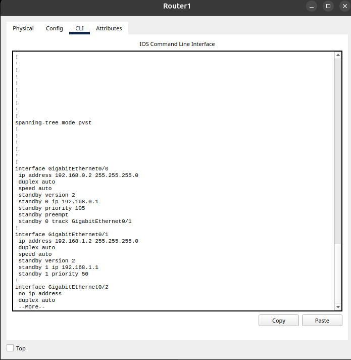

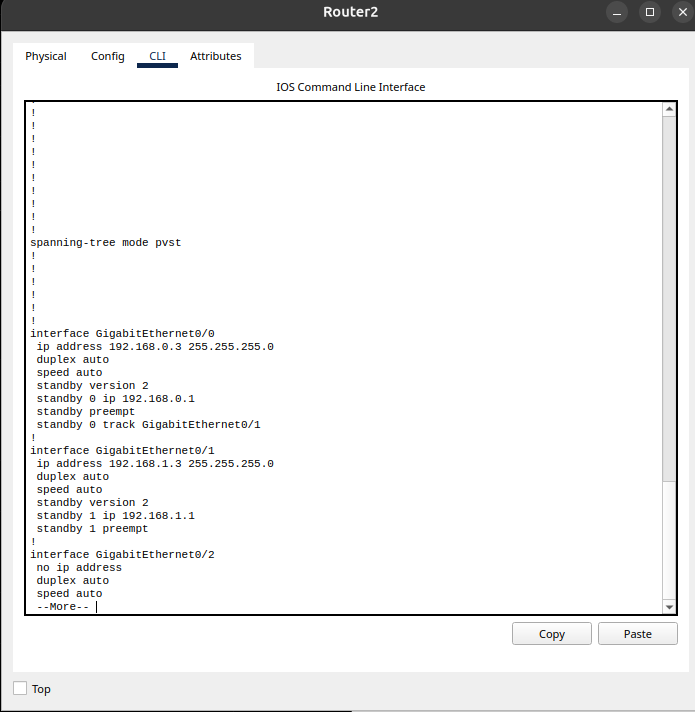

Также была проверена связь между `PC0` и `Server0` в режиме `Simulation`. ICMP-пакеты проходили между устройствами.

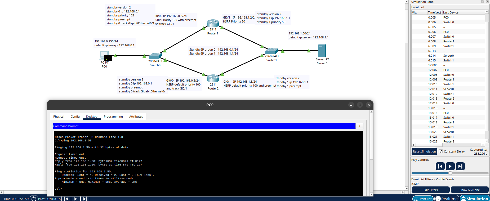

Далее была настроена первая группа HSRP.

На Router1 были выполнены команды:

```bash
enable
configure terminal
interface GigabitEthernet0/1
standby 1 priority 95
standby 1 preempt
standby 1 track GigabitEthernet0/0
end
write
```

На Router2 были выполнены команды:

```bash
enable
configure terminal
interface GigabitEthernet0/1
standby 1 track GigabitEthernet0/0
end
write
```

Команда `standby 1 track GigabitEthernet0/0` добавляет отслеживание интерфейса `Gi0/0` для первой группы HSRP.

На Router1 дополнительно был изменён приоритет первой группы на `95`, чтобы после отказа соединения Router2 с Switch0 виртуальный шлюз `192.168.1.1` переходил на Router1.

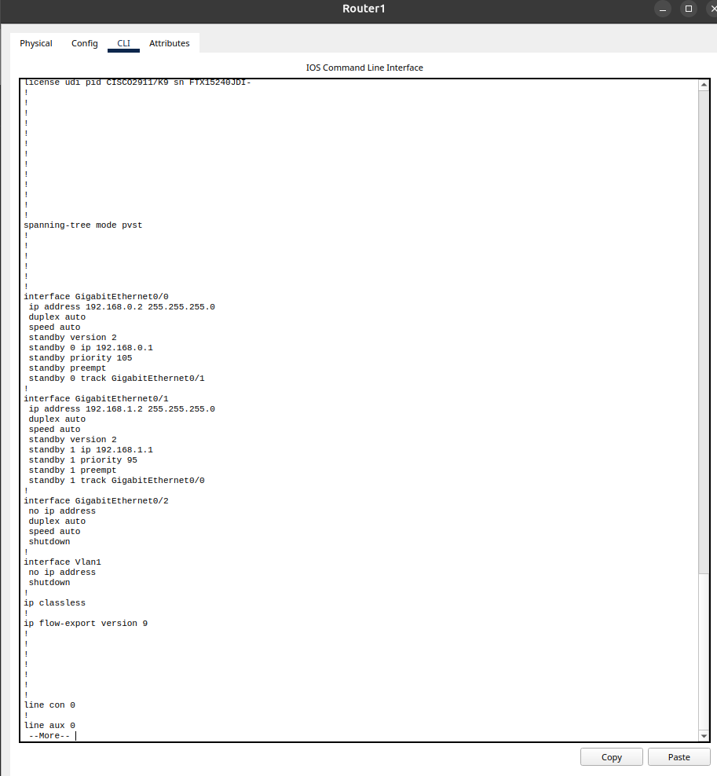

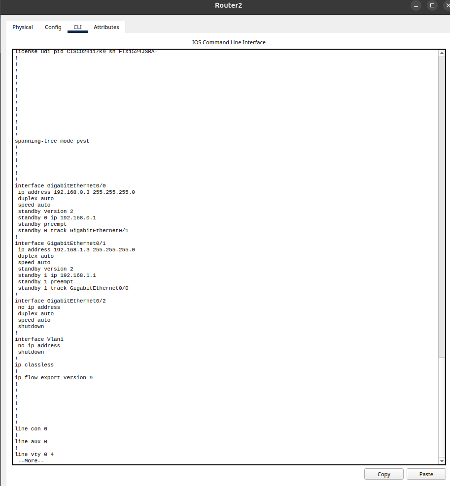

После настройки была проверена работа HSRP командой:

```bash
show standby brief
```

До отказа активным маршрутизатором для первой группы был Router2.

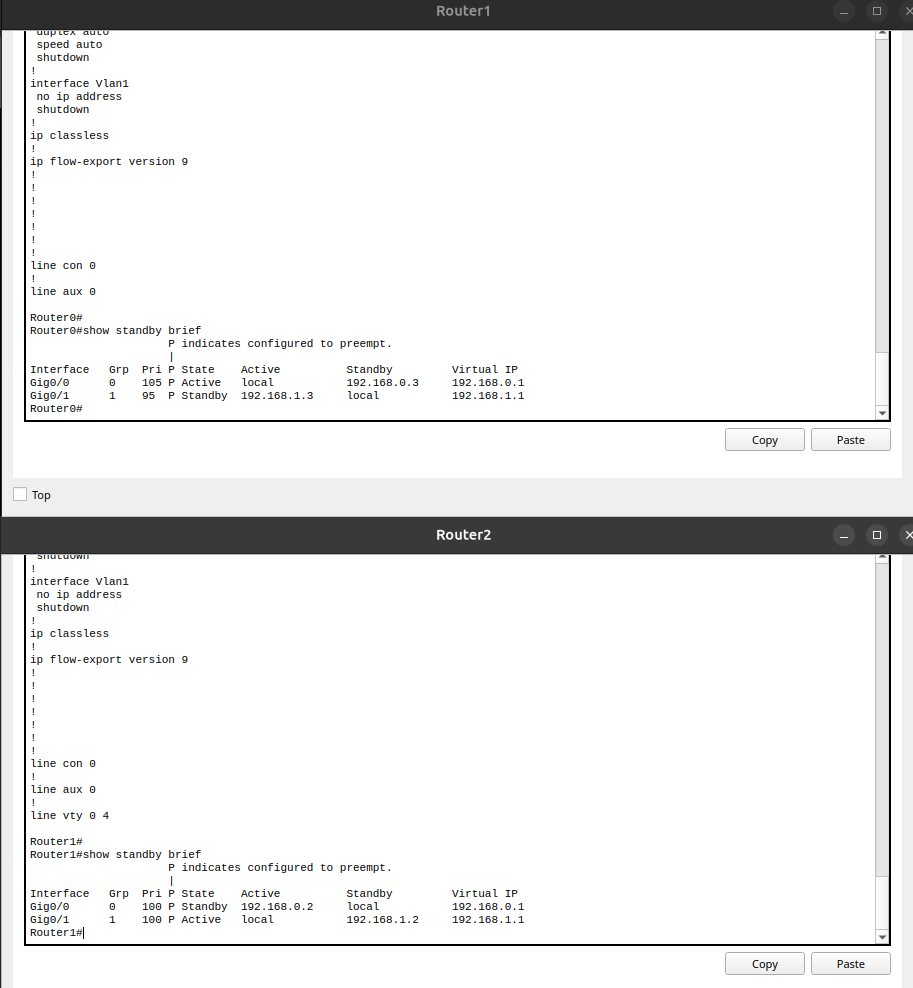

Затем был разорван кабель между Router2 и Switch0. После этого снова была выполнена проверка HSRP.

После отказа активным маршрутизатором для первой группы стал Router1.

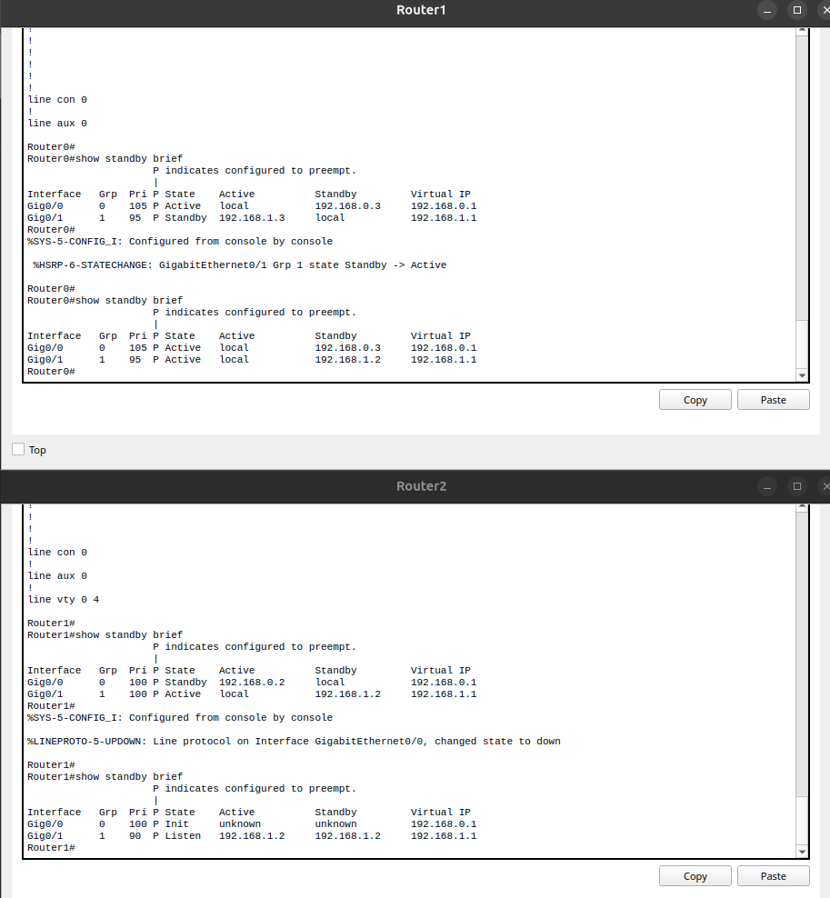

После переключения была проверена связь между `PC0` и `Server0`:

```bash
ping 192.168.1.50
```

Ping прошёл успешно, значит связь сохранилась.

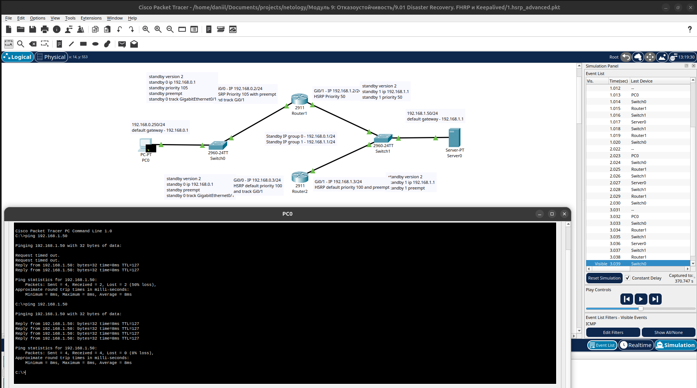

Итоговая схема после настройки:

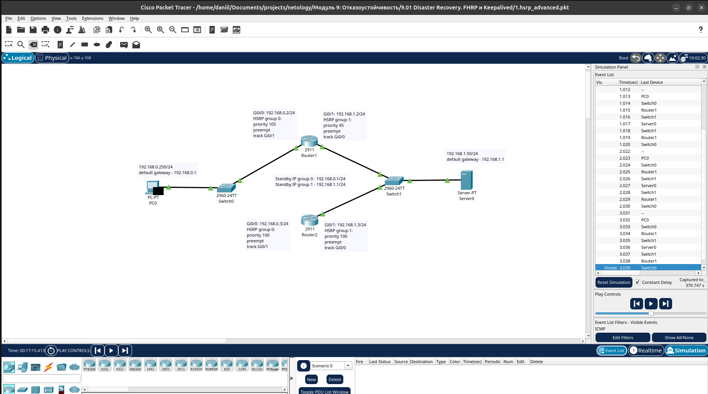

Файл итоговой схемы: [task1_final_hsrp.pkt](./task1_files/task1_final_hsrp.pkt)

**Вывод:** для первой группы HSRP было настроено отслеживание интерфейса `Gi0/0`. После разрыва соединения между Router2 и Switch0 виртуальный шлюз `192.168.1.1` перешёл на Router1, а связь между PC0 и Server0 сохранилась.

---

## Задание 2

### Условие

- Запустите две виртуальные машины Linux, установите и настройте сервис Keepalived как в лекции, используя пример конфигурационного [файла](./2.keepalived-simple.conf).
- Настройте любой веб-сервер (например, nginx или simple python server) на двух виртуальных машинах
- Напишите Bash-скрипт, который будет проверять доступность порта данного веб-сервера и существование файла index.html в root-директории данного веб-сервера.
- Настройте Keepalived так, чтобы он запускал данный скрипт каждые 3 секунды и переносил виртуальный IP на другой сервер, если bash-скрипт завершался с кодом, отличным от нуля (то есть порт веб-сервера был недоступен или отсутствовал index.html). Используйте для этого секцию vrrp_script
- Отправьте получившейся bash-скрипт и конфигурационный файл keepalived, а также скриншот с демонстрацией переезда плавающего ip на другой сервер в случае недоступности порта или файла index.html

### Ход решения

Для выполнения задания были подготовлены две виртуальные машины Ubuntu Server.

Адреса серверов:

- VM1: `192.168.122.230`;
- VM2: `192.168.122.241`;
- виртуальный IP-адрес: `192.168.122.200`.

На обеих виртуальных машинах были установлены `nginx` и `keepalived`.

Для проверки работы веб-сервера был создан bash-скрипт `check_nginx.sh`.

На VM1:

```bash
#!/bin/bash

SERVER_IP="192.168.122.230"
INDEX_FILE="/var/www/html/index.html"

curl -s "http://$SERVER_IP" > /dev/null
if [ $? -ne 0 ]; then
    exit 1
fi

if [ ! -f "$INDEX_FILE" ]; then
    exit 1
fi

exit 0
```

Для VM2 в скрипте поменял только IP-адрес сервера:

```bash
SERVER_IP="192.168.122.241"
```

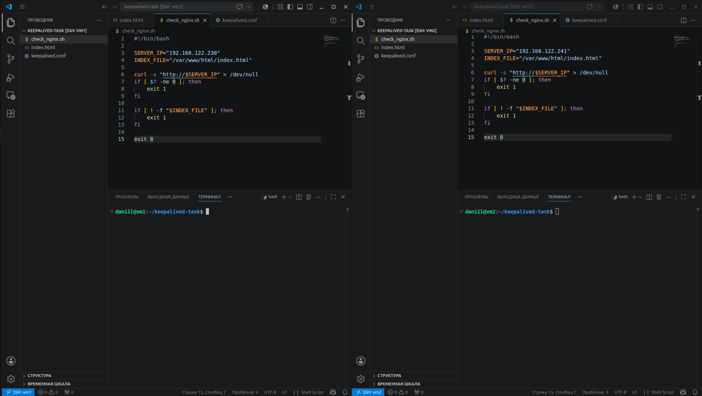

Также были подготовлены тестовые страницы `index.html` для понимания какой сервер является активным.

На VM1:

```html
<h1>VM1</h1>
<p>Server IP: 192.168.122.230</p>
<p>Role: MASTER</p>
<p>VIP: 192.168.122.200</p>
```

На VM2:

```html
<h1>VM2</h1>
<p>Server IP: 192.168.122.241</p>
<p>Role: BACKUP</p>
<p>VIP: 192.168.122.200</p>
```

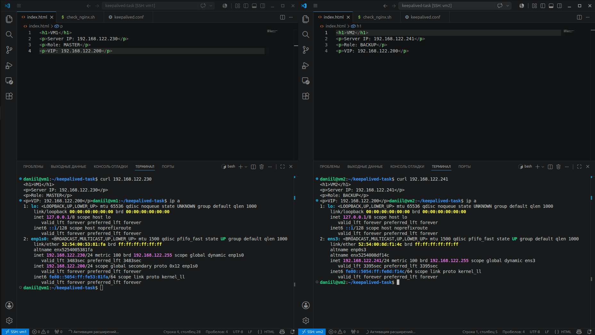

Далее был настроен `keepalived`.

Конфигурация VM1:

```conf
vrrp_script check_nginx {
        script "/usr/local/bin/check_nginx.sh"
        interval 3
}

vrrp_instance VI_1 {
        state MASTER
        interface enp1s0
        virtual_router_id 15
        priority 255
        advert_int 1

        virtual_ipaddress {
              192.168.122.200/24
        }

        track_script {
              check_nginx
        }
}
```

Конфигурация VM2:

```conf
vrrp_script check_nginx {
        script "/usr/local/bin/check_nginx.sh"
        interval 3
}

vrrp_instance VI_1 {
        state BACKUP
        interface ens3
        virtual_router_id 15
        priority 100
        advert_int 1

        virtual_ipaddress {
              192.168.122.200/24
        }

        track_script {
              check_nginx
        }
}
```

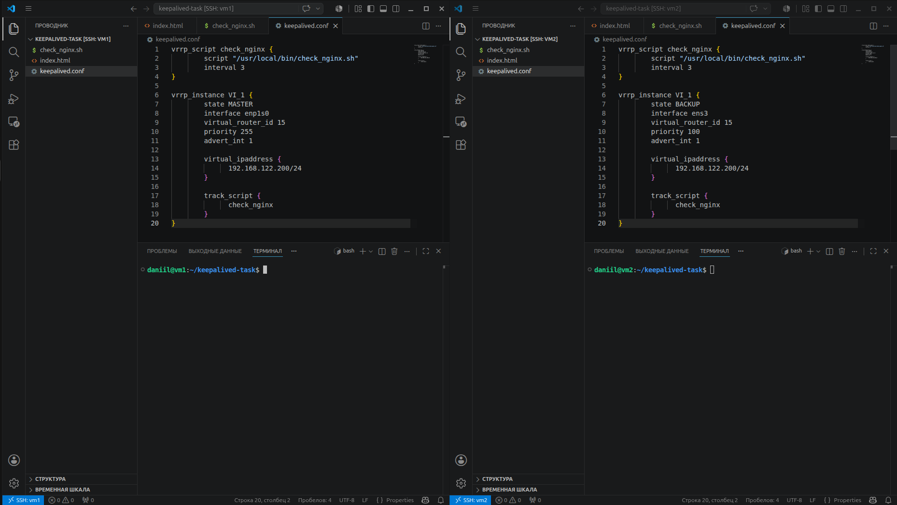

После запуска сервисов виртуальный IP-адрес `192.168.122.200` находился на VM1. При обращении к нему открывалась страница VM1.


Затем на VM1 был остановлен сервис `nginx`.

```bash
sudo systemctl stop nginx
```

После остановки nginx виртуальный IP-адрес `192.168.122.200` перешёл на VM2. При обращении к VIP стала открываться страница VM2.

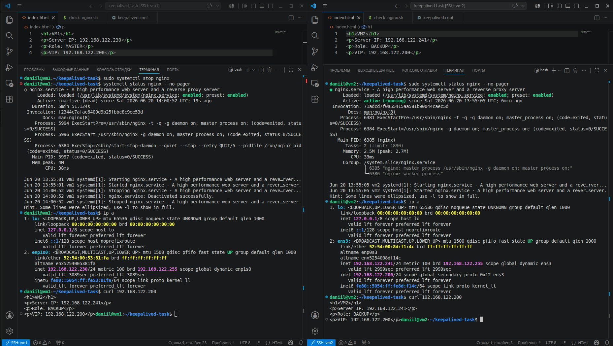

Также работа переключения была проверена в браузере.


**Вывод:** с помощью `keepalived` был настроен виртуальный IP-адрес `192.168.122.200`. При отказе веб-сервера на VM1 виртуальный IP автоматически перешёл на VM2, а доступ к веб-странице сохранился.

Конфигурационные файлы:

- [Скрипт проверки nginx для VM1](./task2_files/vm1_check_nginx.sh)
- [Конфигурация keepalived для VM1](./task2_files/vm1_keepalived.conf)
- [Тестовая страница index.html для VM1](./task2_files/vm1_index.html)
- [Скрипт проверки nginx для VM2](./task2_files/vm2_check_nginx.sh)
- [Конфигурация keepalived для VM2](./task2_files/vm2_keepalived.conf)
- [Тестовая страница index.html для VM2](./task2_files/vm2_index.html)

---

## Задание 3*

### Условие

- Изучите дополнительно возможность Keepalived, которая называется vrrp_track_file
- Напишите bash-скрипт, который будет менять приоритет внутри файла в зависимости от нагрузки на виртуальную машину (можно разместить данный скрипт в cron и запускать каждую минуту). Рассчитывать приоритет можно, например, на основании Load average.
- Настройте Keepalived на отслеживание данного файла.
- Нагрузите одну из виртуальных машин, которая находится в состоянии MASTER и имеет активный виртуальный IP и проверьте, чтобы через некоторое время она перешла в состояние SLAVE из-за высокой нагрузки и виртуальный IP переехал на другой, менее нагруженный сервер.
- Попробуйте выполнить настройку keepalived на третьем сервере и скорректировать при необходимости формулу так, чтобы плавающий ip адрес всегда был прикреплен к серверу, имеющему наименьшую нагрузку.
- Отправьте получившийся bash-скрипт и конфигурационный файл keepalived, а также скриншоты логов keepalived с серверов при разных нагрузках

### Ход решения

---

*Список используемой литературы:*

- ["Как пользоваться программой Cisco Packet Tracer"](https://pc.ru/articles/osnovy-raboty-s-cisco-packet-tracer)
- [Документация](https://www.cisco.com/c/en/us/support/docs/ip/network-address-translation-nat/13772-12.html)

---
