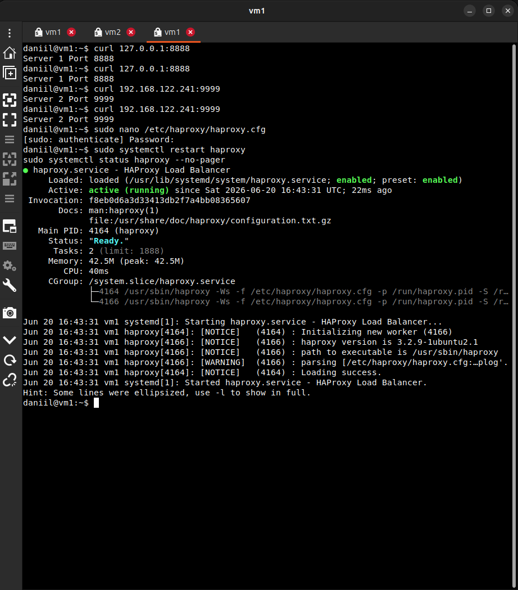
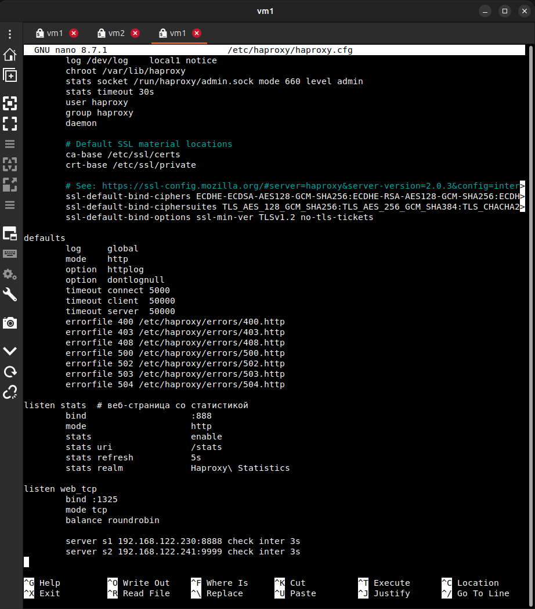
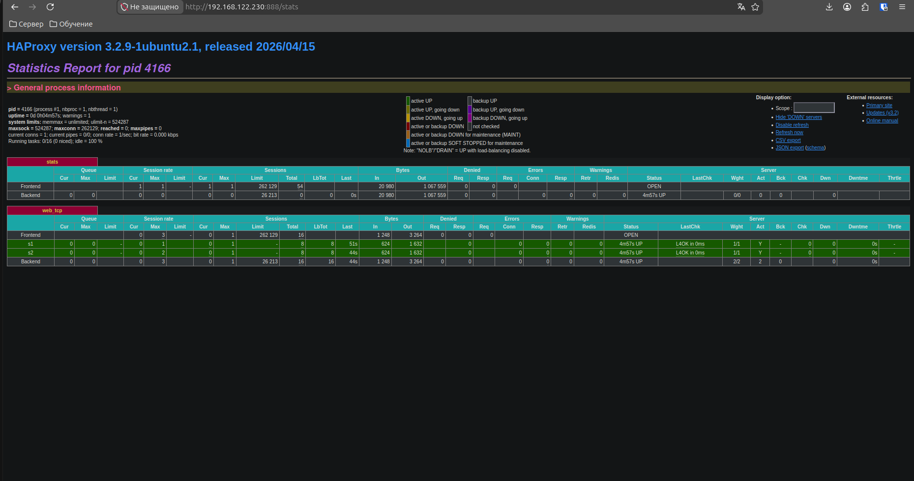
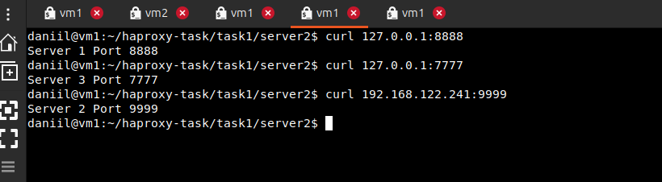
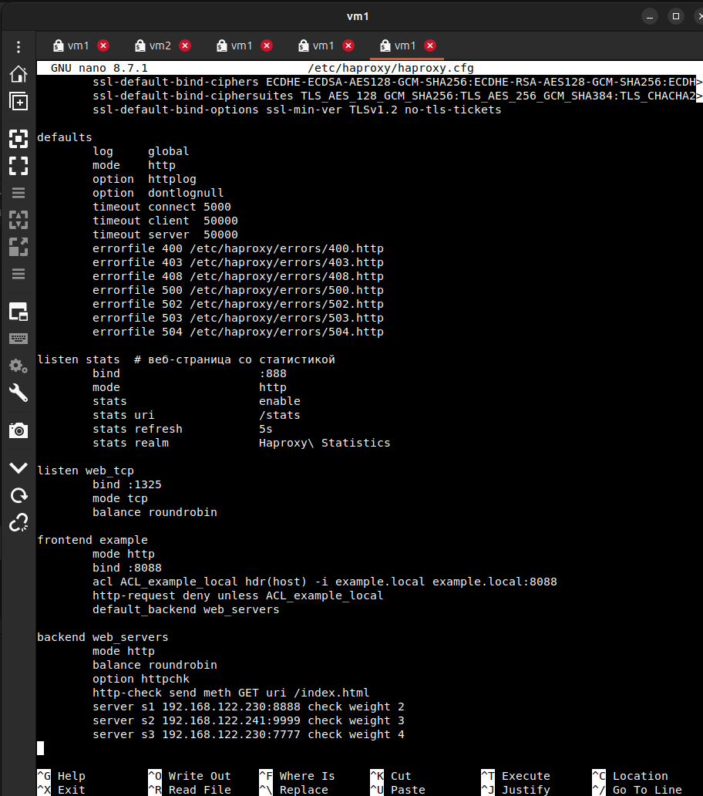
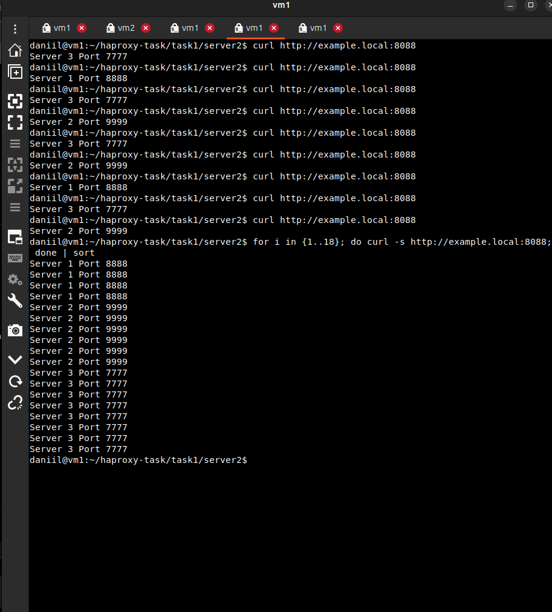
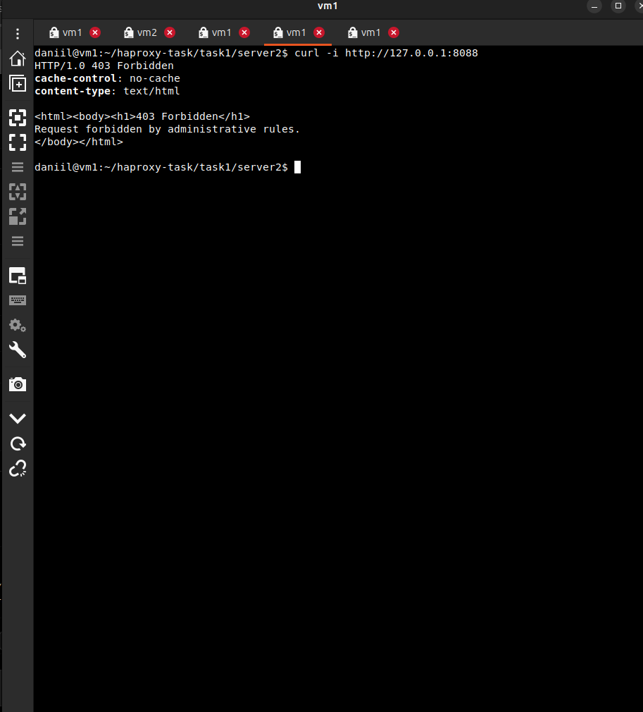
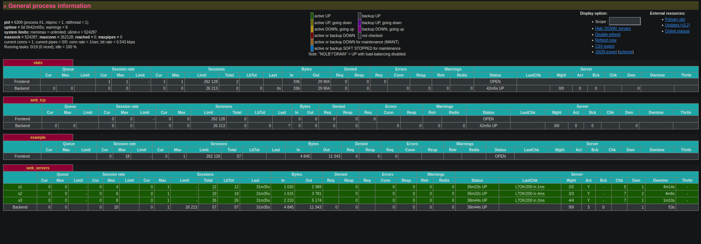

# Домашнее задание к занятию "9.02 Кластеризация и балансировка нагрузки" - "Борисенко Даниил"

## Цель задания

В результате выполнения этого задания вы научитесь:

1. Настраивать балансировку с помощью HAProxy
2. Настраивать связку HAProxy + Nginx

---

## Задание 1

### Условие

- Запустите два simple python сервера на своей виртуальной машине на разных портах
- Установите и настройте HAProxy, воспользуйтесь материалами к лекции
- Настройте балансировку Round-robin на 4 уровне.
- На проверку направьте конфигурационный файл haproxy, скриншоты, где видно перенаправление запросов на разные серверы при обращении к HAProxy.

### Ход решения

Для выполнения задания использовал следующие VM:

- VM1: `192.168.122.230`;
- VM2: `192.168.122.241`.

1. На VM1 был запущен simple python сервер на порту `8888`.

```bash
mkdir -p ~/haproxy-task/task1/server1
echo "Server 1 Port 8888" > ~/haproxy-task/task1/server1/index.html

cd ~/haproxy-task/task1/server1
python3 -m http.server 8888 --bind 0.0.0.0
```


2. На VM2 был запущен второй simple python сервер на порту `9999`.

```bash
mkdir -p ~/haproxy-task/task1/server2
echo "Server 2 Port 9999" > ~/haproxy-task/task1/server2/index.html

cd ~/haproxy-task/task1/server2
python3 -m http.server 9999 --bind 0.0.0.0
```


3. В конфигурационный файл `/etc/haproxy/haproxy.cfg` были добавлены блоки `listen stats` и `listen web_tcp`.

```conf
listen stats  # веб-страница со статистикой
        bind                    :888
        mode                    http
        stats                   enable
        stats uri               /stats
        stats refresh           5s
        stats realm             Haproxy\ Statistics

listen web_tcp
        bind :1325
        mode tcp
        balance roundrobin

        server s1 192.168.122.230:8888 check inter 3s
        server s2 192.168.122.241:9999 check inter 3s
```

В секции `listen web_tcp` HAProxy принимает подключения на порту `1325` и балансирует их между двумя simple python серверами.  
Для выполнения балансировки на 4-м уровне, был выбран метод `mode tcp`.

4. После настройки конфигурация HAProxy сервис был перезапущен.

```bash
sudo systemctl restart haproxy
sudo systemctl status haproxy --no-pager
```



Конфигурация HAProxy:



5. Для проверки балансировки были выполнены последовательные запросы к HAProxy на порт `1325`.

```bash
curl 127.0.0.1:1325
curl 127.0.0.1:1325
curl 127.0.0.1:1325
curl 127.0.0.1:1325
```

При повторных обращениях HAProxy направляр запросы на разные сервера:

```text
Server 1 Port 8888
Server 2 Port 9999
Server 1 Port 8888
Server 2 Port 9999
```

6. Работу HAProxy так же проверил через веб-страницу:

```text
http://192.168.122.230:888/stats
```



Файл конфигурации HAProxy:

- [haproxy_task1.cfg](./haproxy_task1.cfg)

**Вывод:** была настроена балансировка Round-robin на 4 уровне с помощью HAProxy. При обращении к HAProxy на порт `1325` запросы по очереди перенаправлялись на два simple python сервера: `192.168.122.230:8888` и `192.168.122.241:9999`.

---

## Задание 2

### Условие

- Запустите три simple python сервера на своей виртуальной машине на разных портах
- Настройте балансировку Weighted Round Robin на 7 уровне, чтобы первый сервер имел вес 2, второй - 3, а третий - 4
- HAproxy должен балансировать только тот http-трафик, который адресован домену example.local
- На проверку направьте конфигурационный файл haproxy, скриншоты, где видно перенаправление запросов на разные серверы при обращении к HAProxy c использованием домена example.local и без него.

### Ход решения

Для выполнения задания использовал уже настроенные серверы из задания 1 и добавил третий simple python сервер.

Схема получилась следующая:

- VM1: `192.168.122.230`;
- VM2: `192.168.122.241`;
- Server 1: `192.168.122.230:8888`;
- Server 2: `192.168.122.241:9999`;
- Server 3: `192.168.122.230:7777`;
- HAProxy frontend: `example.local:8088`.

1. На VM1 был запущен третий simple python сервер на порту `7777`.

```bash
mkdir -p ~/haproxy-task/task1/server3
echo "Server 3 Port 7777" > ~/haproxy-task/task1/server3/index.html

cd ~/haproxy-task/task1/server3
python3 -m http.server 7777 --bind 0.0.0.0
```


2. После этого была проверена доступность всех трёх серверов.

```bash
curl 127.0.0.1:8888
curl 127.0.0.1:7777
curl 192.168.122.241:9999
```

В результате каждый сервер отдавал свою страницу:

```text
Server 1 Port 8888
Server 3 Port 7777
Server 2 Port 9999
```



3. Для проверки балансировки только по домену `example.local` в файл `/etc/hosts` была добавлена запись:

```bash
127.0.0.1 example.local
```

Проверка записи:

```bash
cat /etc/hosts | grep example
```


4. Далее в конфигурационный файл `/etc/haproxy/haproxy.cfg` были добавлены блоки `frontend example` и `backend web_servers`.

```conf
frontend example
        mode http
        bind :8088
        acl ACL_example_local hdr(host) -i example.local example.local:8088
        http-request deny unless ACL_example_local
        default_backend web_servers

backend web_servers
        mode http
        balance roundrobin
        option httpchk
        http-check send meth GET uri /index.html
        server s1 192.168.122.230:8888 check weight 2
        server s2 192.168.122.241:9999 check weight 3
        server s3 192.168.122.230:7777 check weight 4
```

С помощью ACL проверяется заголовок `Host`. Если запрос не адресован домену `example.local`, HAProxy возвращает ошибку `403 Forbidden`.

В секции `backend web_servers` настроена балансировка между тремя серверами.  
Для серверов указаны веса:

- `s1` — вес `2`;
- `s2` — вес `3`;
- `s3` — вес `4`.



5. После настройки конфигурация была применена перезапуском HAProxy.

```bash
sudo systemctl restart haproxy
```

6. Далее была проверена работа балансировки при обращении к домену `example.local`.

```bash
curl http://example.local:8088
curl http://example.local:8088
curl http://example.local:8088
curl http://example.local:8088
curl http://example.local:8088
curl http://example.local:8088
```

При повторных запросах HAProxy перенаправлял обращения на разные backend-серверы.



7. Также была выполнена проверка распределения запросов с учётом весов серверов.

```bash
for i in {1..18}; do curl -s http://example.local:8088; done | sort
```

В результате видно, что сервер с большим весом получает больше запросов:

```text
Server 1 Port 8888
Server 2 Port 9999
Server 3 Port 7777
```


8. Проверил работу HAProxy без домена `example.local`.

```bash
curl -i http://127.0.0.1:8088
```

HAProxy вернул ошибку `403 Forbidden`, так как запрос был выполнен без домена.



9. Работа backend-серверов также была проверена через веб-страницу статистики HAProxy.

```text
http://192.168.122.230:888/stats
```

На странице статистики видны backend `web_servers`, серверы `s1`, `s2`, `s3` и их веса `2`, `3`, `4`.



Файл конфигурации HAProxy для задания 2:

- [haproxy_task2.cfg](./haproxy_task2.cfg)

**Вывод:** была настроена балансировка Weighted Round Robin на 7 уровне. HAProxy принимал HTTP-запросы на порту `8088` только для домена `example.local` и распределял их между тремя simple python серверами с весами `2`, `3` и `4`.

---

## Задание 3*

### Условие

- Настройте связку HAProxy + Nginx как было показано на лекции.
- Настройте Nginx так, чтобы файлы .jpg выдавались самим Nginx (предварительно разместите несколько тестовых картинок в директории /var/www/), а остальные запросы переадресовывались на HAProxy, который в свою очередь переадресовывал их на два Simple Python server.
- На проверку направьте конфигурационные файлы nginx, HAProxy, скриншоты с запросами jpg картинок и других файлов на Simple Python Server, демонстрирующие корректную настройку.

### Ход решения

---

### Задание 4*

### Условие

- Запустите 4 simple python сервера на разных портах.
- Первые два сервера будут выдавать страницу index.html вашего сайта example1.local (в файле index.html напишите example1.local)
- Вторые два сервера будут выдавать страницу index.html вашего сайта example2.local (в файле index.html напишите example2.local)
- Настройте два бэкенда HAProxy
- Настройте фронтенд HAProxy так, чтобы в зависимости от запрашиваемого сайта example1.local или example2.local запросы перенаправлялись на разные бэкенды HAProxy
- На проверку направьте конфигурационный файл HAProxy, скриншоты, демонстрирующие запросы к разным фронтендам и ответам от разных бэкендов.

### Ход решения

---

*Список используемой литературы:*

- [Балансировка нагрузки: основные алгоритмы и методы](https://habr.com/ru/companies/selectel/articles/250201/)
- [Вычислительный кластер](https://itelon.ru/blog/vychislitelnyy-klaster/)
- [Кластерные системы](https://habr.com/ru/companies/parking-old/articles/126415/)
- [Эффективные кластерные решения](https://www.ixbt.com/cpu/clustering.shtml)

---
