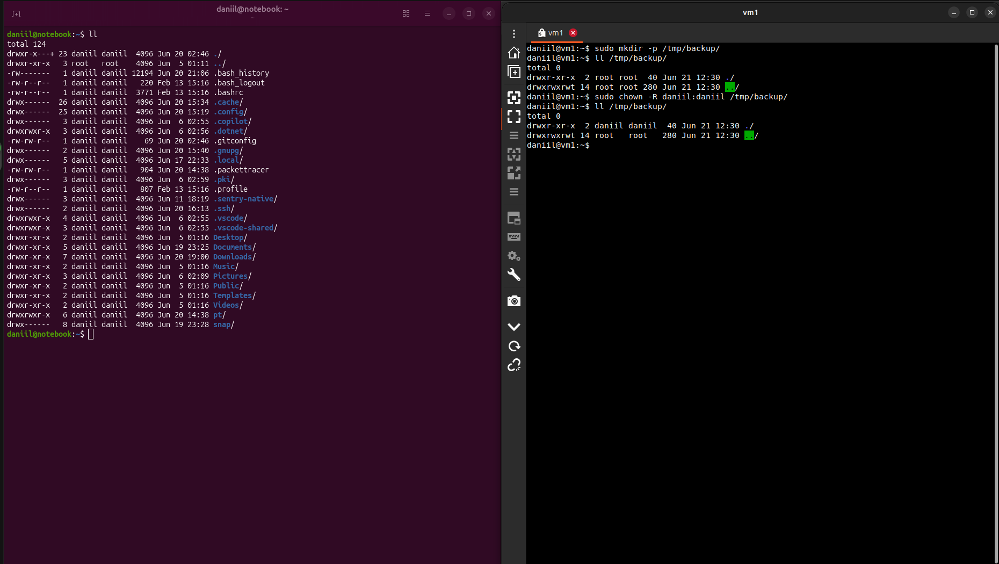
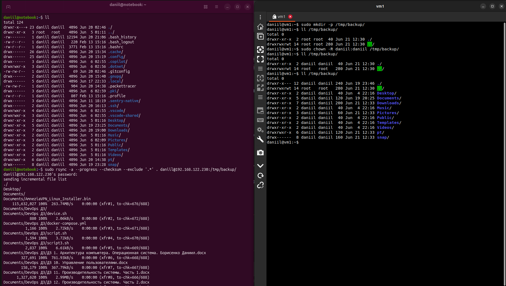
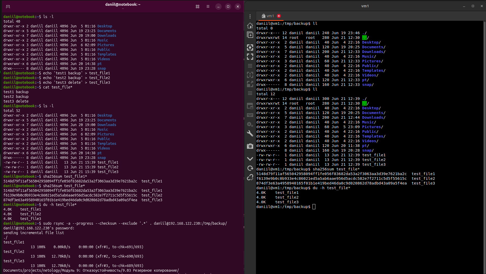
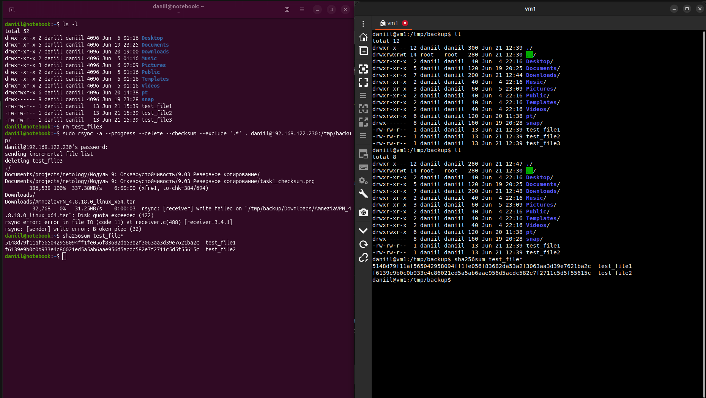
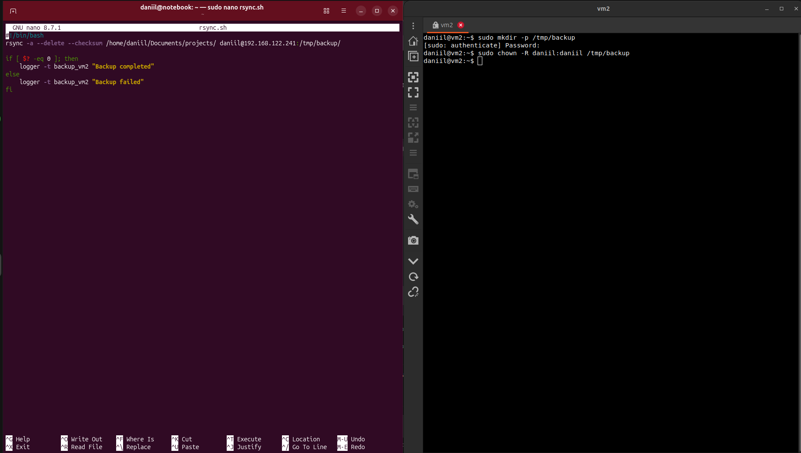
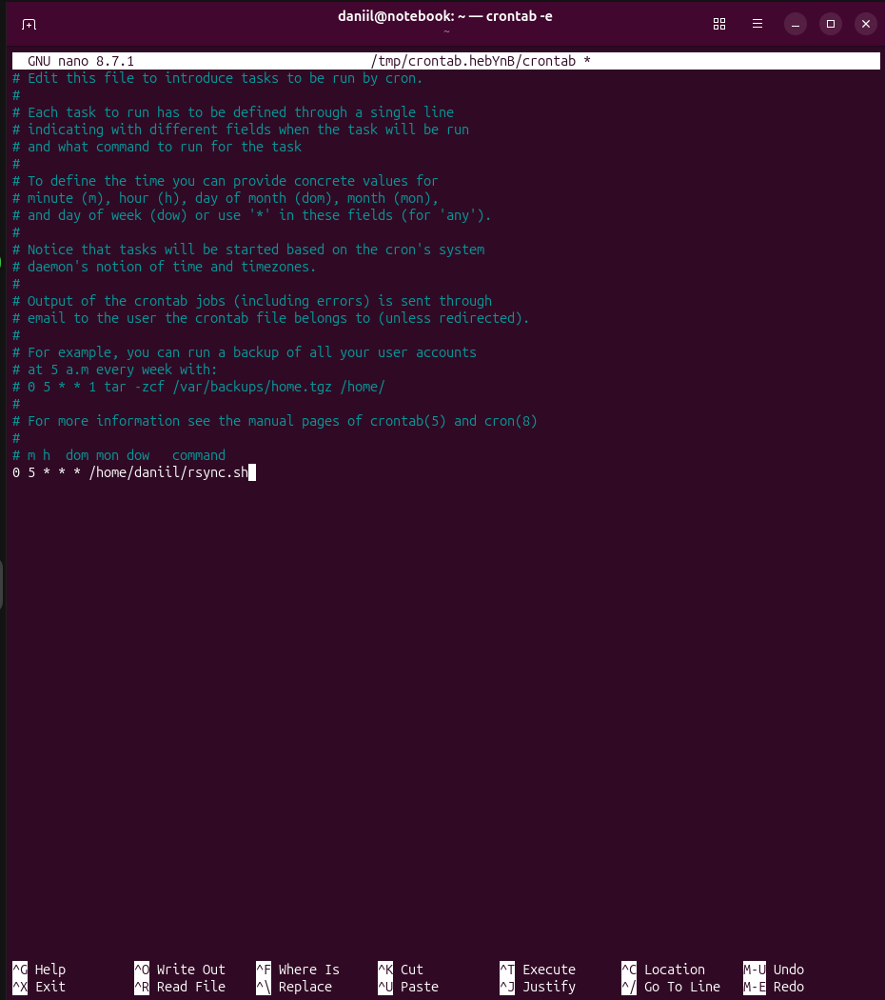
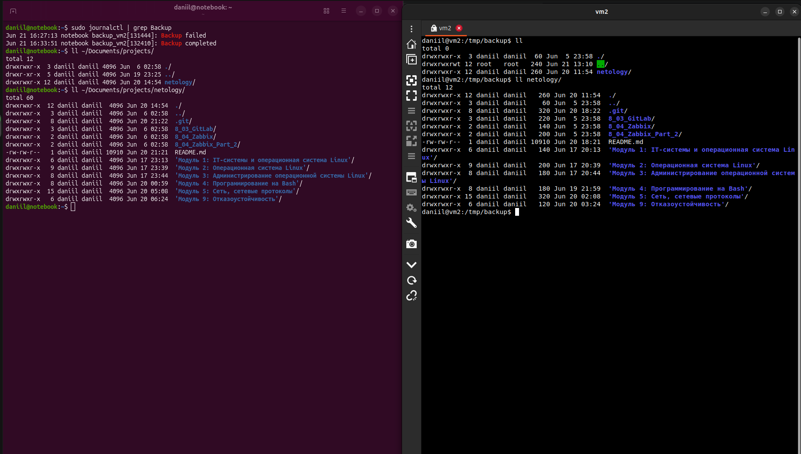

# Домашнее задание к занятию "9.03 Резервное копирование" - "Борисенко Даниил"

## Цель задания

В результате выполнения этого задания вы научитесь:

1. Настраивать регулярные задачи на резервное копирование (полная зеркальная копия)
2. Настраивать инкрементное резервное копирование с помощью rsync

---

## Задание 1

### Условие

- Составьте команду rsync, которая позволяет создавать зеркальную копию домашней директории пользователя в директорию `/tmp/backup`
- Необходимо исключить из синхронизации все директории, начинающиеся с точки (скрытые)
- Необходимо сделать так, чтобы rsync подсчитывал хэш-суммы для всех файлов, даже если их время модификации и размер идентичны в источнике и приемнике.
- На проверку направить скриншот с командой и результатом ее выполнения

### Ход решения

Для выполнения задания была использована домашняя директория пользователя `daniil` на основной машине и директория `/tmp/backup` на VM1.

VM1:

```text
192.168.122.230
```

1. На VM1 была создана директория для резервной копии `/tmp/backup` и изменен владелец директории.

```bash
sudo mkdir -p /tmp/backup/
ls -l /tmp/backup/
sudo chown -R daniil:daniil /tmp/backup/
ls /tmp/backup/
```

После изменения владельца получил права на запись в `/tmp/backup`.



2. На основной машине был выполнен бэкап домашней директории в `/tmp/backup` на VM1.

```bash
sudo rsync -a --progress --checksum --exclude '.*' . daniil@192.168.122.230:/tmp/backup/
```

**Где:**

- `-a` — архивный режим;
- `--progress` — показывает процесс копирования файлов;
- `--checksum` — сравнивает файлы по контрольным суммам;
- `--exclude '.*'` — исключает скрытые файлы и директории, которые начинаются с точки;
- `daniil@192.168.122.230:/tmp/backup/` — директория на VM1.



3. Для проверки были созданы тестовые файлы.

```bash
echo 'test1 backup' > test_file1
echo 'test2 backup' > test_file2
echo 'test3 delete' > test_file3
cat test_file*
ls -l
```

После синхронизации файлы появились в `/tmp/backup` на VM1.

```bash
ll /tmp/backup/
```

Также была выполнена проверка контрольных сумм файлов на основной машине и на VM1.

```bash
sha256sum test_file*
du -h test_file*
```

На VM1:

```bash
sha256sum test_file*
du -h test_file*
```

Контрольные суммы файлов совпали, значит файлы были скопированы корректно.



4. Далее был проверен режим зеркальной копии. Для этого файл `test_file3` был удалён из исходной директории.

```bash
rm test_file3
```

После этого была запущена синхронизация с параметром `--delete`.

```bash
sudo rsync -a --progress --delete --checksum --exclude '.*' . daniil@192.168.122.230:/tmp/backup/
```

Во время выполнения команды `rsync` удалил файл `test_file3` из `/tmp/backup`:

```text
deleting test_file3
```

После этого синхронизация была прервана ошибкой:

```text
Disk quota exceeded
```

Ошибка возникла из-за того, что на VM1 в директории `/tmp/backup` не хватило доступного места для полного бэкапа, но файл `test_file3` был удалён из резервной копии, а в `/tmp/backup` остались только `test_file1` и `test_file2`.



**Вывод:** Утилита `rsync` позволяет создавать backup директорий и файлов, используя контрольные суммы через `--checksum`, исключает скрытые директории и файлы через `--exclude '.*'`, а также поддерживает зеркальный бэкап через параметр `--delete`.

---

## Задание 2

### Условие

- Написать скрипт и настроить задачу на регулярное резервное копирование домашней директории пользователя с помощью rsync и cron.
- Резервная копия должна быть полностью зеркальной
- Резервная копия должна создаваться раз в день, в системном логе должна появляться запись об успешном или неуспешном выполнении операции
- Резервная копия размещается локально, в директории `/tmp/backup`
- На проверку направить файл crontab и скриншот с результатом работы утилиты.

### Ход решения

Для выполнения задания был написан скрипт, который выполняет резервное копирование с локальной машины на VM2 с помощью `rsync`.

1. На VM2 была создана директория `/tmp/backup` и выданы права пользователю `daniil`.

```bash
sudo mkdir -p /tmp/backup
sudo chown -R daniil:daniil /tmp/backup
```

2. Для автоматического выполнения резервного копирования через `cron` был добавлен SSH-ключ на VM2.  

На локальной машине был создан SSH-ключ:

```bash
ssh-keygen -t ed25519 -f ~/.ssh/backup_vm2
```

После этого публичный ключ добавил на VM2:

```bash
ssh-copy-id -i ~/.ssh/backup_vm2.pub daniil@192.168.122.241
```

После добавления ключа подключение к VM2 стало возможно без ввода пароля, что позволило запускать скрипт автоматически через `cron`.

3. На локальной машине был создан скрипт `rsync.sh`.

```bash
#!/bin/bash
rsync -a --delete --checksum /home/daniil/Documents/projects/ daniil@192.168.122.241:/tmp/backup/

if [ $? -eq 0 ]; then
    logger -t backup_vm2 "Backup completed"
else
    logger -t backup_vm2 "Backup failed"
fi
```

**Где:**

- `-a` — архивный режим, сохраняет структуру каталогов и атрибуты файлов;
- `--delete` — удаляет из резервной копии файлы, которых больше нет в источнике;
- `--checksum` — заставляет `rsync` сравнивать файлы по контрольным суммам;
- `logger` — записывает результат выполнения скрипта в системный лог.



4. Для автоматического запуска скрипта был настроен `cron`.

```bash
crontab -e
```

В crontab была добавлена строка:

```cron
0 5 * * * /home/daniil/rsync.sh
```

Таким образом, скрипт будет запускаться каждый день в `05:00`.



5. После запуска скрипта была проверена резервная копия на VM2.

На VM2 в директории `/tmp/backup` появилась папка `netology`, значит копирование прошло успешно.

Также был проверен системный лог:

```bash
sudo journalctl | grep Backup
```

В логе появилась запись:

```text
Backup completed
```

Это подтверждает успешное выполнение операции резервного копирования.



Файл скрипта:

- [rsync.sh](./rsync.sh)

**Вывод:** Утилита `rsync` позволяет выполнять автоматический backup на сервер через `cron`, используя SSH-ключ, полученный результат, записывать в `journalctl`.

---

## Задание 3*

### Условие

- Настройте ограничение на используемую пропускную способность rsync до 1 Мбит/c
- Проверьте настройку, синхронизируя большой файл между двумя серверами
- На проверку направьте команду и результат ее выполнения в виде скриншота

### Ход решения

---

## Задание 4*

### Условие

- Напишите скрипт, который будет производить инкрементное резервное копирование домашней директории пользователя с помощью rsync на другой сервер
- Скрипт должен удалять старые резервные копии (сохранять только последние 5 штук)
- Напишите скрипт управления резервными копиями, в нем можно выбрать резервную копию и данные восстановятся к состоянию на момент создания данной резервной копии.
- На проверку направьте скрипт и скриншоты, демонстрирующие его работу в различных сценариях.

### Ход решения

---
