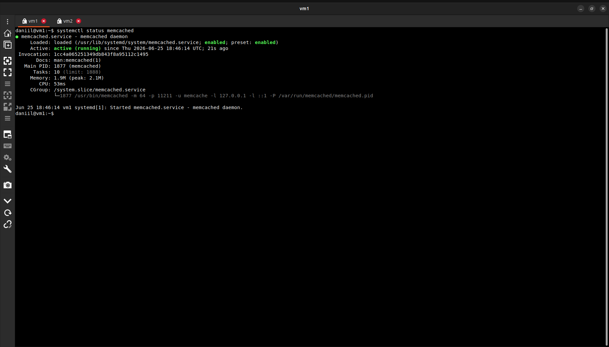
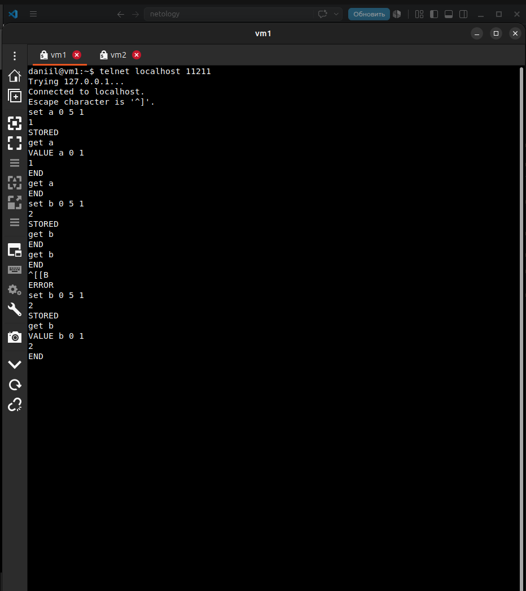
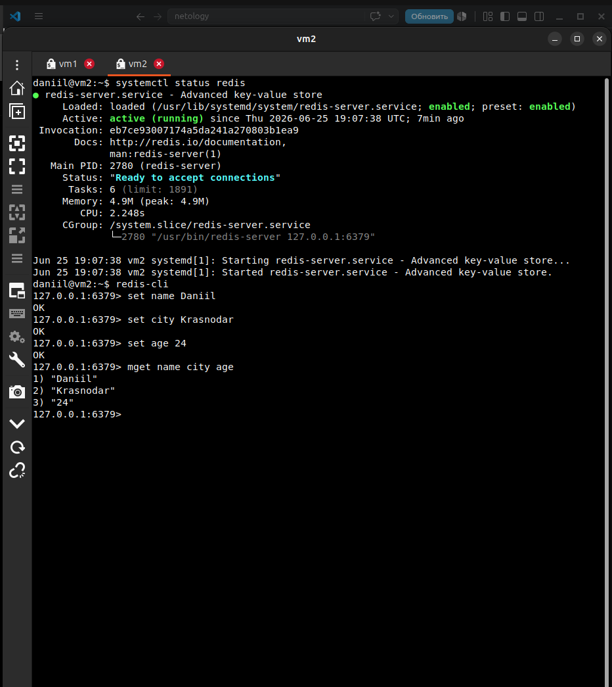
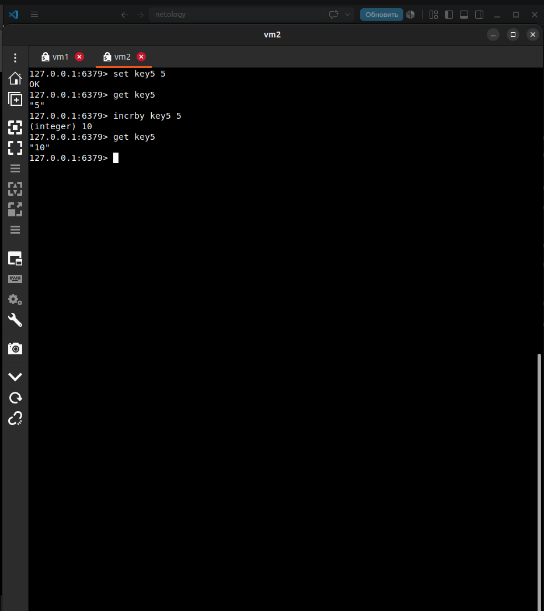

# Домашнее задание к занятию "10.02 Кеширование Redis/memcached" - "Борисенко Даниил"

---

## Задание 1. Кеширование

### Условие

Приведите примеры проблем, которые может решить кеширование.

*Приведите ответ в свободной форме.*

### Ход решения

Кеширование помогает решить несколько проблем:

1. Снизить нагрузку на базу данных, так как часто запрашиваемые данные можно брать из кеша.
2. Ускорить ответ приложения пользователю, потому что данные из кеша возвращаются быстрее, чем при постоянном обращении к БД.
3. Уменьшить количество повторяющихся запросов к одним и тем же данным.
4. Повысить устойчивость приложения при высокой нагрузке, так как часть запросов будет обрабатываться кешем.

---

## Задание 2. Memcached

### Условие

Установите и запустите memcached.

*Приведите скриншот systemctl status memcached, где будет видно, что memcached запущен.*

### Ход решения

На vm1 был установлен и запущен memcached.

Сервис был проверен командой `systemctl status memcached`. Сервис находится в состоянии `active (running)`.

---

## Задание 3. Удаление по TTL в Memcached

### Условие

Запишите в memcached несколько ключей с любыми именами и значениями, для которых выставлен TTL 5.

*Приведите скриншот, на котором видно, что спустя 5 секунд ключи удалились из базы.*

### Ход решения

В memcached были записаны ключи `a` и `b` со значениями `1` и `2`.  
Для ключей был указан TTL 5 секунд.

Команда `get a` сначала вернула значение ключа, а после истечения TTL повторный запрос вернул `END`, что означает удаление ключа из базы.

---

## Задание 4. Запись данных в Redis

### Условие

Запишите в Redis несколько ключей с любыми именами и значениями.

*Через redis-cli достаньте все записанные ключи и значения из базы, приведите скриншот этой операции.*

### Ход решения

На vm2 был установлен и запущен Redis.

Через `redis-cli` были записаны ключи `name`, `city`, `age` со значениями `Daniil`, `Krasnodar`, `24`.

Командой `MGET name city age` были получены все записанные значения.

---

## Задание 5*. Работа с числами

### Условие

Запишите в Redis ключ key5 со значением типа "int" равным числу 5. Увеличьте его на 5, чтобы в итоге в значении лежало число 10.  

*Приведите скриншот, где будут проделаны все операции и будет видно, что значение key5 стало равно 10.*

### Ход решения

В Redis был создан ключ `key5` со значением `5`.

После этого значение было увеличено на 5 с помощью команды `INCRBY key5 5`.

Итоговая проверка через `GET key5` показала значение `10`.

---

**Список используемой литературы:**

- [Кэширование](https://habr.com/ru/articles/734660/)
- [Как работает Redis. Особенности кэширования](https://selectel.ru/blog/cache-redis/)
- [Разбираемся с Redis](https://habr.com/ru/companies/wunderfund/articles/685894/)
- [Redis и Memcached](https://webhost1.ru/help/articles/reviews/2023-09-20-redis-i-memcached-ispolzovanie-preimuwestva-i-otlichija.html)

---
