# Домашнее задание к занятию "10.03 ELK" - "Борисенко Даниил"

---

**Примечание**: если у вас недоступны официальные образы, можете найти альтернативные варианты в DockerHub, например, [такой](https://hub.docker.com/layers/bitnami/elasticsearch/7.17.13/images/sha256-8084adf6fa1cf24368337d7f62292081db721f4f05dcb01561a7c7e66806cc41?context=explore).

---

## Задание 1. Elasticsearch

### Условие

Установите и запустите Elasticsearch, после чего поменяйте параметр cluster_name на случайный.

*Приведите скриншот команды 'curl -X GET 'localhost:9200/_cluster/health?pretty', сделанной на сервере с установленным Elasticsearch. Где будет виден нестандартный cluster_name*.

### Ход решения

Для запуска Elasticsearch был использован Docker Compose по примеру из официальной документации Elastic.

В файле `docker-compose.yml` был описан сервис `elasticsearch`. В качестве образа использован официальный образ:

```yaml
docker.elastic.co/elasticsearch/elasticsearch-wolfi:9.4.2
```

В настройках контейнера были изменены параметры:

```yaml
- discovery.type=single-node
- xpack.security.enabled=false
- cluster.name=borisenko-cluster
```

**Где:**

`discovery.type=single-node` - параметр для запуска Elasticsearch в режиме одного узла.
`xpack.security.enabled=false` - параметр для запуска без авторизации и сертификатов.
`cluster.name=borisenko-cluster` - параметр, позволяющий задать нестандартное имя кластера.

Также был проброшен порт:

```yaml
- 9200:9200
```

После этого Elasticsearch был запущен командой:

```bash
docker compose up -d
```

Проверка состояния кластера выполнена командой:

```bash
curl -X GET 'localhost:9200/_cluster/health?pretty'
```

В результате видно, что Elasticsearch запущен, статус кластера `green`, а имя кластера изменено на `borisenko-cluster`.


---

## Задание 2. Kibana

### Условие

Установите и запустите Kibana.

*Приведите скриншот интерфейса Kibana на странице http://<ip вашего сервера>:5601/app/dev_tools#/console, где будет выполнен запрос GET /_cluster/health?pretty*.

### Ход решения

Для запуска Kibana в файл `docker-compose.yml` был добавлен сервис `kibana`.

В качестве образа был использован официальный образ Kibana:

```yaml
docker.elastic.co/kibana/kibana-wolfi:9.4.2
```

Для доступа к веб-интерфейсу Kibana был проброшен порт:

```yaml
- 5601:5601
```

Также была добавлена зависимость от Elasticsearch:

```yaml
depends_on:
  - elasticsearch
```

Для подключения Kibana к Elasticsearch был указан параметр:

```yaml
ELASTICSEARCH_HOSTS=http://elasticsearch:9200
```

После этого сервисы были запущены командой:

```bash
docker compose up -d
```


Проверка была выполнена в интерфейсе Kibana на странице Dev Tools.

В консоли был выполнен запрос:

```text
GET /_cluster/health?pretty
```

В результате видно, что Kibana подключена к Elasticsearch, кластер доступен, статус кластера `green`, а имя кластера — `borisenko-cluster`.


---

## Задание 3. Logstash

### Условие

Установите и запустите Logstash и Nginx. С помощью Logstash отправьте access-лог Nginx в Elasticsearch.

*Приведите скриншот интерфейса Kibana, на котором видны логи Nginx.*

### Ход решения

Для выполнения задания в `docker-compose.yml` были добавлены сервисы `nginx` и `logstash`.

Nginx был запущен на порту `8080`, а директория с логами была проброшена в контейнер:

```yaml
volumes:
  - ./logs/nginx:/var/log/nginx
```

После запуска контейнеров были выполнены запросы к Nginx:

```bash
curl http://localhost:8080/
```

В файле `logs/nginx/access.log` появились записи access-лога Nginx.

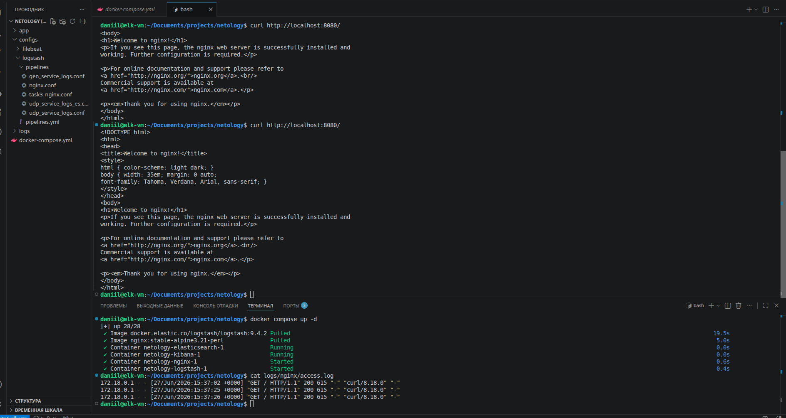

Для Logstash был создан pipeline `nginx_logs`.
Он читает access-лог Nginx из файла `/var/log/nginx/access.log`, разбирает строки лога с помощью `grok` и отправляет данные в `elasticsearch` в индекс `logs_nginx-*`.

Файл состоит из 3-х блоков:

`input` - чтение `access.log`
`filter` - разбор строки лога через `grok`
`output` - отправка данных в `elasticsearch`

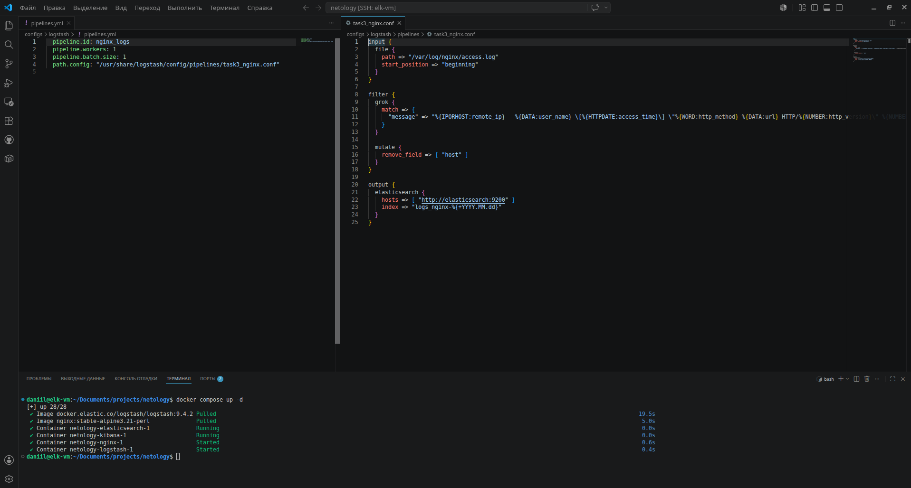

После настройки сервисы были запущены командой:

```bash
docker compose up -d
```

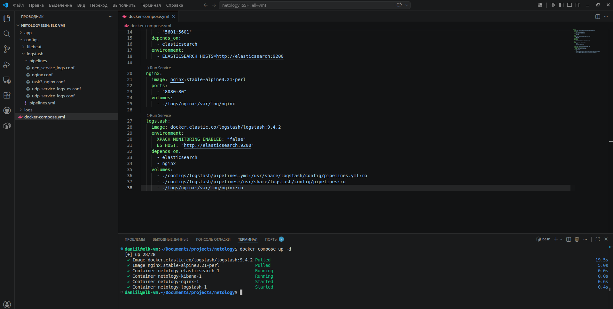

После обработки логов Logstash отправил данные в Elasticsearch.
В Kibana был создан Data View для индекса:

```text
logs_nginx*
```

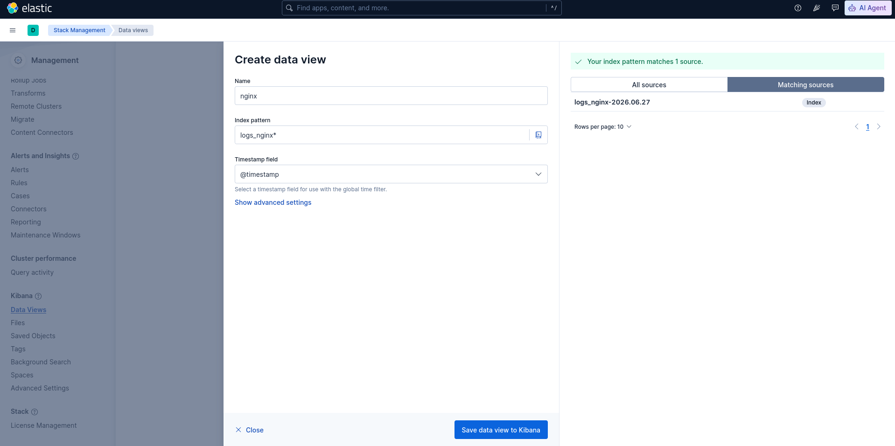

После этого в разделе Discover отображаются логи, записанные в файл `access.log`.

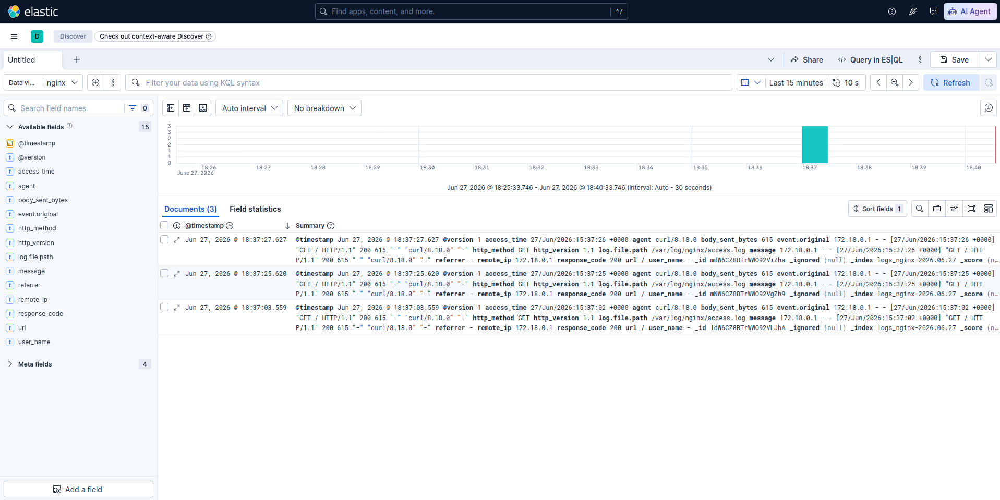

Был запущен, Logstash прочитал его access-лог, обработал записи и отправил их в Elasticsearch. В Kibana были отображены логи Nginx из индекса `logs_nginx-*`.

---

## Задание 4. Filebeat

### Условие

Установите и запустите Filebeat. Переключите поставку логов Nginx с Logstash на Filebeat.

*Приведите скриншот интерфейса Kibana, на котором видны логи Nginx, которые были отправлены через Filebeat.*

### Ход решения

Для выполнения задания был настроен Filebeat для чтения access-лога Nginx.

В файле `configs/filebeat/filebeat.yml` был настроен input для чтения файла:

```text
/var/log/nginx/access.log
```

Также был настроен output в Logstash:

```yaml
output.logstash:
  hosts: ["logstash:5044"]
```

Для приёма данных от Filebeat был изменён pipeline Logstash.
Вместо чтения файла через `input file` был настроен приём данных через `input beats`:

```text
input {
  beats {
    port => 5044
  }
}
```

Далее Logstash разбирает строки access-лога Nginx через `grok` и отправляет данные в Elasticsearch в индекс:

```text
filebeat-nginx-*
```

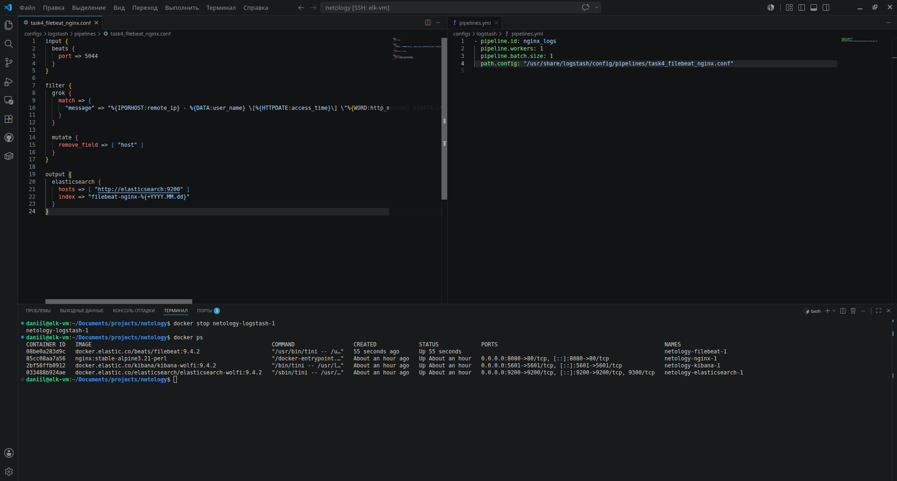

В `docker-compose.yml` был добавлен сервис `filebeat`, а для Logstash был открыт порт `5044`, на который Filebeat отправляет данные.

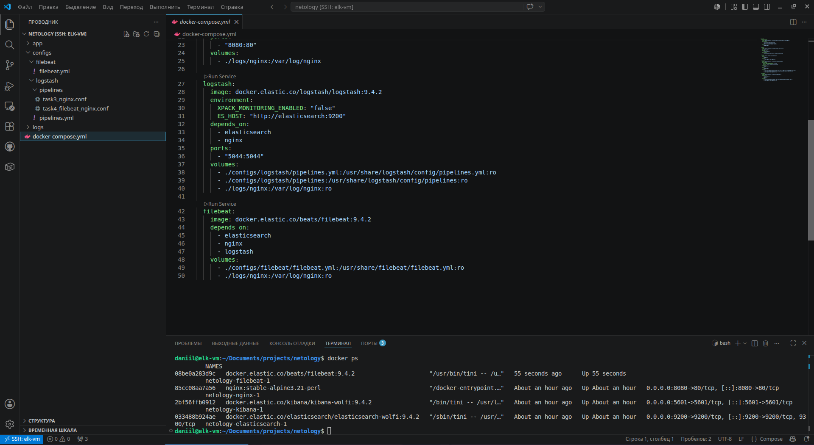

После запуска контейнеров были выполнены запрос к Nginx:

```bash
curl http://localhost:8080/
```

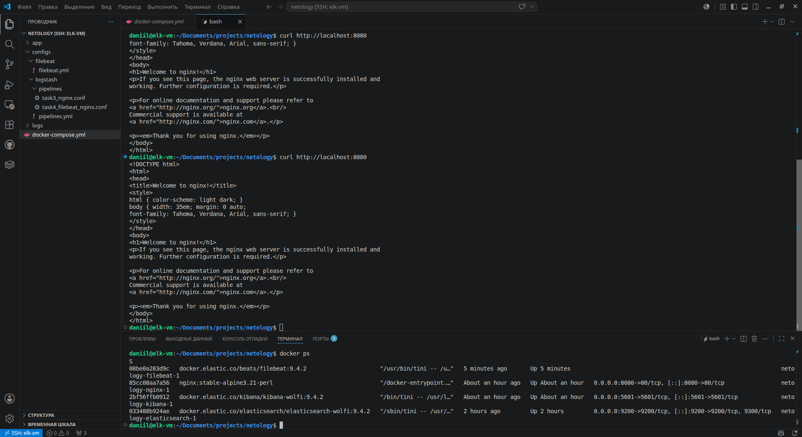

После обработки логов в Elasticsearch появился индекс с данными, отправленными через Filebeat.

```text
filebeat-nginx-*
```

В разделе Discover стали доступны документы с логами Nginx.

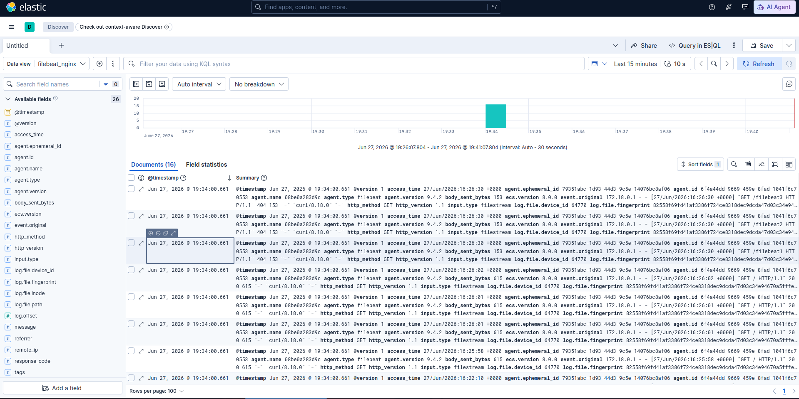

Таким образом, поставка логов Nginx была переключена на Filebeat. Filebeat читает access-лог Nginx, отправляет его в Logstash, после чего Logstash обрабатывает данные и записывает их в Elasticsearch.

---

## Задание 5*. Доставка данных

### Условие

Настройте поставку лога в Elasticsearch через Logstash и Filebeat любого другого сервиса , но не Nginx.
Для этого лог должен писаться на файловую систему, Logstash должен корректно его распарсить и разложить на поля.

*Приведите скриншот интерфейса Kibana, на котором будет виден этот лог и напишите лог какого приложения отправляется.*

### Ход решения

Для выполнения задания было использовано приложение, предоставленное преподавателем.

Приложение написано на Python и генерирует логи в файл `log_gen.log`.

[app](./app/main.py)

В `docker-compose.yml` был добавлен сервис приложения `app`, который запускает файл `main.py`.

```yaml
  app:
    build:
      context: ./app
      dockerfile: Dockerfile.dev
    volumes:
      - ./app:/app
    command: python main.py

```

Также был настроен `Filebeat`. Он читает лог приложения из файла `/var/log/app/log_gen.log` и отправляет данные в `Logstash` на порт `5044`.

```yml
filebeat.inputs:
  - type: filestream
    id: app-log
    enabled: true
    paths:
      - /var/log/app/log_gen.log

output.logstash:
  hosts: ["logstash:5044"]
```

В `Logstash` был создан `pipeline` для обработки логов приложения.

[task5_app_logs](./configs/logstash/pipelines/task5_app_logs.conf)

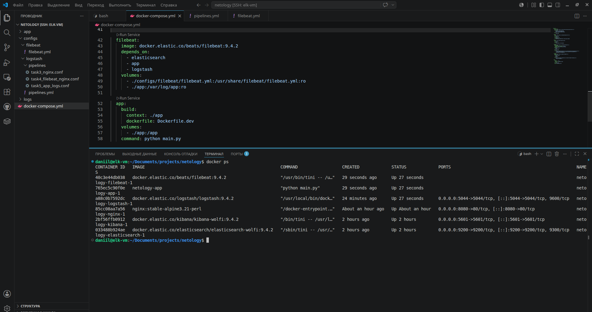

В Kibana был создан `Data View` для индекса `logs_app-*`.

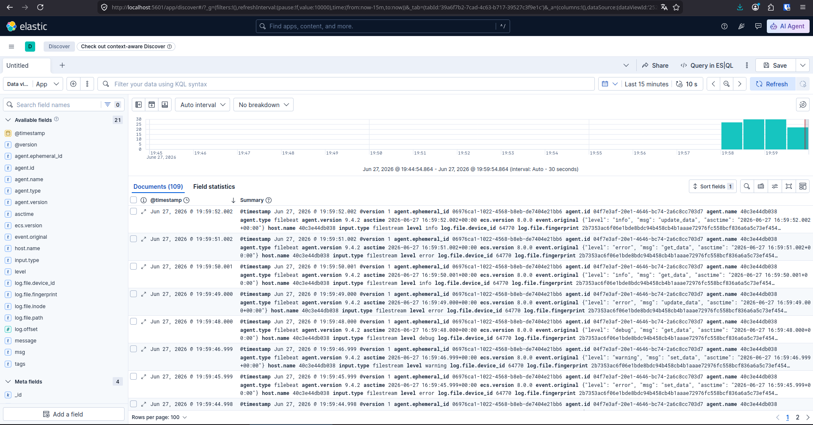

В разделе `Discover` стали доступны логи приложения.

Таким образом, была настроена поставка логов отдельного приложения. Логи приложения записываются в файл, передаются через `Filebeat` в `Logstash`, обрабатываются и сохраняются в `Elasticsearch`. В `Kibana` эти логи успешно отображаются.

---

**Список используемой литературы:**

- [Start a multi-node cluster with Docker Compose](https://www.elastic.co/docs/deploy-manage/deploy/self-managed/install-elasticsearch-docker-compose)
- [Install Kibana with Docker](https://www.elastic.co/docs/deploy-manage/deploy/self-managed/install-kibana-with-docker)
- [поднимаем elk в docker](https://www.elastic.co/guide/en/elasticsearch/reference/7.17/docker.html);
- [поднимаем elk в docker с filebeat и docker-логами](https://www.sarulabs.com/post/5/2019-08-12/sending-docker-logs-to-elasticsearch-and-kibana-with-filebeat.html);
- [конфигурируем logstash](https://www.elastic.co/guide/en/logstash/7.17/configuration.html);
- [плагины filter для logstash](https://www.elastic.co/guide/en/logstash/current/filter-plugins.html);
- [конфигурируем filebeat](https://www.elastic.co/guide/en/beats/libbeat/5.3/config-file-format.html);
- [привязываем индексы из elastic в kibana](https://www.elastic.co/guide/en/kibana/7.17/index-patterns.html);
- [как просматривать логи в kibana](https://www.elastic.co/guide/en/kibana/current/discover.html);
- [решение ошибки increase vm.max_map_count elasticsearch](https://stackoverflow.com/questions/42889241/how-to-increase-vm-max-map-count).

---
