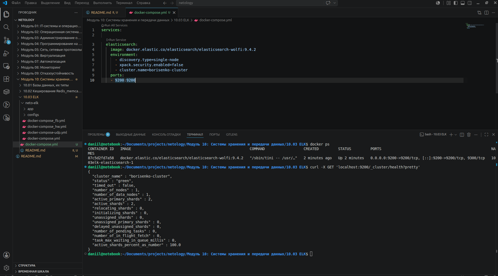
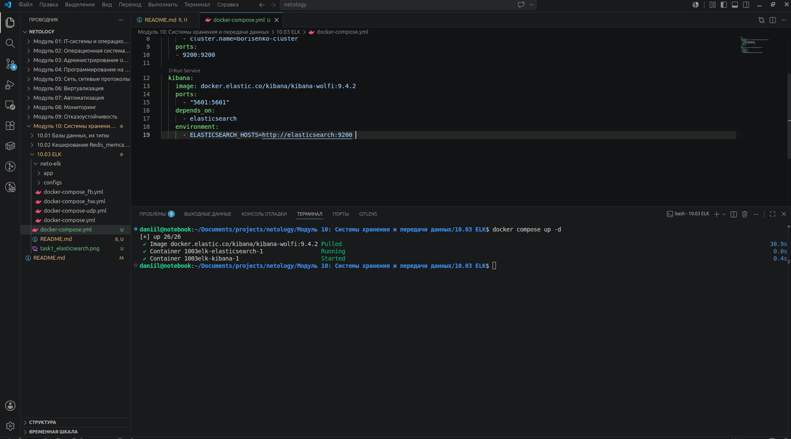
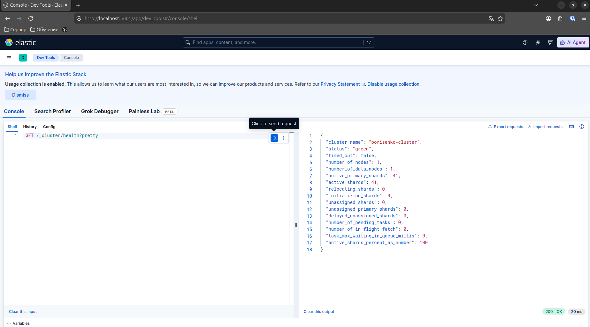

# Домашнее задание к занятию "10.03 ELK" - "Борисенко Даниил"

---

**Примечание**: если у вас недоступны официальные образы, можете найти альтернативные варианты в DockerHub, например, [такой](https://hub.docker.com/layers/bitnami/elasticsearch/7.17.13/images/sha256-8084adf6fa1cf24368337d7f62292081db721f4f05dcb01561a7c7e66806cc41?context=explore).

---

## Задание 1. Elasticsearch

### Условие

Установите и запустите Elasticsearch, после чего поменяйте параметр cluster_name на случайный.

*Приведите скриншот команды 'curl -X GET 'localhost:9200/_cluster/health?pretty', сделанной на сервере с установленным Elasticsearch. Где будет виден нестандартный cluster_name*.

### Ход решения

Для запуска Elasticsearch был использован Docker Compose по примеру из официальной документации Elastic.

В файле `docker-compose.yml` был описан сервис `elasticsearch`. В качестве образа использован официальный образ:

```text
docker.elastic.co/elasticsearch/elasticsearch-wolfi:9.4.2
```

В настройках контейнера были изменены параметры:

```text
- discovery.type=single-node
- xpack.security.enabled=false
- cluster.name=borisenko-cluster
```

**Где:**

`discovery.type=single-node` - параметр для запуска Elasticsearch в режиме одного узла.
`xpack.security.enabled=false` - параметр для запуска без авторизации и сертификатов.
`cluster.name=borisenko-cluster` - параметр, позволяющий задать нестандартное имя кластера.

Также был проброшен порт:

```text
- 9200:9200
```

После этого Elasticsearch был запущен командой:

```bash
docker compose up -d
```

Проверка состояния кластера выполнена командой:

```bash
curl -X GET 'localhost:9200/_cluster/health?pretty'
```

В результате видно, что Elasticsearch запущен, статус кластера `green`, а имя кластера изменено на `borisenko-cluster`.



---

## Задание 2. Kibana

### Условие

Установите и запустите Kibana.

*Приведите скриншот интерфейса Kibana на странице http://<ip вашего сервера>:5601/app/dev_tools#/console, где будет выполнен запрос GET /_cluster/health?pretty*.

### Ход решения

Для запуска Kibana в файл `docker-compose.yml` был добавлен сервис `kibana`.

В качестве образа был использован официальный образ Kibana:

```text
docker.elastic.co/kibana/kibana-wolfi:9.4.2
```

Для доступа к веб-интерфейсу Kibana был проброшен порт:

```text
- 5601:5601
```

Также была добавлена зависимость от Elasticsearch:

```text
depends_on:
  - elasticsearch
```

Для подключения Kibana к Elasticsearch был указан параметр:

```text
ELASTICSEARCH_HOSTS=http://elasticsearch:9200
```

После этого сервисы были запущены командой:

```bash
docker compose up -d
```



Проверка была выполнена в интерфейсе Kibana на странице Dev Tools.

В консоли был выполнен запрос:

```text
GET /_cluster/health?pretty
```

В результате видно, что Kibana подключена к Elasticsearch, кластер доступен, статус кластера `green`, а имя кластера — `borisenko-cluster`.



---

## Задание 3. Logstash

### Условие

Установите и запустите Logstash и Nginx. С помощью Logstash отправьте access-лог Nginx в Elasticsearch.

*Приведите скриншот интерфейса Kibana, на котором видны логи Nginx.*

### Ход решения

---

## Задание 4. Filebeat

### Условие

Установите и запустите Filebeat. Переключите поставку логов Nginx с Logstash на Filebeat.

*Приведите скриншот интерфейса Kibana, на котором видны логи Nginx, которые были отправлены через Filebeat.*

### Ход решения

---

## Задание 5*. Доставка данных

### Условие

Настройте поставку лога в Elasticsearch через Logstash и Filebeat любого другого сервиса , но не Nginx.
Для этого лог должен писаться на файловую систему, Logstash должен корректно его распарсить и разложить на поля.

*Приведите скриншот интерфейса Kibana, на котором будет виден этот лог и напишите лог какого приложения отправляется.*

### Ход решения

---

**Список используемой литературы:**

- [Start a multi-node cluster with Docker Compose](https://www.elastic.co/docs/deploy-manage/deploy/self-managed/install-elasticsearch-docker-compose)
- [Install Kibana with Docker](https://www.elastic.co/docs/deploy-manage/deploy/self-managed/install-kibana-with-docker)
- [поднимаем elk в docker](https://www.elastic.co/guide/en/elasticsearch/reference/7.17/docker.html);
- [поднимаем elk в docker с filebeat и docker-логами](https://www.sarulabs.com/post/5/2019-08-12/sending-docker-logs-to-elasticsearch-and-kibana-with-filebeat.html);
- [конфигурируем logstash](https://www.elastic.co/guide/en/logstash/7.17/configuration.html);
- [плагины filter для logstash](https://www.elastic.co/guide/en/logstash/current/filter-plugins.html);
- [конфигурируем filebeat](https://www.elastic.co/guide/en/beats/libbeat/5.3/config-file-format.html);
- [привязываем индексы из elastic в kibana](https://www.elastic.co/guide/en/kibana/7.17/index-patterns.html);
- [как просматривать логи в kibana](https://www.elastic.co/guide/en/kibana/current/discover.html);
- [решение ошибки increase vm.max_map_count elasticsearch](https://stackoverflow.com/questions/42889241/how-to-increase-vm-max-map-count).

---
