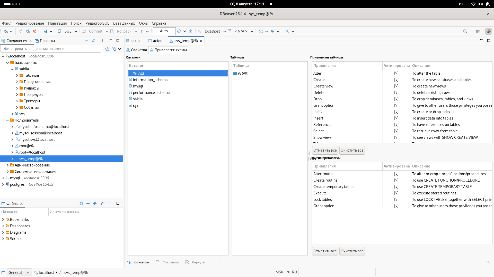
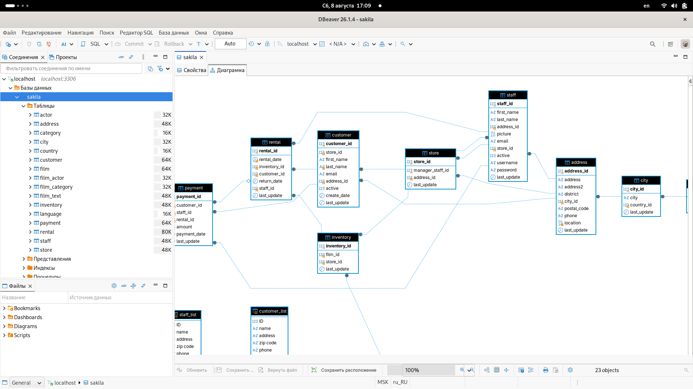
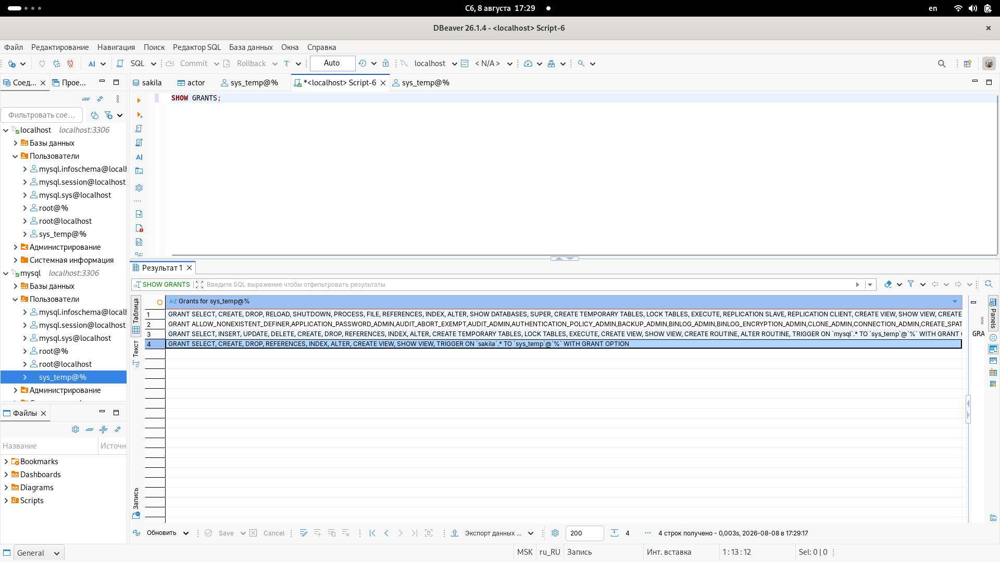

# Домашнее задание к занятию "11.02 Работа с данными (DDL/DML)" - "Борисенко Даниил"

---

## Задание 1

### Условие

1.1. Поднимите чистый инстанс MySQL версии 8.0+. Можно использовать локальный сервер или контейнер Docker.

1.2. Создайте учётную запись sys_temp.

1.3. Выполните запрос на получение списка пользователей в базе данных. (скриншот)

1.4. Дайте все права для пользователя sys_temp.

1.5. Выполните запрос на получение списка прав для пользователя sys_temp. (скриншот)

1.6. Переподключитесь к базе данных от имени sys_temp.

Для смены типа аутентификации с sha2 используйте запрос:

```sql
ALTER USER 'sys_test'@'localhost' IDENTIFIED WITH mysql_native_password BY 'password';
```

1.6. По ссылке https://downloads.mysql.com/docs/sakila-db.zip скачайте дамп базы данных.

1.7. Восстановите дамп в базу данных.

1.8. При работе в IDE сформируйте ER-диаграмму получившейся базы данных. При работе в командной строке используйте команду для получения всех таблиц базы данных. (скриншот)

*Результатом работы должны быть скриншоты обозначенных заданий, а также простыня со всеми запросами.*

### Ход решения

Для выполнения задания была запущена СУБД MySQL версии 8+ в Docker.

В DBeaver через графический интерфейс был создан пользователь `sys_temp` и ему были предоставлены права на все базы данных и таблицы.



После настройки прав было выполнено отдельное подключение к MySQL от имени пользователя `sys_temp`.

В DBeaver от имени пользователя `sys_temp` были последовательно выполнены два готовых SQL-скрипта:

- `sakila-schema.sql` — для создания структуры базы данных `sakila`;
- `sakila-data.sql` — для заполнения базы данных данными.

После выполнения скриптов в базе `sakila` появились таблицы и связи между ними.

Cредствами DBeaver была построена ER-диаграмма `sakila`.



---

## Задание 2

### Условие

Составьте таблицу, используя любой текстовый редактор или Excel, в которой должно быть два столбца: в первом должны быть названия таблиц восстановленной базы, во втором названия первичных ключей этих таблиц. Пример: (скриншот/текст)

```text
Название таблицы | Название первичного ключа
customer         | customer_id
```

### Ход решения

| Название таблицы | Первичный ключ |
|---|---|
| actor | actor_id |
| address | address_id |
| category | category_id |
| city | city_id |
| country | country_id |
| customer | customer_id |
| film | film_id |
| film_actor | actor_id, film_id |
| film_category | film_id, category_id |
| film_text | film_id |
| inventory | inventory_id |
| language | language_id |
| payment | payment_id |
| rental | rental_id |
| staff | staff_id |
| store | store_id |

---

## Задание 3*

### Условие

3.1. Уберите у пользователя sys_temp права на внесение, изменение и удаление данных из базы sakila.

3.2. Выполните запрос на получение списка прав для пользователя sys_temp. (скриншот)

### Ход решения

Через графический интерфейс DBeaver у пользователя `sys_temp` были отозваны права на внесение, изменение и удаление данных.

Были отключены привилегии:

- `INSERT`
- `UPDATE`
- `DELETE`

После изменения прав было выполнено переподключение от имени пользователя `sys_temp`.

Для проверки оставшихся прав был выполнен запрос:

```sql
SHOW GRANTS;
```



---
