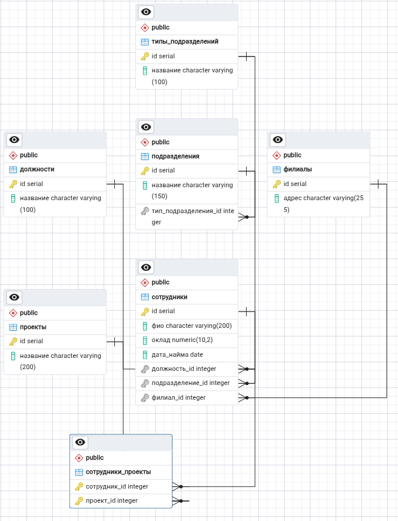

# Домашнее задание к занятию "11.01 Базы данных" - "Борисенко Даниил"
---

### Легенда

Заказчик передал вам [файл в формате Excel](./hw-12-1.xlsx), в котором сформирован отчёт. 

На основе этого отчёта нужно выполнить следующие задания.

### Задание 1

### Условие

Опишите не менее семи таблиц, из которых состоит база данных. Определите:

- какие данные хранятся в этих таблицах,
- какой тип данных у столбцов в этих таблицах, если данные хранятся в PostgreSQL.

Начертите схему полученной модели данных. Можете использовать онлайн-редактор: https://app.diagrams.net/

Этапы реализации:

1.	Внимательно изучите предоставленный вам файл с данными и подумайте, как можно сгруппировать данные по смыслу.
2.	Разбейте исходный файл на несколько таблиц и определите список столбцов в каждой из них. 
3.	Для каждого столбца подберите подходящий тип данных из PostgreSQL. 
4.	Для каждой таблицы определите первичный ключ (PRIMARY KEY).
5.	Определите типы связей между таблицами. 
6.	Начертите схему модели данных.

На схеме должны быть чётко отображены:

 - все таблицы с их названиями,
 - все столбцы  с указанием типов данных,
 - первичные ключи (они должны быть явно выделены),
 - линии, показывающие связи между таблицами.

**Результатом выполнения задания** должен стать скриншот получившейся схемы базы данных.

### Ход решения

Исходный Excel-файл содержит информацию о сотрудниках, должностях, подразделениях, филиалах и проектах.

Чтобы одинаковые данные не повторялись, таблица была разделена на 7 дополнительных таблиц.

### 1. Таблица `должности`

Хранит список должностей сотрудников.

```sql
CREATE TABLE должности (
    id SERIAL PRIMARY KEY,
    название VARCHAR(100) NOT NULL
);
```

- `id` — уникальный номер должности;
- `название` — название должности.

## 2. Таблица `типы_подразделений`

Хранит типы подразделений, например отдел, группа или департамент.

```sql
CREATE TABLE типы_подразделений (
    id SERIAL PRIMARY KEY,
    название VARCHAR(100) NOT NULL
);
```

- `id` — уникальный номер типа подразделения;
- `название` — название типа подразделения.

### 3. Таблица `подразделения`

Хранит названия структурных подразделений.

```sql
CREATE TABLE подразделения (
    id SERIAL PRIMARY KEY,
    название VARCHAR(150) NOT NULL,
    тип_подразделения_id INTEGER NOT NULL
        REFERENCES типы_подразделений(id)
);
```

- `id` — уникальный номер подразделения;
- `название` — название подразделения;
- `тип_подразделения_id` — ссылка на тип подразделения.

Связь:

```text
типы_подразделений.id
        ↓
подразделения.тип_подразделения_id
```

Один тип подразделения может относиться к нескольким подразделениям.

### 4. Таблица `филиалы`

Хранит адреса филиалов организации.

```sql
CREATE TABLE филиалы (
    id SERIAL PRIMARY KEY,
    адрес VARCHAR(255) NOT NULL
);
```

- `id` — уникальный номер филиала;
- `адрес` — полный адрес филиала.

Один филиал может быть связан с несколькими сотрудниками.

### 5. Таблица `проекты`

Хранит список проектов.

```sql
CREATE TABLE проекты (
    id SERIAL PRIMARY KEY,
    название VARCHAR(200) NOT NULL
);
```

- `id` — уникальный номер проекта;
- `название` — название проекта.

Один проект может быть назначен нескольким сотрудникам.

### 6. Таблица `сотрудники`

Хранит основные сведения о сотрудниках.

```sql
CREATE TABLE сотрудники (
    id SERIAL PRIMARY KEY,
    фио VARCHAR(200) NOT NULL,
    оклад NUMERIC(10, 2) NOT NULL,
    дата_найма DATE NOT NULL,
    должность_id INTEGER NOT NULL REFERENCES должности(id),
    подразделение_id INTEGER NOT NULL REFERENCES подразделения(id),
    филиал_id INTEGER NOT NULL REFERENCES филиалы(id)
);
```

- `id` — уникальный номер сотрудника;
- `фио` — фамилия, имя и отчество сотрудника;
- `оклад` — размер оклада;
- `дата_найма` — дата приёма на работу;
- `должность_id` — ссылка на должность;
- `подразделение_id` — ссылка на подразделение;
- `филиал_id` — ссылка на филиал.

Связи:

```text
должности.id
        ↓
сотрудники.должность_id

подразделения.id
        ↓
сотрудники.подразделение_id

филиалы.id
        ↓
сотрудники.филиал_id
```

Тип `NUMERIC(10, 2)` используется для точного хранения оклада с двумя знаками после запятой.

Тип `DATE` используется для хранения даты найма.

### 7. Таблица `сотрудники_проекты`

Связывает сотрудников с проектами.

```sql
CREATE TABLE сотрудники_проекты (
    сотрудник_id INTEGER REFERENCES сотрудники(id),
    проект_id INTEGER REFERENCES проекты(id),
    PRIMARY KEY (сотрудник_id, проект_id)
);
```

- `сотрудник_id` — ссылка на сотрудника;
- `проект_id` — ссылка на проект.

Первичный ключ состоит сразу из двух столбцов:

```sql
PRIMARY KEY (сотрудник_id, проект_id)
```

Это не позволяет дважды назначить одного сотрудника на один проект.

Таблица нужна для связи **многие ко многим**:

- один сотрудник может работать над несколькими проектами;
- над одним проектом могут работать несколько сотрудников.

---

# Связи между таблицами

В базе данных созданы следующие связи:

| Таблица 1 | Таблица 2 | Тип связи |
|---|---|---|
| `типы_подразделений` | `подразделения` | Один ко многим |
| `должности` | `сотрудники` | Один ко многим |
| `подразделения` | `сотрудники` | Один ко многим |
| `филиалы` | `сотрудники` | Один ко многим |
| `сотрудники` | `сотрудники_проекты` | Один ко многим |
| `проекты` | `сотрудники_проекты` | Один ко многим |

Между таблицами `сотрудники` и `проекты` создана связь **многие ко многим** через таблицу `сотрудники_проекты`.

# Итог

Исходный Excel-файл был разделён на семь таблиц:

1. `должности`;
2. `типы_подразделений`;
3. `подразделения`;
4. `филиалы`;
5. `проекты`;
6. `сотрудники`;
7. `сотрудники_проекты`.

Для каждой таблицы определён первичный ключ. Между таблицами созданы внешние ключи и связи.

Ниже представлена ER-диаграмма полученной базы данных.



### Задание 2*

1. Разверните СУБД Postgres на своей хостовой машине, на виртуальной машине или в контейнере docker.
2. Опишите схему, полученную в предыдущем задании, с помощью скрипта SQL.
3. Создайте в вашей полученной СУБД новую базу данных и выполните полученный ранее скрипт для создания вашей модели данных.

В качестве решения приложите SQL скрипт и скриншот диаграммы.

Для написания и редактирования sql удобно использовать  специальный инструмент dbeaver.

---
