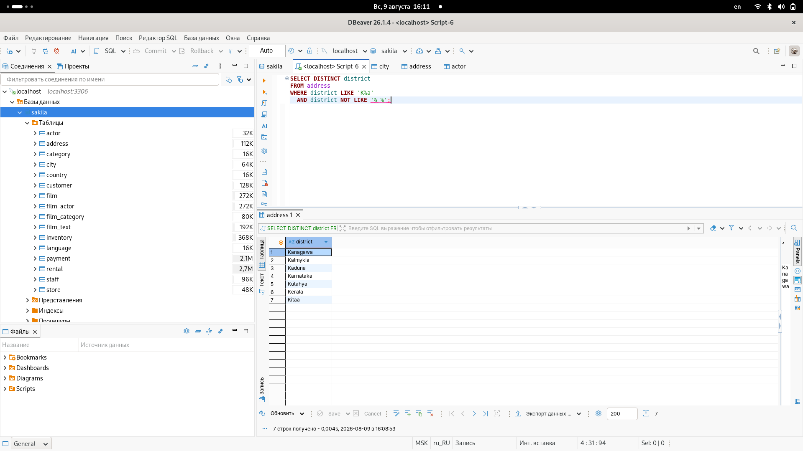
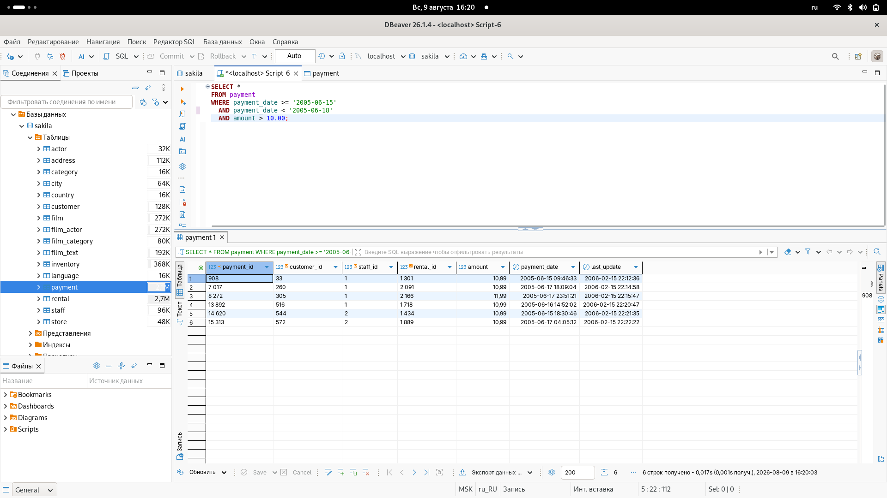
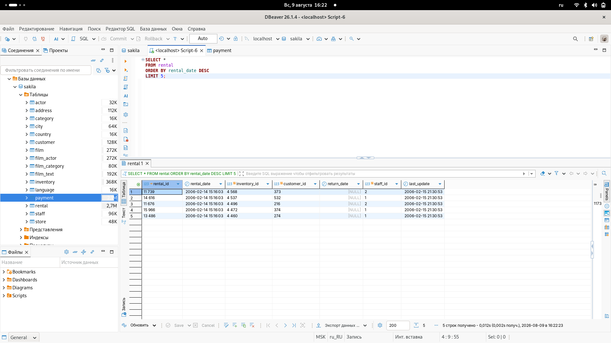
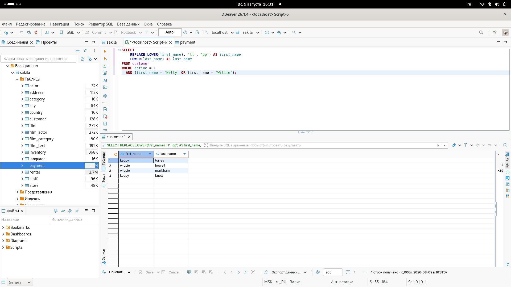

# Домашнее задание к занятию "11.03 SQL. Часть 1" - "Борисенко Даниил"

---

## Задание 1

### Условие

Получите уникальные названия районов из таблицы с адресами, которые начинаются на “K” и заканчиваются на “a” и не содержат пробелов.

### Ход решения

Для получения уникальных значений используется `DISTINCT`.

Оператором `LIKE 'K%a'` выбирал районы, название которых начинается на `K` и заканчивается на `a`.

Для того, чтобы исключить пробелы в названиях - использовал оператор `NOT LIKE '% %'`.

```sql
SELECT DISTINCT district
FROM address
WHERE district LIKE 'K%a'
  AND district NOT LIKE '% %';
```



---

## Задание 2

### Условие

Получите из таблицы платежей за прокат фильмов информацию по платежам, которые выполнялись в промежуток с 15 июня 2005 года по 18 июня 2005 года **включительно** и стоимость которых превышает 10.00.

### Ход решения

Для выбора платежей использовал условие `WHERE`.

```sql
SELECT *
FROM payment
WHERE payment_date >= '2005-06-15'
  AND payment_date < '2005-06-19'
  AND amount > 10.00;
```



---

## Задание 3

### Условие

Получите последние пять аренд фильмов.

### Ход решения

Для сортировки аренд по дате использовал оператор `ORDER BY`.

Параметр `DESC` сортирует записи от самой новой к самой старой.

`LIMIT 5` ограничивает результат до 5-ти записей.

```sql
SELECT *
FROM rental
ORDER BY rental_date DESC
LIMIT 5;
```



---

## Задание 4

### Условие

Одним запросом получите активных покупателей, имена которых Kelly или Willie.

Сформируйте вывод в результат таким образом:

- все буквы в фамилии и имени из верхнего регистра переведите в нижний регистр,
- замените буквы 'll' в именах на 'pp'.

### Ход решения

```sql
SELECT
    REPLACE(LOWER(first_name), 'll', 'pp') AS first_name,
    LOWER(last_name) AS last_name
FROM customer
WHERE active = 1
  AND (first_name = 'Kelly' OR first_name = 'Willie');
```

`LOWER()` переводит текст в нижний регистр.

`REPLACE()` заменяет `ll` на `pp`.

`active = 1` оставляет только активных покупателей.



---

## Задание 5*

### Условие

Выведите Email каждого покупателя, разделив значение Email на две отдельных колонки: в первой колонке должно быть значение, указанное до @, во второй — значение, указанное после @.

### Ход решения

---

## Задание 6*

### Условие

Доработайте запрос из предыдущего задания, скорректируйте значения в новых колонках: первая буква должна быть заглавной, остальные — строчными.

### Ход решения

---
