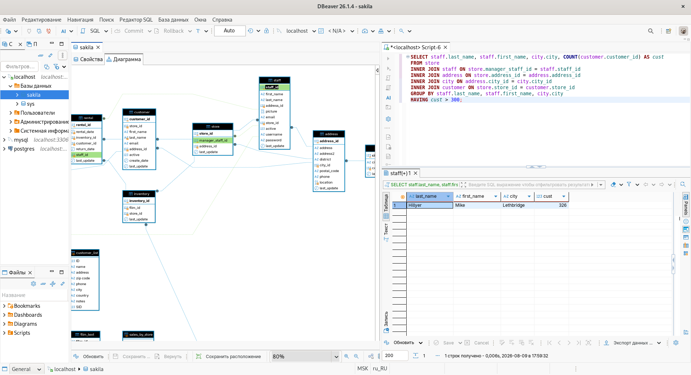
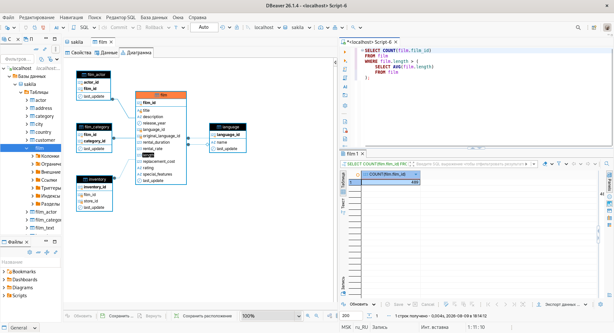
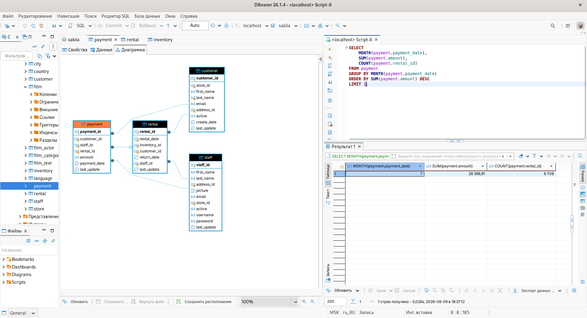
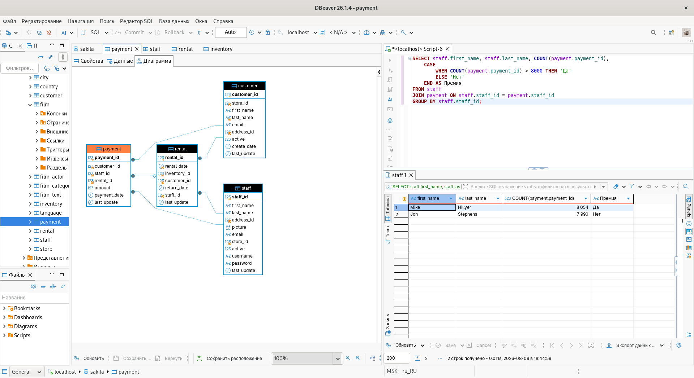
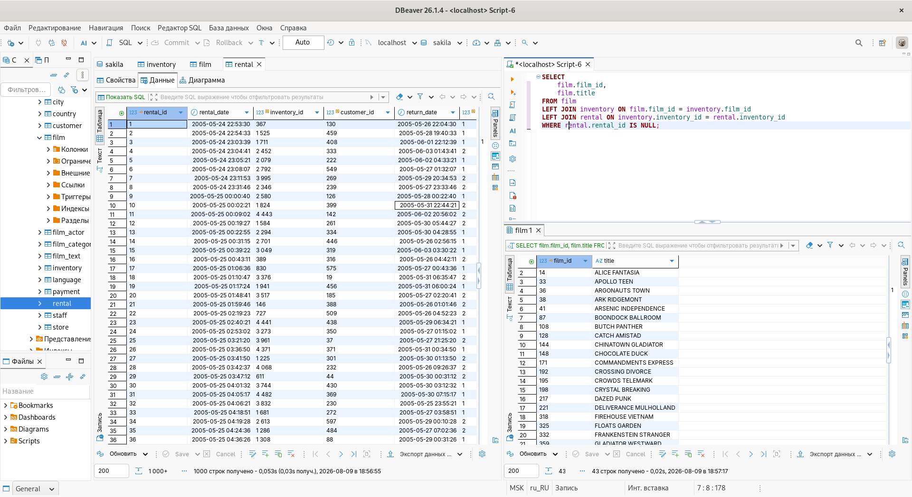

# Домашнее задание к занятию "11.04 Расширенные возможности SQL" - "Борисенко Даниил"

## Задание 1

### Условие

Одним запросом получите информацию о магазине, в котором обслуживается более 300 покупателей, и выведите в результат следующую информацию:

- фамилия и имя сотрудника из этого магазина;
- город нахождения магазина;
- количество пользователей, закреплённых в этом магазине.

### Ход решения

Для выполнения задания я объединил таблицы `store`, `staff`, `address`, `city` и `customer`.

С помощью `COUNT()` посчитал количество покупателей в магазине, а `GROUP BY` использовал для группировки данных по сотруднику и городу.

Через `HAVING` оставил только магазин, в котором больше 300 покупателей.

```sql
SELECT staff.last_name, staff.first_name, city.city, COUNT(customer.customer_id) AS cust
FROM store
INNER JOIN staff ON store.manager_staff_id = staff.staff_id
INNER JOIN address ON store.address_id = address.address_id
INNER JOIN city ON address.city_id = city.city_id
INNER JOIN customer ON store.store_id = customer.store_id
GROUP BY staff.last_name, staff.first_name, city.city
HAVING cust > 300;
```



---

## Задание 2

### Условие

Получите количество фильмов, продолжительность которых больше средней продолжительности всех фильмов.

### Ход решения

Для выполнения задания сначала с помощью подзапроса и `AVG()` получаю среднюю продолжительность всех фильмов.

Затем выбираю фильмы, продолжительность которых больше среднего значения, и с помощью `COUNT()` считаю их количество.

В результате получено **489 фильмов**.

```sql
SELECT COUNT(film.film_id)
FROM film
WHERE film.length > (
    SELECT AVG(film.length)
    FROM film
);
```



---

## Задание 3

### Условие

Получите информацию, за какой месяц была получена наибольшая сумма платежей, и добавьте информацию по количеству аренд за этот месяц.

### Ход решения

Сгруппировал платежи по месяцам.

С помощью `SUM()` посчитал сумму платежей, а с помощью `COUNT()` — количество аренд.

Отсортировал результат по сумме платежей и получил месяц с наибольшей суммой.



---

## Задание 4*

### Условие

Посчитайте количество продаж, выполненных каждым продавцом. Добавьте вычисляемую колонку «Премия». Если количество продаж превышает 8000, то значение в колонке будет «Да», иначе должно быть значение «Нет».

### Ход решения

С помощью `COUNT()` посчитал количество продаж каждого продавца.

Для проверки количества продаж использовал `CASE`:
если продаж больше 8000 — выводится `Да`, иначе — `Нет`.

```sql
SELECT staff.first_name, staff.last_name, COUNT(payment.payment_id),
    CASE
        WHEN COUNT(payment.payment_id) > 8000 THEN 'Да'
        ELSE 'Нет'
    END AS Премия
FROM staff
JOIN payment ON staff.staff_id = payment.staff_id
GROUP BY staff.staff_id;
```



---

## Задание 5*

### Условие

Найдите фильмы, которые ни разу не брали в аренду.

### Ход решения

Для поиска фильмов, которые ни разу не брали в аренду, использовал `LEFT JOIN`.

Сначала соединил таблицу `film` с таблицей `inventory` по `film_id`, чтобы получить экземпляры каждого фильма.

Затем таблицу `inventory` соединил с таблицей `rental` по `inventory_id`, чтобы проверить, были ли эти экземпляры в аренде.

`LEFT JOIN` оставляет в результате все фильмы, даже если для них нет записи в таблице `rental`.

```sql
SELECT
    film.film_id,
    film.title
FROM film
LEFT JOIN inventory ON film.film_id = inventory.film_id
LEFT JOIN rental ON inventory.inventory_id = rental.inventory_id
WHERE rental.rental_id IS NULL;
```



---
