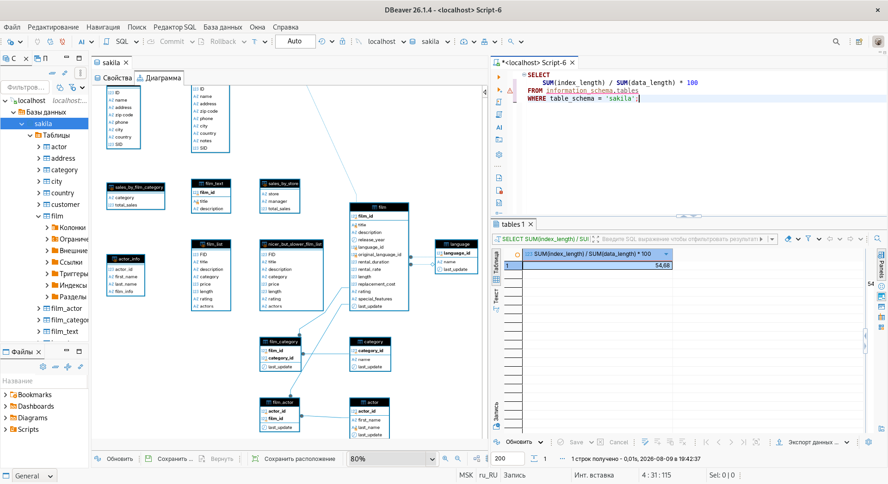

# Домашнее задание к занятию "11.05 Индексы" - "Борисенко Даниил"

---

## Задание 1

### Условие

Напишите запрос к учебной базе данных, который вернёт процентное отношение общего размера всех индексов к общему размеру всех таблиц.

### Ход решения

Из `information_schema.tables` получил размеры таблиц и индексов базы `sakila`.

С помощью `SUM()` посчитал общий размер индексов и общий размер данных таблиц.

Затем разделил размер индексов на размер таблиц и умножил результат на 100, чтобы получить процентное отношение.

```sql
SELECT
    SUM(index_length) / SUM(data_length) * 100
FROM information_schema.tables
WHERE table_schema = 'sakila';
```



---

## Задание 2

### Условие

Выполните explain analyze следующего запроса:

```sql
select distinct concat(c.last_name, ' ', c.first_name), sum(p.amount) over (partition by c.customer_id, f.title)
from payment p, rental r, customer c, inventory i, film f
where date(p.payment_date) = '2005-07-30' and p.payment_date = r.rental_date and r.customer_id = c.customer_id and i.inventory_id = r.inventory_id
```

- перечислите узкие места;
- оптимизируйте запрос: внесите корректировки по использованию операторов, при необходимости добавьте индексы.

### Ход решения

Сначала выполнил исходный запрос с помощью `EXPLAIN ANALYZE`.

```sql
EXPLAIN ANALYZE
SELECT DISTINCT
    CONCAT(c.last_name, ' ', c.first_name),
    SUM(p.amount) OVER (PARTITION BY c.customer_id, f.title)
FROM payment p, rental r, customer c, inventory i, film f
WHERE DATE(p.payment_date) = '2005-07-30'
    AND p.payment_date = r.rental_date
    AND r.customer_id = c.customer_id
    AND i.inventory_id = r.inventory_id;
```

По результату анализа исходный запрос выполнялся примерно за **3,68 секунды**.

Основным узким местом было отсутствие связи между таблицами `inventory` и `film`. Из-за этого обрабатывалось около **642 000 строк**.

Также `DATE()` применялась непосредственно к `payment_date`, из-за чего поиск по дате можно было выполнить эффективнее.

В запрос внёс минимальные изменения:

- добавил связь `i.film_id = f.film_id`;
- заменил `DATE(payment_date)` на диапазон дат.

```sql
EXPLAIN ANALYZE
SELECT DISTINCT
    CONCAT(c.last_name, ' ', c.first_name),
    SUM(p.amount) OVER (PARTITION BY c.customer_id, f.title)
FROM payment p, rental r, customer c, inventory i, film f
WHERE p.payment_date >= '2005-07-30'
    AND p.payment_date < '2005-07-31'
    AND p.payment_date = r.rental_date
    AND r.customer_id = c.customer_id
    AND i.inventory_id = r.inventory_id
    AND i.film_id = f.film_id;
```

После оптимизации количество обрабатываемых строк значительно уменьшилось, а время выполнения составило примерно **8 мс** вместо **3,68 секунды**.

Дополнительно создал индекс для поля `payment_date`:

```sql
CREATE INDEX idx_payment_date
ON payment(payment_date);
```

Проверил его наличие:

```sql
SHOW INDEX FROM payment;
```

В результате появился индекс `idx_payment_date` для столбца `payment_date`.

---

## Задание 3*

### Условие

Самостоятельно изучите, какие типы индексов используются в PostgreSQL. Перечислите те индексы, которые используются в PostgreSQL, а в MySQL — нет.

*Приведите ответ в свободной форме.*

### Ход решения

В PostgreSQL используются следующие основные типы индексов:

- `B-tree`
- `Hash`
- `GiST`
- `SP-GiST`
- `GIN`
- `BRIN`

Из них в MySQL отсутствуют следующие типы индексов:

- `GiST` — используется для различных сложных типов данных и операций, например геометрических данных;
- `SP-GiST` — используется для специализированных структур данных, например деревьев и пространственных данных;
- `GIN` — инвертированный индекс, удобен для массивов, полнотекстового поиска и составных значений;
- `BRIN` — хранит информацию о диапазонах блоков и хорошо подходит для больших таблиц с упорядоченными данными.

---
