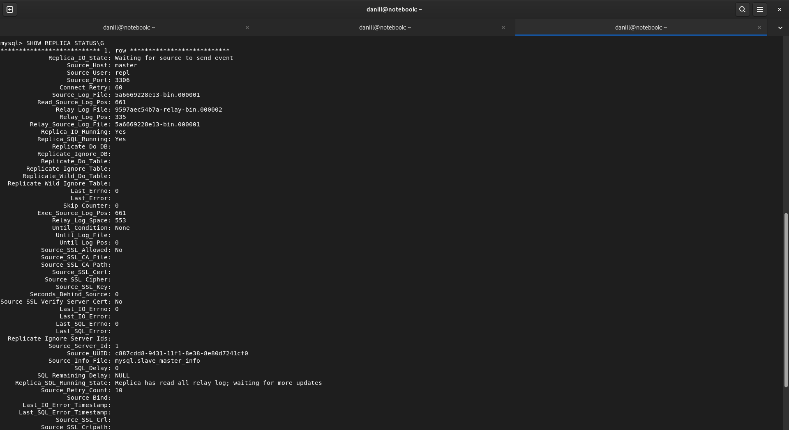
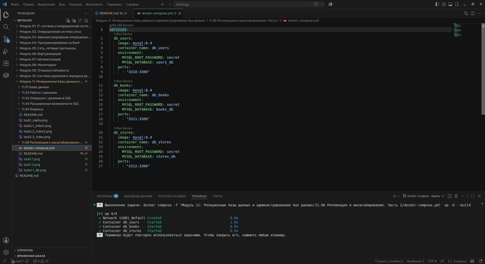
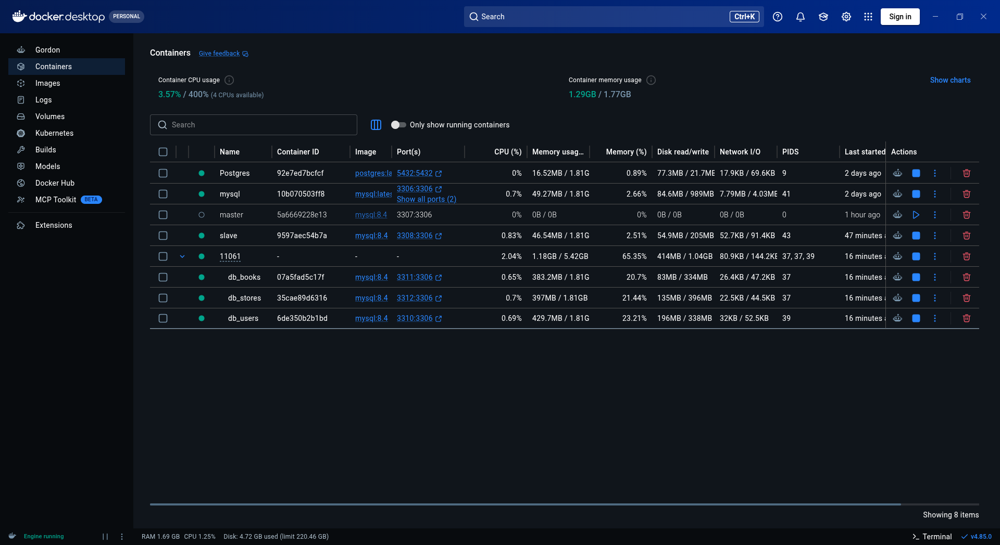
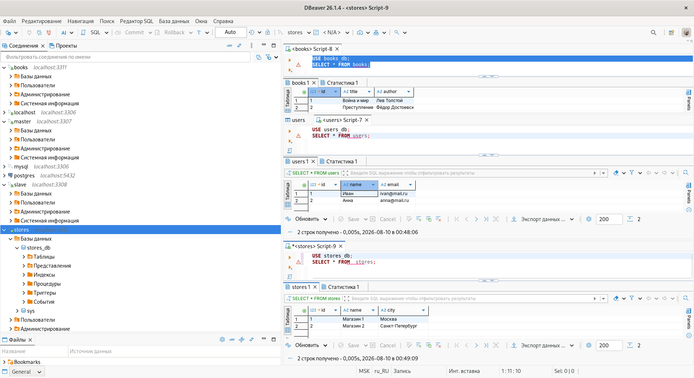

# Домашнее задание к занятию "11.06 Репликация и масштабирование" - "Борисенко Даниил"

---

## Задание 1

### Условие

Выполнить настройку master-slave репликации и приложить скриншоты конфигурации, состояния и работы серверов.

### Ход решения

Для выполнения задания поднял два отдельных сервера MySQL в Docker:

- `master` — основной сервер;
- `slave` — сервер-реплика.

Сначала создал отдельную Docker-сеть для связи контейнеров:

```bash
docker network create replication
```

После этого запустил два контейнера MySQL с помощью `docker run` и подключил их к сети `replication`.

Для контейнеров использовал разные внешние порты:

```text
3307 - master
3308 - slave
```

Конфигурационные файлы `my.cnf` редактировал через Docker Desktop.

На master указал:

```ini
[mysqld]
server_id=1
mysql_native_password=ON
```

На slave:

```ini
[mysqld]
server_id=2
# read_only=ON
super_read_only=1
mysql_native_password=ON
```

Таким образом, серверы получили разные `server-id`, а slave был переведён в режим только для чтения.

На master создал отдельного пользователя для репликации:

```sql
CREATE USER 'repl'@'%' IDENTIFIED BY 'password';

GRANT REPLICATION SLAVE ON *.* TO 'repl'@'%';

```

Далее на master получил имя текущего бинарного журнала и его позицию:

```sql
SHOW BINARY LOG STATUS;
```

После этого на slave указал master как источник репликации:

```sql
CHANGE REPLICATION SOURCE TO
    SOURCE_HOST='master',
    SOURCE_USER='repl',
    SOURCE_PASSWORD='password',
    SOURCE_LOG_FILE='5a6669228e13-bin.000001',
    SOURCE_LOG_POS=661;
```

Запустил репликацию:

```sql
START REPLICA;
```

Для проверки состояния использовал:

```sql
SHOW REPLICA STATUS\G
```

В результате получил:

```text
Replica_IO_Running: Yes
Replica_SQL_Running: Yes
```

Для проверки работы репликации на master создал базу `new_db` и таблицу `users`.

После обновления подключения в DBeaver база `new_db` и таблица `users` появились и на slave, что подтверждает успешную передачу изменений с master на реплику.

.png>)



---

## Задание 2

### Условие

Разработайте план для выполнения горизонтального и вертикального шаринга базы данных. База данных состоит из трёх таблиц:

- пользователи,
- книги,
- магазины (столбцы произвольно).

Опишите принципы построения системы и их разграничение или разбивку между базами данных.

*Пришлите блоксхему, где и что будет располагаться. Опишите, в каких режимах будут работать сервера.*

### Ход решения

Для базы данных с таблицами `users`, `books` и `stores` можно использовать вертикальный и горизонтальный шардинг.

При вертикальном шардинге разные таблицы располагаются на разных серверах.

В моём варианте:

- сервер `db_users` хранит таблицу `users`;
- сервер `db_books` хранит таблицу `books`;
- сервер `db_stores` хранит таблицу `stores`.

Каждый сервер работает независимо и обрабатывает запросы только к своей части данных.

Преимущество такого разделения — нагрузка от разных таблиц распределяется между несколькими серверами.

При горизонтальном шардинге структура таблиц остаётся одинаковой, но строки распределяются между несколькими серверами.

Например, данные можно разделить по `id`:

- `shard_1` — записи с `id` от 1 до 500000;
- `shard_2` — записи с `id` больше 500000.

В таком варианте оба сервера работают в активном режиме. Приложение определяет, на какой сервер отправить запрос, исходя из значения `id`.

Таким образом:

**вертикальный шардинг** разделяет базу по таблицам, а **горизонтальный шардинг** — по строкам внутри одинаковых таблиц.

---

## Задание 3*

### Условие

Опишите основные преимущества использования масштабирования методами:

- активный master-сервер и пассивный репликационный slave-сервер;
- master-сервер и несколько slave-серверов;
- активный сервер со специальным механизмом репликации — distributed replicated block device (DRBD);
- SAN-кластер.

*Дайте ответ в свободной форме.*

### Ход решения

**Активный master и пассивный slave**

Основное преимущество — повышение отказоустойчивости. Все изменения выполняются на master и передаются на slave.

**Master и несколько slave**

Позволяет распределить нагрузку на чтение между несколькими серверами. Запись выполняется на master, а запросы на чтение можно отправлять на разные slave-серверы. Также наличие нескольких копий данных повышает отказоустойчивость.

**DRBD**

DRBD выполняет репликацию данных на уровне блочного устройства. Данные диска одного сервера копируются на другой сервер. Основное преимущество — наличие практически идентичной копии хранилища, которую можно использовать при отказе основного сервера.

**SAN-кластер**

SAN позволяет нескольким серверам использовать централизованное сетевое хранилище. При отказе одного сервера другой сервер может продолжить работу с теми же данными.

Основные преимущества SAN-кластера — централизованное хранение данных, высокая доступность и возможность переключения между серверами.

---

### Задание 4*

### Условие

Выполните настройку выбранных методов шардинга из задания 2.

*Пришлите конфиг Docker и SQL скрипт с командами для базы данных*.

### Ход решения

Для практической реализации выбрал **вертикальный шардинг**.

В моём случае данные разделены следующим образом:

- `db_users` — сервер с пользователями;
- `db_books` — сервер с книгами;
- `db_stores` — сервер с магазинами.

Для каждого сервера использовал отдельный контейнер MySQL.


Для запуска серверов создал файл `docker-compose.yml`:

```yaml
services:
  db_users:
    image: mysql:8.4
    container_name: db_users
    environment:
      MYSQL_ROOT_PASSWORD: secret
      MYSQL_DATABASE: users_db
    ports:
      - "3310:3306"

  db_books:
    image: mysql:8.4
    container_name: db_books
    environment:
      MYSQL_ROOT_PASSWORD: secret
      MYSQL_DATABASE: books_db
    ports:
      - "3311:3306"

  db_stores:
    image: mysql:8.4
    container_name: db_stores
    environment:
      MYSQL_ROOT_PASSWORD: secret
      MYSQL_DATABASE: stores_db
    ports:
      - "3312:3306"
```

Контейнеры запустил командой:

```bash
docker compose up -d
```

После запуска Docker создал три отдельных контейнера:

```text
db_users  → localhost:3310
db_books  → localhost:3311
db_stores → localhost:3312
```



В Docker Desktop проверил состояние контейнеров. Все три сервера успешно запущены и работают независимо друг от друга.



На сервере `db_users` была создана база `users_db`.

В ней создал таблицу `users`:

```sql
USE users_db;

CREATE TABLE users (
    id BIGINT PRIMARY KEY AUTO_INCREMENT,
    name VARCHAR(100),
    email VARCHAR(100)
);
```

Для проверки добавил несколько записей:

```sql
INSERT INTO users (name, email)
VALUES
    ('Иван', 'ivan@mail.ru'),
    ('Анна', 'anna@mail.ru');
```

Проверил содержимое:

```sql
SELECT * FROM users;
```

На сервере `db_books` использовал отдельную базу `books_db`.

Создал таблицу:

```sql
USE books_db;

CREATE TABLE books (
    id BIGINT PRIMARY KEY AUTO_INCREMENT,
    title VARCHAR(150),
    author VARCHAR(100)
);
```

Добавил тестовые данные:

```sql
INSERT INTO books (title, author)
VALUES
    ('Война и мир', 'Лев Толстой'),
    ('Преступление и наказание', 'Фёдор Достоевский');
```

Проверил данные:

```sql
SELECT * FROM books;
```

На сервере `db_stores` использовал базу `stores_db`.

Создал таблицу:

```sql
USE stores_db;

CREATE TABLE stores (
    id BIGINT PRIMARY KEY AUTO_INCREMENT,
    name VARCHAR(100),
    city VARCHAR(100)
);
```

Добавил тестовые данные:

```sql
INSERT INTO stores (name, city)
VALUES
    ('Магазин 1', 'Москва'),
    ('Магазин 2', 'Санкт-Петербург');
```

Проверил содержимое:

```sql
SELECT * FROM stores;
```

К каждому серверу подключился отдельно через DBeaver:

```text
db_users  → localhost:3310
db_books  → localhost:3311
db_stores → localhost:3312
```

После подключения проверил данные во всех трёх таблицах.

На сервере пользователей находятся только данные таблицы `users`, на сервере книг — таблица `books`, а на сервере магазинов — таблица `stores`.



---
