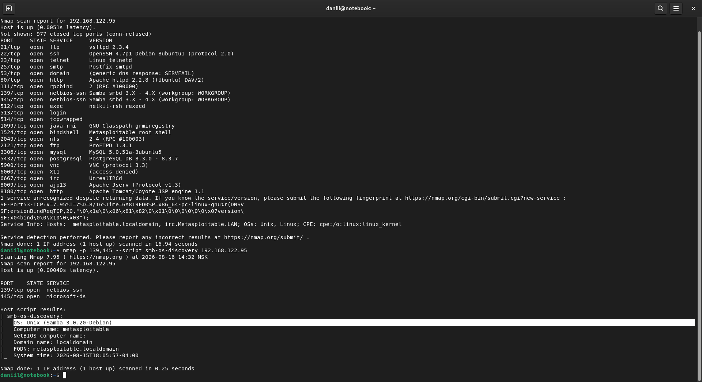
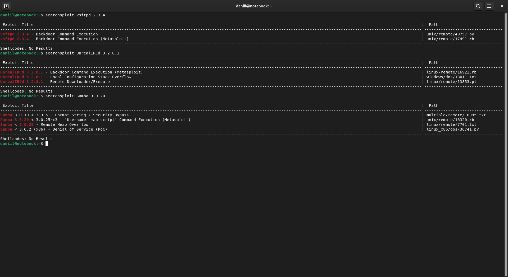
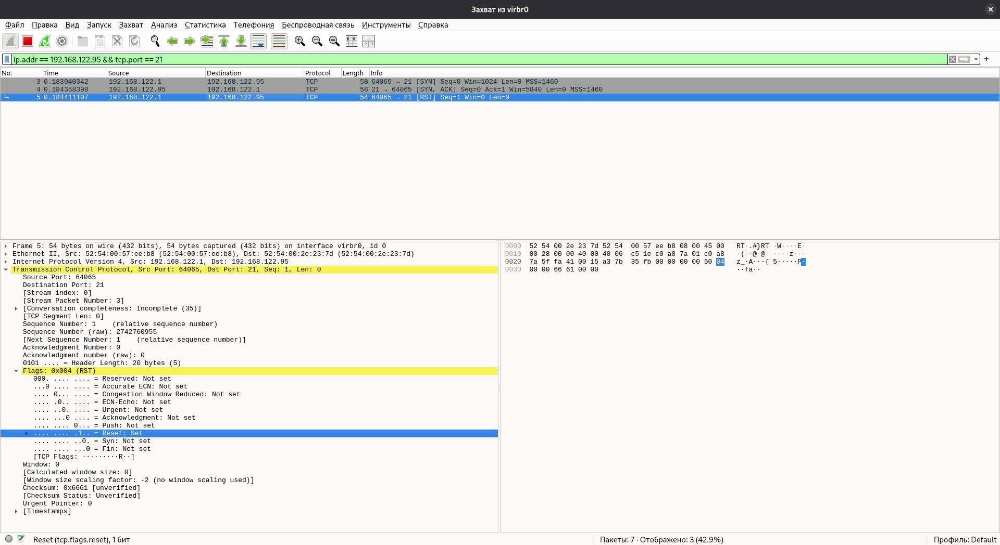
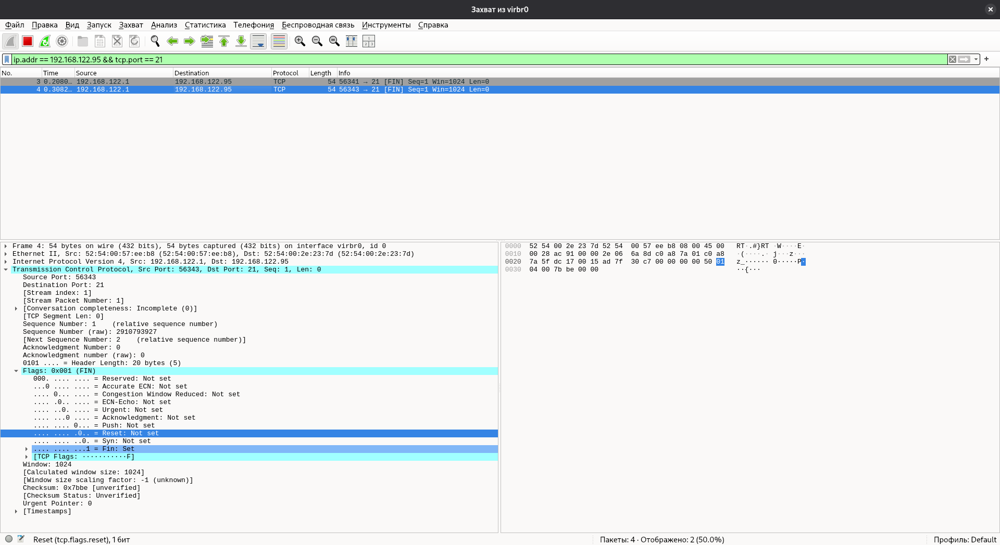
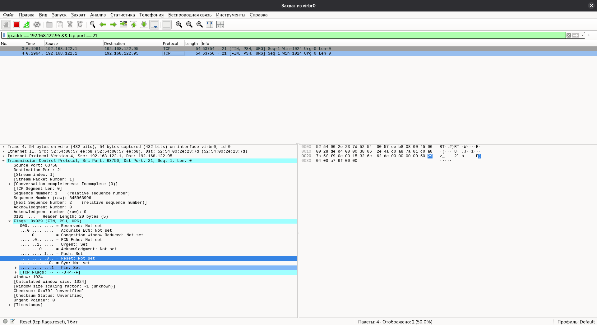
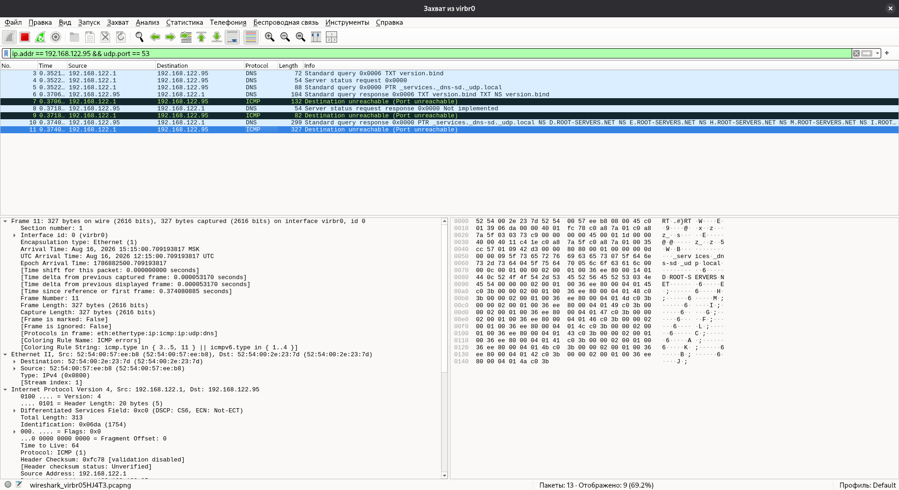

# Домашнее задание к занятию "12.01 Уязвимости и атаки на информационные системы" - "Борисенко Даниил"

---

## Задание 1

### Условие

Скачайте и установите виртуальную машину Metasploitable: https://sourceforge.net/projects/metasploitable/.

Это типовая ОС для экспериментов в области информационной безопасности, с которой следует начать при анализе уязвимостей.

Просканируйте эту виртуальную машину, используя **nmap**.

Попробуйте найти уязвимости, которым подвержена эта виртуальная машина.

Сами уязвимости можно поискать на сайте https://www.exploit-db.com/.

Для этого нужно в поиске ввести название сетевой службы, обнаруженной на атакуемой машине, и выбрать подходящие по версии уязвимости.

Ответьте на следующие вопросы:

- Какие сетевые службы в ней разрешены?
- Какие уязвимости были вами обнаружены? (список со ссылками: достаточно трёх уязвимостей)
  
*Приведите ответ в свободной форме.*

### Ход решения

Для выполнения задания была запущена виртуальная машина Metasploitable.  
IP-адрес виртуальной машины: `192.168.122.95`.

Для определения доступных сетевых служб и их версий было выполнено сканирование с помощью `nmap`:

```bash
nmap -sV 192.168.122.95
```

Для уточнения версии Samba дополнительно был использован скрипт `smb-os-discovery`:

```bash
nmap -p 139,445 --script smb-os-discovery 192.168.122.95
```

В результате была определена версия:

```text
Samba 3.0.20-Debian
```



Для поиска известных уязвимостей использовалась локальная база Exploit-DB через утилиту `searchsploit`:

```bash
searchsploit "vsftpd 2.3.4"
searchsploit "UnrealIRCd 3.2.8.1"
searchsploit "Samba 3.0.20"
```

Были найдены следующие уязвимости:

1. **vsftpd 2.3.4 — Backdoor Command Execution**  
   Позволяет выполнить команды через бэкдор в уязвимой версии vsftpd.  
   Exploit-DB: https://www.exploit-db.com/exploits/49757

2. **UnrealIRCd 3.2.8.1 — Backdoor Command Execution**  
   Уязвимость связана с наличием бэкдора и позволяет удалённо выполнять команды.  
   Exploit-DB: https://www.exploit-db.com/exploits/16922

3. **Samba 3.0.20 — Username map script Command Execution**  
   Уязвимость позволяет удалённо выполнить команды через механизм `username map script`.  
   Exploit-DB: https://www.exploit-db.com/exploits/16320



---

## Задание 2

### Условие

Проведите сканирование Metasploitable в режимах SYN, FIN, Xmas, UDP.

Запишите сеансы сканирования в Wireshark.

Ответьте на следующие вопросы:

- Чем отличаются эти режимы сканирования с точки зрения сетевого трафика?
- Как отвечает сервер?

*Приведите ответ в свободной форме.*

### Ход решения

Для анализа работы различных видов сканирования Nmap использовался **Wireshark**.

Для TCP-сканирования использовался FTP-порт `21`.

### SYN-сканирование

Выполнил SYN-сканирование командой:

```bash
sudo nmap -sS -p 21 192.168.122.95
```

При таком сканировании Nmap отправляет пакет с флагом `SYN`. Так как FTP-порт открыт, сервер отвечает `SYN, ACK`. После этого Nmap отправляет `RST`, не устанавливая TCP-соединение.

```text
SYN → SYN, ACK → RST
```



### FIN-сканирование

Выполнил FIN-сканирование:

```bash
sudo nmap -sF -p 21 192.168.122.95
```

В этом случае вместо `SYN` отправляется TCP-пакет с флагом `FIN`. На открытом FTP-порту ответа нет. Поэтому Nmap определяет состояние как `open|filtered`.

Если бы порт был закрыт, в ответе был бы пакет `RST`.



### Xmas-сканирование

Выполнил Xmas-сканирование:

```bash
sudo nmap -sX -p 21 192.168.122.95
```

Nmap отправляет пакет с несколькими флагами:

```text
FIN, PSH, URG
```

В Wireshark видны пакеты `FIN, PSH, URG`, но ответа от FTP-порта нет. Порт снова определяется как `open|filtered`.



### UDP-сканирование

Для UDP-сканирования использовал DNS-порт `53`:

```bash
sudo nmap -sU -p 53 192.168.122.95
```

В Wireshark видны DNS-запросы и ответы сервера и ICMP-сообщения `Destination unreachable (Port unreachable)`.



## Вывод

При анализе трафика в Wireshark видна разница между способами сканирования.
`SYN Scan` использует стандартный механизм TCP-соединения через `SYN` и `SYN, ACK`.
`FIN` и `Xmas Scan` определяют состояние порта по наличию или отсутствию ответа.
`UDP Scan` использует ответы UDP-служб и ICMP-сообщения для определения состояния портов.

---

### Список используемой литературы

1. [Nmap — руководство](https://nmap.org/man/ru/)
2. [Nmap — методы сканирования портов](https://nmap.org/man/ru/man-port-scanning-techniques.html)
3. [Wireshark — подробное руководство по началу использования](https://habr.com/ru/articles/735866/)
4. [Exploit Database — база данных эксплойтов](https://www.exploit-db.com/)
5. [Exploit-DB — vsftpd 2.3.4 Backdoor Command Execution](https://www.exploit-db.com/exploits/49757)
6. [Exploit-DB — UnrealIRCd 3.2.8.1 Backdoor Command Execution](https://www.exploit-db.com/exploits/16922)
7. [Exploit-DB — Samba Username Map Script Command Execution](https://www.exploit-db.com/exploits/16320)

---
