# Домашнее задание к занятию "12.02 Защита хоста" - "Борисенко Даниил"

---

## Задание 1

### Условие

1. Установите **eCryptfs**.
2. Добавьте пользователя cryptouser.
3. Зашифруйте домашний каталог пользователя с помощью eCryptfs.

*В качестве ответа  пришлите снимки экрана домашнего каталога пользователя с исходными и зашифрованными данными.*  

### Ход решения

Установил пакет `ecryptfs-utils`:

```bash
sudo apt install ecryptfs-utils
```

Создал пользователя `cryptouser`:

```bash
sudo adduser cryptouser
```

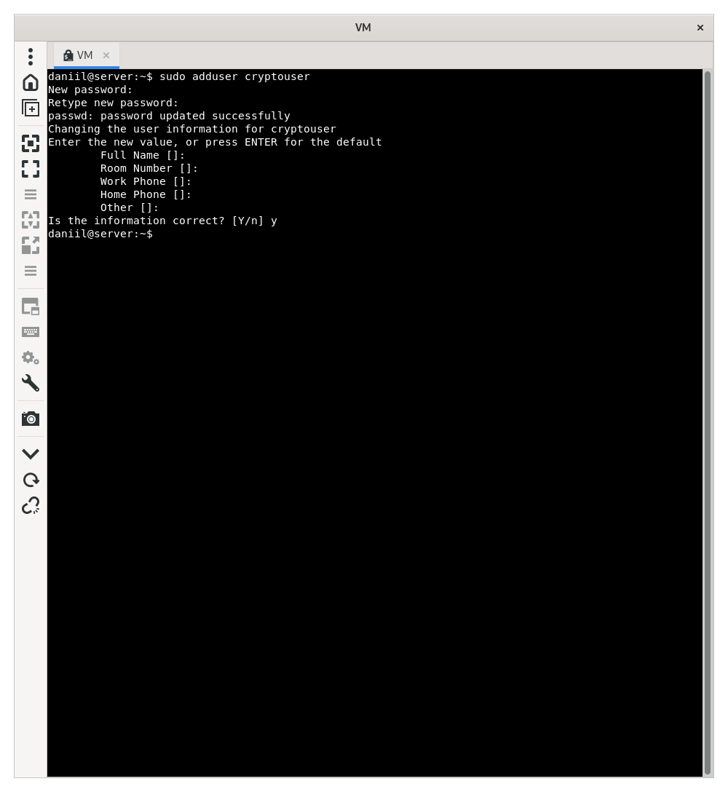

Перешёл под созданного пользователя и создал тестовые файлы `test1.txt` и `test2.txt`.

Проверил содержимое домашнего каталога и файлов:

```bash
sudo -iu cryptouser
ls -la
pwd
cat test1.txt
cat test2.txt
```

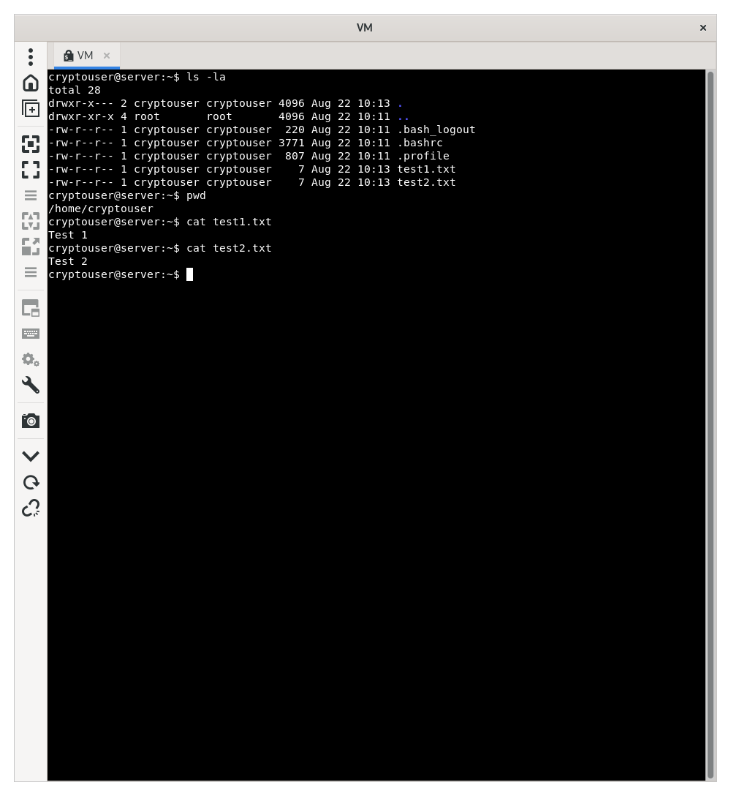

После выхода из учётной записи `cryptouser` выполнил шифрование существующего домашнего каталога с помощью eCryptfs:

```bash
sudo ecryptfs-migrate-home -u cryptouser
```

Миграция домашнего каталога завершилась успешно.

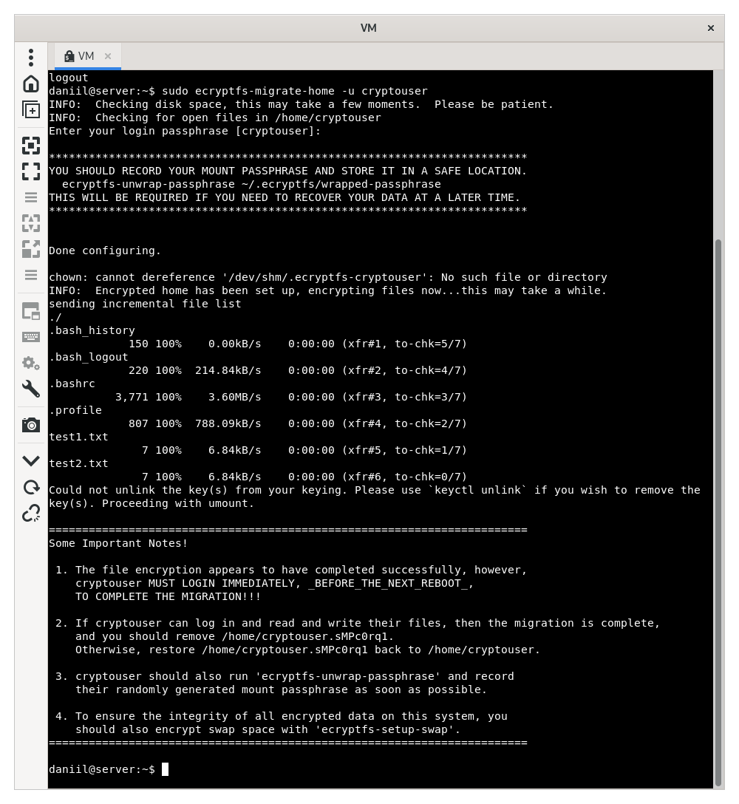

После повторного входа под пользователем `cryptouser` проверил доступность исходных файлов.

Затем вышел из учётной записи и проверил содержимое зашифрованного каталога:

```bash
sudo ls -la /home/.ecryptfs/cryptouser/.Private/
```

В каталоге отображаются файлы с именами вида `ECRYPTFS_FNEK_ENCRYPTED...`, что подтверждает хранение данных в зашифрованном виде.

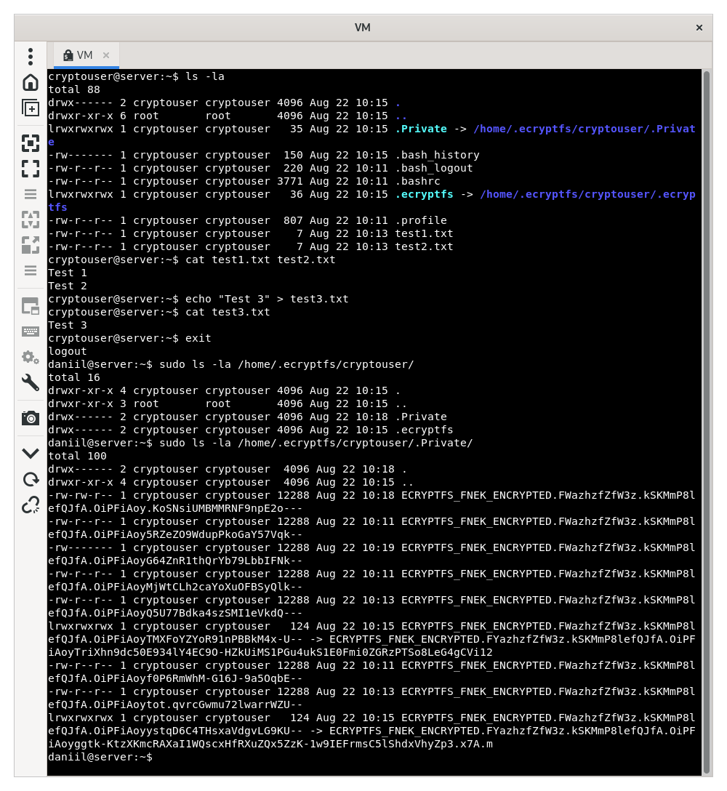

Домашний каталог пользователя `cryptouser` успешно зашифрован с помощью eCryptfs.

---

## Задание 2

### Условие

1. Установите поддержку **LUKS**.
2. Создайте небольшой раздел, например, 100 Мб.
3. Зашифруйте созданный раздел с помощью LUKS.

*В качестве ответа пришлите снимки экрана с поэтапным выполнением задания.*

### Ход решения

Установил и проверил наличие утилиты `cryptsetup`:

```bash
sudo apt install cryptsetup
cryptsetup --version
```

Для выполнения задания был добавлен отдельный диск `/dev/sdb` размером 10 ГБ.

С помощью `fdisk` создал на нём отдельный раздел `/dev/sdb1` размером 1 ГБ:

```bash
sudo fdisk /dev/sdb
```

В `fdisk` была создана таблица разделов GPT и новый раздел:

```text
g
n
+1G
p
w
```

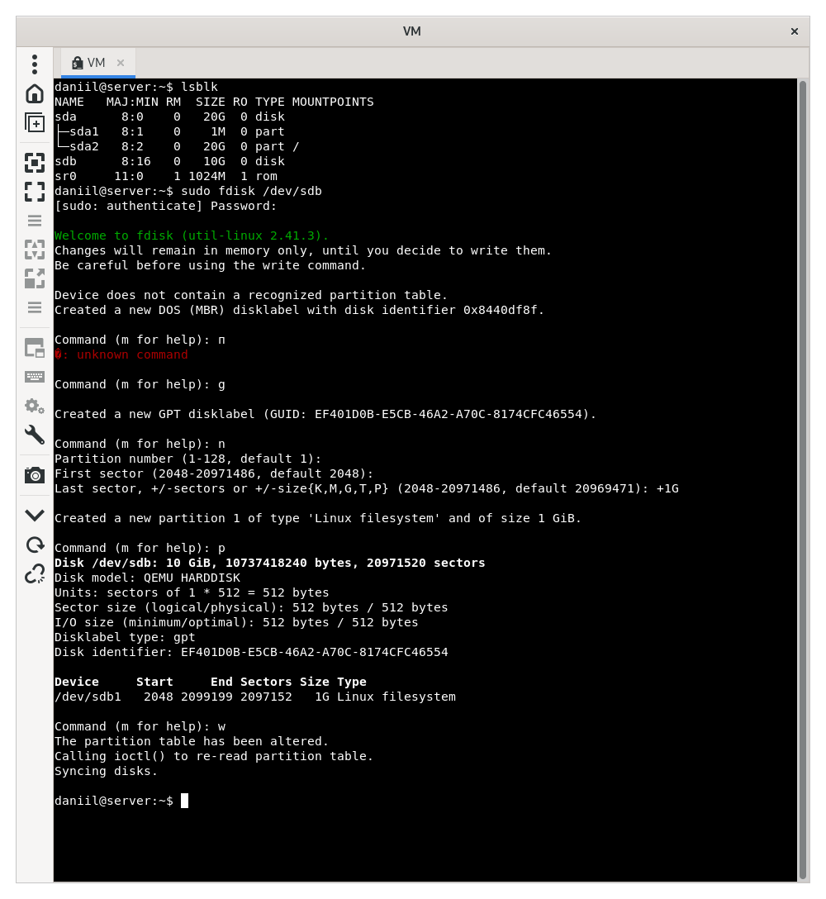

Зашифровал созданный раздел `/dev/sdb1` с помощью LUKS2:

```bash
sudo cryptsetup -y -v --type luks2 luksFormat /dev/sdb1
```

Проверил результат:

```bash
lsblk -f
```

В выводе `/dev/sdb1` определяется как `crypto_LUKS`, что подтверждает успешное шифрование раздела.

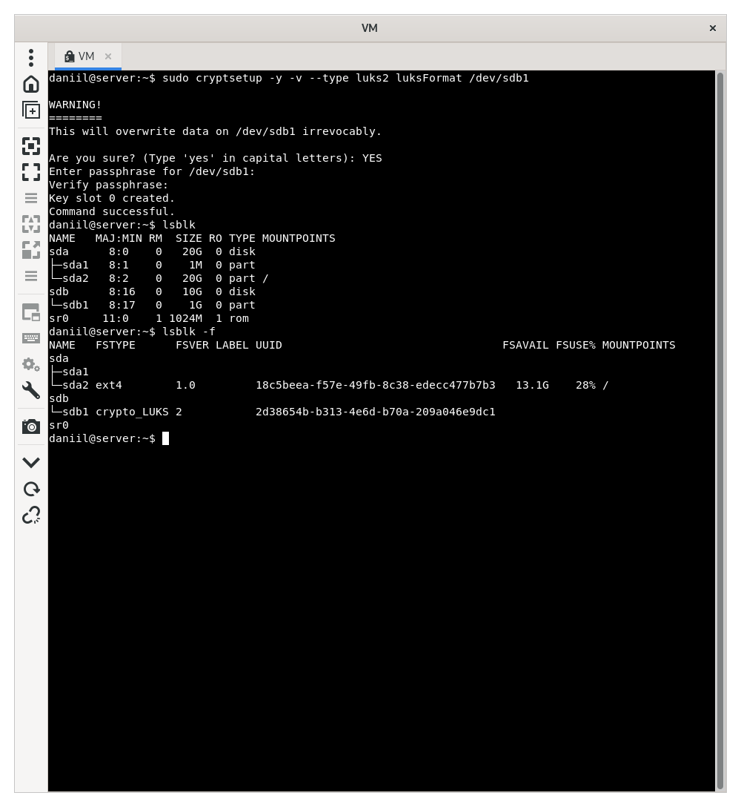

Открыл зашифрованный раздел:

```bash
sudo cryptsetup luksOpen /dev/sdb1 disk
```

После ввода парольной фразы появилось устройство:

```text
/dev/mapper/disk
```

Создал на открытом устройстве файловую систему `ext4`:

```bash
sudo mkfs.ext4 /dev/mapper/disk
```

Создал каталог для монтирования и смонтировал раздел:

```bash
mkdir -p ~/task2
sudo mount /dev/mapper/disk ~/task2/
```

Проверил состояние раздела:

```bash
lsblk -f
df -hT ~/task2/
```

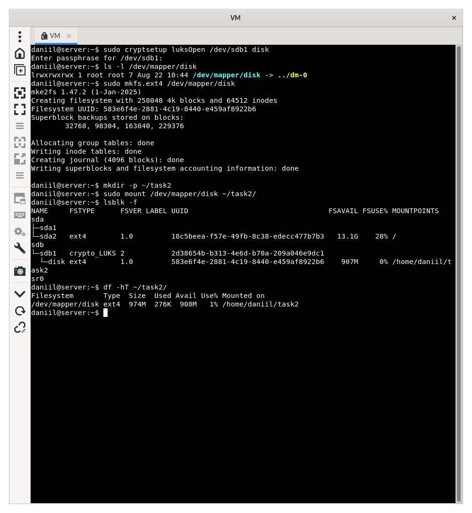

После проверки размонтировал зашифрованный раздел и закрыл LUKS-контейнер:

```bash
sudo umount ~/task2
sudo cryptsetup luksClose disk
```

Повторная проверка:

```bash
lsblk -f
```

После закрытия `/dev/mapper/disk` исчез, а `/dev/sdb1` остался определяться как `crypto_LUKS`.

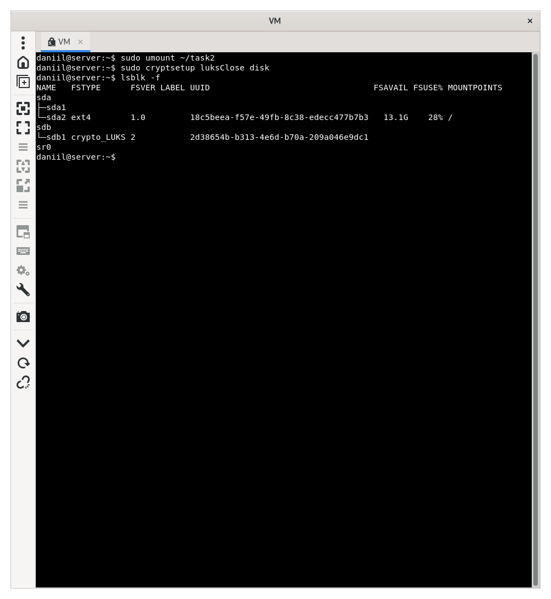

Раздел `/dev/sdb1` был успешно зашифрован с помощью LUKS.

---

## Задание 3 *

### Условие

1. Установите **apparmor**.
2. Повторите эксперимент, указанный в лекции.
3. Отключите (удалите) apparmor.

*В качестве ответа пришлите снимки экрана с поэтапным выполнением задания.*

### Ход решения

Установил необходимые пакеты AppArmor:

```bash
sudo apt install apparmor-profiles apparmor-utils apparmor-profiles-extra
```

Проверил состояние AppArmor:

```bash
sudo apparmor_status
```

Модуль AppArmor был загружен, также были активны профили в режиме `enforce`.

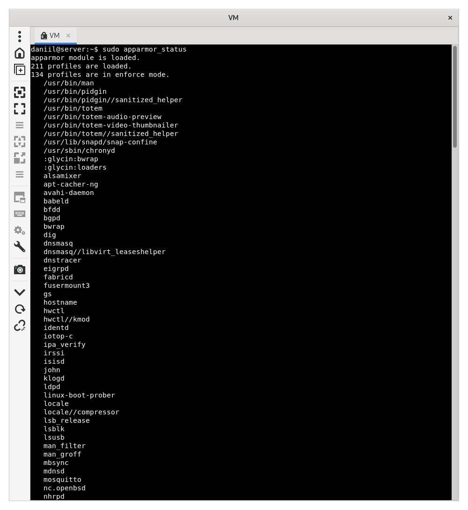

Для проведения эксперимента сохранил оригинальный файл `/usr/bin/man`:

```bash
sudo cp /usr/bin/man /usr/bin/man.backup
```

После этого заменил его программой `ping`:

```bash
sudo cp /bin/ping /usr/bin/man
```

При запуске:

```bash
sudo man 127.0.0.1
```

AppArmor заблокировал создание raw-сокета, так как профиль `/usr/bin/man` находился в режиме `enforce`:

```text
man: sockettype: SOCK_RAW
man: socket: Permission denied
```

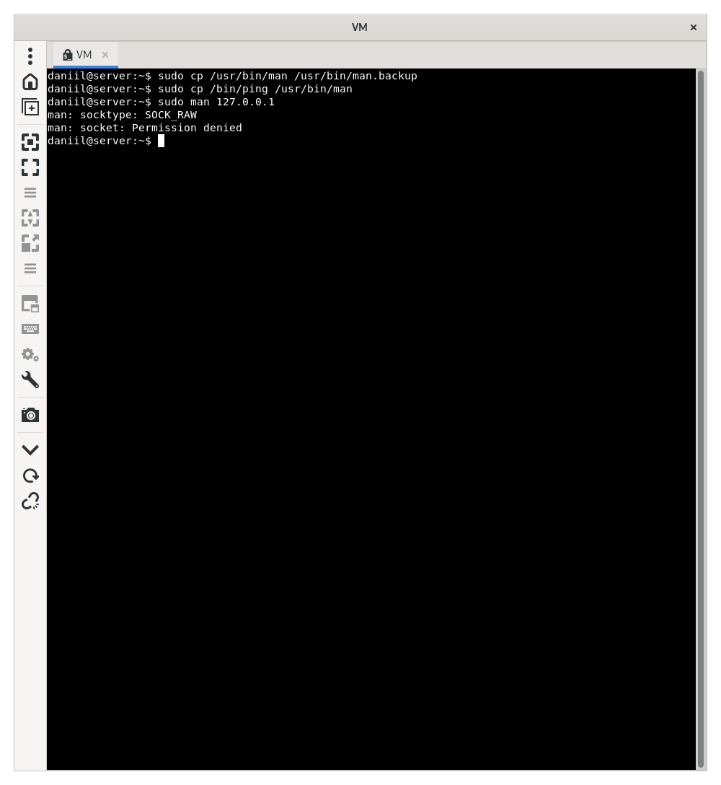

Перевёл профиль `/usr/bin/man` в режим `complain`:

```bash
sudo aa-complain /usr/bin/man
```

Повторно выполнил:

```bash
sudo man 127.0.0.1
```

В режиме `complain` AppArmor не блокирует действие программы, поэтому `ping` успешно выполнился:

```text
PING 127.0.0.1 ...
64 bytes from 127.0.0.1 ...
```

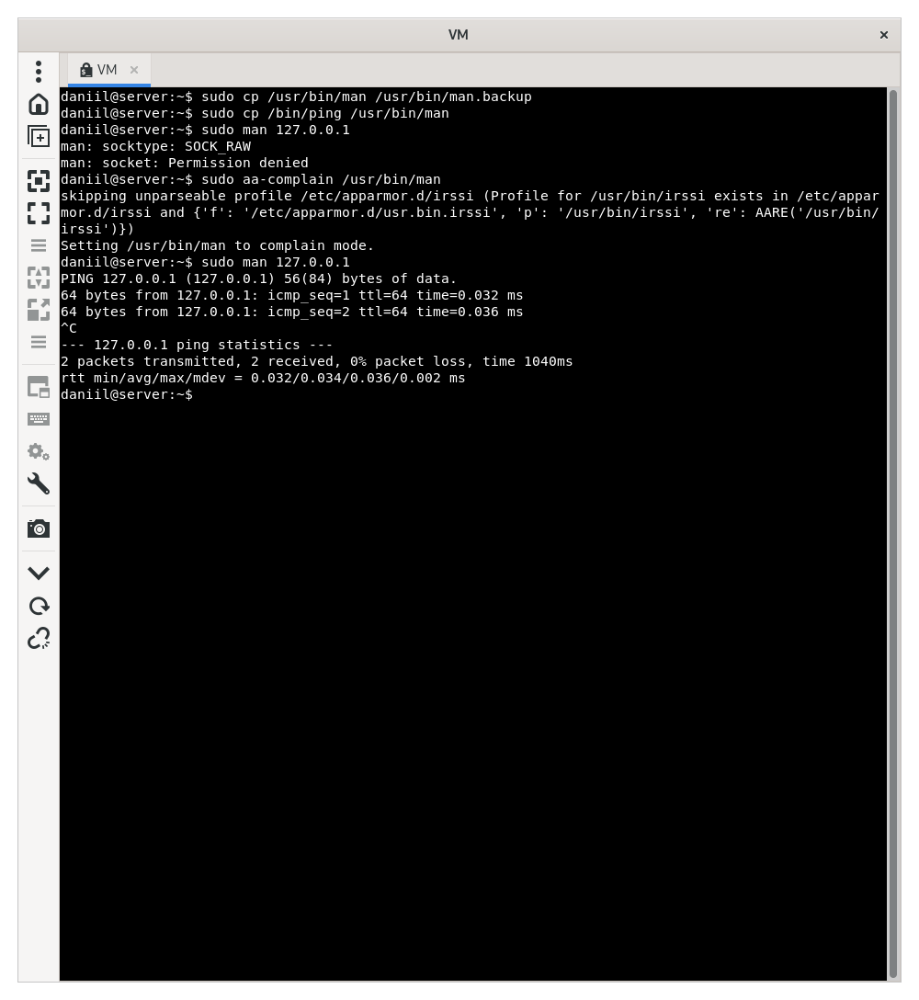

После завершения эксперимента восстановил оригинальную программу `man`:

```bash
sudo cp /usr/bin/man.backup /usr/bin/man
```

Проверил её работу:

```bash
man --version
```

Для отключения AppArmor выгрузил активные профили:

```bash
sudo aa-teardown
```

После этого проверил состояние:

```bash
sudo apparmor_status
```

В результате получено:

```text
apparmor module is loaded.
No policy loaded into the kernel
```

Это подтверждает, что политики AppArmor были выгружены.

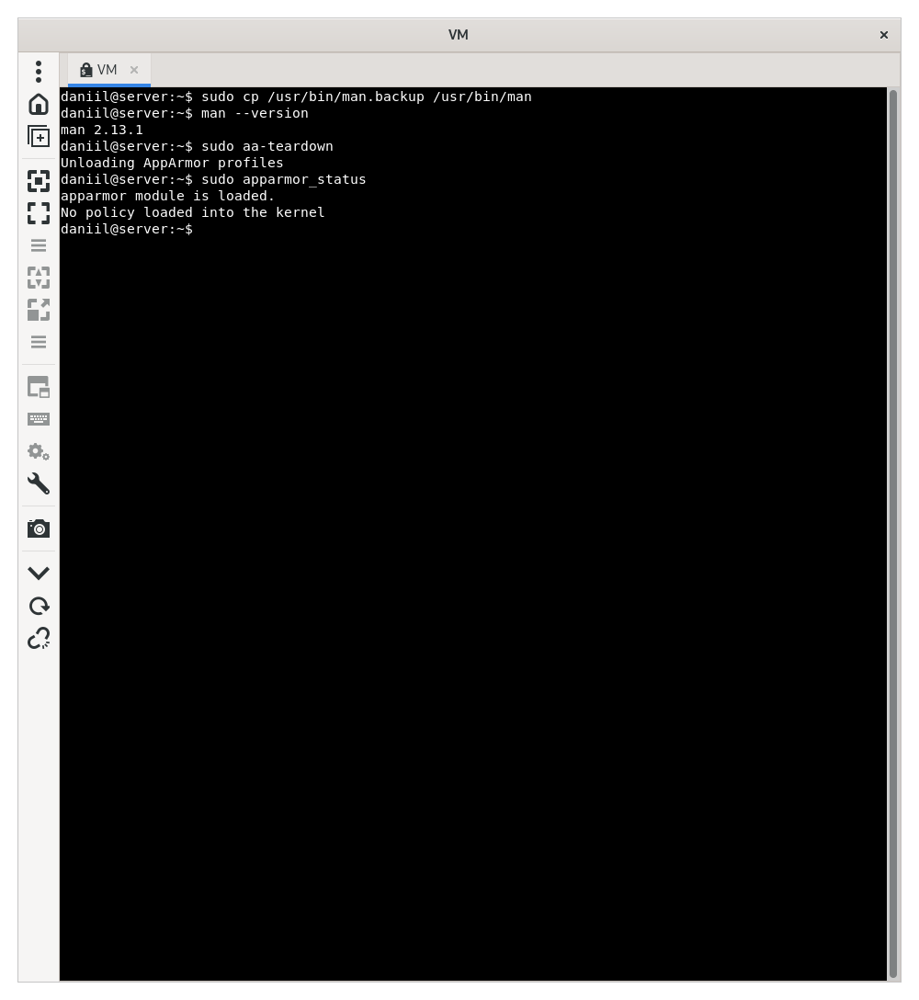

Эксперимент показал различие режимов работы AppArmor: в режиме `enforce` запрещённые политикой действия блокируются, а в режиме `complain` они разрешаются, но нарушения политики могут регистрироваться.

---
