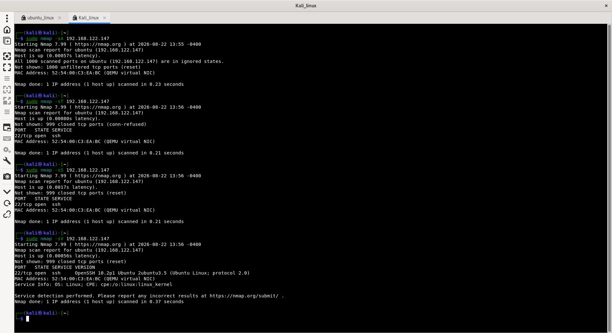
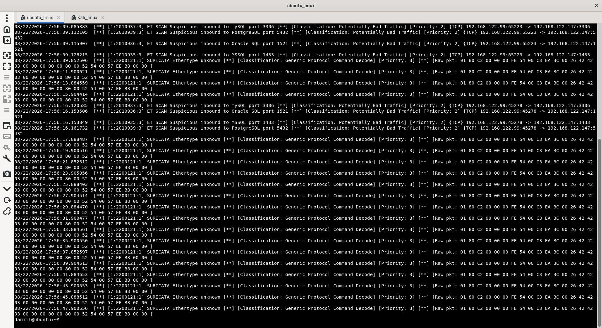
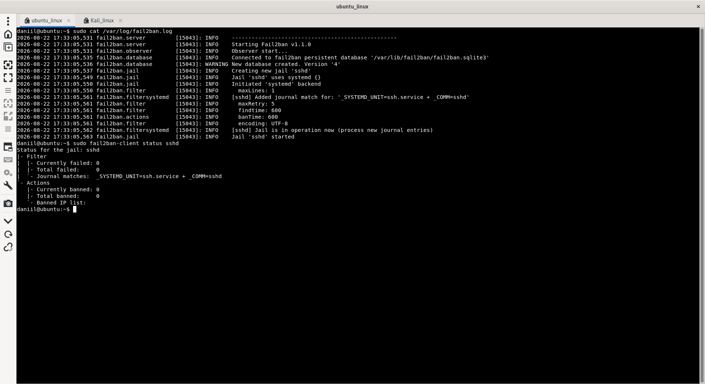
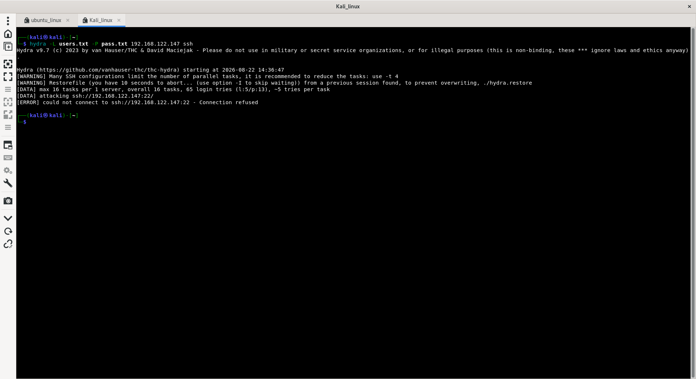
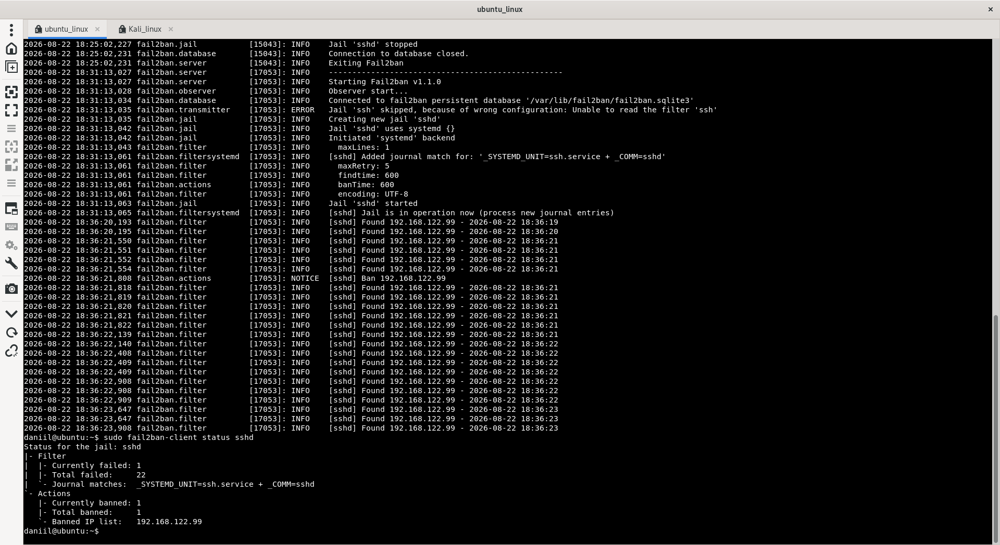
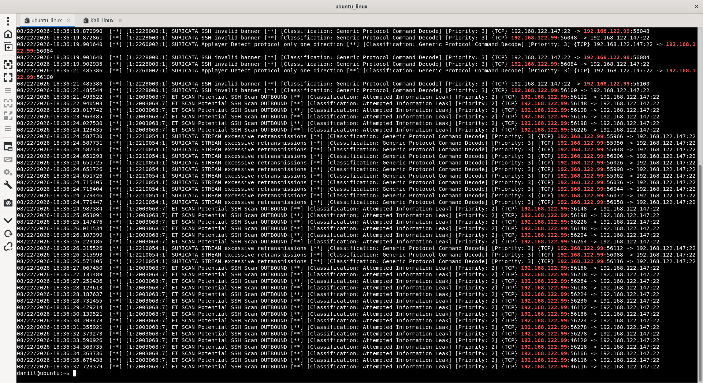

# Домашнее задание к занятию "12.03 Защита сети" - "Борисенко Даниил"

---

### Подготовка к выполнению заданий

1. Подготовка защищаемой системы:

- установите **Suricata**,
- установите **Fail2Ban**.

2. Подготовка системы злоумышленника: установите **nmap** и **thc-hydra** либо скачайте и установите **Kali linux**.

Обе системы должны находится в одной подсети.

---

## Задание 1

### Условие

Проведите разведку системы и определите, какие сетевые службы запущены на защищаемой системе:

**sudo nmap -sA < ip-адрес >**

**sudo nmap -sT < ip-адрес >**

**sudo nmap -sS < ip-адрес >**

**sudo nmap -sV < ip-адрес >**

По желанию можете поэкспериментировать с опциями: https://nmap.org/man/ru/man-briefoptions.html.

*В качестве ответа пришлите события, которые попали в логи Suricata и Fail2Ban, прокомментируйте результат.*

### Ход решения

Для выполнения задания использовал атакующую ОС Kali Linux с IP-адресом `192.168.122.99` и защищаемую ОС Ubuntu с IP-адресом `192.168.122.147`.

Выполнил требуемые варианты сканирования `nmap`:

```bash
sudo nmap -sA 192.168.122.147
sudo nmap -sT 192.168.122.147
sudo nmap -sS 192.168.122.147
sudo nmap -sV 192.168.122.147
```

По результатам сканирования был обнаружен открытый порт:

```text
22/tcp open ssh
```

ACK-скан `-sA` показал порты в состоянии `unfiltered`, а TCP Connect и SYN-сканирование обнаружили открытый SSH-порт.



Во время сканирования на защищаемой системе проверил журнал Suricata:

```bash
sudo cat /var/log/suricata/fast.log
```

Suricata зафиксировала сетевую активность от Kali Linux `192.168.122.99` к Ubuntu `192.168.122.147`.



Также проверил состояние Fail2Ban для SSH:

```bash
sudo fail2ban-client status sshd
```

После выполнения сканирования результат был следующим:

```text
Currently failed: 0
Total failed: 0
Currently banned: 0
Total banned: 0
```



Fail2Ban не отреагировал на сканирование `nmap`, так как в процессе разведки не выполнялись неудачные попытки авторизации по SSH.

На защищаемой системе доступна служба SSH на порту `22/tcp`. Suricata обнаружила подозрительную сетевую активность, а Fail2Ban не произвёл блокировок, поскольку попыток подбора учётных данных ещё не выполнялось.

---

## Задание 2

### Условие

Проведите атаку на подбор пароля для службы SSH:

**hydra -L users.txt -P pass.txt < ip-адрес > ssh**

1. Настройка **hydra**:

 - создайте два файла: **users.txt** и **pass.txt**;
 - в каждой строчке первого файла должны быть имена пользователей, второго — пароли. В нашем случае это могут быть случайные строки, но ради эксперимента можете добавить имя и пароль существующего пользователя.

Дополнительная информация по **hydra**: https://kali.tools/?p=1847.

2. Включение защиты SSH для Fail2Ban:

-  открыть файл /etc/fail2ban/jail.conf,
-  найти секцию **ssh**,
-  установить **enabled**  в **true**.

Дополнительная информация по **Fail2Ban**:https://putty.org.ru/articles/fail2ban-ssh.html.

*В качестве ответа пришлите события, которые попали в логи Suricata и Fail2Ban, прокомментируйте результат.*

### Ход решения

Для выполнения задания был создан пользователь `test` на защищаемой VM Ubuntu.

На атакуемой VM Kali-linux создал файлы `pass.txt` и `users.txt` с генерированными логинами и паролями, дополнительно указал действующие логопассы пользователя `test`.

Провел атаку на защищаемую VM Ubuntu c IP-адресом `192.168.122.147`, используя команду:

```bash
hydra -L users.txt -P pass.txt 192.168.122.147 ssh
```

В выводе команды наблюдаем ошибку о подключении к хосту.

```text
[ERROR] could not connect to ssh://192.168.122.147:22 - Connection refused
```



В журнале Fail2Ban зафиксированы неудачные попытки авторизации по SSH с адреса `192.168.122.99`.
После превышения допустимого количества попыток Fail2Ban заблокировал данный IP-адрес.

```text
[sshd] Found 192.168.122.99 - 2026-08-22 18:36:19
[sshd] Found 192.168.122.99 - 2026-08-22 18:36:20
[sshd] Found 192.168.122.99 - 2026-08-22 18:36:21
[sshd] Found 192.168.122.99 - 2026-08-22 18:36:21
[sshd] Found 192.168.122.99 - 2026-08-22 18:36:21
[sshd] Found 192.168.122.99 - 2026-08-22 18:36:21
[sshd] Ban 192.168.122.99
```



В логах Suricata зафиксирована активность от узла `192.168.122.99` к SSH-службе защищаемого узла `192.168.122.147` на порту 22.



Таким образом, Suricata обнаружила подозрительную сетевую активность, а Fail2Ban выполнил активную блокировку источника атаки.

---
