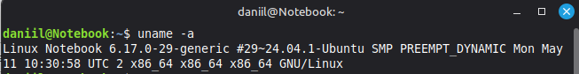
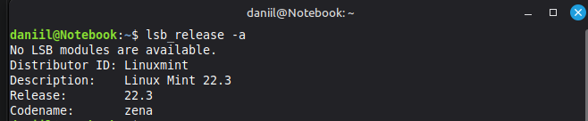
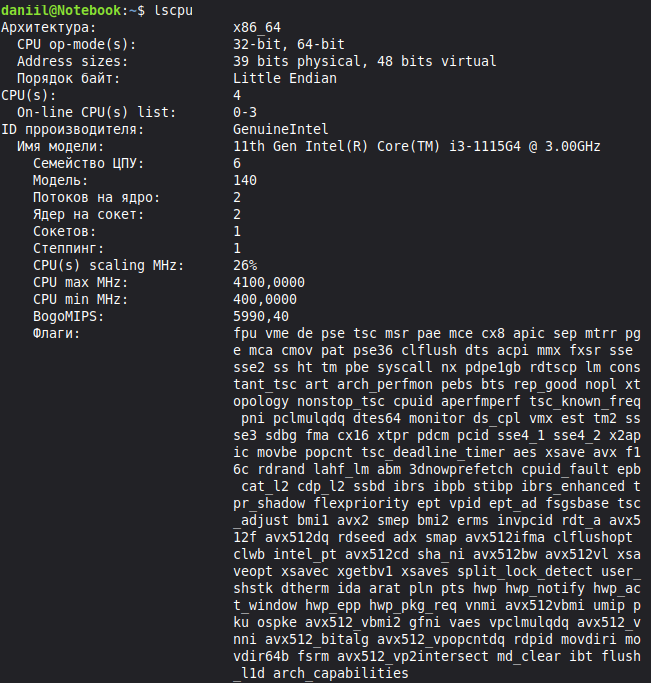
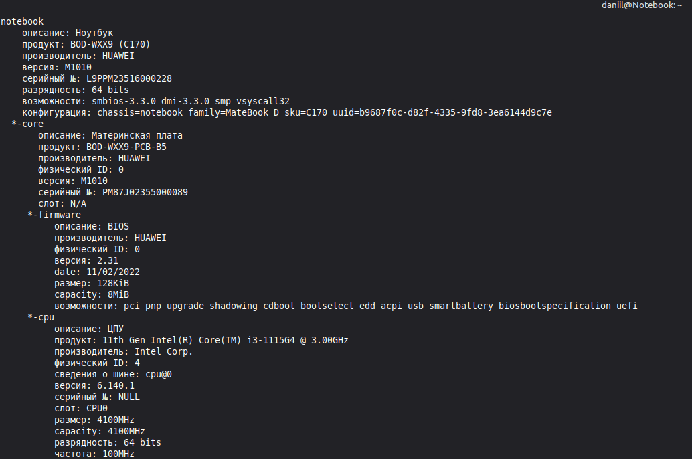

# Домашнее задание к занятию "1.01.Архитектура компьютера. Операционная система" - "Борисенко Даниил"

---

## Задание 1. Команды

**Условие:** 

Если вы работаете в ОС Linux, то запустите терминал и введите команды:
 - uname -a
 - lsb_release -a
 - lscpu
 - lshw

Что выводит каждая их этих команд?

**Ход решения:**

1. Для получения подробной информации о системе, выполнил команду: 

```bash
uname -a
```



2. Для получения подробной информации об установленном дистрибутиве, выполнил команду: 

```bash
lsb_release -a
```



3. Для получения подробной информации о процессоре, выполнил команду: 

```bash
lscpu
```



4. Для получения подробной информации о всех компонентах системы, выполнил команду: 

```bash
lshw
```

Запустил команду с правами суперпользователя и использовал команду less для удобного просмотра содержимого:

```bash
sudo lshw | less 
```



---


