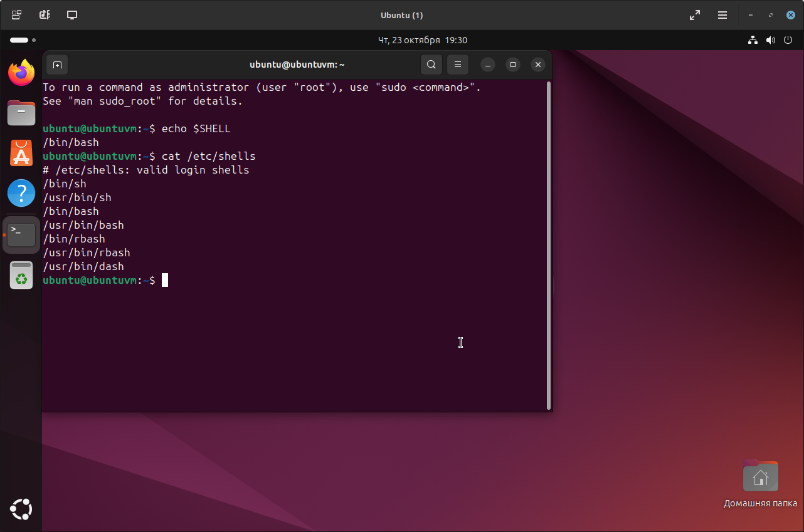

# Домашнее задание к занятию "1.03.Знакомство с операционной системой Linux" - "Борисенко Даниил"

---

## Задание 1

1. Для создания ВМ, буду использовать образ ubuntu. Скачал образ, используя команду: 

```bash
sudo wget https://mirror.linux-ia64.org/ubuntu-releases/24.04.3/ubuntu-24.04.3-desktop-amd64.iso 
```

Скриншот выполнения команды:


2. Создал VM через qemu-kvm, используя инструмент virt-install, командой:

```bash
sudo virt-install --name Ubuntu --ram 4096 --vcpus 4 --disk size=30 --cdrom ubuntu-24.04.3-desktop-amd64.iso
```
где:
**`--name`** - задает имя VM;
**`--ram`** - задает количество выделенной оперативной памяти;
**`--vcpus`** - задает количество процессоров;  
**`--disk size`** - размер пространства под VM;
**`--cdrom`** - путь к iso образу, на основе которого содается VM.

Скриншот выполнения команды:


3. Для запуска окна созданной VM, использовал команду:

```bash
virt-viewer Ubuntu
```

Скриншот выполнения команды:


---

## Задание 2

1. Команда: 

```bash
echo $SHELL
```

Выводит путь, где находится используемая оболочка

2. Команда: 

```bash
cat /etc/shells 
```

Просматривает файл, в котором указаны доступные оболочки

Скриншот выполнения команды:


---

## Задание 3

Для установки файлового менеджера midnight commander, использовал утилиту apt, применив следующую команду:

```bash
sudo apt install mc
```

Скриншот выполнения команды:


---

## Задание 4

1. Для вывода данных о текущем пользователе использовал команду:

```bash
id
```

2. Для вывода данных пользователя sudo, использовал следующую команду с правами суперпользователя:

```bash
sudo id
```

Скриншот выполнения команды:
