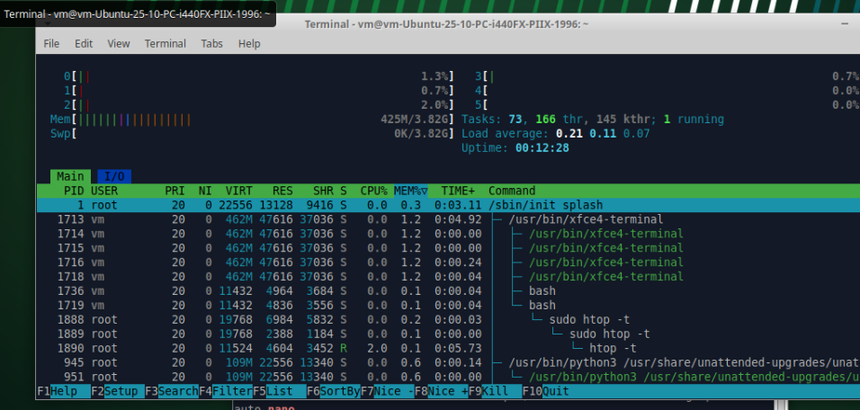
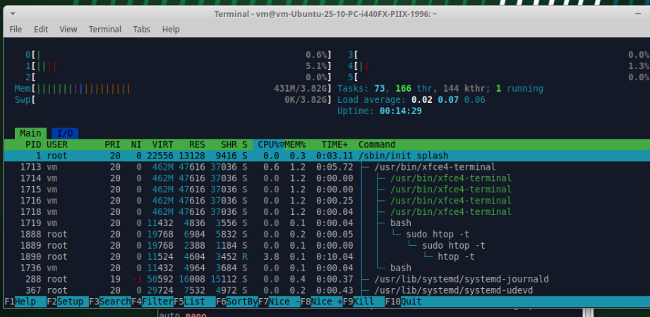
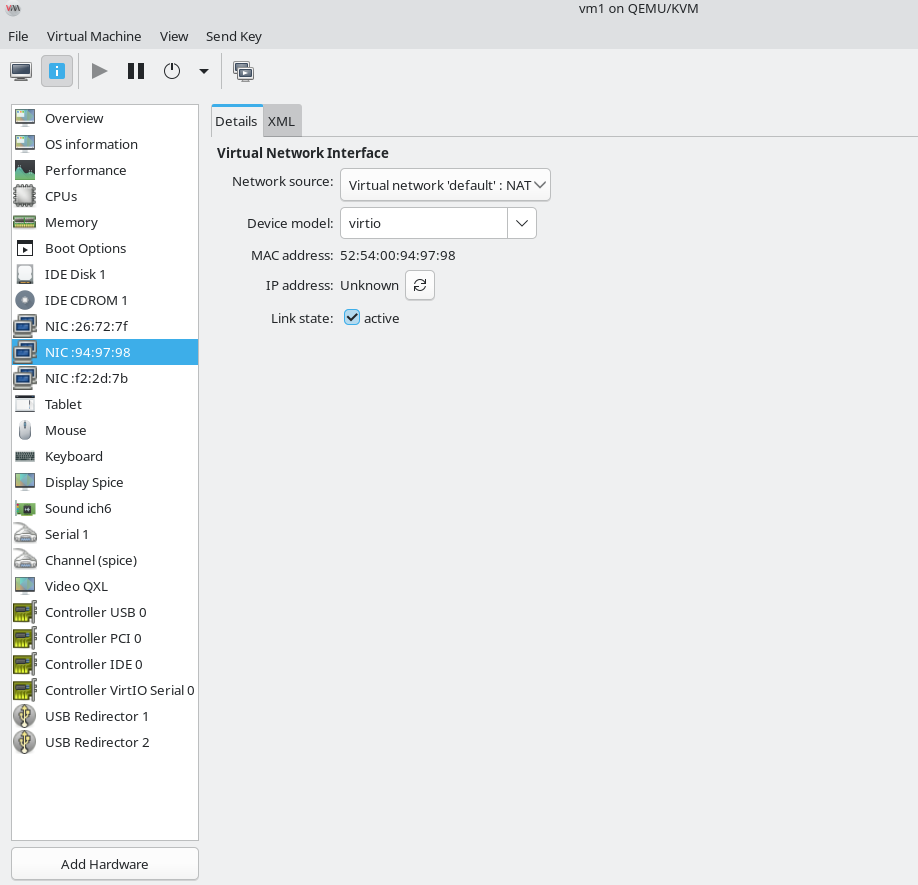
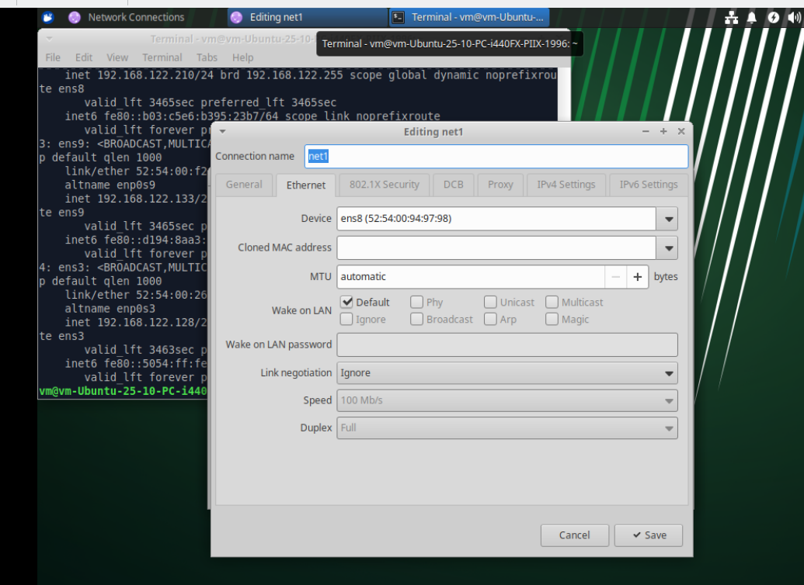
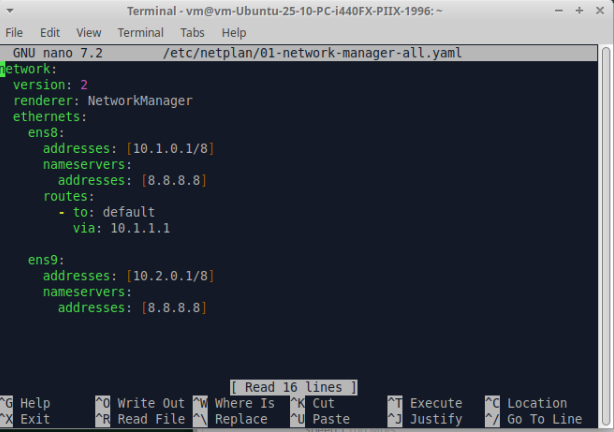
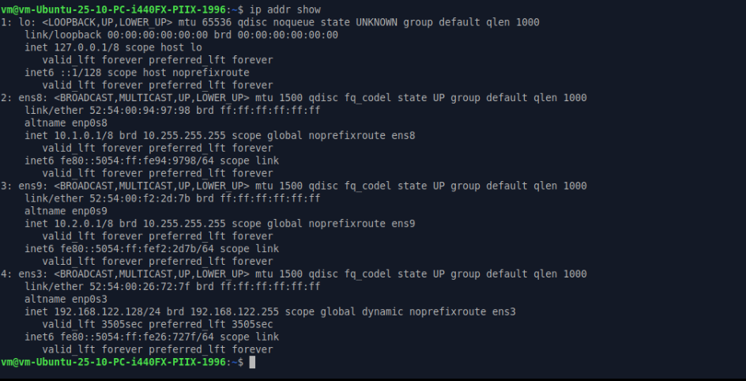
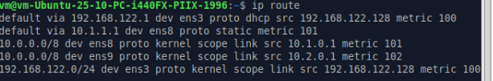
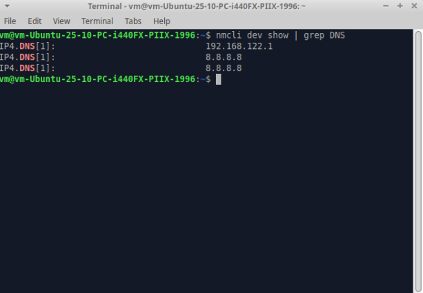

# Домашнее задание к занятию "1.04.Основы работы в терминале ОС Linux" - "Борисенко Даниил"

---

## Задание 1. Процессы

**Условие:**
- Запустите текстовый редактор nano
- Откройте ещё одно окно терминала
- С помощью команды ps определите PID запущенного процесса
- Выполните команду kill PID

Что произошло в терминале с nano?
Ответ приведите в виде последовательности команд и снимка экрана

**Ход решения:**
1. Для запуска текстового редактора использовал команду:

```bash
nano
```
2. Открыл еще одно окно терминала и использовал следующую команду для поиска процесса:

```bash
ps aux | grep nano
```

3. Для того чтобы "убить" найденный процесс тестового редактора nano, использовал следующую команду:

```bash
kill 1727
```

4. Получил следующее уведомление:
**Received SIGHUP or SIGTERM** - сигнал, уведомляющий о прерывании или остановки процесса.

---

## Задание 2. Утилита htop
**Условие:**
- Установите утилиту htop
- С помощью htop ответьте на вопросы:
    - Какие процессы занимают больше всего памяти?
    - Какие процессы занимают больше всего процессорного времени?

Приведите ответ в виде снимков экрана

**Ход решения:**
1. Установил утилиту htop при помощи следующей команды:

```bash
sudo apt install htop
```

2. Далее запускаю утилиту htop с правами суперпользователя и для удобства отображения процессов использую ключ -t:

```bash
sudo htop -t
```

3. При помощи клавишы **F6** выбираю сортировку по памяти.
Наблюдаю что в данном случае процесс **terminal** занимает больше всего оперативной памяти, т.к. в данный момент не запущены ресурсозатратные процессы.



4. Выбираю сортировку по процессорному времени.
В данном случае ситуация аналогичная, процесс **terminal** так же занимает больше всего процессорного времени.



---

## Задание 3. Работа с сетью
**Условие:**
- Добавьте в виртуальную машину два дополнительных сетевых адаптера с внутренней (internal) сетью
- Настройте на первом из них адрес 10.1.0.1 маску подсети 255.0.0.0
- Настройте на втором из них адрес 10.2.0.1 маску подсети 255.0.0.0
- На обоих интерфейсах настройте адрес dns-сервера как 8.8.8.8 и шлюз по умолчанию 10.1.1.1
- Выполните команду ip addr

Приведите ответ в виде снимка экрана с выполненной командой ip addr

**Ход решения:**
1. Добавил сети через GUI virtual manager:



2. Открыл соединения и определил что сеть net1 закреплена за девайсом ens8, а net2 закреплена за ens9



3. Редактировал общий файл сети используя следующую команду и путь:

```bash
sudo nano /etc/netplan/01-network-manager-all.yaml 
```



4. Закрыл текстовый редактор с сохранением файла и для применения изменений использовал команду:

```bash
sudo netplan apply
```

5. Для проверки изменений использовал команду:

```bash
ip addr show
```



6. Для проверки маршрута использовал команду:

```bash
ip route
```



7. Для проверки DNS использовал команду:

```bash
nmcli dev show | grep DNS
```



Выполнил домашнее задание, основываясь на следующую статью:
https://habr.com/ru/articles/448400/