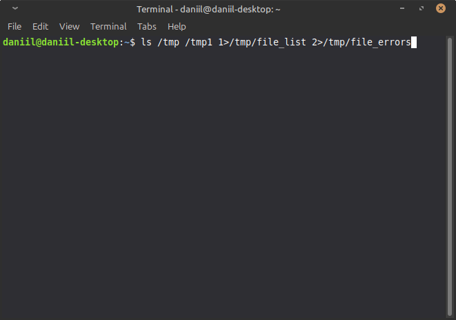
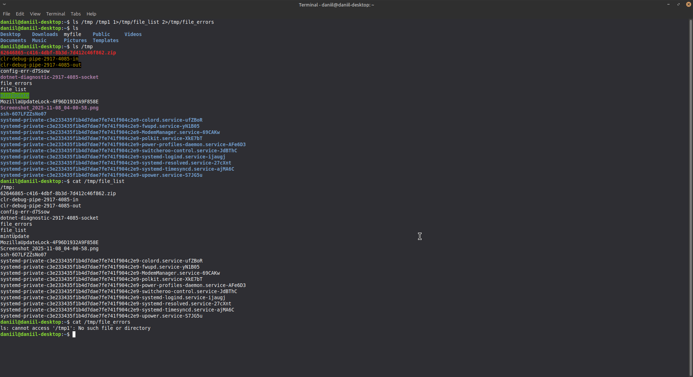
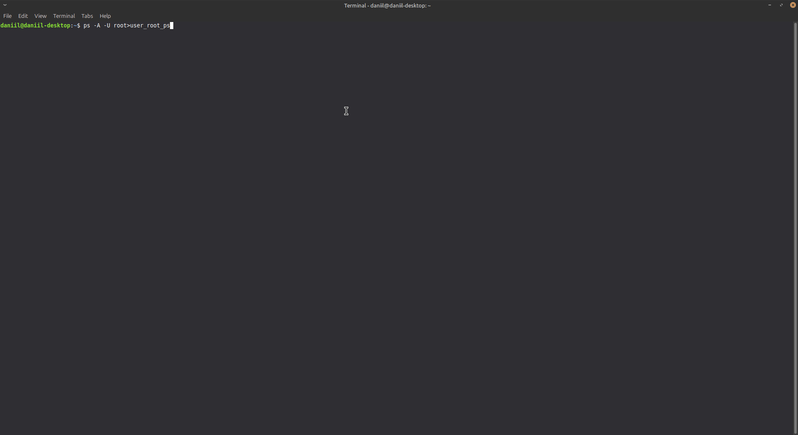

# Домашнее задание к занятию "2.03 Процессы, управление процессами" - "Борисенко Даниил"

---

## Задание 1
**Условие:**
Измените команду ls /tmp /tmp1 так, чтобы:
 - Результат работы (список файлов) для текущего запуска команды выводился в файл /tmp/file_list.
 - Ошибки для каждого запуска добавлялись в файл /tmp/file_errors.

**Примечание к заданию:**
 - Создавать /tmp1 не требуется. Директория должна отсутствовать для генерации вывода stderr. 
 - Задание необходимо выполнить одной командой.

В качестве решения пришлите полученную команду и скриншот терминала с выводом содержимого созданных файлов

**Ход решения:**
1. Меняю команду ls /tmp /tmp1 так, чтобы стандартный вывод выводился в file_list, а ошибки выводились в /tmp/file_errors:

```bash
ls /tmp /tmp1 1>/tmp/file_list 2>/tmp/file_errors
```



2. Для проверки созданных файлов и просмотра содержимого использовал следующие команды:

```bash
ls /tmp - для проверки созданных файлов
cat /tmp/file_list - просмотр файла вывода 
cat /tmp/file_errors - просмотр файла ошибок
```



---

## Задание 2
**Условие:**
Напишите команду, которая выводит все запущенные процессы пользователя root в файл "user_root_ps".

**Ход решения:**

1. Для выполнения задания использовал команду **ps** следующим образом:

```bash
ps -A -U root>user_root_ps
```

**где:**
- **`-A`** - ключ для вывода всех процессов, а не только в текущей консоли.
- **`-U`** - ключ для вывода процессов по определенному пользователю, в данном случае **root**
- **`user_root_ps`** - перенаправление процессов в файл **user_root_ps**



2. Проверил файл вывода командой **cat:**

```bash
cat user_root_ps
```

---

## Задание 3
**Условие:**
Начинающий администратор захотел вывести все запущенные процессы пользователя с логином "2" в файл "user_2_ps".

Для этого он набрал команду:

ps -U 2> user_2_ps

Затем, он аналогично повторил для пользователя с логином "5" вывод в файл "user_5_ps":

ps -U 5> user_5_ps

Вопрос:

Почему вывод этих команд и содержимое файлов сильно отличаются друг от друга? Как должны выглядеть правильные команды?

**Ход решения:**

Допустим у меня 2 пользователя daniil и test. Тогда размеры файлов будут разными в зависимости от количество запускаемых процессоров определенными пользователями. Если пользователя tester - нет, то файл будет еще меньше, т.к. нет пользователя - нет процессов.

---
