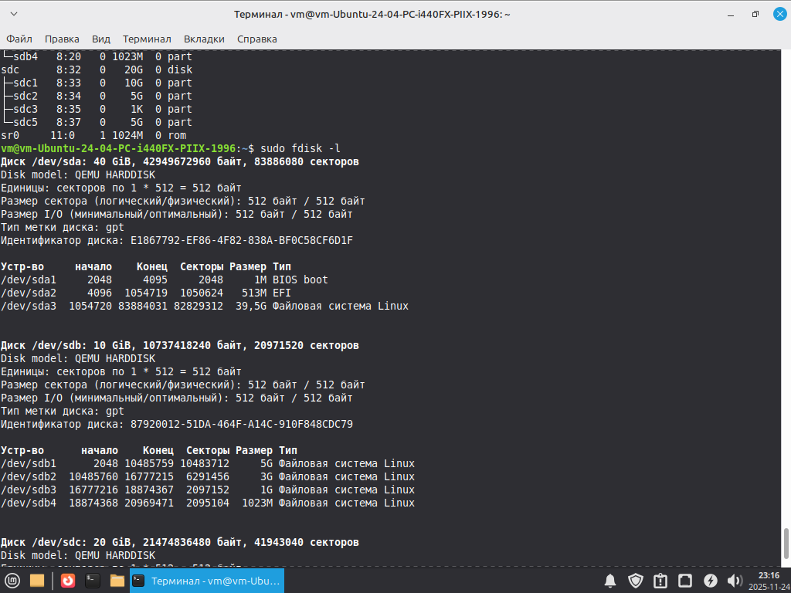
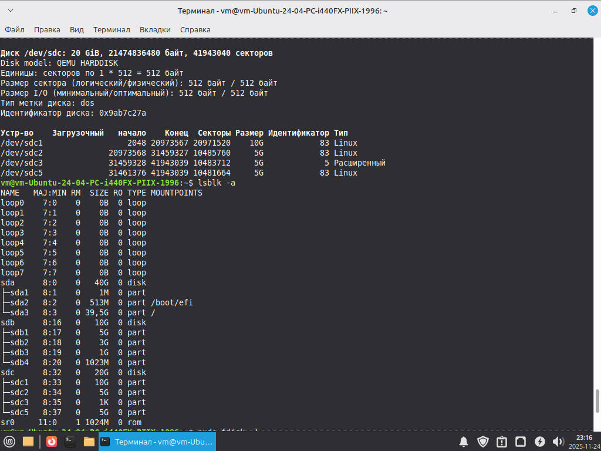
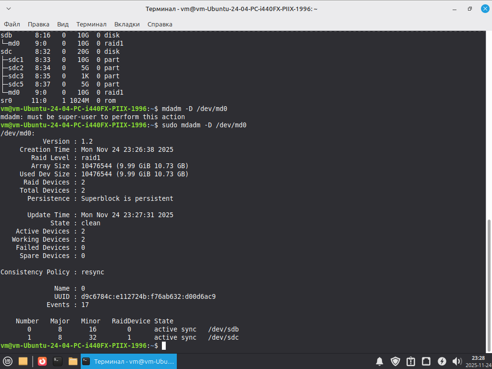

# Домашнее задание к занятию "2.06 Дисковые системы" - "Борисенко Даниил"

---

## Задание 1

**Условие:**
Какие виды RAID увеличивают производительность дисковой системы?

Приведите ответ в свободной форме.

**Ход решения:**

Повышают производительность те RAID-уровни, в которых применяется чередование (striping):

- RAID 0 — чередование без избыточности, максимальный упор на скорость чтения и записи.
- RAID 1 — выполняет только зеркалирование данных, без striping-механизма; обеспечивает сохранность, но не относится к производительным уровням.
- RAID 5 — чередование с распределённой чётностью, данные и информация для восстановления равномерно распределены между дисками.
- RAID 6 — чередование с двойной чётностью, позволяющей выдержать отказ двух дисков, такая надёжность достигается за счёт снижения производительности. Два диска в массиве используются не для хранения данных, а для контроля их целостности и восстановления при сбоях. За счёт двух дисков избыточности он имеет более высокую степень надёжности.
- RAID 10 — зеркалирование в сочетании с чередованием (RAID 1 + RAID 0), объединяет отказоустойчивость и высокую производительность, так как чтение и запись распределяются между несколькими парами дисков.

---

## Задание 2

**Условие:**
Назовите преимущества использования VFS. Используется ли VFS при работе с tmpfs? Почему?
Приведите развернутый ответ в свободной форме.

**Ход решения:**

- VFS создает возможность подключать любые типы файловых систем и работать с ними через единый интерфейс.
- Благодаря VFS можно использовать дисковые ФС через функцию file_operations: open(), read(), write().
- Так же VFS предоставляет возможность работать с виртуальными ФС tmpfs, procfs, sysfs, devtmpfs, cgroupfs, которые не работают с привычными file_operations, т.к. работает напрямую с памятью, но всё равно проходят через слой VFS и доступны как обычные каталоги и файлы.
- VFS является «слоем-оболочкой» между системными вызовами и конкретными файловыми системами, поэтому все ФС: дисковые и виртуальные проходят через VFS, включая tempfs.

---

## Задание 3

**Условие:**

Подключите к виртуальной машине 2 новых диска.

- На первом диске создайте таблицу разделов MBR, создайте 4 раздела: первый раздел на 50% диска, остальные диски любого размера на ваше усмотрение. Хотя бы один из разделов должен быть логическим.
- На втором диске создайте таблицу разделов GPT. Создайте 4 раздела: первый раздел на 50% диска, остальные любого размера на ваше усмотрение.

В качестве ответа приложите скриншоты, на которых будет видно разметку диска (например, командами lsblk -a; fdisk -l)

**Прилагаемые скриншоты:**

---

## Задание 4

**Условие:**

- Создайте программный RAID 1 в вашей ОС, используя программу mdadm.
- Объем RAID неважен.

В качестве ответа приложите скриншот вывода команды mdadm -D /dev/md0, где md0 - это название вашего рейд массива (может быть любым).

**Прилагаемые скриншоты:**

---

*Список используемой литературы:*
    
