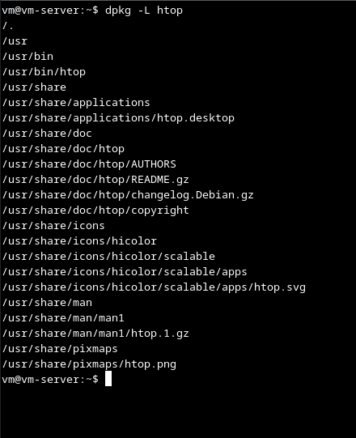
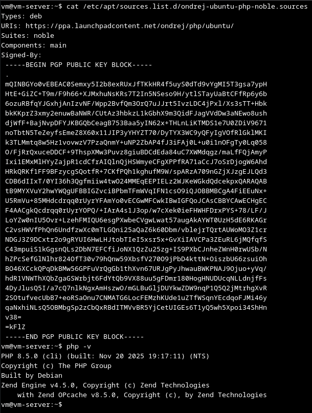
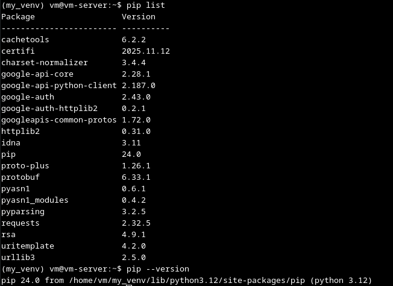

# Домашнее задание к занятию "3.02 Управление пакетами" - "Борисенко Даниил"

---

## Задание 1

**Условие:**

Опишите достоинства и недостатки работы с пакетным менеджером и репозиторием.

*Напишите ответ в свободной форме.*

**Ход решения:**

- Достоинства: Установка зависимостей при установке программы из пакетного менеджера, подписанные пакеты в официальных репозиториях, удобство установки необходимого ПО, его обновление и удаление с зависимостями из консоли.

- Недостатки: Ограниченные версии ПО в репозиториях, а так же отсутствие подписей в некоторых ПО в официальных репозиториях. Необходимость использовать сторонние репозитории.

---

## Задание 2

**Условие:**

Ответьте на вопросы:

1. Какие действия надо выполнить при подключении стороннего репозитория?
2. В чём опасность такого способа распространения ПО и как это решить?

*Напишите ответ в свободной форме.*

**Ход решения:**

1. Находим нужное нам ПО на платформе репозиториев, например launchpad.net.
2. Добавляем сторонний репозиторий либо вручную в файл  /etc/apt/sources.list.d/ либо автоматически командой sudo add-apt-repository.
3. Если репозиторий установлен вручную, то добавляем ключ так же вручную, скачиваем его и установить его командой apt-key add.

Опасность использования сторонних репозиториев заключается в том, что в них могут быть использованы вредоносные пакеты.

---

## Задание 3

**Условие:**

1. Запустите свою виртуальную машину.
2. Найдите в репозиториях и установите пакет `htop`.

Какие зависимости требует `htop`?

*Ответ приведите в виде текста команды, которой вы это выполнили, а также приложите скриншот места расположения исполняемых файлов установленного ПО.*

**Ход решения:**

1. Для поиска пакета `htop` использовал следующую команду:

    ```bash
    apt search htop
    ```

2. Установил пакет `htop` следующей командой:

    ```bash
    sudo apt install htop
    ```

3. Для того чтобы найти исполняемые файлы пакета `htop`, использовал:

    ```bash
    sudo dpkg -L htop
    ```

    

4. Определил требуемые зависимости пакета `htop` следующей командой:

    ```bash
    sudo apt show htop
    ```

    

    Зависимости: libc6 (>= 2.38), libncursesw6 (>= 6), libnl-3-200 (>= 3.2.7), libnl-genl-3-200 (>= 3.2.7), libtinfo6 (>= 6)

---

## Задание 4

**Условие:**

1. Подключите репозиторий PHP и установите `PHP 8.0`. В зависимости от вашего дистрибутива, если эта версия у вас уже есть, то установите более свежую версию.
*Приложите скриншот содержимого файла, в котором записан адрес репозитория.*

2. При помощи команды php -v убедитесь, что поставлена корректная версия `PHP`.
*Приложите к ответу скриншот версии.*

**Ход решения:**

Скриншот добавленного репозитория и проверки корректной версии `php`:



---

### Задание 5

**Условие:**

Ваш коллега-программист просит вас установить модуль `google-api-python-client` на сервер, который необходим для программы, работающей с Google API.

Установите этот пакет при помощи менеджера пакетов `pip`.

**Примечение №1:** для установки может понадобиться пакет `python-distutils`, проверьте его наличие в системе.

**Примечение №2:** если возникнет ошибка при установке с помощью Python версии 2, воспользуйтесь командой `python3`.

*Приложите скриншоты  с установленным пакетом `python-distutils`, с версией `Pip` и установленными модулями, они должны быть видимы.*

**Ход решения:**



---
