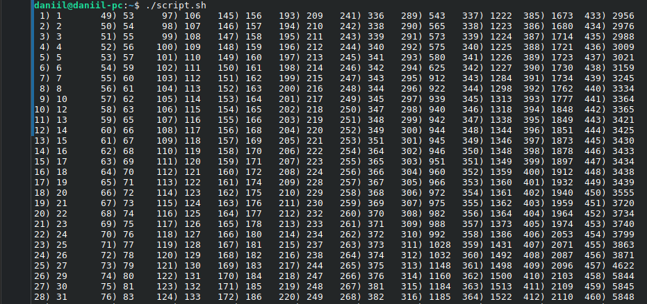
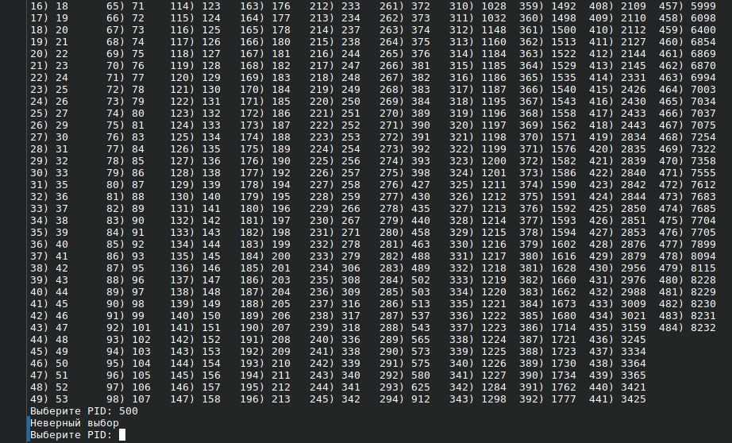
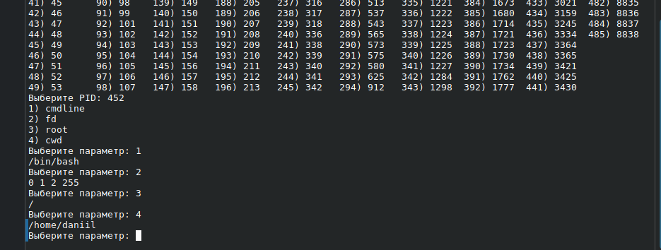
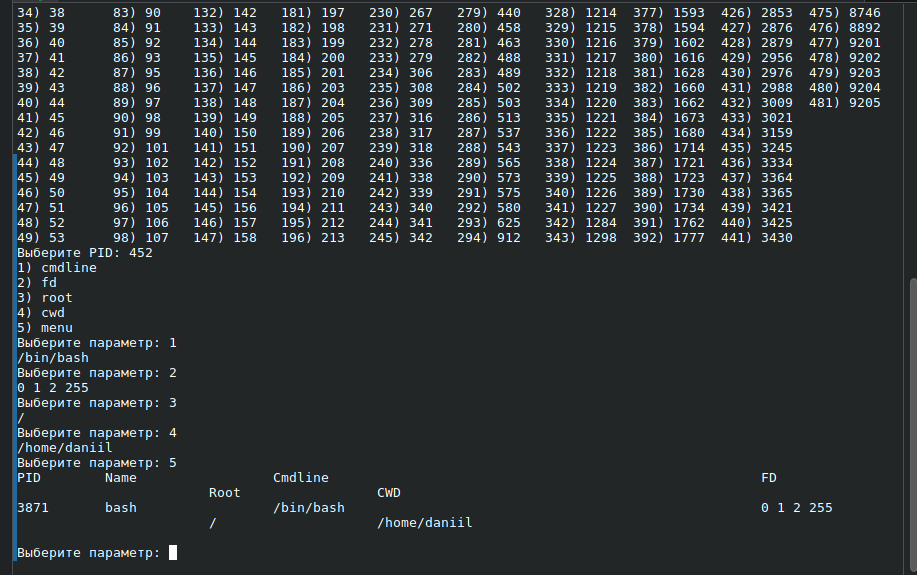
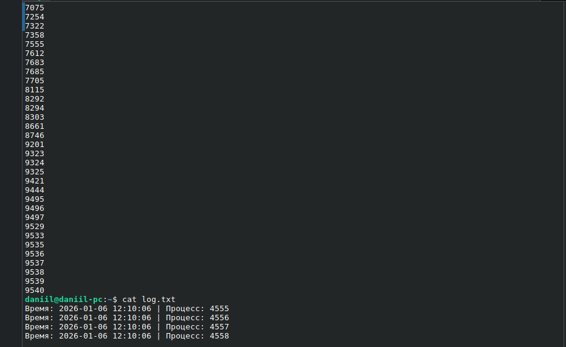
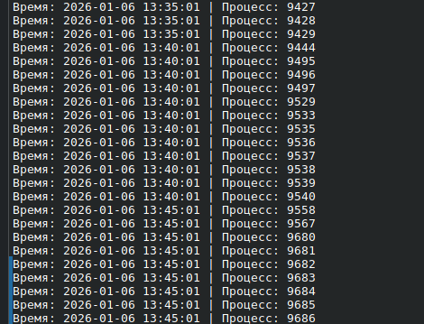
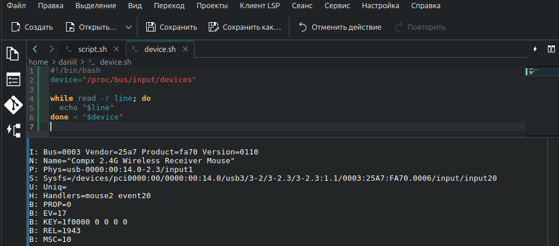
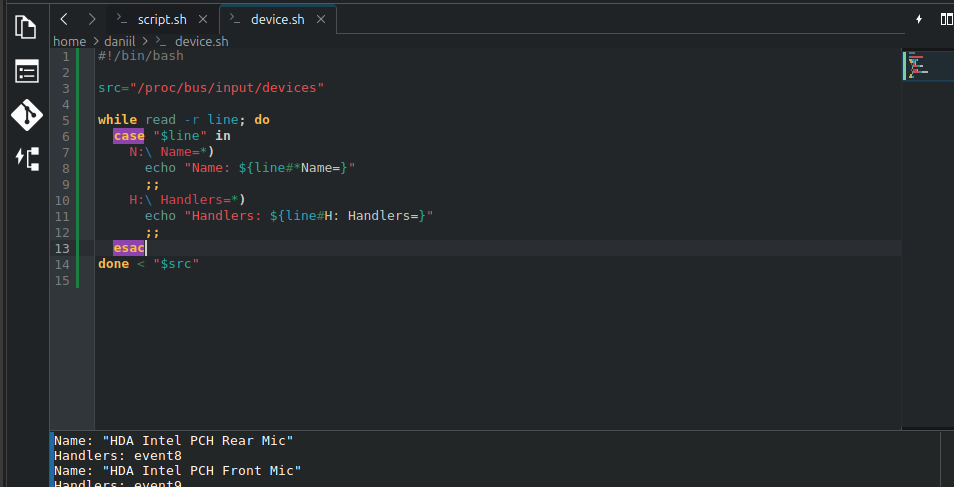
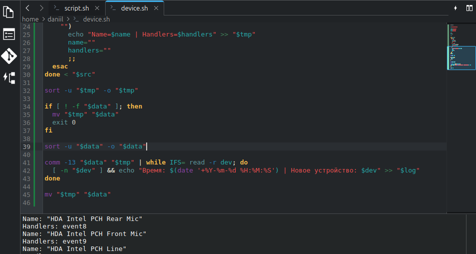
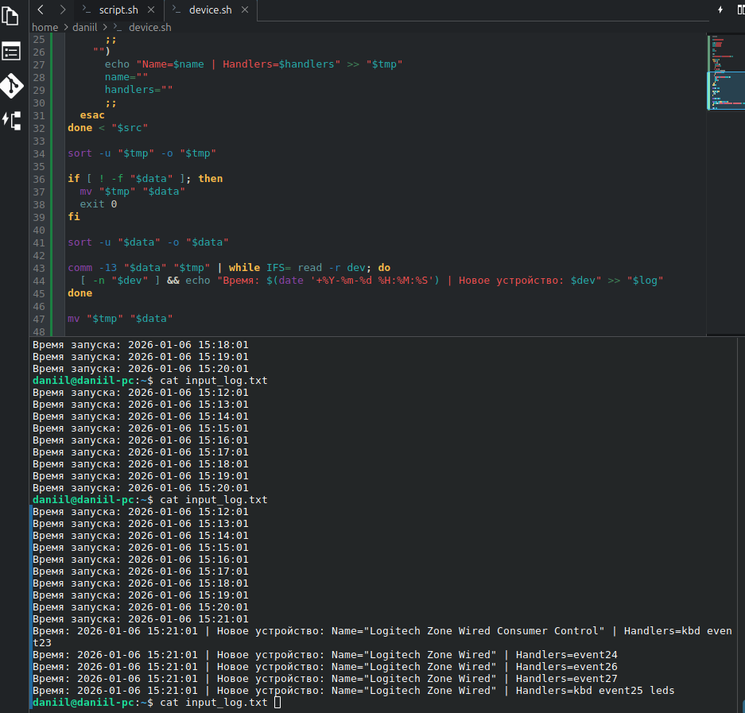

# Итоговый проект модуля «Программирование на Bash» - "Борисенко Даниил"

## Цель задания

В результате выполнения этого задания вы научитесь:

1. Использовать базовые команды для управления файлами, процессами и ресурсами системы
2. Писать Bash-скрипты с использованием переменных, циклов и условных операторов
3. Реализовывать автоматизированные процессы, такие как резервное копирование данных, мониторинг состояния системы и логирование событий
4. Работать с утилитами обработки текста (sed, awk, grep) для анализа и трансформации данных
5. Анализировать Bash-скрипты

---

## Описание задания

Задание состоит из двух частей. Для выполнения работы требуется создать:

1. Bash-скрипт, который будет выполнять мониторинг содержимого директории proc, получать сведения о процессах и системных данных о них, сбор полученной информации в логе.
2. Bash-скрипт, который будет информировать о подключенных устройствах к системе при его запуске и сигнализировать о новых подключениях устройств при работе в фоновом режиме.

При работе над итоговым проектом, к каждому пункту обоих заданий, описывайте логику выполнения каждого пункта заданий и прикладывайте скриншоты.

---

## Задание 1: создание Bash-скрипта, который будет выполнять мониторинг содержимого директории proc, получать сведения о процессах и системных данных о них, сбор полученной информации в логе

**Условие:**

1. Написать Bash-скрипт, который выполняет просмотр директории /proc и записывает номерные директории.
2. Дополнить скрипт, чтобы он получал имя процесса по номеру директории через прочтения /proc/N/exe (PID = номер папки)
3. Дополнить скрипт, чтобы по каждому процессу можно было выбрать группу параметров, не менее 4 (/proc/N/cmdline, /proc/N/environ, /proc/N/limits, /proc/N/mounts, /proc/N/status, /proc/N/cwd, /proc/N/fd, /proc/N/fdinfo, /proc/N/root)

4. Дополнить скрипт циклом, который оформит полученную информацию в виде таблицы с наименованием столбцов PID, Name, и 4 параметров, которые вы выбрали в предыдущем пункте задания (пункт 1.3)

5. Дополнить скрипт, чтобы создавался лог файл с записью времени выполнения скрипта и занесения новых процессов. Старые процессы не заносятся

6. Создать сценарий для «планировщика заданий» (например cron,acron) для опроса каждые 5 минут директории на предмет новых процессов

**Ход решения:**

Для выполнения задания был написан Bash-скрипт `script.sh`.

Файл скрипта: [script.sh](./script.sh)

### 1.1 Просмотр директории `/proc`

Скрипт выполняет просмотр директории `/proc` и отбирает только номерные директории, так как они соответствуют PID процессов.

Для этого используется команда:

```bash
ls /proc | grep '^[0-9]\+$' | sort -n
```

**Где:**

`ls /proc` — выводит содержимое директории `/proc`;  
`grep '^[0-9]\+$'` — оставляет только строки, состоящие из цифр;  
`sort -n` — сортирует PID как числа.



### 1.2 Получение имени процесса по PID

После выбора PID скрипт получает имя процесса через ссылку `/proc/N/exe`, где `N` — номер процесса.

Используется команда:

```bash
readlink "/proc/$pid/exe"
```

Если процесс уже завершился или доступ к файлу отсутствует, имя процесса заменяется на `?`.



### 1.3 Выбор параметров процесса

Для каждого выбранного процесса доступен выбор параметров:

- `cmdline` — команда запуска процесса;
- `fd` — файловые дескрипторы процесса;
- `root` — корневая директория процесса;
- `cwd` — текущая рабочая директория процесса.

Выбор реализован через конструкцию `select` и оператор `case`.



### 1.4 Формирование таблицы

После выбора параметров скрипт выводит информацию в виде таблицы с помощью команды `printf`.

В таблице отображаются столбцы:

```text
PID | Name | Cmdline | FD | Root | CWD
```

Для форматирования используется команда:

```bash
printf "%-10s %-20s %-60s %-40s %-20s %-20s\n"
```

Она позволяет выровнять данные по столбцам.



### 1.5 Логирование новых процессов

Для логирования используются три файла:

```bash
data="$HOME/data.txt"
log="$HOME/log.txt"
tmp="$HOME/tmp.txt"
```

`tmp.txt` — временный файл с текущим списком PID;  
`data.txt` — файл с предыдущим состоянием PID;  
`log.txt` — файл логирования новых процессов.

Если файл `data.txt` отсутствует, текущий список процессов сохраняется как начальное состояние.

При следующих запусках скрипт сравнивает старый и новый список PID командой:

```bash
comm -13 "$data" "$tmp"
```

Новые процессы записываются в лог-файл с указанием времени:

```text
Время: 2026-01-06 12:10:06 | Процесс: 4555
```



### 1.6 Запуск через cron

Для автоматического запуска скрипта каждые 5 минут был создан сценарий cron:

```cron
*/5 * * * * /bin/bash /home/daniil/script.sh
```

**Где:**

`*/5` — запуск каждые 5 минут;  
`* * * *` — любой час, день месяца, месяц и день недели;  
`/bin/bash /home/daniil/script.sh` — запуск скрипта через Bash.



**Вывод:** скрипт выполняет просмотр директории `/proc`, получает PID процессов, позволяет выбрать параметры процесса, выводит данные в виде таблицы и логирует только новые процессы.

---

## Задание 2: создание Bash-скрипта, который будет информировать о подключенных устройствах к системе при его запуске и сигнализировать о новых подключениях устройств при работе в фоновом режиме

**Условие:**

1. Написать Bash-скрипт, который выполняет просмотр /proc/bus/input/
2. Дополнить скрипт, который разберет полученные данные по наименованию столбцов, для работы скрипта использовать циклы
3. Дополнить скрипт, чтобы создавался лог файл с записью времени выполнения скрипта и занесения новых устройств. Старые устройства не заносятся.
4. Создать сценарий для «планировщика заданий» (например cron,acron) для опроса  каждые 1 минуту директории на предмет новых процессов

**Ход решения:**

Для выполнения задания был написан Bash-скрипт `device.sh`.

Файл скрипта: [device.sh](./device.sh)

### 2.1 Просмотр `/proc/bus/input/`

Скрипт читает файл:

```bash
/proc/bus/input/devices
```

Для чтения файла используется цикл:

```bash
while read -r line; do
    ...
done < "$src"
```

Каждая строка файла обрабатывается отдельно.



### 2.2 Разбор данных по столбцам

Для разбора строк используется оператор `case`.

Скрипт ищет строки, начинающиеся с:

```text
N: Name=
H: Handlers=
```

Из строки `N: Name=` извлекается имя устройства, а из строки `H: Handlers=` — обработчики устройства.

Пример логики:

```bash
case "$line" in
  N:\ Name=*)
    name=${line#*Name=}
    ;;
  H:\ Handlers=*)
    handlers=${line#H: Handlers=}
    ;;
esac
```

В результате скрипт получает список устройств в формате:

```text
Name=... | Handlers=...
```



### 2.3 Логирование новых устройств

Для логирования используются файлы:

```bash
data="$HOME/input_data.txt"
tmp="$HOME/input_tmp.txt"
log="$HOME/input_log.txt"
```

`input_tmp.txt` — временный файл с текущим списком устройств;  
`input_data.txt` — файл с предыдущим состоянием устройств;  
`input_log.txt` — файл логирования запусков и новых устройств.

При каждом запуске скрипт записывает время запуска:

```bash
echo "Время запуска: $(date '+%Y-%m-%d %H:%M:%S')" >> "$log"
```

Если файл предыдущего состояния отсутствует, текущий список устройств сохраняется как начальный.

При последующих запусках выполняется сравнение:

```bash
comm -13 "$data" "$tmp"
```

Если обнаружены новые устройства, они записываются в лог:

```text
Время: 2026-01-06 15:21:01 | Новое устройство: Name="Logitech Zone Wired" | Handlers=event24
```



### 2.4 Запуск через cron

Для автоматического запуска скрипта каждую минуту был создан сценарий cron:

```cron
*/1 * * * * /bin/bash /home/daniil/device.sh
```

**Где:**

`*/1` — запуск каждую минуту;  
`* * * *` — любой час, день месяца, месяц и день недели;  
`/bin/bash /home/daniil/device.sh` — запуск скрипта через Bash.



**Вывод:** скрипт выполняет просмотр устройств ввода, извлекает имя устройства и обработчики, сохраняет текущее состояние и логирует только новые подключённые устройства.

---
