# Домашнее задание к занятию "9.04 Отказоустойчивость в облаке" - "Борисенко Даниил"

## Цель задания

В результате выполнения этого задания вы научитесь:

1. Конфигурировать отказоустойчивый кластер в облаке с использованием различных функций отказоустойчивости. 
2. Устанавливать сервисы из конфигурации инфраструктуры.

---

## Задание 1

### Условие

Возьмите за основу [решение к заданию 1 из занятия «Подъём инфраструктуры в Яндекс Облаке»](https://github.com/netology-code/sdvps-homeworks/blob/main/7-03.md#задание-1).

1. Теперь вместо одной виртуальной машины сделайте terraform playbook, который:

- создаст 2 идентичные виртуальные машины. Используйте аргумент [count](https://www.terraform.io/docs/language/meta-arguments/count.html) для создания таких ресурсов;
- создаст [таргет-группу](https://registry.terraform.io/providers/yandex-cloud/yandex/latest/docs/resources/lb_target_group). Поместите в неё созданные на шаге 1 виртуальные машины;
- создаст [сетевой балансировщик нагрузки](https://registry.terraform.io/providers/yandex-cloud/yandex/latest/docs/resources/lb_network_load_balancer), который слушает на порту 80, отправляет трафик на порт 80 виртуальных машин и http healthcheck на порт 80 виртуальных машин.

Рекомендуем изучить [документацию сетевого балансировщика нагрузки](https://cloud.yandex.ru/docs/network-load-balancer/quickstart) для того, чтобы было понятно, что вы сделали.

2. Установите на созданные виртуальные машины пакет Nginx любым удобным способом и запустите Nginx веб-сервер на порту 80.

3. Перейдите в веб-консоль Yandex Cloud и убедитесь, что:

- созданный балансировщик находится в статусе Active,
- обе виртуальные машины в целевой группе находятся в состоянии healthy.

4. Сделайте запрос на 80 порт на внешний IP-адрес балансировщика и убедитесь, что вы получаете ответ в виде дефолтной страницы Nginx.

*В качестве результата пришлите:*

*1. Terraform Playbook.*

*2. Скриншот статуса балансировщика и целевой группы.*

*3. Скриншот страницы, которая открылась при запросе IP-адреса балансировщика.*

### Ход решения

За основу были взяты файлы из предыдущего задания к занятию "7.04 Подъём инфраструктуры в Yandex Cloud". В рамках него была доработана конфигурация по документации Terraform и Yandex Cloud.

1. Перед началом работы был подготовлен SSH-ключ для подключения к виртуальным машинам:

```bash
ssh-keygen -t ed25519 -f ~/.ssh/yandex_vm
```

2. Публичный ключ был добавлен в файл `cloud-init.yml`. Этот файл используется для первичной настройки создаваемых ВМ: создаётся пользователь `user`, добавляется SSH-ключ, устанавливается и запускается Nginx.

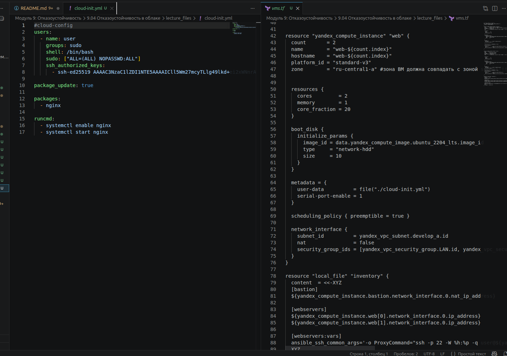

3. Файлы `providers.tf` и `network.tf` были взяты из предыдущего решения.

4. Для работы с Yandex Cloud был установлен и настроен Yandex Cloud CLI. Аутентификация Terraform выполнялась через сервисный аккаунт и переменные окружения:

```bash
export YC_TOKEN=$(yc iam create-token --impersonate-service-account-id <идентификатор_сервисного_аккаунта>)
export YC_CLOUD_ID=$(yc config get cloud-id)
export YC_FOLDER_ID=$(yc config get folder-id)
```

5. В файле `providers.tf` используется провайдер Yandex Cloud.

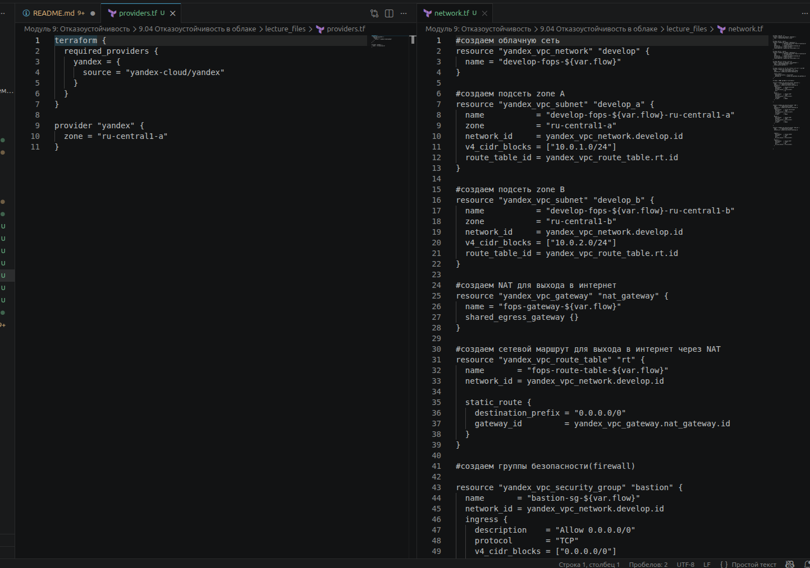

6. В файле `vms.tf` конфигурация web-серверов была изменена: вместо отдельных ВМ используется одина переменная `yandex_compute_instance.web` с аргументом `count`.

```hcl
resource "yandex_compute_instance" "web" {
  count = 2

  name     = "web-${count.index}"
  hostname = "web-${count.index}"
}
```

В результате Terraform создаёт две виртуальные машины:

- `web-0`;
- `web-1`.

ВМ размещаются во внутренней сети, для доступа к ним используется отдельная ВМ `bastion`.

7. Далее был добавлен файл `balancer.tf`, в котором описаны целевая группа и сетевой балансировщик нагрузки.

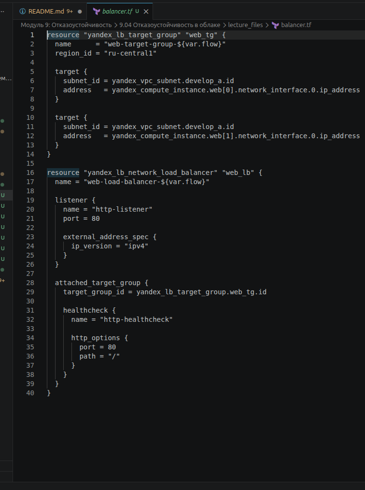

В целевую группу `yandex_lb_target_group` были добавлены обе ВМ по их IP-адресам:

```hcl
resource "yandex_lb_target_group" "web_tg" {
  name      = "web-target-group-${var.flow}"
  region_id = "ru-central1"

  target {
    subnet_id = yandex_vpc_subnet.develop_a.id
    address   = yandex_compute_instance.web[0].network_interface.0.ip_address
  }

  target {
    subnet_id = yandex_vpc_subnet.develop_a.id
    address   = yandex_compute_instance.web[1].network_interface.0.ip_address
  }
}
```

8. После доработки конфигурационных файлов была выполнена инициализация Terraform:

```bash
terraform init
```

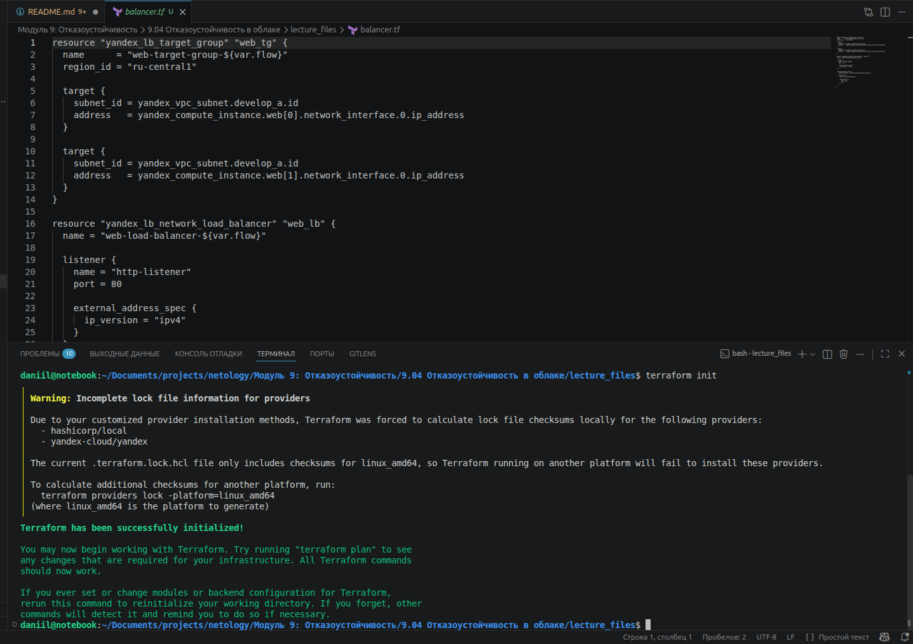

9. Затем была выполнена проверка форматирования и валидация конфигурации:

```bash
terraform fmt
terraform validate
```

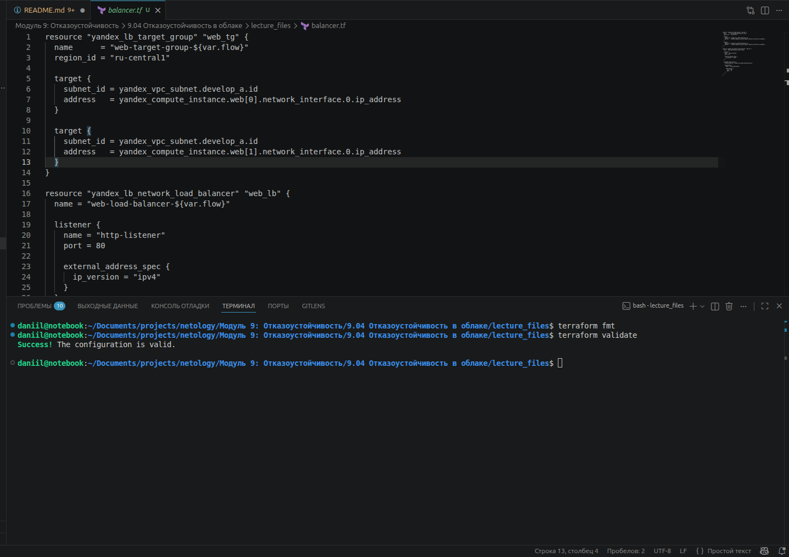

10. После успешной проверки был сформирован план создания инфраструктуры:

```bash
terraform plan
```

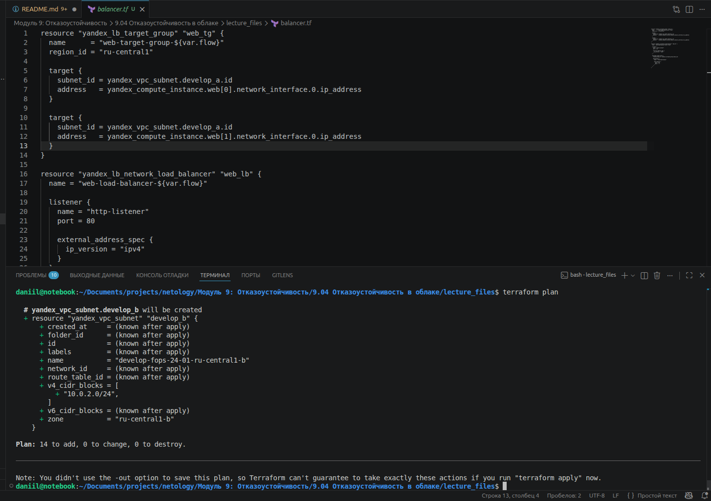

11. После проверки плана инфраструктура была создана командой:

```bash
terraform apply
```

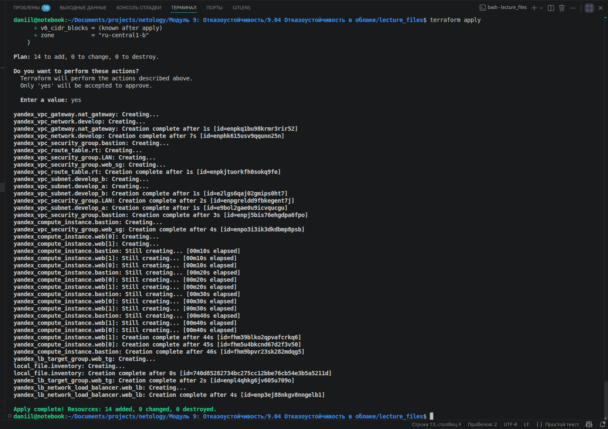

12. После создания инфраструктуры были получены адреса виртуальных машин:

```bash
yc compute instance list
```

В результате были созданы:

- `bastion` с публичным IP-адресом `89.169.138.61`;
- `web-0` с внутренним IP-адресом `10.0.1.13`;
- `web-1` с внутренним IP-адресом `10.0.1.20`.

13. Для изменения стартовой страницы Nginx было выполнено подключение к ВМ через `bastion`:

```bash
ssh -i ~/.ssh/yandex_vm -J user@89.169.138.61 user@10.0.1.20
ssh -i ~/.ssh/yandex_vm -J user@89.169.138.61 user@10.0.1.13
```

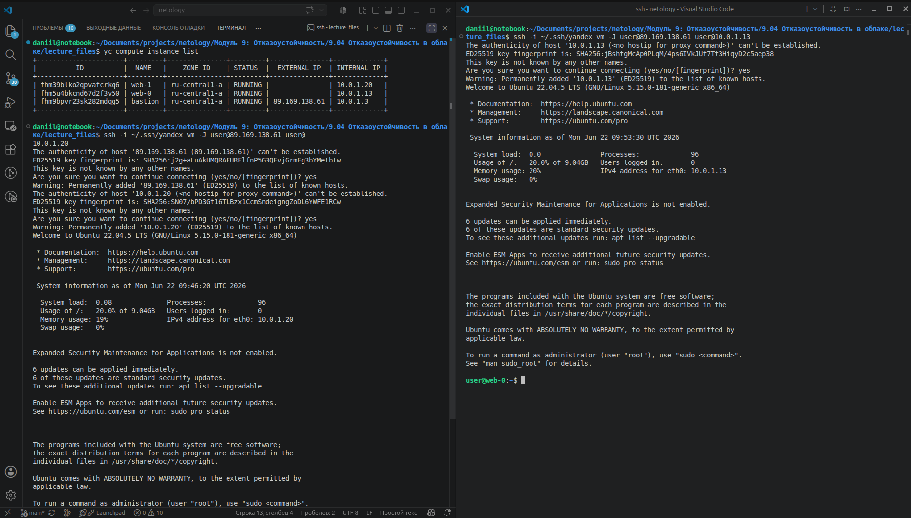

14. На каждой web-ВМ был изменён стартовый HTML-файл Nginx.

Для `web-0` был указан IP-адрес `10.0.1.13`, для `web-1` — `10.0.1.20`.

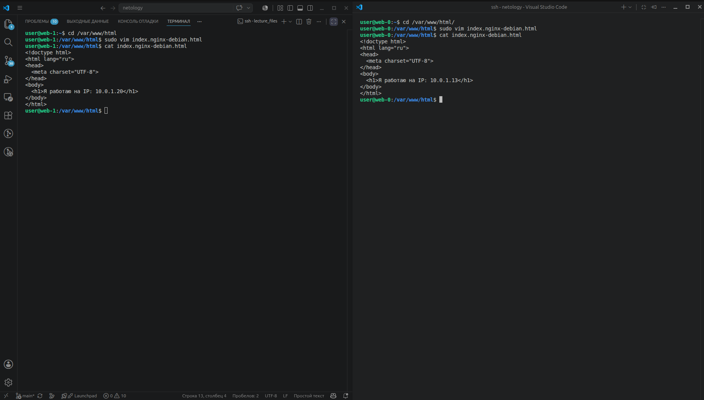

В консоли Yandex Cloud виртуальные машины в целевой группе имеют статус `Healthy`.

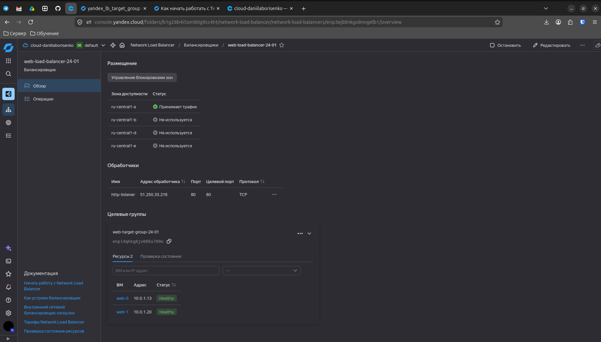

15. После этого был направлен запрос к внешнему IP-адресу балансировщика:

```bash
curl http://51.250.33.218/
```

Также страница была открыта в браузере. При обращении к балансировщику отображается страница одной из web-ВМ.

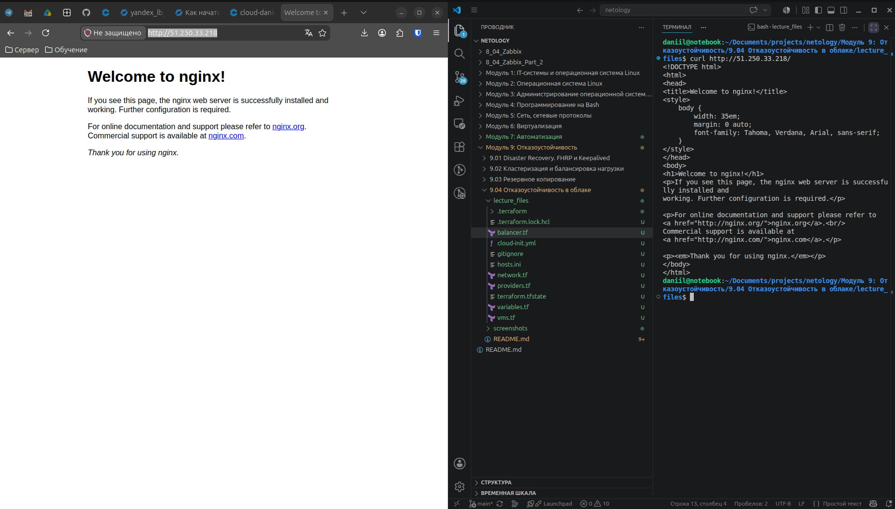

16. Для проверки отказоустойчивости одна из виртуальных машин была остановлена.

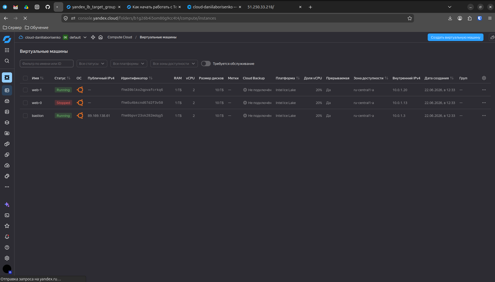

17. После остановки одной ВМ в целевой группе осталась доступной вторая виртуальная машина.

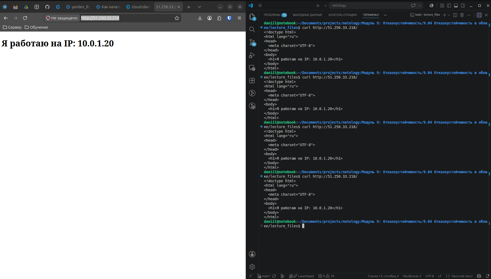

18. При повторном обращении к внешнему IP-адресу балансировщика страница продолжила открываться и трафик был направлен на оставшуюся рабочую виртуальную машину.

```bash
curl http://51.250.33.218/
```

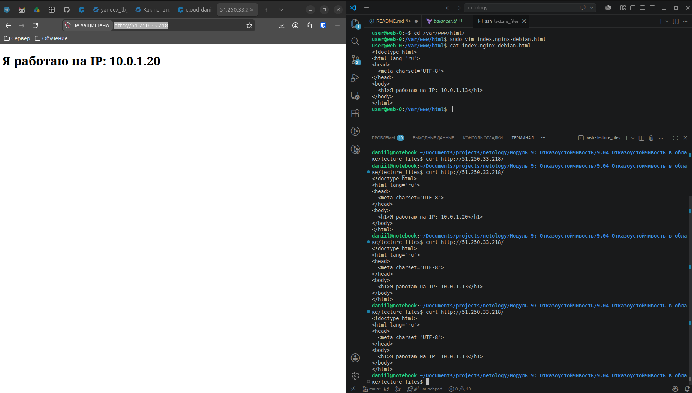

**Вывод:** На основе предыдущего решения была доработана инфраструктура: вместо одной ВМ создаются две одинаковые через `count`, добавляются в целевую группу и балансировщик принимает трафик на `80` порту, а также проверяет состояние ВМ через HTTP healthcheck и направляет запросы только на доступные серверы.

---

## Задание 2*

### Условие

1. Теперь вместо создания виртуальных машин создайте [группу виртуальных машин с балансировщиком нагрузки](https://cloud.yandex.ru/docs/compute/operations/instance-groups/create-with-balancer).

2. Nginx нужно будет поставить тоже автоматизированно. Для этого вам нужно будет подложить файл установки Nginx в user-data-ключ [метадаты](https://cloud.yandex.ru/docs/compute/concepts/vm-metadata) виртуальной машины.

- [Пример файла установки Nginx](https://github.com/nar3k/yc-public-tasks/blob/master/terraform/metadata.yaml).
- [Как подставлять файл в метадату виртуальной машины.](https://github.com/nar3k/yc-public-tasks/blob/a6c50a5e1d82f27e6d7f3897972adb872299f14a/terraform/main.tf#L38)

3. Перейдите в веб-консоль Yandex Cloud и убедитесь, что: 

- созданный балансировщик находится в статусе Active,
- обе виртуальные машины в целевой группе находятся в состоянии healthy.

4. Сделайте запрос на 80 порт на внешний IP-адрес балансировщика и убедитесь, что вы получаете ответ в виде дефолтной страницы Nginx.

*В качестве результата пришлите:*

*1. Terraform Playbook.*

*2. Скриншот статуса балансировщика и целевой группы.*

*3. Скриншот страницы, которая открылась при запросе IP-адреса балансировщика.*

### Ход решения (В процессе)

---

*Список литературы:*

- [Terraform: count meta-argument](https://developer.hashicorp.com/terraform/language/meta-arguments/count)
- [Yandex Cloud: начало работы с Terraform](https://yandex.cloud/ru/docs/terraform/quickstart)
- [Yandex Cloud: справочник провайдера Terraform](https://yandex.cloud/ru/docs/terraform/tf-ref/overview)
- [Yandex Cloud Terraform: yandex_lb_target_group](https://yandex.cloud/ru/docs/terraform/resources/lb_target_group)
- [Terraform Registry: yandex_lb_network_load_balancer](https://registry.terraform.io/providers/yandex-cloud/yandex/latest/docs/resources/lb_network_load_balancer)
- [Yandex Cloud: Network Load Balancer — начало работы](https://yandex.cloud/ru/docs/network-load-balancer/quickstart)
- [Yandex Cloud: создание ВМ с помощью cloud-init](https://yandex.cloud/ru/docs/compute/operations/vm-create/create-with-cloud-init-scripts)
- [Yandex Cloud: получение списка образов](https://yandex.cloud/ru/docs/compute/operations/images-with-pre-installed-software/get-list)

---
